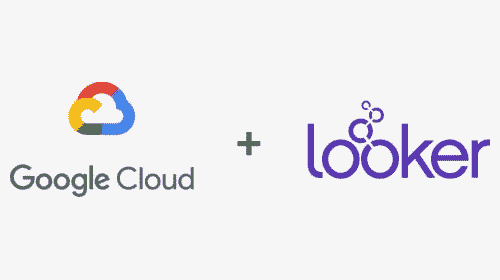
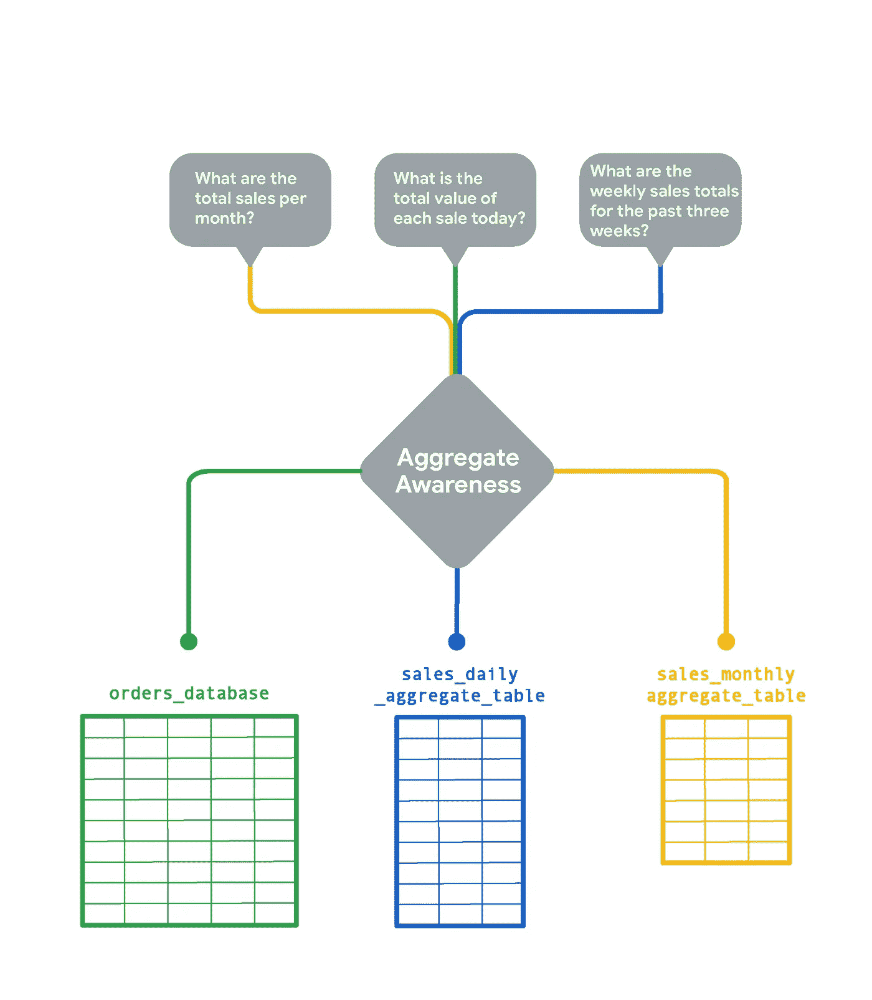

# 旁观者:介绍

> 原文：<https://medium.com/google-cloud/looker-an-introduction-88432392b240?source=collection_archive---------0----------------------->

*有效利用商业智能技术和战略，是决定一家公司在这个数据驱动的世界中的地位的关键。现在有很多商业智能工具，但是是什么让 Looker 与众不同呢？*

来源:[皮克指标](https://www.peakindicators.com/blog/are-desktop-bi-tools-worth-having-and-which-one-should-i-use)。com

## 但是首先，一堂简短的历史课

作为一名数据爱好者，看到我们在数据技术方面取得的进步是非常了不起的。在过去的 30 年里，它经历了巨大的变化，并且仍在以指数速度变化。数据库过去很贵而且很慢，但是现在很快而且非常便宜。还有锦上添花？它们中的许多都驻留在云上。这意味着许多旧的约束不再存在。

来源: [memegenerator](https://memegenerator.net/) 。网

这是个不太好的消息。尽管数据库发展迅速，但数据分析工具并没有跟上步伐。它们中的大多数仍然被设计成与缓慢且昂贵的数据库一起工作。这可能会阻碍公司及时从数据中获取他们想要的价值。

商业智能/分析工具的前景已经经历了两次显著的浪潮。在第一波浪潮中，Business Objects、Cognos 和 Micro Strategy 占据了主导地位。这些工具保证了标准、可扩展性和治理。我们所说的数据治理是指谁可以在什么情况下使用什么方法对什么数据采取什么行动。

随着第二波的出现，我们看到了 Tableau，Power BI 和 Qlik 统治了这个领域。这些工具承诺自助服务、灵活性和敏捷性。虽然这些都是很好的特性，但是公司很难找到一个中间地带。一个两全其美的工具；自助+治理。

进入 Looker ✨

Looker 是 Google Cloud 的云原生企业 BI 平台。它可以在您需要时提供对接近实时数据的安全访问。这是一个多云数据平台，因此它提供了通过数据传递影响的灵活性，而不管当前使用的是什么云平台。所以请放心，你可以用谷歌云、AWS 或 Azure 在你选择的云中托管 Looker。

## 为什么要看？

Looker 经得起未来考验的一点是它的数据库不可知特性。它经过优化，可以与您现有的任何数据库一起运行。Looker 支持 50 多种 SQL 方言。使这成为可能的原因之一是 JDBC 驱动程序模式的使用。这有助于 Looker 迎合各种各样的企业和业务，不管数据库在哪里。

Looker 还允许重复使用 SQL 查询。您可以一次定义您的数据模型，并在任何地方引用它的任何部分。这样，您可以避免重复编写相同的 SQL 查询。

Looker 提供名为 Looker Blocks 的预建分析模板，帮助您尽快从数据转移到仪表板。它们是预构建的代码片段，您可以利用它们来加速分析。从优化的 SQL 模式到完全构建的模型，再到定制的可视化，有许多 Looker 块可供选择，可以作为快速分析的起点。

这种易用性使得几乎每个人都能够有效地利用数据，而无需咨询分析团队。这基本上消除了分析团队只是一个人的情况下的“瓶颈”。当人们需要访问或需要获得见解时，他们不再需要排队等候。

Looker 支持双因素认证，并集成了 LDAP 和 SSO(支持 SAML、OneLogin 和 Google Apps)。这对于投资了用户认证工具并需要适当的访问控制的公司来说非常有用。

Looker 平台的核心是细粒度的访问控制，提供三个级别的数据管理:

1.  模型级别——限制用户可以访问的模型。
2.  组级别-限制用户在 Looker 中可以访问的内容。
3.  角色级别-设置个人在 Looker 中可以访问的特定功能和数据。

这种数据治理的分层方法对于具有特殊安全需求和隐私考虑的行业来说特别有价值。

[**聚合认知**](https://bobjanalytics.weebly.com/blog/aggregate-awareness1) 是 Looker 成为如此高性价比工具的原因之一。许多组织以更精细的粒度级别存储数据。当运行查询来获取一年的数据时，这会显著增加运行查询的成本。对于非常大的表，Looker 开发人员可以创建较小的聚合数据表，按各种属性分组。这些表实质上充当了 Looker 可以用于查询的汇总表，而不是遍历原始的大表。如果有策略地实现，聚合感知可以显著地将平均查询速度提高几个数量级。

[资料来源:Looker 文档](https://docs.looker.com/data-modeling/learning-lookml/aggregate_awareness)

Looker 还提供对嵌入式分析的支持。这允许用户和客户在任何 HTML 格式的网页、门户或应用程序中探索内嵌在 iframe 中的数据。然后，iframe 执行整个 Looker 应用程序，请求显示查询所需的数据。

乍一看，您可能觉得嵌入会带来隐私和安全问题。为了减轻这些担忧，Looker 提供了多种嵌入方法，具体取决于用户访问您的数据所需的身份验证级别。欲了解更多信息，请访问[嵌入式分析的安全最佳实践](https://docs.looker.com/reference/embedding/security)

## 后续步骤

Looker 的可能性是无穷无尽的，要充分欣赏它的功能，我们必须看到它的行动。 [Big query 和 Looker](https://cloud.google.com/blog/topics/developers-practitioners/go-database-dashboard-bigquery-and-looker) 如果你对 Big query 和 Looker 的组合可能性感兴趣，这是一个很好的起点。

喜欢听你的反馈！