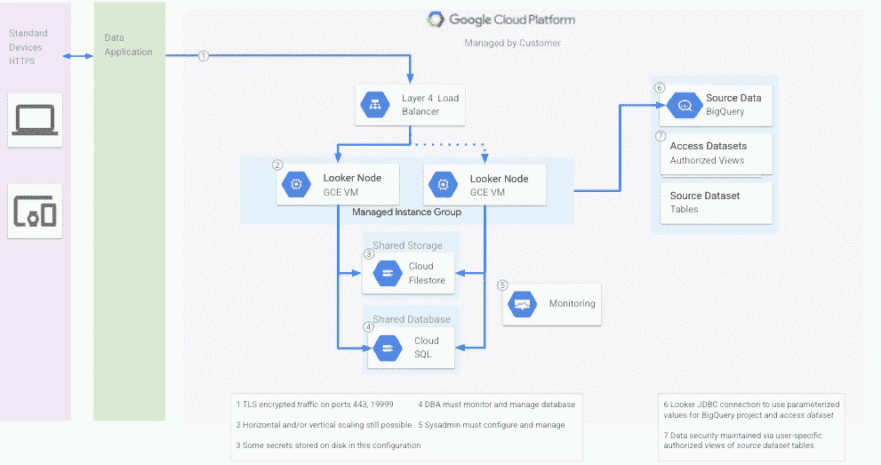

# looker—GCP 上的自托管安装

> 原文：<https://medium.com/google-cloud/looker-self-hosted-installation-on-gcp-7e6a5050784a?source=collection_archive---------0----------------------->

Looker 是 Google Cloud 的云原生企业商务智能平台，支持在您需要时随时随地访问近乎实时的数据。

您可以选择 Looker 托管解决方案(Looker 管理所有组件)和客户托管解决方案(您拥有自己的环境)。这两种解决方案之间的选择取决于需求。例如，您可能有不允许您使用 Looker 宿主的安全要求。使用 Looker hosted 解决方案，您不必担心安装、升级和扩展，并且解决问题的时间也更快。借助客户托管的解决方案，您可以完全控制自己的基础架构。

在这篇文章中，我将描述在 GCP 上安装 Looker 的必要步骤。

可以在单个虚拟机上安装 Looker，但这仅适用于小型工作负载数据库。对于生产环境，更好的解决方案是虚拟机群集，如下图所示。

虚拟机集群

将 Looker 作为跨多个虚拟机的实例集群运行是一种灵活的模式，它受益于服务故障转移和冗余。水平可伸缩性提供了更高的吞吐量，而不会产生过多的垃圾收集成本。

## **集群注意事项**

*   **OS 和发行**

Looker 运行在最常见的 Linux 版本上:RedHat、SUSE 和 Debian/Ubuntu。Linux 的 GCP 发行版与 Looker 兼容。Debian/Ubuntu 是使用最广泛的 Linux 版本。Looker 运行在 Java 虚拟机(JVM)中。选择发行版时，检查 OpenJDK 8 的版本是否是最新的。

*   **CPU 和内存**

对于生产使用 16x64 节点(16 个 CPU 和 64gb RAM)，这是价格和性能之间的良好平衡。配置超过 64 GB 的 RAM 会影响性能，因为垃圾收集事件是单线程的，并且对于多达 50 个用户的配置，会暂停所有其他线程，所以 Looker 建议运行单个服务器

*   **磁盘存储**

100 GB 的磁盘空间通常足以满足生产系统的需求。

*   **容量**

当需要更多容量时，您应该向群集中添加 16x64 节点，而不是将节点大小增加到 16x64 以上。

*   **文件系统**

Looker 节点需要共享文件系统的某些部分(LookML 模型、Looker 模型开发人员、Git 服务器连接)。文件系统必须与 POSIX 兼容。

*   **数据库**

Looker 的元数据需要集中，所以其内部数据库必须迁移到云 SQL (MySQL)。

Looker 需要 Git 服务来提供 LookML 文件的版本管理。支持 GitHub、GitLab、BitBucket 等。

# **可扩展性**

您可以在实例组配置中指定集群中的节点数量。目前，Looker 还没有一个干净的方法来优雅地终止一个节点。

您可以自动放大，但是缩小应该手动进行，并且非常小心。

-从负载平衡器目录中删除节点

-等待用户开始新的会话(通常为 15、20 分钟)

-使节点脱机

# **升级**

*   创建一个新的形象
*   永远记住升级虚拟机的最重要的规则:永远不能将两个版本的基于虚拟机的 Looker 连接到同一个数据库。这将损坏数据库并使其不可用。
*   安全进行的最快方法是将我们的实例组“扩展”到 0 个节点。在实例组的编辑模式中进行更改。
*   备份您的数据库
*   使用新映像重新创建实例组

# **网络**

Looker 在端口 9999 上侦听 HTTPS 请求。Looker 使用一个自签名证书，其常用名为 self-signed.looker.com。

Looker API 监听端口 19999。

## 内部数据库连接

必须启用私有服务访问，以便使用私有 IP 从计算引擎实例连接到云 SQL。您的 VM 实例必须与您的云 SQL 实例位于同一区域。

## 外部服务

Looker 的遥测和许可证服务器可通过 HTTPS 在公共互联网上获得。必须允许从 Looker 节点到 ping.looker.com:443 和 license.looker.com:443 的流量。

## SMTP 服务

默认情况下，Looker 通过 SendGrid 发送邮件。这可能需要将 smtp.sendgrid.net:587 加入允许名单。

集群节点将通过消息代理服务相互通信，该服务使用端口 1551 和 61616。必须在群集节点之间打开端口 1551 和 61616。

# 数据库ˌ资料库

建议使用远程 MySQL 数据库(在 Google Cloud 中，使用 Cloud SQL)。

# **监控**

可以使用云监控或 JMX。

**JMX**

默认情况下，JMX 未启用。要启用它，需要修改启动脚本

[https://docs . looker . com/setup-and-management/on-prem-install/monitoring-instance](https://docs.looker.com/setup-and-management/on-prem-install/monitoring-instance)

**云监控**

建议至少对以下性能指标进行收集、绘制图表并发出警报:

*   CPU 利用率:负载和 CPU 利用率百分比
*   内存利用率:已用总内存和已用交换内存
*   磁盘使用

# **测井**

可以在启动脚本中配置日志记录选项，例如日志文件的存储位置、级别和日志格式。

# **安全**

*   Looker 使用安全连接来查询云 SQL 和云文件存储。
*   管理员可以按用户或组设置粒度权限，并可以限制访问
*   所有静态数据都经过加密。
*   只允许 Looker 服务器使用的 IP 地址使用您的 MySQL 用户帐户。

# **IAC**

你可以用 Terraform 在 GCP 上安装 Looker。需要以下模块:

*   数据库模块
*   文件存储模块
*   DNS 模块
*   托管区域模块
*   实例组模块
*   负载平衡器模块
*   秘密模块
*   SSl 证书模块

**参考文献**

 [## 客户托管架构解决方案:概述

### 本文是由多个部分组成的系列文章的一部分，讨论 Looker 的托管、部署方法和最佳…

help.looker.com](https://help.looker.com/hc/en-us/articles/4404034035987-Customer-Hosted-Architecture-Solutions-Overview)  [## 客户托管架构解决方案:模式和实践

### 本文是由多个部分组成的系列文章的一部分，讨论 Looker 的托管、部署方法和最佳…

help.looker.com](https://help.looker.com/hc/en-us/articles/4403392016019-Customer-Hosted-Architecture-Solutions-Patterns-and-Practices)  [## 设置和测试 Git 连接

### 设置和测试 Git 连接查看器提供了一种开发模式，让您可以在安全的环境中开发您的模型…

docs.looker.com](https://docs.looker.com/data-modeling/getting-started/setting-up-git-connection)  [## 在 Looker | Looker 社区中使用 GitLab 进行版本控制

### 使用这篇文章和 Looker 文档设置版本控制来配置你的版本控制…

community.looker.com](https://community.looker.com/general-looker-administration-35/using-gitlab-for-version-control-in-looker-8199)  [## 在 Looker 中使用云源代码库进行版本控制

### 本文旨在与 Looker 文档页面结合使用，以设置和测试 Git…

help.looker.com](https://help.looker.com/hc/en-us/articles/360057499914)  [## 客户托管架构解决方案:组件演练

### 本文是由多个部分组成的系列文章的一部分，讨论 Looker 的托管、部署方法和最佳…

help.looker.com](https://help.looker.com/hc/en-us/articles/4404416923283#h_01FBSNBCJKPR3554EVNC0676AE)  [## 监视旁观者

### 虽然 Looker 应用程序监控似乎不是严格要求的，但设置它是非常重要的。在…

docs.looker.com](https://docs.looker.com/setup-and-management/on-prem-install/monitoring-instance)