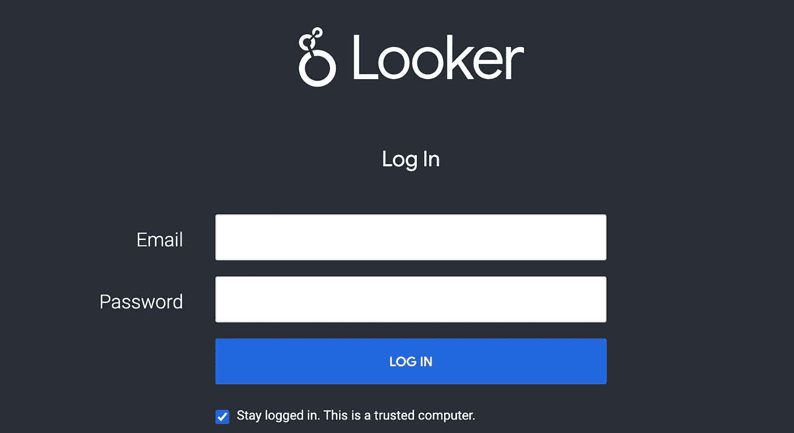

# 碧湖居

> 原文：<https://medium.com/google-cloud/looker-with-delta-lake-49f0a084e2e6?source=collection_archive---------1----------------------->

## 如何将 Google Looker 连接到 Databricks Delta Lake

[Databricks](https://databricks.com/) ，其 lakehouse 架构，现在可以在谷歌云平台(GCP)上使用。这意味着您可以在所有主要云上使用您的数据科学笔记本、优化的 Apache Spark 引擎、SQL Analytics 和 Delta Lake 及其开放格式:Y *您现在可以在您的数据所在的地方进行分析。*

Databricks 还与 GCP 云服务紧密集成。对于那些有商业智能或分析背景的人来说，谷歌的 Looker 和 Databricks lakehouse 的结合尤其有趣。Looker 是 Google 基于云的商业智能企业平台，让您轻松创建令人惊叹的仪表盘。

有了 GCP 的 Databricks，你现在可以直接在湖边小屋建造 Looker 仪表盘。Delta Lake 是一个开放、可靠、高性能、安全的数据存储和管理层，适用于流和批处理操作。

实现本教程中的体系结构，不需要从数据湖复制数据或将数据复制到数据湖中。不需要数据仓库，您的湖边小屋就成了唯一的数据源。

为了分享我在三角洲湖上建造 Looker 仪表盘时学到的经验，我制作了以下视频教程。

*以下步骤提供了对用户有用的其他资源。这些资源支持上面的视频教程，并不意味着是一步一步的指导。*

# 重要的事情先来

## 谷歌浏览器

当我开始这个项目时，我没有 Looker 的经验。这个[视频](https://www.youtube.com/watch?v=FBlyD2nCJds)帮我出入门。为了改善你的外表体验，我的建议是在你开始构建仪表板之前，先学习核心的外表资源和概念。此外，确保你知道 [Looker 项目是如何运作的](https://docs.looker.com/data-modeling/getting-started/how-project-works)。如果你不喜欢视频，请看这里的[文档](https://docs.looker.com/data-modeling/learning-lookml/lookml-terms-and-concepts)进行概述(下面的截图就是从这里截取的)。

Google Looker 项目、模型、视图、维度、测量、探索

## 数据布里克斯湖屋

lakehouse 是一个可扩展的低成本选项，它统一了数据、分析和人工智能。这篇来自 Databricks 博客的[博文是了解湖边小屋建筑的好方法。](https://databricks.com/blog/2020/01/30/what-is-a-data-lakehouse.html)

[Delta Lake](https://databricks.com/product/delta-lake-on-databricks) 是一个开放格式的事务存储层，构成了 [lakehouse](https://databricks.com/blog/2020/01/30/what-is-a-data-lakehouse.html) 的基础。Delta Lake 为您的数据湖提供了可靠性、安全性和性能，适用于流操作和批处理操作，并通过为结构化、半结构化和非结构化数据提供单一存储来消除数据孤岛。

湖屋:从 DWH 和数据湖的演变

# 获得一个 Looker 帐户

Looker 不属于自由 GCP 审判。你可以在谷歌市场申请 Looker。注意，我不是谷歌:-)，所以我不能帮助这一部分。一旦你有了你的帐户，确保你可以登录。

# 创建数据块工作空间和集群

创建工作空间在[数据块文档](https://docs.gcp.databricks.com/administration-guide/account-settings-gcp/index.html)中有详细描述。文档还列出了[先决条件](https://docs.gcp.databricks.com/getting-started/try-databricks-gcp.html#prerequisites-for-account-and-workspace-creation)，比如配置资源配额或者在 Google cloud 上启用 API。

Databricks 工作区链接到 GCP 项目。创建工作空间时，您必须 [Google cloud 项目 ID](https://support.google.com/googleapi/answer/7014113?hl=en) ，可以在 Google cloud 控制台中通过选择项目信息下的项目名称找到该 ID。

使用 GCP Looker 为 BI 创建 Databricks 工作区

在数据块工作区，创建一个[数据块集群](https://docs.gcp.databricks.com/clusters/create.html)。

# 创建或使用增量表

我们的目标是建立一个 Looker 仪表板，直接从增量表中访问您的数据。Delta 表可以基于 [**Google 云存储**](https://docs.gcp.databricks.com/data/data-sources/google/gcs.html) 作为可扩展、高可用、廉价的存储层。使用现有的表或按照视频教程在增量表中创建自己的示例数据。

为 Looker 创建数据块增量表

要创建视频教程中使用的增量表，请在笔记本单元格中运行下面的 Scala 代码片段。

# 创建 Spark 数据库连接

在 Looker 控制台中，创建一个[连接](https://docs.databricks.com/integrations/bi/looker.html#step-1-get-databricks-connection-information)来访问您的集群正在运行的 GCP 上的 Databricks 工作区。视频教程将向您展示如何填写所有连接设置参数。

更新:从 21.6 版本开始，Looker 支持数据库设置的 Databricks 方言。用这个代替我在动手视频教程中展示的 Spark 2.x 设置。

# 创建带有视图的 LookerML 模型

使用指向您的 Databricks 集群的 Looker 数据库连接，为您的数据生成一个 LookerML **模型**。在模型中，表格被表示为**视图**。

基于三角洲湖表的 Looker 模型

# 创建 Looker 仪表板

要有创造性:-)钻研你的数据。构建您的**外观仪表盘**。我的建议是在你深入研究之前多了解一些关于 Looker 的知识，例如 [Looker ML](https://docs.looker.com/data-modeling/learning-lookml/what-is-lookml) 的基础知识以及仪表盘中 [*尺寸*和*尺寸*](https://docs.looker.com/data-modeling/learning-lookml/lookml-terms-and-concepts) 的区别。

基于三角洲湖的 Looker 仪表盘

# 旁观者发展与生产模式

到目前为止，您已经在 [**开发模式**](https://docs.looker.com/data-modeling/getting-started/dev-mode-prod-mode) 中创建了仪表板。开发模式允许您在不影响任何人的情况下对项目进行更改。此模式访问完全独立的项目文件版本，只有您可以查看和编辑。

在生产模式下使用 Looker 实例的每个人都以相同的状态访问它的项目。在此模式下，项目文件是只读的。

Looker 使用 Git 进行版本控制。一旦你[配置了 Git 连接](https://docs.looker.com/data-modeling/getting-started/setting-up-git-connection)，你就可以提交修改并把它们推向生产。

# Looker 中的混合三角洲湖和大查询仪表板

要将基于 BigQuery 中的表的图添加到仪表板中，只需在 Looker 控制台中配置一个 BigQuery 数据库连接，并使用基于新连接的视图创建一个 Looker 模型。

带有 Delta Lake 和 BigQuery 的混合外观仪表盘

# 旁观者 40 秒快速旋转

基于上面列出的步骤，当《GCP 数据报》发行时，我创建了一个 looker 仪表板。下面的视频捕捉到了这个演示的快速旋转。

# 你呢？

我很好奇想了解一下，看看你都造了些什么。请在下面的评论区分享你用 Looker 和 Databricks 创建的截图。

# 参考

*   订阅 [Databricks YouTube 频道](https://www.youtube.com/channel/UC3q8O3Bh2Le8Rj1-Q-_UUbA)和我们的 GCP 播放列表。

**如果你像我喜欢写这篇文章一样喜欢阅读它，请连接媒体，为这篇文章鼓掌。我在 Twitter 上花了太多时间——关注更多数据科学、数据工程或 AI/ML 相关新闻:**[**@ frankmunz**](https://twitter.com/search?q=frankmunz)**。**