# 谷歌规模的机器学习

> 原文：<https://medium.com/google-cloud/machine-learning-at-google-scale-9f2665c79361?source=collection_archive---------8----------------------->

上个月，我受斯蒂芬·让桑的邀请参加了 T2 devo xx 2016 会议的主题演讲，谈论机器学习。

***注:*** *对于没有耐心的人:你可以直接观看本文底部的视频，也可以看看下面的幻灯片，以及每张幻灯片的说明。你的选择！我还详细介绍了* [*演示，展示了我如何使用 Google Speech API 和 Google Natural Language API 构建自己的穷人会议助手*](http://glaforge.appspot.com/article/a-poor-man-assistant-with-speech-recognition-and-natural-language-processing) *。*

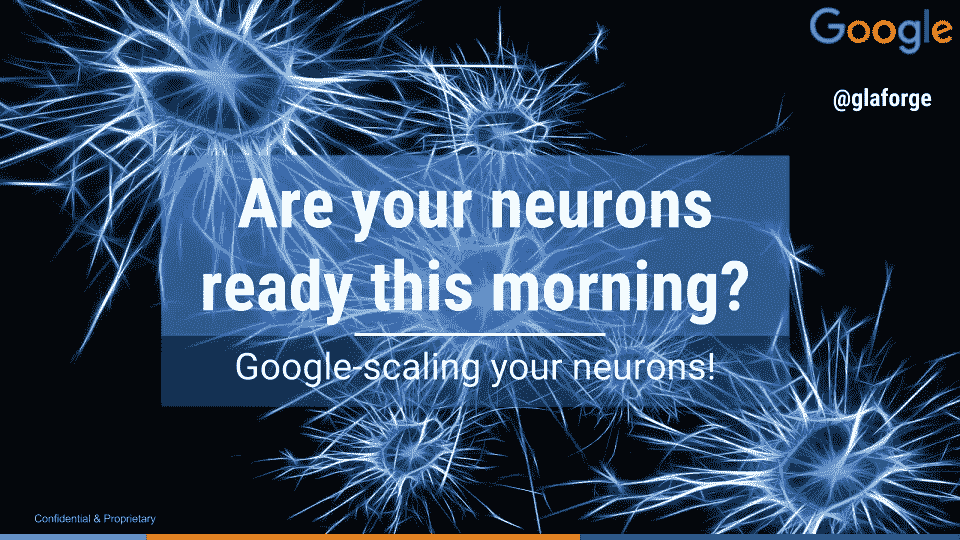

这个主题演讲的目的是让大家了解一下机器学习和人工智能，为什么它最近变得如此流行，为什么你今天也可以在你自己的应用程序和公司中利用它们，并且快速概述一下这个行业的工具，特别是从谷歌的角度。

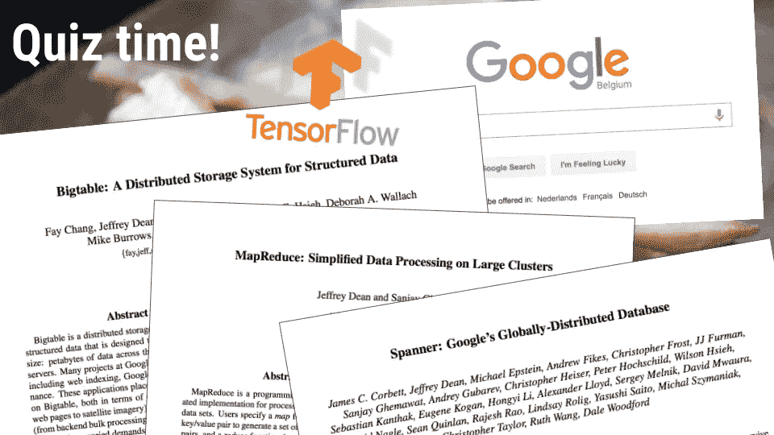

由于这是今天的第一节课，我想以一个小测验开始，让观众保持一点娱乐和清醒。我的目标是介绍对谷歌高级研究员兼 ML/AI 研究员[杰夫迪恩](https://research.google.com/pubs/jeff.html)的采访。

杰夫·迪恩是谷歌各种项目背后的关键人物和智囊。Jeff 在谷歌搜索引擎本身、广告平台、[协议缓冲区、](https://developers.google.com/protocol-buffers/)……但他也参与了 [MapReduce](https://research.google.com/archive/mapreduce.html) 、 [BigTable](https://research.google.com/archive/bigtable.html) ( *“一个在许多谷歌产品下使用的大规模半结构化存储系统】*)的设计和实现。在机器学习方面，他致力于 Google Translate 的统计机器翻译系统，以及设计和实现流行的 [TensorFlow](https://www.tensorflow.org/) 系统，用于大规模训练和部署深度学习模型。

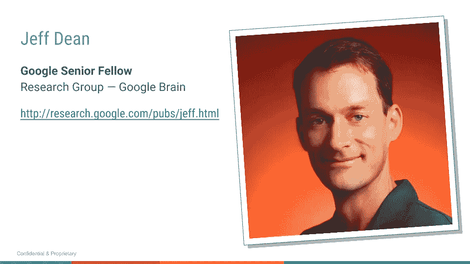

为了澄清人工智能术语和机器学习概念的含义，我通过击败多次冠军 [Lee Sedol](https://en.wikipedia.org/wiki/Lee_Sedol) 来谈论 [AlphaGo](https://deepmind.com/research/alphago/) “掌握围棋比赛的计算机”，并将其与 IBM 击败著名棋手加里·卡斯帕罗夫的[深蓝](https://en.wikipedia.org/wiki/Deep_Blue_(chess_computer))进行对比。

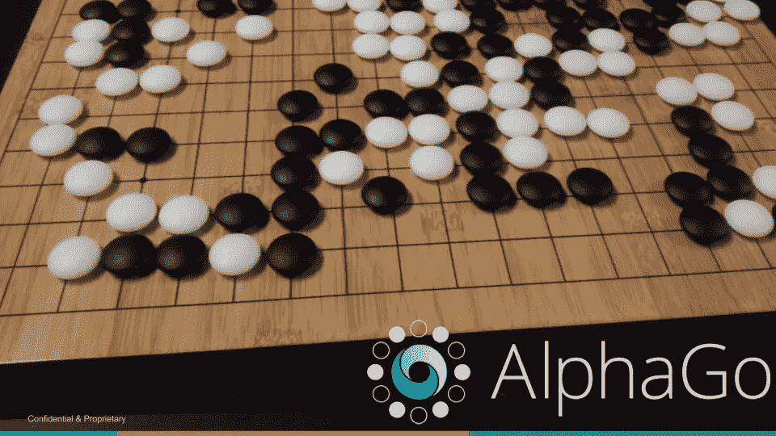

1997 年，当“深蓝”显示出它在国际象棋方面的天赋时，这台计算机被专门编程来下棋，并且是为下棋的目的而设计的。它被教授了所有的游戏规则，它吸收了大量过去的游戏，并被给予了整体的国际象棋算法来玩(它的评估函数)。只剩下一些参数需要大师调整，并通过那个镜头分析过去的比赛。

快进到 2016 年，有了 AlphaGo，方法有点不同，因为计算机教会了自己如何下围棋！没有人给它规则:启发法不是由人类硬编码的。计算机分析围棋高手过去的棋局，以理解游戏规则，并计算出自己的评估函数，以区分好棋和坏棋。为此，使用了深度神经网络，以及[蒙特卡罗树搜索](https://en.wikipedia.org/wiki/Monte_Carlo_tree_search)。此外，[强化学习](https://en.wikipedia.org/wiki/Reinforcement_learning)被应用于让计算机与自己对抗数百万次，以进一步改善其自身的游戏。

这里的关键是自学方面:教自己玩，而不是被指导如何玩。这就是机器学习的意义所在。

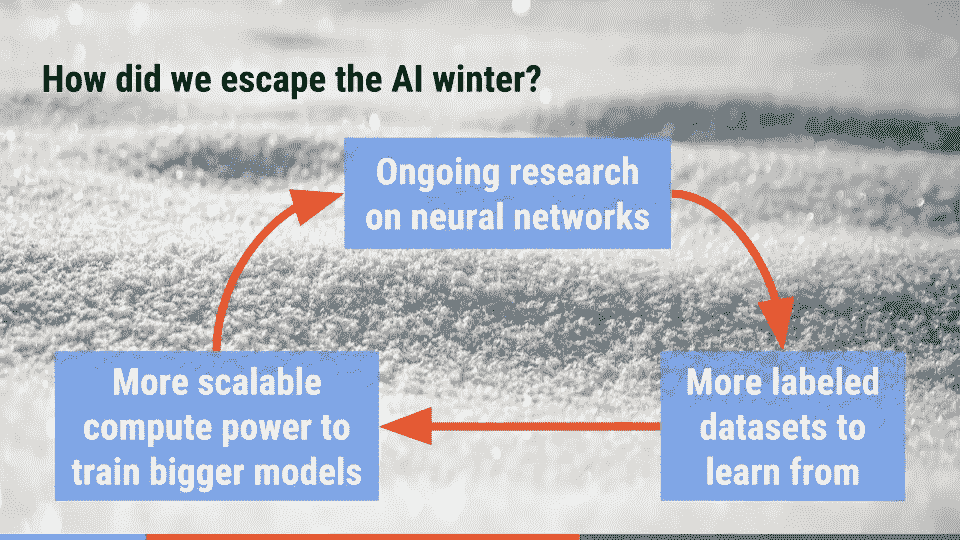

专家们认为在 5 年左右的时间内赢不了围棋。为实现这一目标，已经取得了重大进展。但是这个领域的研究并不新鲜。几十年前就发明了各种神经网络。直到 20 世纪 70 年代，这一领域的大量研究一直在进行，当时过多的承诺导致了失望，然后削减了资助。这就是所谓的[艾冬](https://en.wikipedia.org/wiki/AI_winter)。结果与预期不符。

那么，为什么对人工智能、神经网络和机器学习又有了兴趣呢？什么变了？

随着从未真正停止的持续研究，两大因素在这一领域的新兴趣中发挥了主导作用:

*   首先，**更多带标签的数据集向**学习。
    如果你改进正在使用的算法，训练一个机器学习程序可以带来更好的结果，但通常*只是*向它扔更多的数据将有助于它大大提高其准确性。在互联网和大数据时代，每天都在收集大量数据，从你发送的推文，到你发布的图片，或者你在网上购物的文章。你自己的图片标签有助于确定图片中确实有一只猫，或者某个客户下一步可能会购买什么，考虑到它以前购买过 X 和 Y，模仿其他在线购物者的行为。带有标签和结果的大质量数据集有助于提高神经网络的学习能力。
*   其次，**更可扩展的计算能力，用于训练更大、更快的模型**。
    大标签数据集是一回事，但如果你想在这些数据集上训练你的神经网络，你还需要能够表示所有可能的参数化数据的特征，还需要有机器的处理能力来分析数据。与人工智能的冬天相比，我们的电脑和服务器获得了更大的内存和更高的 CPU 周期。所以在内存中表示一个大模型更容易，计算速度也更快。此外，像 [TensorFlow](https://www.tensorflow.org/) 这样的 ML 工具包已经被设计成以分布式方式工作，在联网的计算机上分割学习，具有更多的 CPU 周期和内存。你甚至不需要创建自己的大型服务器群，但是你可以利用云计算服务，比如谷歌的 Cloud ML。
    同样有趣的是，除了 CPU，多亏了 GPU，游戏行业帮助我们提高了计算效率。通常，GPU 是为计算复杂的矩阵运算而定制的，这些运算在神经网络中被大量使用。谢谢各位游戏玩家！

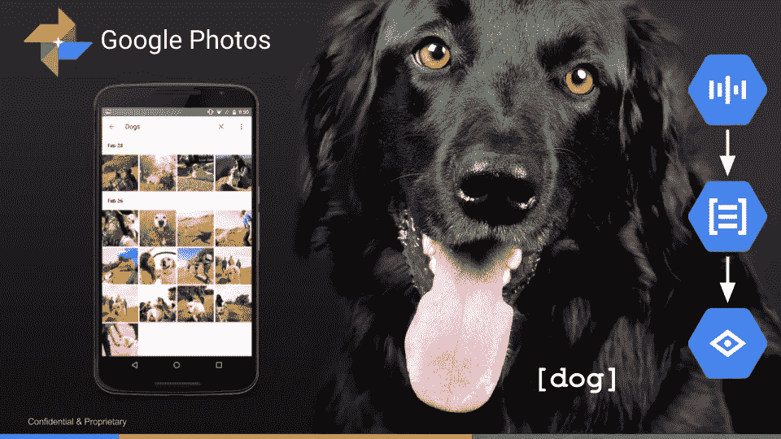

好吧，很高兴知道有更多的数据集可用，计算能力有助于训练和表示更大的模型。但是具体来说，我能从机器学习中得到什么呢？让我们来看一些例子。

Google Photos 最近的一个重大改进是它能够识别图片中的内容，而不需要你标记你的图片。以前，你必须以某种方式记住某张特定照片的拍摄时间或地点，并且在找到正确的照片之前，你必须快速浏览几十页或几百页照片。

简而言之，你现在可以搜索“狗”图片来找到你的狗的所有图片。好吧，但仔细看看:你可以使用语音识别搜索，而不是通过打字。深度学习也有助于提高语音识别能力。一旦你识别出查询，自然语言处理就能帮助你理解这个查询是关于什么的。这里再次使用了深度学习来更好地理解文本的结构。然后，神经网络的另一个伟大用途是视觉理解，意识到照片确实包含一只狗。

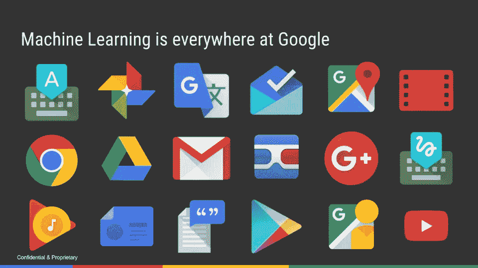

谷歌内部越来越多地使用机器学习。例如，当谷歌音乐或 YouTube 建议您可能感兴趣的其他标题或视频时。如果你使用谷歌收件箱收发邮件，收件箱会提供“[智能回复](https://blog.google/products/gmail/smart-reply-comes-to-inbox-by-gmail-on-the-web/)”，它会设计你可能会发回的回复。新的[谷歌翻译高级版](https://cloud.google.com/translate/docs/premium)使用了一个[神经机器翻译系统](https://research.googleblog.com/2016/09/a-neural-network-for-machine.html)来翻译文本。还有更多…

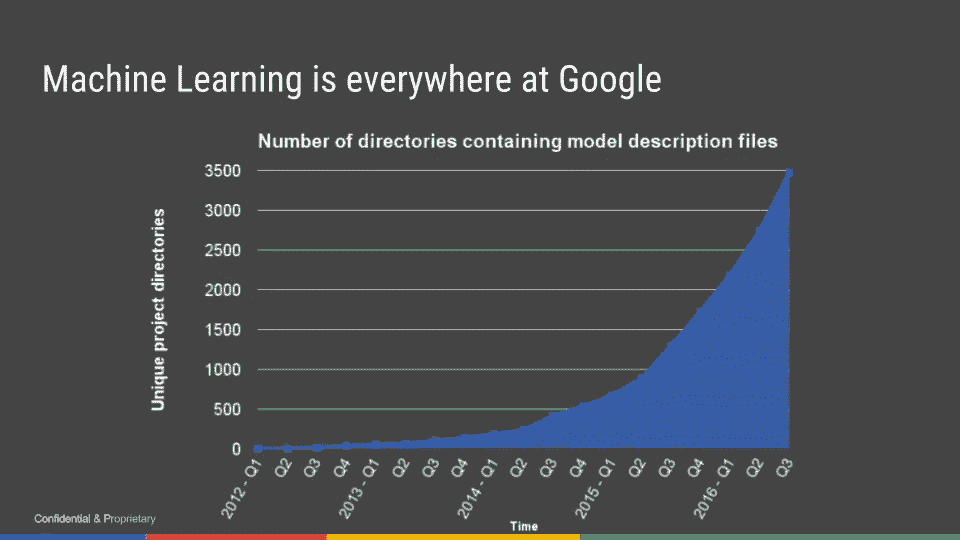

上图中的数字可能对你来说没什么意义，但是它代表了 [Google 的中央大代码仓库](http://glaforge.appspot.com/article/billions-of-lines-of-code-in-a-single-repository-seriously)中包含模型定义文件的目录数量。内部和外部利用机器学习的项目呈指数级增长。越来越多的谷歌产品和服务利用机器学习来添加新的增值功能，以改善用户体验。

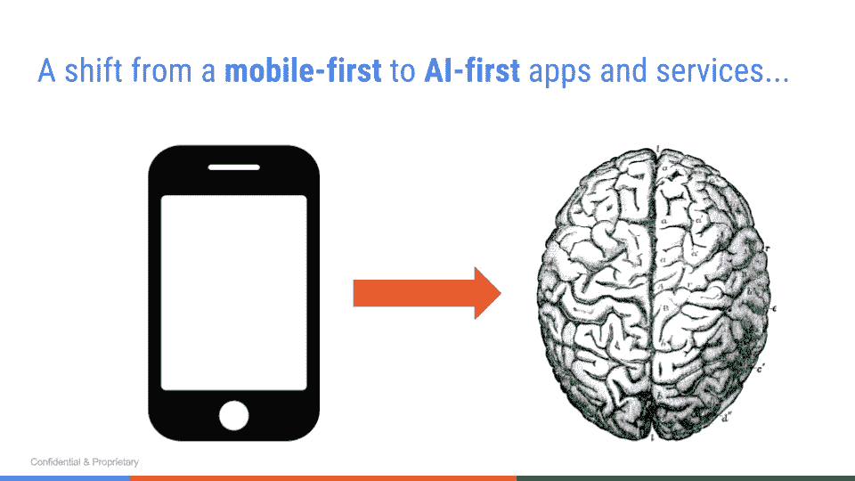

谷歌首席执行官桑德尔·皮帅概述了这种从移动优先到人工智能优先的战略转变。现在授予移动；产品和服务的下一个进步来自我们正在取得的进展，这要归功于人工智能方面，这些方面将智能添加到用户体验和新的智能关键功能中。

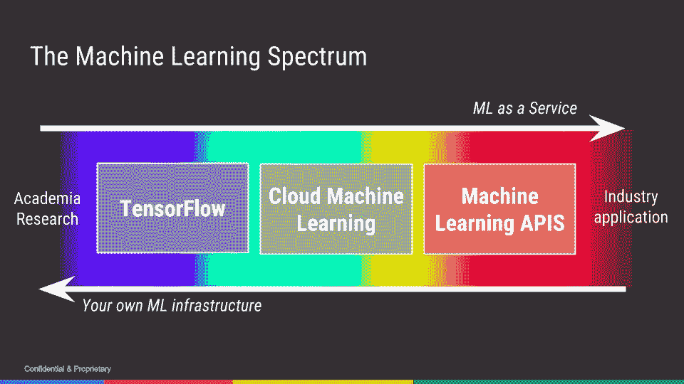

在谷歌，更准确地说是通过[谷歌云平台](https://cloud.google.com/)，一系列工具和服务可以满足你下一步的机器学习需求，让你自己的产品更加智能。你可以使用现成的机器学习 API，而不需要博士学位和人工智能(即上图中的“ML 即服务”)。你也可以使用 [TensorFlow](https://www.tensorflow.org/) 开源项目来构建你自己的神经网络。你可以在谷歌云基础设施上扩展培训。

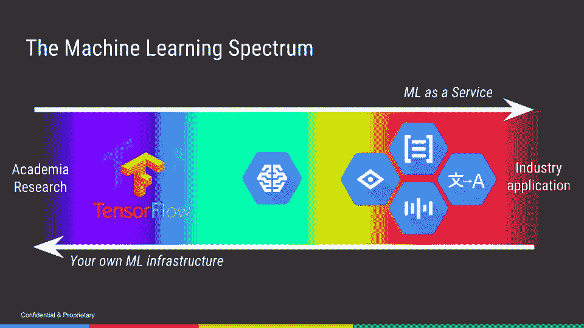

对于已有的训练好的模型，你可以使用[语音](https://cloud.google.com/speech/)识别 API、[自然语言](https://cloud.google.com/natural-language/)处理 API、[翻译](https://cloud.google.com/translate/) API 或者[视觉](https://cloud.google.com/vision/)识别 API。但是，如果你使用自己的 TensorFlow 模型， [Cloud ML](https://cloud.google.com/ml/) 是一种托管服务，使你能够轻松地建立机器学习模型，这些模型可以处理任何类型、任何规模的数据。

# 资源&更进一步

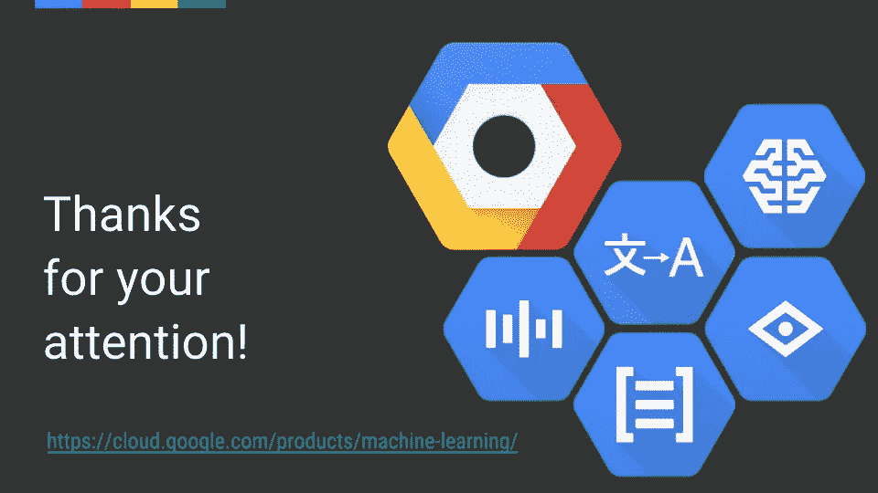

如果你想了解更多关于机器学习产品的信息，请前往:[https://cloud.google.com/products/machine-learning/](https://cloud.google.com/products/machine-learning/)

如果你想看我做的主题演讲，这里有我出场的视频节选，还有杰夫·迪恩的采访(你也可以在 YouTube 上看[整个主题演讲](https://www.youtube.com/watch?v=T-ujPlfm6p4))。我会在另一篇关于杰夫·迪安采访的文章中回来，这真的很吸引人。

如果你想仔细看看我在主题演讲中展示的会议助理演示，请在我的博客上阅读更多信息:[一个具有语音识别和自然语言处理的穷人助理](http://glaforge.appspot.com/article/a-poor-man-assistant-with-speech-recognition-and-natural-language-processing)。

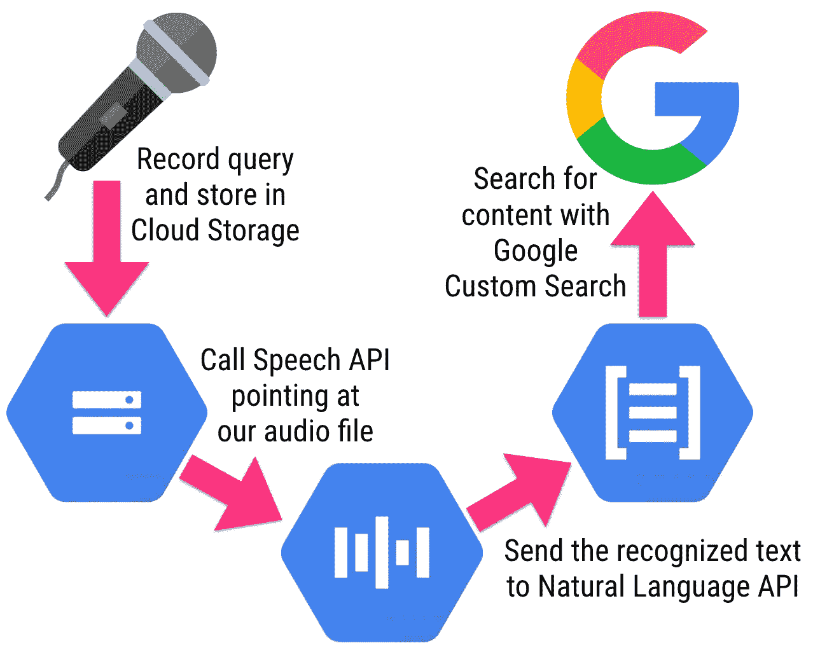