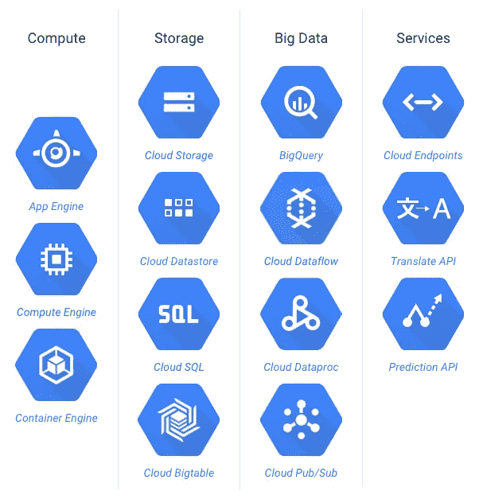
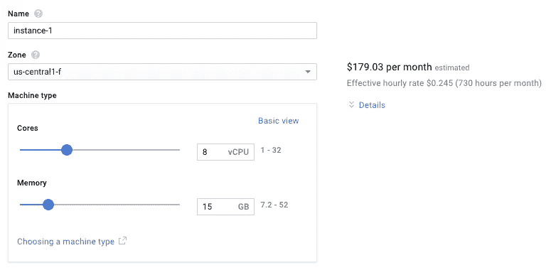

# 机器类型—谷歌云

> 原文：<https://medium.com/google-cloud/machine-types-google-cloud-ba3486b4d747?source=collection_archive---------0----------------------->

自云计算平台开始以来，提供商一直在寻找各种方法来克服可用定制的限制。对于谷歌云，它从提供应用引擎开始，这仍然是任何应用部署的最佳起点之一，因为它为你处理平台。

但这还不够，谷歌同时推出了计算引擎，并一直在改进其各种产品，无论是在大数据服务、存储还是监控领域。云生态系统已经成熟，我们不时会看到新的功能和产品。

如果您使用 Compute Engine 或其他提供商提供的同等产品，您应该已经注意到有预先指定的[机器类型](https://cloud.google.com/compute/docs/machine-types?hl=en_US)可供选择。这些机器类型在本质上是可扩展的，并且根据机器的主要使用情况具有多种配置。

即使这样，有时你也会觉得受到产品的限制，因为你可能需要两个世界最好的，CPU 和 RAM 的大小。如果你对机器的尺寸有一个定制的要求，你将总是在至少一个机器上使用额外的资源。例如，如果我的一个部署需求是 8 个 CPU 和 15G RAM，最接近的产品是 n1-standard-8，它有多余的 15G RAM，我不会使用，但必须为机器类型付费。

随着计算引擎启动平台中新的定制功能的推出，现在您可以根据自己的需求定制计算机。您最多可以拥有 32 个虚拟 CPU 和 208G 内存。为了避免超出硬件配置常识的限制，根据您的 CPU，它显示了可用 RAM 的最大数量。

这是一个小更新，它给我们使用这些平台的方式带来了重大变化。现在，您可以构建自己的定制机器类型，并使用 Docker 通过容器引擎启动它，根据需要进行多次迭代和复制。更高的灵活性意味着终端开发者拥有更大的能力，从而拥有更好的云生态系统。