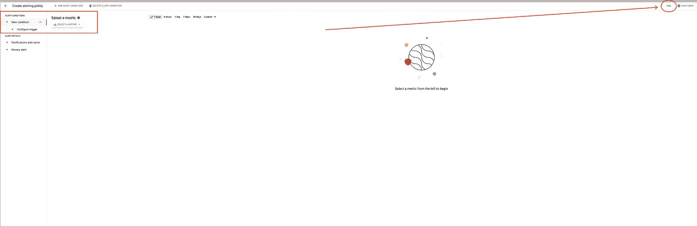
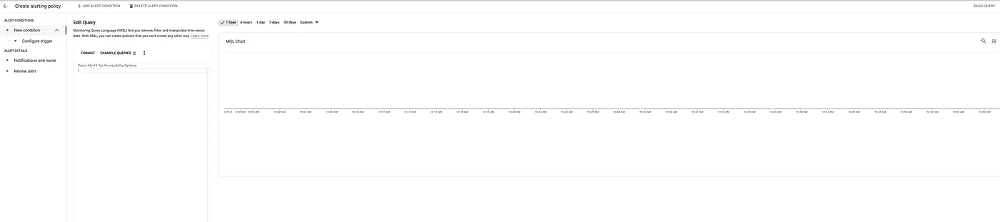
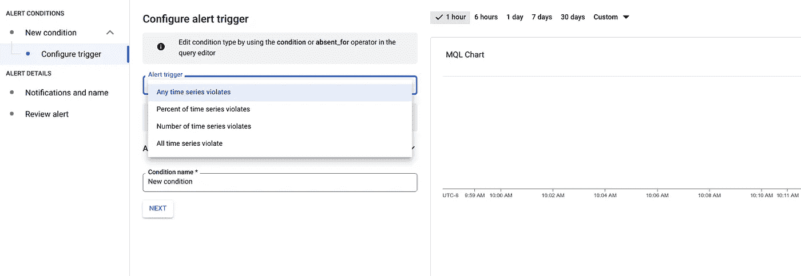

# 使用谷歌云发布切实可行的警报

> 原文：<https://medium.com/google-cloud/make-actionable-alerts-using-google-cloud-dda93e30c781?source=collection_archive---------2----------------------->


[罗伯特·林德](https://unsplash.com/@rwlinder?utm_source=unsplash&utm_medium=referral&utm_content=creditCopyText)在[号航天飞机](https://unsplash.com/s/photos/railway-crossing?utm_source=unsplash&utm_medium=referral&utm_content=creditCopyText)上的照片

操作生产系统时，可操作事件是一个非常有用的工具。一个常见的使用示例是能够重启 CPU 利用率达到 99%且持续时间超过一分钟的虚拟机实例。根据基础架构或云提供商，事件可以实现为某种触发器，这些触发器绑定到正在执行的脚本，编码到服务中(例如，可以在创建虚拟机实例时提供操作)，或者描述为具有可定制反应的系统警报。许多其他类型的实现也是可能的。例如，参见 AWS 中的 [CloudWatch Events](https://docs.aws.amazon.com/AmazonCloudWatch/latest/events/WhatIsCloudWatchEvents.html) 。主要的挑战通常是理解术语，所以您可以理解如何识别事件，以及如何将您的实现绑定到该事件，这样它将在预期的条件下被触发。

## 在谷歌云中

谷歌云是工程师为工程师构建的。这意味着*你可以实现任何你需要的东西，只要有一个公共的 API。然而，这也意味着*有时*你会花时间搜索那个 API，然后弄清楚如何使用它。这就是在谷歌云中被称为*警报*的可操作事件的情况。*

在 Google Cloud 中，您可以使用阈值警报、数据缺失、SLO、正常运行时间检查以及更高级的操作(如使用 MQL 的变化率和聚合)来定义指标或日志数据的[警报策略](https://cloud.google.com/monitoring/alerts)—[监控查询语言](https://cloud.google.com/monitoring/mql)。警报策略可以根据小组的需要而简单或复杂，然后使用筛选和分组将数据组合成所需的集合。警报策略包含触发警报的条件、通知您的[通知渠道](https://cloud.google.com/monitoring/support/notification-options) (s ),以及包含任何动态数据和仪表盘、行动手册等链接的文档部分，以便更快地进行故障排除。每次满足策略的条件时，系统都会创建一个新的[事件](https://cloud.google.com/monitoring/alerts/incidents-events)。为了实施 ***可操作*** 警报，您需要定义允许您“采取行动”的“正确”通知渠道。

## 实施警报行动

您可以使用三种方法来执行操作以响应触发的警报:

1.  定义[云构建触发器](https://cloud.google.com/build/docs/automating-builds/create-manage-triggers)。
2.  定义[云函数](https://cloud.google.com/functions/docs/calling/pubsub)。
3.  定义一个将运行您的逻辑的 REST API 端点。

前两个可以使用 [PubSub](https://cloud.google.com/monitoring/support/notification-options#pubsub) 或 [Webhook](https://cloud.google.com/monitoring/support/notification-options#webhooks) 通知通道来触发。最后一种方法仅由 [Webhook](https://cloud.google.com/monitoring/support/notification-options#webhooks) 触发。我会推荐使用[云构建](https://cloud.google.com/build)，因为它(1)使用声明性语言；(2)配置易于创建、维护和控制；(3)作为无服务器服务，维护成本低廉,( 4)作为谷歌云不可或缺的一部分，它让你可以使用谷歌 CLI 或 API 做任何事情。但是，如果你需要某种代理，这样你就可以在 Terraform Cloud 中触发执行 Terraform 计划，那么第二种或第三种方法适合你。

您可以在[文档](https://cloud.google.com/monitoring/support/notification-options#expandable-6)中找到在 PubSub 消息或 HTTP 请求中发送的有效负载的 JSON 模式。

## 在警报策略中描述事件的条件

这就是“你内心的工程师”很重要的地方。如今，用户在使用 Google Cloud 中的警报来定义事件方面的体验并不好。基本上，为了能够定义一个有意义的警报，你需要编写你自己的 MQL，是的，它是另一种脚本语言。让我给你一些关于你可以使用的 UI 和 MQL 资源的提示。

当您使用[云控制台](https://cloud.google.com/cloud-console)创建新警报时，您会发现自己处于多步向导式界面中



新建警报向导窗口

它限制您只能选择一个指标进行查询，然后让您定义预警阈值。如果您的事件是" *CPU 利用率达到 100%* "，这就足够了，但是如果您想要捕获一个事件"*当返回 200 个状态代码的响应占响应总数的比率小于 90%* "或者类似的复杂事件，这就不够了。在这些情况下，你可以通过点击窗口右上角的小 **MQL** 按钮来改变用户界面，允许你在向导中编写 MQL(见前面截图中的红色箭头)。然后，您将看到向导窗口的外观略有不同:



用于编写 MQL 查询的新警报向导窗口

现在到了困难的部分。几乎所有复杂的警报都使用某种度量比率。使用[比率](https://cloud.google.com/monitoring/mql/examples#qlx-ratio-ratio)操作实现。达到相同目标的其他方法的描述可以在 [MQL 示例](https://cloud.google.com/monitoring/mql/examples#qlx-ratios)中找到。使用 MQL，您应该能够定义描述您的事件的 MQL 查询，尽管[文档](https://cloud.google.com/monitoring/mql/examples)对于您的具体情况可能不全面。如果你发现自己遇到了挑战，请在[专用论坛](https://www.googlecloudcommunity.com/gc/Google-Cloud-s-operations-suite/bd-p/cloud-operations)中自由提问。在接下来的部分中，我将展示如何针对特定的用户场景来做这件事。

在您构建了查询以查看捕获您的事件的数据之后，您可以[定义两个条件](https://cloud.google.com/monitoring/mql/alerts#ql-alert-ops)中的一个来完成事件的描述并触发警报:

1.  `condition` operator 让您描述触发事件的[阈值条件](https://cloud.google.com/monitoring/mql/alerts#ql-threshold-alerts)，或者在 Google Cloud 的情况下，打开一个警报事件。
2.  `absent_for`操作符允许您描述在[缺少条件](https://cloud.google.com/monitoring/mql/alerts#ql-absence-alerts)时应该触发的事件。当您想要描述没有数据的事件时，这很有用。例如，来自您部署的应用程序的任何*响应或对数据库的任何*查询。

然后，您可以为触发事件设置附加约束



是希望在每次满足条件时触发它，还是希望根据违反条件的比率(百分比)或时间序列数，仅在某些时候触发它。为了使其尽可能接近*通常的*可操作事件，我建议选择第一个选项“任何时间序列违反”。

现在，让我们来看一个例子。

## 以身作则或“你能在 Google Cloud 中做到吗”挑战

前一段时间，我的朋友问我，是否有可能部署一个新版本的云功能，然后如果部署的版本执行得不够好，就将其回滚。举个例子，我的朋友说这在 Azure 中是可能的，但是在他看来 Google Cloud 中没有这样的功能。我来接受挑战，因为我确信它就在那里。

因此，我最终创建了一个简单的云函数，当到达“好”路径时返回状态 200，当到达“坏”路径时返回状态 404。

```
package cloudfunctiondemo

import (
 "fmt"
 "net/http"
)

func Ping(w http.ResponseWriter, r *http.Request) {
  if r.URL.Path == "/good" {
    fmt.Fprint(w, "pong")
    return
  }
  http.NotFound(w, r)
}
```

我将其部署到云功能，然后创建了一个警报策略，该策略应该捕获以下事件，并在每次事件发生时发送 PubSub 消息:

> 我的云函数实例的响应错误率在 5 分钟内超过(大于)20%

换句话说，如果少于 80%的请求连续 5 分钟以上不正常，那么我想回滚到以前的版本。

因此，为了将上述转换成 MQL，我需要一些指标来帮助我找到“云函数响应的错误率”。我去 Google Cloud 上查看[度量云函数报告了什么](https://cloud.google.com/monitoring/api/metrics_gcp#gcp-cloudfunctions)，发现`[function/execution_count](https://cloud.google.com/monitoring/api/metrics_gcp#cloudfunctions/function/execution_count)`度量累积了函数**的执行总数，而**的属性可以是“ok”、“error”等。所以，为了知道这个比率，我需要知道`status == "ok"`执行了多少次死刑，相对于所有死刑的总数。查看 MQL [文档](https://cloud.google.com/monitoring/mql)和示例帮助我编写了以下包含条件的查询:

```
fetch cloud_function
| metric 'cloudfunctions.googleapis.com/function/execution_count'
| {
    filter status != 'ok'
    ;
    ident
}
| group_by drop[status], sliding(5m), .sum
| ratio
| scale '%'
| every (30s)
| condition val() > 20'%'
```

我来解释一下，这样你自己做东西就容易了。*第一个*操作符(第 1 行)定义了我们获取数据的受监控资源的类型。s*second*运算符(第 2 行)查询我发现应该使用的度量。T *hird* 算子是一个复杂的算子。它(第 3 行)是一个[组操作符](https://cloud.google.com/monitoring/mql/reference#query-structure)，它将来自(第 2 行)的过滤结果与[“身份”表](https://cloud.google.com/monitoring/mql/reference#ident-tabop)相结合，后者实质上是指标的整个时间序列。下面的操作符实现前面提到的比率计算 I。在这个特定的查询中，它对 5 分钟窗口中的表进行求和，并计算第一个表(非 OK 状态的表)与第二个表(所有计数)的比率。然后，它将结果转换成百分比(第 10 行)，并“告诉”每 30 秒刷新一次(第 11 行)。最后，它为比率将大于 20%的情况下的警报查询设定条件。

在定义了“违反任何时间序列”时触发的警报并添加了 PubSub 通知通道后，我得到了没有操作的可操作事件。剩下的工作很简单。我定义了在接收 PubSub 消息时触发的 CloudBuild 触发器，该消息连接到警报向其发送通知的同一个 PubSub 主题，然后我使用 CloudBuild 脚本实现了[云功能回滚](/@minherz/rollback-your-google-cloud-function-to-its-previous-version-76db870744c6)。我没有把代码放在这里，因为这是一个基于云函数的未记录特性的概念证明。

长话短说，在 Google Cloud 中实现可操作事件并不容易。我们正在努力使它更简单，但这可能需要一段时间。然而，在这方面，谷歌云没有什么是你做不到的。请联系我，您有具体的用户案例困扰着您。