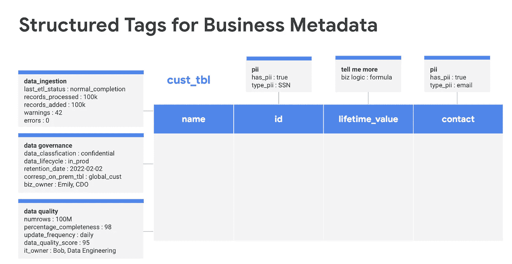

# 在 GCP 上构建集中且安全的数据目录的 5 个关键步骤

> 原文：<https://medium.com/google-cloud/make-people-find-what-theyre-looking-for-aa178567ded7?source=collection_archive---------1----------------------->

## 让你的人找到他们要找的东西

我和我的团队最近完成了一个漂亮的项目。我们的目标是让一家大公司的所有员工忘记思考*“我已经花了 10 分钟寻找这些数据，但仍然没有找到我要找的东西”*。

[蒂姆·高来自 Unsplash 的照片](https://unsplash.com/@punttim)

有人知道**我们在工作中浪费了多少时间寻找数据吗？**

我们中的许多人都经历过这样的噩梦，感觉我们在浪费时间寻找我们怀疑存在但却找不到的公司数据。根据 Dresner 在 2020 年进行的一项研究[ [1](https://hdresner.gumroad.com/l/YKFrv) ]，51%的员工认为他们很难找到分析数据，这种趋势在最大的公司(> 1000 名员工)中不断增长。此外，还发现内容越难找到，业务计划失败的可能性就越大。为了证明这一点，让我们加入一些在各种研究中发现的令人沮丧的数据[[1](https://hdresner.gumroad.com/l/YKFrv)][[2](https://pages.alteryx.com/idc-infobrief-state-data-science-analytics)]关于大多数商业计划的第一阶段，即第一次信息搜索 T25 分析:

*   90%的工作周花在与数据相关的活动上。
*   92%的时间花在搜索数据资产上。
*   44%的时间浪费在数据工作者不成功的活动上。

而且有一点我们是相当清楚的: ***时间就是金钱*** 。为了解决这个问题并大幅减少搜索时间，**谷歌云创建了数据目录**，并于 2020 年 4 月正式发布。

[Data Catalog](https://cloud.google.com/data-catalog) 是一个**完全托管和高度可扩展的数据发现和元数据管理服务**。在本文中，我将展示如何使用该产品构建端到端的企业数据目录。为了实现这一点，我将保持简单:只需 5 个步骤。

在此之前，我想做一个澄清——可能对某些人来说是显而易见的——来强调，为了构建我们的业务数据目录，最基本的(以及我们将使用该产品管理的)不是数据本身，而是描述我们数据的**元数据**。

我们使用该目录的基本目标是，我们的同事能够**找到他们正在寻找的信息**，如果他们无法访问数据本身，至少他们能够**知道我们确实希望他们了解的关于该数据的具体信息**。例如，我们可能希望我们的员工看到:

*   谁创建了一个表或者谁负责一个文件(所以如果它不是敏感信息，这个人知道应该向谁请求访问它)
*   该信息何时生成以及何时更新
*   它占用了多少存储空间
*   如果它包含敏感信息，是什么类型的
*   诸如此类。

所有这些**都不需要访问元数据下面的数据**。

现在我们已经了解了数据目录的使用情形，让我们看看如何从该产品中获得价值。为了更好地理解，我添加了**演示视频来展示我们的 5 个步骤**。该演示基于 2 个不同的项目(财务和人力资源)和 3 个不同的身份(在这种情况下，它们是 3 个单独的帐户，但在真实的用例中，它们可能是用户组，甚至是服务帐户)。在此找到授予这些身份的权限:

*   ***数据分析师*** 可以**发现**财务项目**中的数据，但不能访问该项目**中的数据。这是通过 ***数据目录查看器*** 角色授予的，该角色提供对所有数据资产的**元数据读取访问**以及对所有标签模板和标签的读取访问。**数据分析师**无权**在人力资源项目**中发现或访问数据。
*   ***数据管理员*** 可以**发现和访问**项目**财务和 hr 中的数据**，通过 ***项目查看器*** 角色*授予。*它还可以**通过使用驻留在两个项目中任何一个的标签模板来创建和附加标签**(***数据目录标签模板用户*** 角色)，还可以编辑附加的标签( ***数据目录标签编辑*** 角色)。
*   ***数据管理者*** 可以**发现和访问**项目**财务和人力资源中的数据**，通过 ***项目查看者*** 角色*授予。*此外，由于 ***数据目录标签模板所有者*** 角色，它可以**访问标签模板并在两个项目中**创建/更新/删除标签模板和相关标签。

也就是说，让我们看看如何通过 5 个步骤在 Google Cloud 上构建我们的数据目录。

## 1.检测并启用您想要发现的数据

开始使用数据目录时，只需打开 [GCP 控制台](https://console.cloud.google.com/)，在这里启用产品的 API [。](https://console.cloud.google.com/marketplace/product/google/datacatalog.googleapis.com)

一旦你这样做了，谷歌云资源就会在你的目录中自动被发现。这包括 [BigQuery](https://cloud.google.com/bigquery) (数据集、表格和 BQML 模型) [Pub/Sub](https://cloud.google.com/pubsub) 和 [Dataproc Metastore](https://cloud.google.com/dataproc-metastore/docs) 数据。此外，您还可以将[数据丢失防护(DLP)](https://cloud.google.com/dlp) 扫描结果发送到数据目录。

除了 Google Cloud 数据源，您还可以将内部数据源与您的数据目录集成，例如所有典型的 RDBMS (MySQL、PostgreSQL、SQL Server、Teradata 等)。)、BI 工具(Looker、Qlik 和 Tableau)和 Hive 数据源。在此查看所有支持的信号源[。在*步骤 3:使用条目组*中解释了集成这些来源的过程，这也使我们能够将 Google 云存储文件集成到我们的目录中。](https://cloud.google.com/data-catalog/docs/integrate-data-sources#integrate_on-premises_data_sources)

一旦我们获取了所有的元数据，我们就可以将数据目录用于两个主要目的:

*   通过搜索使我们的(元数据)数据可被发现(见*步骤 2* )。
*   通过标签用额外的业务元数据丰富我们的数据(参见*步骤 4* )。

## 2.知道(并让你的用户知道)如何搜索数据

一旦我们获取了所有元数据并设置了所有必要的权限，我们的用户就能够发现他们拥有元数据级别访问权限的所有资产。这种发现通常是通过在数据目录的搜索栏中进行查询来完成的。

这些搜索可能非常简单，能够搜索一个字符子串，返回以某种方式与该子串相关的所有资产。例如，如果我们简单地搜索“num ”,搜索引擎将返回包含“num”的所有资产:在资产名称中，在我们环境中的某个表的列中，在项目名称中，在描述中，在标签的值中，等等。如果我们想做更高级的查询，我们将不得不坚持数据目录搜索语法，其限定符(操作符)可以在[数据目录的文档](https://cloud.google.com/data-catalog/docs/how-to/search-reference#qualified_predicatesç)中找到。

为了更好地理解这个搜索引擎有多强大，让我在这里试着解释一下(点击“在 YouTube 中查看”以便于阅读):

## **3。(可选)使用输入组**

***条目*** 表示可以从数据目录中创建、搜索和管理的数据资源。这些资源可以是:

*   **Google 云资源**，比如 BigQuery 数据集或表、发布/订阅主题等。
*   **具有自定义数据类型的自定义资源**。

条目包含在一个 ***条目组*** 中，该条目组是一组逻辑上相关的条目以及 IAM 策略，这些策略指定了可以创建、编辑和查看这些条目的用户。

如前所述，我们可以[使用自定义条目](https://cloud.google.com/data-catalog/docs/how-to/custom-entries)创建条目组(例如，来自 MySQL、Postgres 或 SQL Server DDBB、其他数据湖&仓库(如 Redshift、Teradata 等)的文件。).我们还可以创建由我们定义的 **Google 云存储** (GCS) ***文件集*** 组成的条目组。

GCS 文件集只能由同一 bucket 的对象子集组成，但是一个条目组中可以有多个文件集。这些文件集允许使用(复杂的)通配符来定义它们。例如，我们可以通过指定模式`gs://data-emy/2021_*/**/file?.[xls,csv]`来定义文件集。这些图案的含义是:

*   * —匹配该目录级别的任意数量的字符
*   ** —跨目录边界匹配任意数量的字符。
*   ？—匹配单个字符。例如 gs://bucket/？？。txt 只匹配两个字符后跟. txt 的对象。
*   []-匹配任意范围的字符。

有了这些，我们可以说指定的模式包括任何 CSV 或 XML 格式的文件，称为 file？(文件 1，文件 2，…，文件 9)，位于名称以“2021_”开头的“data-emy”存储桶内的文件夹的任何子目录中。

一个文件集可以有 1 到 500 个模式(更多信息参见[通配符名称](https://cloud.google.com/storage/docs/gsutil/addlhelp/WildcardNames)和[gcsfilesetspec . file patterns](https://cloud.google.com/data-catalog/docs/reference/rest/v1/projects.locations.entryGroups.entries#GcsFilesetSpec.FIELDS.file_patterns)API 参考文档)。

## 4.使用标签和模板

数据目录标签是业务元数据，更好的说法是，*云管理者-* 可以创建和管理，以使信息对其他用户是可发现的和完整的。这些标签可以在列或表级别应用:

在执行[云数据丢失防护](https://cloud.google.com/dlp/docs) (DLP)作业时，也可以自动创建标签，该作业用于扫描敏感信息。自动生成的标记将包含我们正在搜索的信息类型(敏感信息类型，如电子邮件地址或信用卡号)的所有字段，指定 DLP API 为这些信息类型中的每一种找到的结果的数量。

为了实现元数据的一致性，*数据调控器*可以创建 ***标签模板*** 。这些模板由元数据 ***字段*** 和键值对组成，键值对可以是字符串、双精度、布尔、枚举或日期时间类型；并且可以是必需的或者不是必需的。

数据目录标签模板将允许我们的数据管理员用户使用我们需要的所有信息(元数据)来创建**同类标签**，从而拥有一个强大且一致的目录。

由于这是我们目录中最重要的主题之一，我制作了一个视频，您可以从中看到*数据管理器*如何创建一个 ***标记模板*** ，其中包括哪些类型的业务信息与我们的数据分类相关。之后，*数据管理员*可以使用创建的模板将 ***标签*** 附加到 BigQuery 表或列。你可以在这里看到:

## 5.(可选)利用策略标记来限制对 BigQuery 列的访问

我们刚刚看到的四个步骤是我们实现完整的数据目录所需的全部，通过同质和一致的元数据标记来增强我们的数据治理。然而，数据目录中还有一个我们尚未探索的特性，它在 BigQuery 中为我们提供了列级安全性:策略标签*。如果您不使用或者对使用 BigQuery 不感兴趣，那么您可以在这里停止阅读。如果您想了解如何在列级别控制对 BigQuery 表的访问，请继续阅读。*

*通过应用这些策略标记，我们可以对不应该看到该信息的用户隐藏 BigQuery 列。这样，他们看到的表就好像特定的列不存在一样。*

*为了定义对 BigQuery 表的列细粒度访问，我们需要执行三个步骤(请注意步骤 2 和 3 的顺序可以互换):*

1.  ***在数据目录中定义一个分类，并在其中创建我们的策略标签**。通过定义我们的分类法，我们定义了我们的策略标签所在的不同安全级别。例如，我们可以根据数据的敏感程度来定义级别，例如高、中或低敏感级别，然后为不同级别分配我们需要的策略标签。*
2.  ***将策略标签应用到我们想要限制访问的列**。由于我们现在处于数据层，而不是元数据层——我们控制的是访问数据本身的**，而不是访问元数据**的**，这应该在 BigQuery** 而不是数据目录中应用**。我们应用策略标记的方法是编辑相应表的模式，并将策略标记应用到我们需要的特定列。***
3.  ***通过在我们想要的分类级别应用**IAM***【细粒度读者】角色*** 来控制访问。这个角色专门负责这个用例:在 BigQuery 列级别限制访问。注意:除了现有的数据集 ACL 之外，还实施列级安全性。用户需要数据集权限和策略标记权限才能访问受列级安全性保护的数据。*

*我知道你在想什么，这个过程在第一次应用时可能看起来有点麻烦。但是，如果定义一个很好的分类法，作为所有 BigQuery 表的基础，可以节省大量时间。如果您想了解如何通过遵循[谷歌云使用策略标签的最佳实践](https://cloud.google.com/bigquery/docs/best-practices-policy-tags)来创建和应用这些策略标签，请观看以下视频:*

*正如我们所见，在您的组织中查找数据并不一定是一场噩梦。通过这 5 个相当简单的步骤，您可以使您的数据更易访问、更丰富、更易共享和集中控制。*

*希望你喜欢这篇文章，并发现在 Google Cloud 上创建数据目录的实用指南。无论你是否成功地应用了这些步骤，我都很乐意听到你的意见——反馈是一份礼物——在评论中或者在 LinkedIn 上。*

***非常感谢你读到这里！***

*[1]数据目录研究，Dresner 咨询服务有限责任公司—2020 年 6 月 15 日，【https://hdresner.gumroad.com/l/YKFrv *

*[2]数据科学和分析的现状，IDC IntroBrief，由 Alteryx 主办，2019 年，[https://pages . Alteryx . com/IDC-info brief-State-Data-Science-Analytics](https://pages.alteryx.com/idc-infobrief-state-data-science-analytics)*