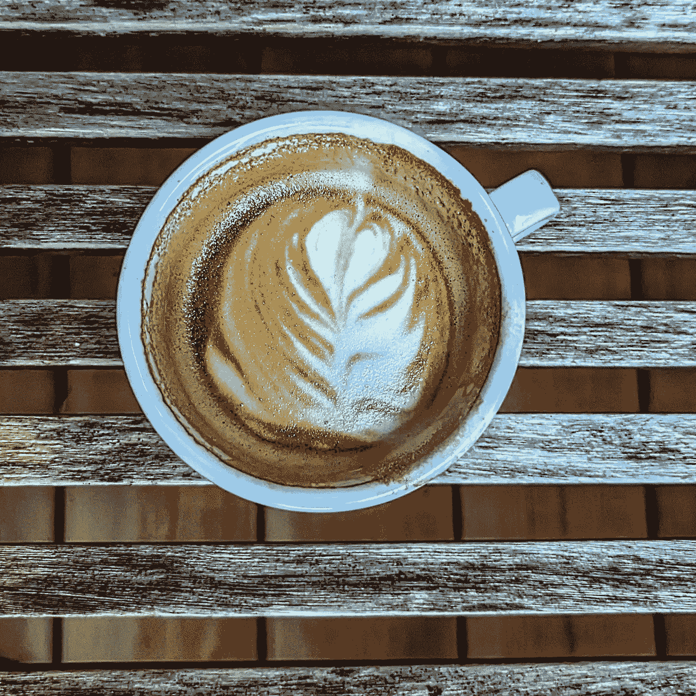
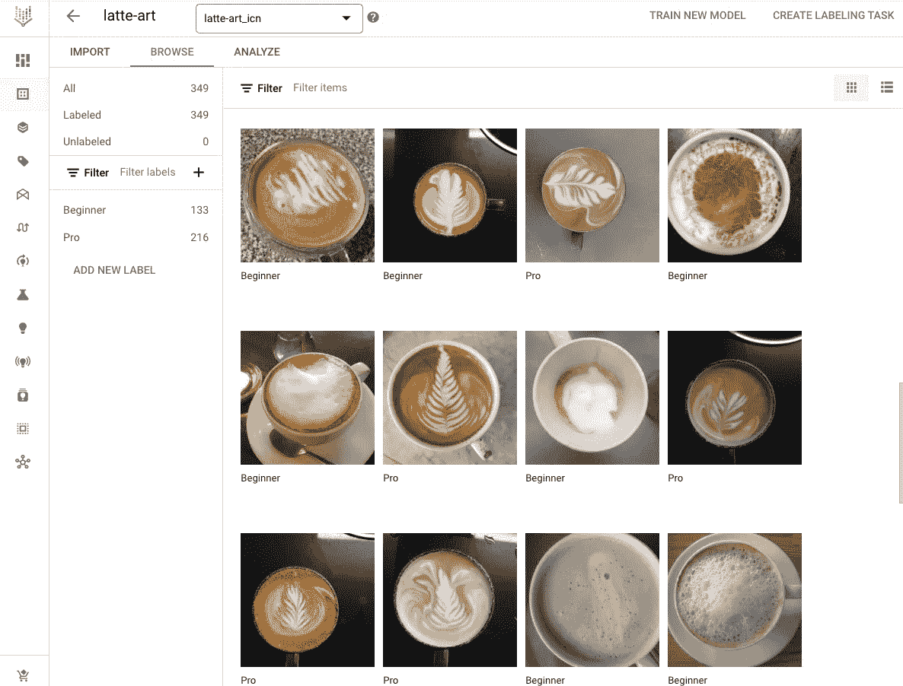
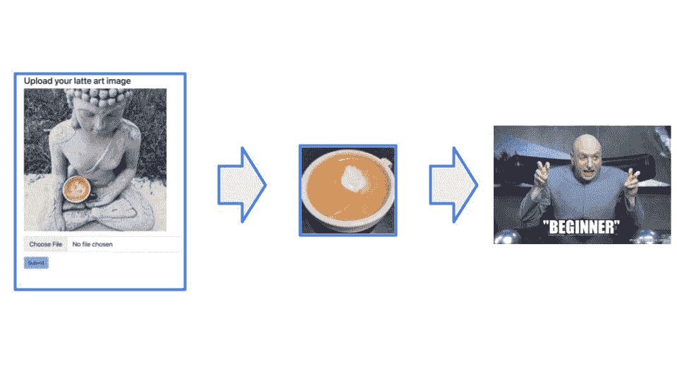
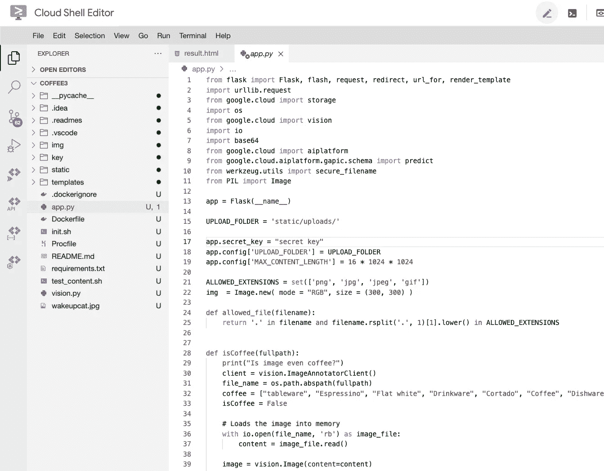

# 使用人工智能制作更好的咖啡

> 原文：<https://medium.com/google-cloud/making-better-coffee-using-artificial-intelligence-f253aa45c0aa?source=collection_archive---------6----------------------->

**如何利用 Vertex AI，一些 Python 和 Cloud Run 在 Google Cloud 上快速搭建一个拿铁艺术检测器(几乎不用编码)**

我喜欢早上的卡布奇诺，每天都努力提高我的拿铁艺术。它还不完美，但肯定比我的 ML 和应用程序构建技能要好。谢天谢地，谷歌云让使用 [AutoML](https://cloud.google.com/vertex-ai/docs/beginner/beginners-guide) 训练你自己的模型变得非常容易，不需要编码。为了运行这个应用程序，我在 Google Cloud Shell 编辑器中使用了 Python 和 Cloud Run，稍后会详细介绍。

几年前，我已经使用 AutoML Vision API 来[检测哪位涂鸦艺术家创作了一幅 ar](https://cloud.google.com/blog/products/ai-machine-learning/who-street-artist-building-graffiti-artist-classifier-using-automl) t。同样的原理可以应用于拿铁艺术。训练一个人工智能关于哪种咖啡*好*或*不太好*就像教一个小孩子区分狗和猫一样。只要给孩子(或人工智能)看很多例子，它就会学会。因此，我把我早上制作卡布奇诺的所有照片拿出来，让我在慕尼黑的 2000 多名同事把他们的*棒的*和*不那么棒的*拿铁艺术照片添加到一个共享文件夹中。在 Vertex AI 中，我创建了基于 300 多张图像的数据集，并将它们标记为“专业”和“初学者”。这只花了几分钟。

然后我点了“火车”，等了几个小时。我将模型部署到一个端点，并使用一些预定义的 Python 代码来调用模型。我使用 Python Flask 和 Cloud Run 来创建和运行我的简单 web 应用程序。不是开发人员，这实际上花了最长的时间，但至少我学到了一两件事(例如，如何调整图像大小，因为 Vertex AI 对图像的限制是 1.5MB)。

你可以在这里用你的拿铁艺术试试 app:[https://latte-art-detector.com/](https://latte-art-detector.com/)

该应用程序通过首先检查谷歌云(预训练)[视觉 API](https://cloud.google.com/vision) 来检测你上传的图像是否不是咖啡。

**编辑(2022 年 11 月 18 日):**所有咖啡图像都放在一个存储桶中，我已经用它来重新训练下一个模型版本。所以继续做好(或不太好)的咖啡吧:-)

用于编写代码和部署到云运行的云外壳编辑器

要查看我的(初学者)Python 应用程序，请进入我的 Github 项目:[https://github.com/aosterloh/latte-detector](https://github.com/aosterloh/latte-detector)

感谢我团队中的 Christoph 和 Dorra 帮助我开发应用程序。这不是谷歌的官方工作。如果我错过了什么，请告诉我。