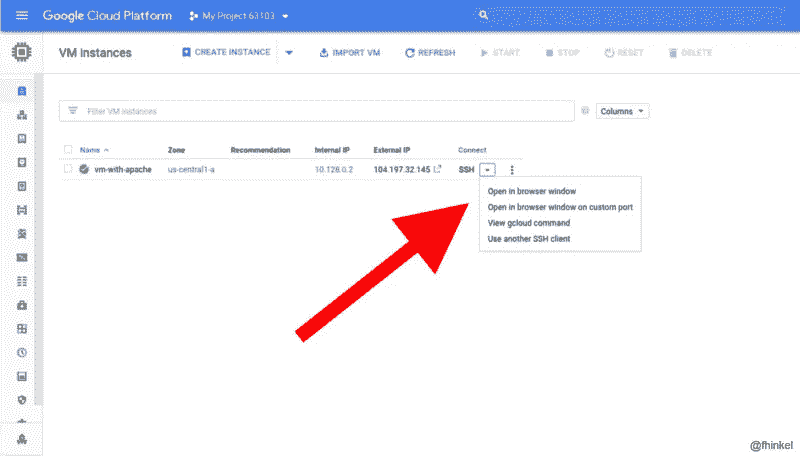

# 用 Node.js 管理 Google 计算引擎

> 原文：<https://medium.com/google-cloud/manage-google-compute-engine-with-node-js-eef8e7a111b4?source=collection_archive---------0----------------------->

## 计算引擎的 Node.js 客户端库简介

> 谷歌[计算引擎](https://cloud.google.com/compute/)交付虚拟机(VM)。计算引擎支持从单个实例扩展到负载平衡的全局云计算。

在[计算引擎](https://cloud.google.com/compute/)虚拟机上，您可以安装任何操作系统或软件，并且您可以完全控制防火墙。计算引擎虚拟机就像您的本地工作站，只是它位于云中。您可以根据需要随时轻松扩展到更多或更少的虚拟机。

开始使用计算引擎最简单的方法是通过[云控制台](https://console.cloud.google.com/compute/instances)。您可以在 UI 中配置和运行虚拟机。

在[云控制台](https://console.cloud.google.com/compute/instances)中配置计算引擎实例。

但是，如果您想要自动化配置和运行虚拟机的过程，该怎么办呢？这就是[计算引擎 API](https://cloud.google.com/compute/docs/reference/latest/) 派上用场的地方。它是一个 REST API，用于管理 Google 云平台上的虚拟机。Node 的`@google-cloud/compute` [客户端库](https://github.com/googleapis/nodejs-compute)减少了您需要编写的代码量，使您的应用程序更加健壮。**使用 Node 以编程方式管理虚拟机非常简单。**

下面的代码片段使用 Ubuntu 和`@google-cloud/compute`库创建了一个新的虚拟机。在运行之前，[启用](https://console.cloud.google.com/apis/library/compute.googleapis.com)谷歌计算引擎 API。[使用服务帐户](https://cloud.google.com/docs/authentication/getting-started)设置认证，这样你就可以从本地工作站访问 API。

这个最小的代码片段执行以下操作:

*   加载客户端库，
*   创建一个计算机客户端，
*   启动虚拟机。

如果你查看[云控制台](https://console.cloud.google.com/compute/instances)，你应该会看到一个名为`ubuntu-instance`的新虚拟机。

# 带有 Node.js 服务器的虚拟机

您可以使用 Node 管理任何虚拟机，包括运行 Node 的虚拟机。

下一个例子更复杂。它创建一个具有 HTTP 访问的虚拟机，并在启动时安装 Node 和 Node *Hello World* 应用程序。将下面的脚本复制到一个名为`createVM.js`的文件中，并使用`npm install @google-cloud/compute && node createVM.js`运行它。

复制到一个名为`createVM.js`的文件，用`npm install @google-cloud/compute && node createVM.js”`运行。

如果一切正常，当您导航到示例脚本记录到终端的 IP 时，您将看到一个 *Hello World* 主页。

## 解决纷争

安装节点`git`，克隆示例应用程序，并启动服务器大约需要一分钟。如果启动脚本不起作用，可以使用[云控制台](https://console.cloud.google.com/compute/instances)登录虚拟机。连接后，查看`/var/log/syslog`中的日志文件来调试问题。请记住，启动脚本是以 root 用户身份运行的，其主目录不同于您的默认用户。

云控制台

云控制台还显示了`gcloud`命令，因此您可以从您的终端`gcloud compute --project "PROJECT_ID" ssh --zone "us-central1-a" "vm-with-node-server"`进入虚拟机`ssh`。

# 试试看！

在 [GitHub](https://github.com/googleapis/nodejs-compute/tree/master/samples/startup-script) 上有更多的示例代码。克隆存储库并创建和删除带有节点的虚拟机，如自述文件中所述。**[**API 参考**](https://cloud.google.com/nodejs/docs/reference/compute/latest/) **解释了更多的方法**。您认为哪一项对管理您的计算引擎虚拟机有用？完成后，不要忘记删除您的虚拟机，这样它们就不会产生费用。**

**关于定价的说明:在撰写本文时，一个*微型*计算引擎是 [GCP 自由层](https://cloud.google.com/free/)的一部分。运行上例中的*标准*计算引擎每小时花费不到 0.05 美元，或者每月 25 美元。详见[定价](https://cloud.google.com/pricing/)。**

**示例代码需要 Node 8 或更高版本。这些示例是为版本 0.10.0 的`@google-cloud/compute`编写的。可以用`npm install @google-cloud/compute@0.10.0`安装那个具体版本。**