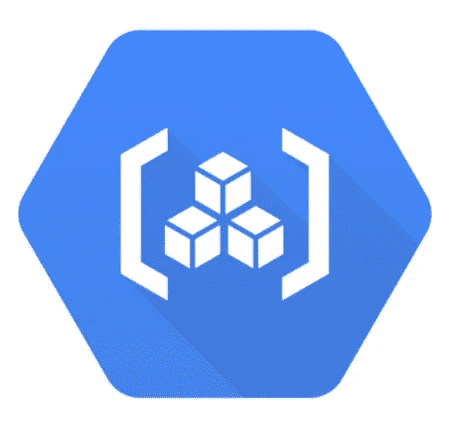

# 使用工件注册管理您的构建工件

> 原文：<https://medium.com/google-cloud/manage-your-build-artifacts-with-artifact-registry-953b98c58715?source=collection_archive---------2----------------------->

如果一提到容器，你就难以抑制自己的兴奋，那么这篇文章就是为你写的！如果你不喜欢这个双关语，那么这篇文章仍然适合你，但不要指望我为爸爸的笑话道歉。


# 一切都各就各位

我一生中搬了好几次家。仅在过去的十年里，我就在三个不同的州，七个不同的城市，八个不同的家生活过。搬家当然会有压力；有些东西不可避免地会损坏，有些东西会丢失，而且搬迁的每一部分都比预期的要贵。但是搬到一个新地方有一个部分是非常令人满意的:变得有条理。如果你使用容器注册，我打赌你也喜欢有条理！但一会儿会有更多的内容。让我们把这个比喻延续得更久一点，因为我对提出这个比喻感到非常自豪。

我终于买了我的第一栋房子，我真的很期待安顿下来。我花了很多时间计划如何自动化和优化我的家。


看它是如何组合在一起的！

我为我所有的烹饪用具选择了一个完美的位置。我投资了可以自动降低的灯罩。我有一个巢门铃，因为我有一对夫妇的包发芽腿，并离开我以前的住所。当然，我有足够的谷歌家园来确保助手永远不会超过一个“嘿谷歌”之外。说到管理您团队的 Docker 图像，我敢打赌，您想要和我在家里一样的组织和自动化。到目前为止，Container Registry 已经提供了这种自动化，但是是时候进入下一代注册了:工件注册。看到我是怎么把那个圆带回来的了吗？


又一张家装照片尽管你没问

# 升级到最新的管道自动化

Container Registry 为您的团队提供了一个单一的位置来管理 Docker 映像、执行漏洞分析，并通过细粒度的访问控制来决定谁可以访问什么。现有的 CI/CD 集成允许您设置完全自动化的 Docker 管道，以获得快速反馈。为了建立这个强大的基础，Google Cloud 发布了下一代容器管理工具:Artifact Registry。



借助 Artifact Registry，您可以管理您的容器映像和语言包(即，在与云的构建、测试和部署套件以及第三方 CI/CD 系统集成的同时构建工件。

*   **特定于注册表的权限** —工件注册表提供了更细粒度的权限，允许您在项目或注册表级别控制访问
*   **区域支持** —在一个谷歌云项目中创建多个区域存储库
*   **拥有独立权限的多个存储库** —您可以在一个项目下创建多个 repos，拥有独立的工件注册中心特定的权限。您可以控制工件的存储位置以及谁可以访问它们。

在听说了 Artifact Registry 之后，我打赌你已经迫不及待地想要开始了！亲爱的读者，请放心；我将向您展示如何创建一个新的存储库，列出现有的存储库，以及配置访问控制。

# 工件注册库

[在控制台中启用工件注册表 API](https://cloud.google.com/artifact-registry/docs/enable-service) 。然后，要创建新的存储库，请执行以下步骤:

```
gcloud beta artifacts repositories create REPOSITORY \— repository-format=FORMAT [ — location=LOCATION] \[ — description=”DESCRIPTION”] [ — async]
```

在哪里

*   存储库是存储库的名称。
*   格式是存储库格式。支持的值有
*   位置是存储库的区域或多区域位置。如果设置了默认值，您可以忽略此标志。要查看受支持位置的列表，请运行命令`gcloud beta artifacts locaitons list`
*   描述是对存储库的描述。

`--async`标志立即返回，而不等待正在进行的操作完成。

要查看存储库列表，您需要运行以下命令:

```
gcloud beta artifacts repositories list [ — project=PROJECT] \[ — location=LOCATION]
```

在哪里

*   项目是项目标识。如果省略此标志，则使用当前或默认项目。
*   位置是区域或多区域位置。使用此标志查看特定位置的存储库。您还可以使用`--location=all`列出所有位置的存储库。

如果省略此标志，则该命令将使用默认位置(如果配置了默认位置)。否则，省略此标志会列出所有位置的存储库。

# 访问控制

虽然您可以使用[原始角色](https://cloud.google.com/iam/docs/understanding-roles) `Owner`、`Editor`和`Viewer`角色来授予对存储库的访问权，但是使用特定的**工件注册中心**角色使您能够应用最小特权的安全原则，以便用户和服务帐户只拥有所需的权限。例如，`artifactregistry.reader`角色允许用户从特定项目的存储库中查看和获取工件，而`roles/reader`角色允许用户从项目的所有云组件中查看和获取任何现有的资源和数据。

# 配置权限

要为用户授予权限，自然要授予包含该权限的角色。在适当的地方，使用[工件注册角色](https://cloud.google.com/artifact-registry/docs/access-control)来控制对您的存储库的访问，而不是项目角色。您可以授予以下工件注册表角色:

*   工件注册阅读器:查看和获取工件
*   工件注册表编写器:读取和写入工件
*   工件注册库管理员:读取、写入和删除工件
*   工件注册管理员:创建和管理存储库和工件

如果您使用 gcloud 命令授予角色，以下参考策略模板将用于这些示例。参考策略文件名为 policy.yaml。您可以在包含示例用户和服务帐户名称的文档中找到参考模板。这里有一个例子`policy.yaml`:

```
bindings:
- role: roles/ownermembers:
- user: jenperson@thisemailisfake.com
- role: roles/artifactregistry.readermembers:
- serviceAccount: repo-readonly@iam.gserviceaccount.com
- user:fakeuser2@thisemailisfake.com
- role: roles/artifactregistry.adminmembers:
- serviceAccount: ar-admin@iam.gserviceaccount.com
```

要将团队成员添加到项目中，并授予他们工件注册角色:

```
gcloud projects set-iam-policy PROJECT /PATH/TO/policy.yaml
```

在哪里

*   PROJECT 是项目的 ID 或项目的完全限定标识符。
*   /PATH/TO/policy.yaml 是策略文件的路径和文件名。

要获取当前配置的策略，请运行以下命令:

```
gcloud projects get-iam-policy PROJECT
```

在哪里

*   PROJECT 是项目的 ID 或项目的完全限定标识符。

# 准备好开始了吗？

只需几个步骤，您就可以启动并运行工件注册表！我希望整理我的垃圾抽屉也一样简单！准备好开始工件注册了吗？查看[文档](https://cloud.google.com/artifact-registry/docs)！