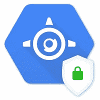
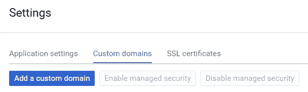

# Google App Engine 的托管 SSL

> 原文：<https://medium.com/google-cloud/managed-ssl-for-google-app-engine-17c7e05cb5d2?source=collection_archive---------2----------------------->

## 不再需要为了添加一个众所周知的文件夹而部署新版本

许多平台即服务产品，如 Google App Engine，使用通配符证书在子域下提供现成的 HTTPS 支持，例如,`*.appspot.com`用于 App Engine, `*.herokuapp.com`用于 Heroku，以及`*.github.io`用于 GitHub 页面。然而，如果你想使用自定义域，你通常只能靠自己。

幸运的是现在有[让我们加密](https://letsencrypt.org/)。根据他们的统计数据，他们目前支持超过 4000 万个活动证书。Let's Encrypt 提供免费的 SSL 证书，您可以使用这些证书在您的网站上设置 HTTPS。

前段时间在 App Engine 上部署了一个应用，并为其设置了自定义域。使用 Certbot ACME 客户端和 Let's Encrypt，我只需要在本地机器上运行几个命令，然后在特定路径下部署一个包含特定文件的新版本应用程序，并收到一个全新的 Let's Encrypt 证书，用于我的自定义域。通过云控制台上传这个证书后，我在我的自定义域上启用了 HTTPS。(我按照[这篇](/google-cloud/lets-encrypt-and-google-app-engine-in-2017-7cfe0928768e)非常有帮助的文章中的说明来做这件事。)

3 个月后，我的证书过期了。没什么大不了的，我可以重复同样的过程来获得一个新的证书。我甚至可以用应用引擎 Cron 服务来自动化这个过程。事实上，让我们加密证书 90 天有效期的部分理由是为了鼓励自动化([https://letsencrypt.org/2015/11/09/why-90-days.html](https://letsencrypt.org/2015/11/09/why-90-days.html))。

但是今天，在 App Engine 上的自定义域中启用 HTTPS 变得比以往任何时候都更容易(有时我想知道，作为开发人员，我们是否被每一项新的托管服务宠坏了)。

Google App Engine 的托管 SSL

Google App Engine 的托管 SSL 现在处于测试阶段，在自定义域上启用 HTTPS 现在只需点击一下鼠标。在云控制台的[应用引擎自定义域设置](https://console.cloud.google.com/appengine/settings/domains)页面上可以找到这个神奇的按钮，它的标签是“启用托管安全”。

我已经点击了。这就像是 [r/thebutton](https://www.reddit.com/r/thebutton/) 又来了一遍。

如果你有一个自定义域下的应用引擎应用程序，但还没有启用 HTTPS，或者觉得这样做很麻烦，现在是时候再试一次了。

你可以从谷歌云平台博客[这里](https://cloudplatform.googleblog.com/2017/09/introducing-managed-SSL-for-Google-App-Engine.html)和 API 文档[这里](https://cloud.google.com/appengine/docs/standard/go/securing-custom-domains-with-ssl)找到详细描述发布的原始博文。