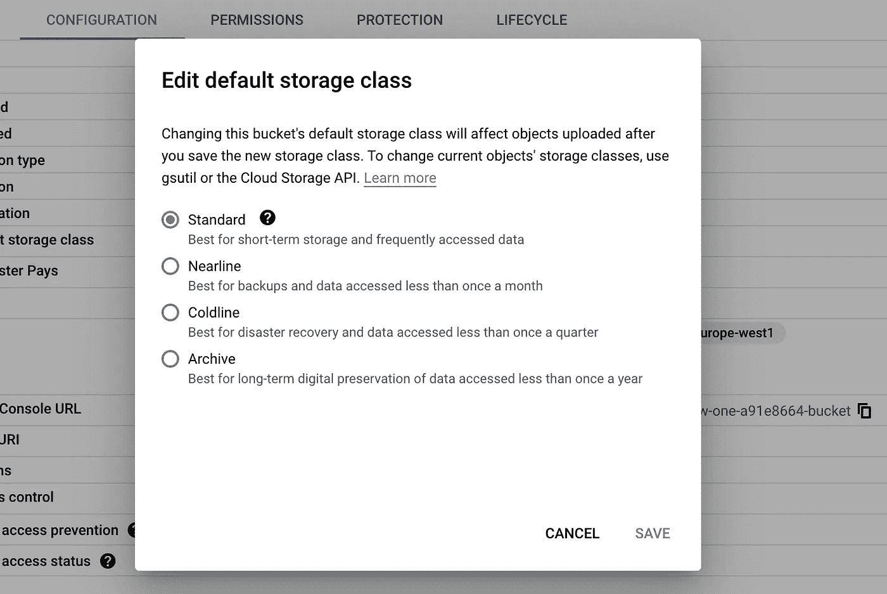
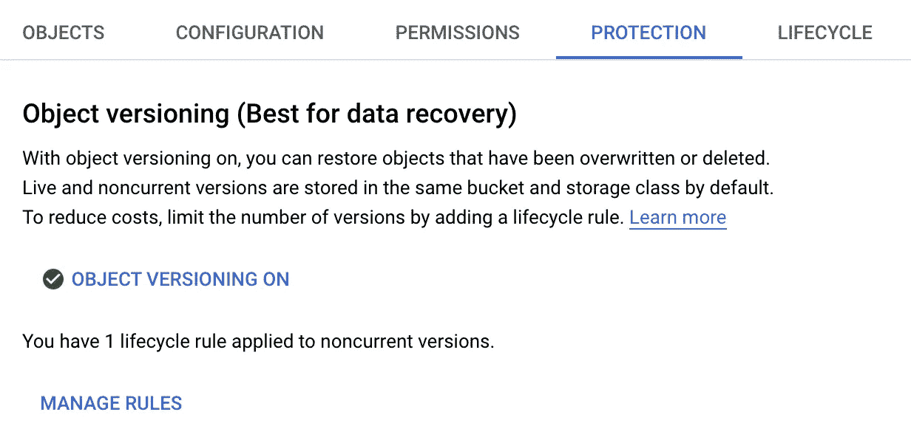
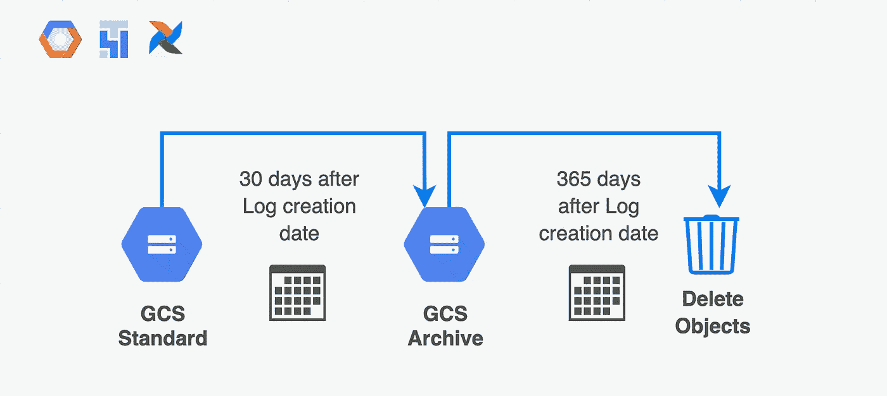
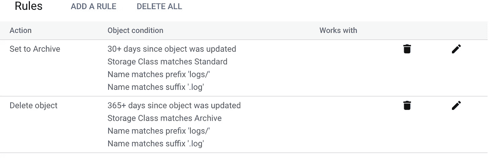

# 使用对象生命周期管理管理 Google 云存储上的气流日志

> 原文：<https://medium.com/google-cloud/managing-airflow-logs-on-google-cloud-storage-with-object-lifecycle-management-a80befe8eeab?source=collection_archive---------2----------------------->

Cloud Composer 上的 Airflow DAGs 为每次运行在 Google 云存储上生成日志文件。那些计划频繁运行的日志往往会生成更多的日志，随着时间的推移，会导致存储成本更快地累积。应用 CGS bucket 生命周期规则是解决这个问题的一个可行方案，让我们来探索一下如何实现！

管理旧的历史日志的一个原因是成本优化。一个 GCS 存储桶的定价取决于几个因素，如****处理*** 和 ***联网*** 。存储和检索定价取决于为存储桶和对象选择的存储类别。关于 GCS 定价的详细指南[点击此处](https://cloud.google.com/storage/pricing)。*

## *GCS 上气流日志的存储选项*

*使用 Cloud Composer，存储桶和底层对象的默认存储类别设置为**标准**，具有这些[定价](https://cloud.google.com/storage/pricing#europe)。对于经常访问的文件，标准存储是一个很好的选择。对于不经常访问或处理的内容，其他类可能更具成本效益，例如超过 ***n 天*** 的日志。下面是摘自 GCP 用户界面的摘要，概括了每个存储类别的使用情形。*

**

*GCS 桶可用的存储选项*

*考虑一个使用案例，其中不需要访问超过 30 天的 DAG 日志，可能一年一次除外。 ***是否可以将所有日志对象保存在同一个桶中，并为每个对象分配不同的存储类别？幸运的是，谷歌云存储支持这一点，我们可以根据生命周期规则自动切换对象的类！****

## *关于 GCS 生命周期规则，您需要了解什么*

*当[生命周期规则](https://cloud.google.com/storage/docs/lifecycle)被设置时，云存储将定期检查桶中所有匹配任何设置模式的对象，并执行适用于这些规则的所有操作。*

*生命周期操作和模式是在整个存储桶的级别上定义和应用的，而不是在“文件夹”的级别上。应该小心定义模式，如前缀、后缀、存储类等..确保规则的粒度符合要求。您最不希望看到的是，动作溢出到同一个存储桶中与生命周期规则无关的其他对象。*

*另一个细节是，GCS bucket 需要预先启用对象版本控制，以便正确应用生命周期规则。截至撰写本文时，默认情况下，属于 Cloud Composer 实例的 buckets 上没有启用对象版本控制。您需要自己启用它。*

*这可以很容易地从 UI 或通过 gsutil 命令进行设置，比如*

```
*gsutil versioning set on gs://my-awesome-gcs-bucket*
```

**

*启用了对象版本控制的存储桶示例*

*最后，对象生命周期管理是一个很大的话题，我建议在生产中使用它之前熟悉所有的概念。谷歌云存储上的官方文档是一个很好的开始。*

# *对气流日志应用生命周期规则*

*生命周期规则可以通过 CLI ( [**gsutil**](https://cloud.google.com/storage/docs/lifecycle-configurations#gsutil) )、GCS API 和 GCP UI 来应用。在下面的例子中，我们将通过 [**gsutil**](https://cloud.google.com/storage/docs/lifecycle-configurations#gsutil) 应用示例规则。*

## *通过设置存储类别归档旧日志*

*默认情况下，GCS bucket 为写入的任何新对象都有一个存储类，可以覆盖子对象的存储类。这很方便，因为较旧的日志仍然组织在同一个桶中，但是不同的存储类适合于它们预期的访问频率。*

*生命周期规则可以定义为一个 JSON 对象，由两个主要的配置块组成:**动作**和**条件**。对于超过 30 天的归档日志:*

*   *将 action 设置为 **SetStorageClass** 以及该存储类的目标值 **ARCHIVE** 。*
*   *将条件设置为多个标准，与气流桶中日志文件夹的结构相关。在这种情况下，我们感兴趣的是只捕获 logs/*文件夹下的文件，这些文件已经使用**标准**(默认)类存储了**至少 30 天**。*
*   *典型的气流日志文件路径将以(前缀) **logs/** 开始，以**结束(后缀)。日志***

*下面是一个使用 JSON 语法的生命周期配置的例子。*

```
*{
  "lifecycle": {
    "rule": [
      {
        "action": {
          "type": "SetStorageClass",
          "storageClass": "ARCHIVE"
        },
        "condition": {
          "matchesPrefix": [
            "logs/"
          ],
          "matchesSuffix": [
            ".log"
          ],
          "age": 30,
          "matchesStorageClass": [
            "STANDARD"
          ]
        }
      }
    ]
  }
}*
```

*如果期望更频繁地访问日志，您可能想要考虑其他类，如**近线**或**冷线**每个类的完整详细信息可从[这里](https://cloud.google.com/storage/docs/storage-classes#classes)获得。*

*然后，您可以使用类似下面的命令，通过 gsutil 简单地应用生命周期配置。*

```
*gsutil lifecycle set my-lifecycle.json gs://my-awesome-airflow-bucket*
```

## *删除*

*如果一段时间后不再需要日志，可以通过另一个规则简单地安排删除它们。这将遵循与上一个示例相同的结构。这里唯一的区别是动作被设置为**删除**。*

```
*{
  "lifecycle": {
    "rule": [
      {
        "action": {
          "type": "Delete"
        },
        "condition": {
          "matchesPrefix": [
            "logs/"
          ],
          "matchesSuffix": [
            ".log"
          ],
          "age": 365
        }
      }
    ]
  }
}*
```

## *组合生命周期规则*

*一个桶的生命周期可以由几个规则组成，这使您能够遵循一种混合方法来管理旧的气流日志。例如，一种方法可以是设置两个规则:*

1.  *将超过 30 天的日志转换为 **COLDLINE** 或 **ARCHIVE** 存储类(取决于所需的访问频率)*
2.  *365 天后删除它们*

**

*GCS 日志管理的混合方法示例*

*就配置而言，这可以简单地转化为将我们之前定义的两个生命周期合并为一个具有多个规则的生命周期。*

*一个生命周期对象，多个规则对象添加到规则数组中。*

```
*{
  "lifecycle": {
    "rule": [
      {
        "action": {
          "type": "SetStorageClass",
          "storageClass": "ARCHIVE"
        },
        "condition": {
          "matchesPrefix": [
            "logs/"
          ],
          "matchesSuffix": [
            ".log"
          ],
          "age": 30,
          "matchesStorageClass": [
            "STANDARD"
          ]
        }
      },
      {
        "action": {
          "type": "Delete"
        },
        "condition": {
          "matchesPrefix": [
            "logs/"
          ],
          "matchesSuffix": [
            ".log"
          ],
          "age": 365,
          "matchesStorageClass": [
            "ARCHIVE"
          ]
        }
      }
    ]
  }
}*
```

*应用上面的配置，应该反映一个生命周期定义，看起来像下面的 GCS 用户界面。*

**

*GCS 时段 UI 上的组合生命周期规则示例*

*更精细的规则集也是可能的，例如基于对象年龄在不同存储类之间转换，直到最终删除。*

# *结束语*

*这是一个关于如何更有效地管理 Google 云存储上的气流日志的快速总结，而不是依赖于 Cloud Composer 设置的默认存储和保留。*

*我在文章中提到了存储成本，但并没有深入探讨成本节约的数字。这将取决于您的气流设置，例如*

*   *Dag 的数量，*
*   *执行和记录频率*
*   *每个 DAG 生成的日志的大小。*

*我强烈建议运行一个评估练习，以更好地理解您的 GCS 成本和生命周期规则的潜在节约。*

*希望这篇文章对你有用，希望听到关于这篇文章或主题的任何反馈/想法/问题。*