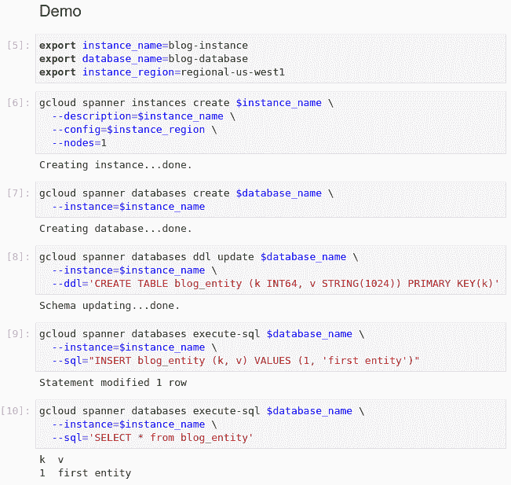

# 在 JupyterLab 中管理和执行 gcloud 命令

> 原文：<https://medium.com/google-cloud/managing-and-executing-gcloud-commands-in-jupyterlab-c614c9a79db1?source=collection_archive---------0----------------------->

**TL；我在文档或文本文件中管理 [gcloud](https://cloud.google.com/sdk/gcloud) 命令的时间最长，尤其是在原型开发或初始研究期间。从那里我将它们一个接一个地或成块地复制粘贴到终端或[云外壳](https://cloud.google.com/shell)上以供执行。这很乏味，容易出错，而且效率很低——所以我改变了我的方法:在这篇博客中，我简要地向你展示如何在 JupyterLab 中结合这两者。你可以在笔记本上管理和执行 gcloud 命令。除了我遇到的一些安装注意事项之外，我还列出了一些有趣的用例。**

# 示例:云扳手—从零到 5 个命令中的查询

下面您将看到一个在 JupyterLab bash 笔记本中使用 gcloud 命令的例子。这需要在 JupyterLab 中安装 bash 内核(参见下面的安装部分)。

我的笔记本有三个部分:

*   **设置**。本节包含设置笔记本所需的命令
*   **演示**。本节展示了五个 gcloud 命令来设置一个[云扳手](https://cloud.google.com/spanner)实例、设置一个数据库、创建表和运行一个查询。
*   **拆卸**。此部分删除笔记本中创建的所有资源。

## 第节:设置

以下屏幕截图显示了设置部分:


笔记本中的设置部分

这些命令执行以下内容(按从上到下的顺序):

1.  对用户进行身份验证和授权
2.  设置执行命令的项目
3.  禁用所有 gcloud 命令提示，并使用默认设置
4.  启用云扳手 API

至此，所有必要的设置都已完成。

## 部分:演示

下一个屏幕截图显示了笔记本的演示部分:



笔记本中的演示部分

这个演示部分是不言自明的。一些 shell 变量被设置并在后续命令中使用。这些命令通过一个简单的云扳手用例。如您所见，每个命令的输出在运行后都会自动显示在笔记本中。

## 部分:拆卸

下一个屏幕截图显示了笔记本的拆卸部分:


笔记本中的拆卸部分

one 命令删除 Cloud Spanner 实例及其所有数据库。

# 工作流程和最佳实践

总体工作流程如下:

1.  **创建一个 bash 笔记本**。这可以通过点击 JupyterLab 中的 **Bash** 图标来完成。


2.将笔记本命名为。为笔记本提供一个合适的名称。


3.**添加第一个命令**。单击“+”创建一个笔记本单元格，并将命令写入其中。在右边的下拉菜单中，您可以选择该命令是原始文本、遵循 [markdown](https://daringfireball.net/projects/markdown/) 符号的文本还是类似 gcloud 的代码命令。


4.**执行命令**。将光标放在单元格中，单击向右箭头执行命令。


5.**继续添加命令**。根据您的需要，通过添加笔记本单元格来创建额外的 raw、markdown 或 code 命令。

6.**从头执行**。可以通过选择“删除所有输出”来删除所有输出，这将只在笔记本中保留命令。您可以重新执行所有命令，新的输出将动态添加到笔记本中。


从最佳实践的角度考虑以下建议

*   使用专用设置部分启动笔记本
*   通过设置 shell 变量来参数化命令
*   根据需要记录命令
*   提供一个清理或拆卸部分来清理所有创建的资源

这些基本的最佳实践是一个良好的开端，您可以随着时间的推移根据自己的需要对其进行改进。

# 用例

在笔记本电脑中使用 JupyterLab 管理和执行 gcloud 命令的这种方法有很多用例。一些重要的使用案例包括:

*   **客户支持**。使用 JupyterLab，客户可以在笔记本上交流执行的 gcloud 命令，并描述遇到的问题，而不必分享他们的 Google Cloud 项目。您可以在项目中重新运行这些命令进行调查。
*   **迭代开发**。当您试验、创建 POC 或对云资源进行初步研究时，笔记本电脑让您能够轻松修改 gcloud 命令，跟踪成功(和失败)的 gcloud 命令及其输出。
*   **演示**。笔记本可以作为演示脚本，让您不仅能够列出和执行命令，还能够记录值得注意的细节。
*   **文档**。您可以创建一个或多个笔记本，为自己或他人记录 gcloud 命令，其中包含官方产品文档之外的详细信息。
*   **协作**。当签入源代码控制时，笔记本可以作为团队内部和团队之间协作的基础。
*   **教学**。笔记本可以用来教授一门或多门关于云资源和与之配套的 gcloud 命令的课程。
*   **学习**。当遵循指令时，您可以将 gcloud 命令收集在一个笔记本中，以记录您已经执行的命令，并用于可能的重复执行。

这些是 gcloud 命令如何在笔记本中使用的一些示例。随着时间的推移，你肯定会发现更多重要的用例。

# 装置

这些是我在 Linux 笔记本上安装 JupyterLabs 时发现的安装注意事项和一些警告。具体情况可能会有所不同；以下只是针对我的情况做的体验报告。

**安装木星实验室**。对我来说，最好的体验是使用`pip`进行安装，如这里的[所述](https://jupyter.org/install)。你可能必须先安装`pip`。

**安装 echo 和 bash 内核**。内核提供了笔记本中可用的功能，我安装了两个:用于测试的 [echo](https://github.com/jupyter/echo_kernel) 内核，以及之后的 [bash](https://github.com/takluyver/bash_kernel) 内核。bash 内核是用于运行 gcloud 命令的内核(上面的例子是使用 bash 内核实现的)。

**启动 JupyterLab** 。在控制台上运行 JupyterLab 命令，jupyter lab 就会启动。

根据我的经验，有一些警告:

*   **括号粘贴**。在某一点上，意外的字符序列出现在一些环境变量中，如这里的[所示](https://cirw.in/blog/bracketed-paste)。这非常令人沮丧，因为我不确定它是从哪里来的。经过一番搜索，我发现这来自于括号粘贴的概念。一旦我[关闭括号粘贴](https://askubuntu.com/questions/662222/why-bracketed-paste-mode-is-enabled-sporadically-in-my-terminal-screen)，我就再也没有遇到这个问题。我的方法是将这一行添加到`.bashrc`文件中:

```
bind ‘set enable-bracketed-paste off’
```

*   **提示**。如果命令在执行过程中要求输入，则该提示不会传播到笔记本。从笔记本的角度来看，该命令看似挂起，但实际上是在等待用户输入。这就是关闭设置部分提示的原因。

# 你的想象力

尝试在 JupyterLab 笔记本中管理和执行 gcloud 命令，并查看您可能会想到的其他用例、功能和特性。

我从 Gopinath 得到的一个建议是指向这篇解释如何在远程机器上运行 JupyterLab 的文章(我没有尝试过，但对你来说可能有帮助):[https://ljvmiranda 921 . github . io/notebook/2018/01/31/running-a-jupyter-notebook/](https://ljvmiranda921.github.io/notebook/2018/01/31/running-a-jupyter-notebook/)

# 承认

我要感谢 Anibal Santiago 的彻底审查和许多意见，以提高这一内容的准确性。

# 放弃

Christoph Bussler 是谷歌公司(Google Cloud)的解决方案架构师。这里陈述的观点是我自己的，而不是谷歌公司的。