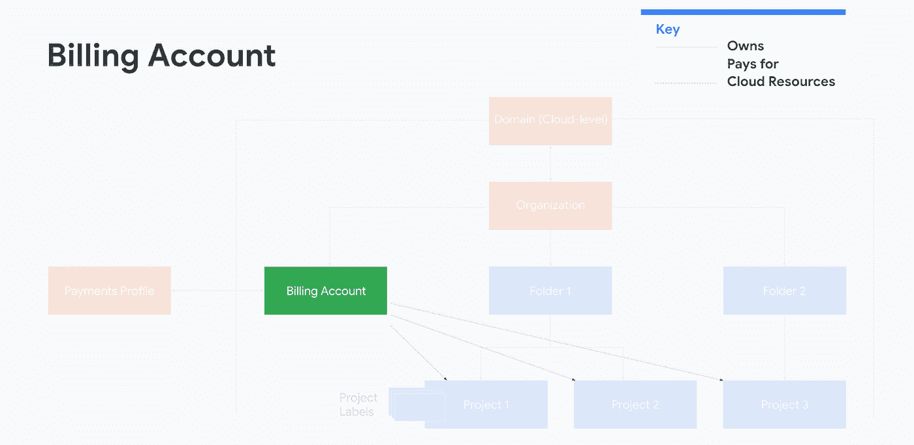
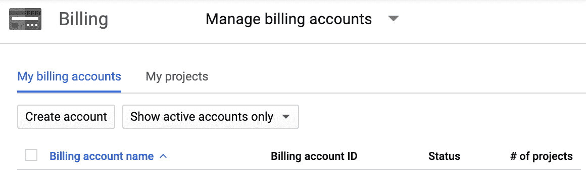
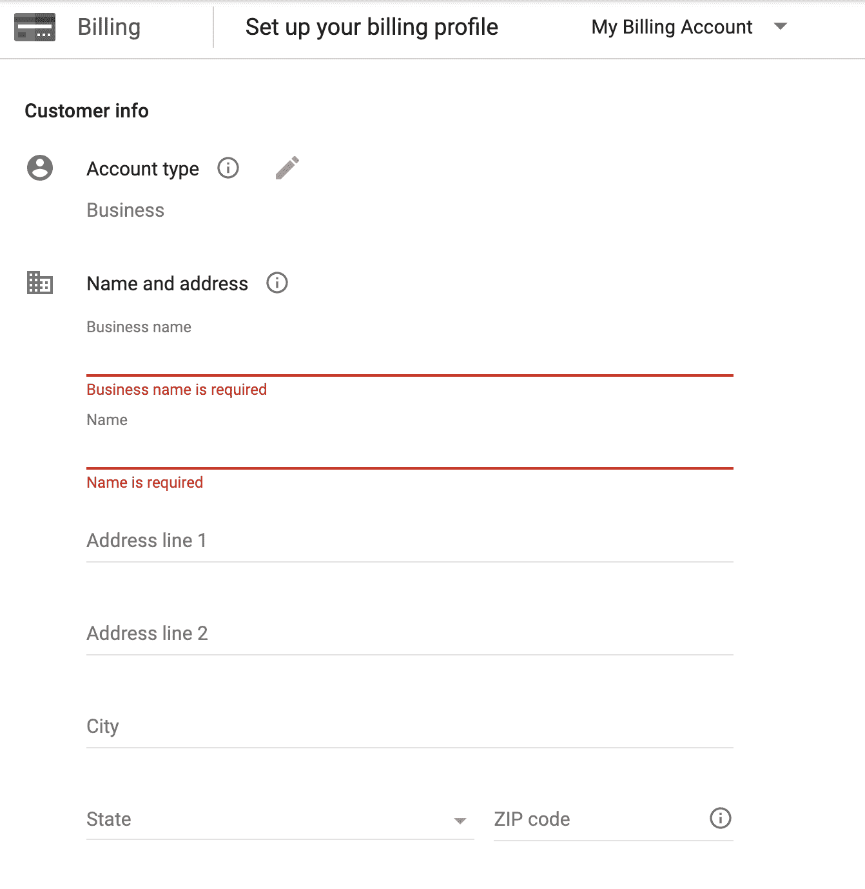
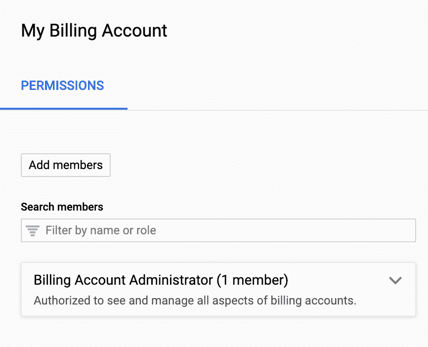
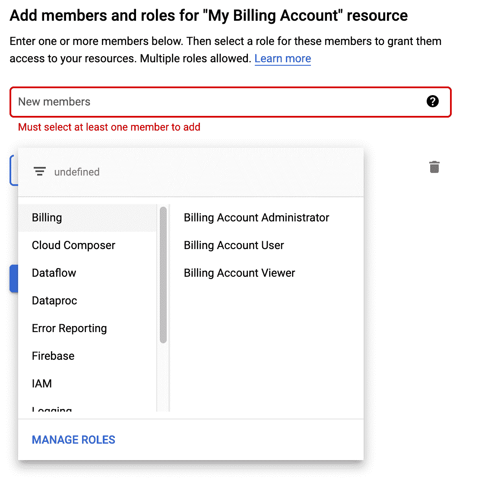

# 在 Google Cloud 中管理计费权限

> 原文：<https://medium.com/google-cloud/managing-billing-permissions-in-google-cloud-31906aa626a0?source=collection_archive---------0----------------------->

对于许多云用户来说，计费只是你在月底要处理的事情。但是对于更大的团队和组织来说，你将达到一个规模，在这个规模上，管理成本和了解你所支付的是什么变得至关重要。

更喜欢看而不是读？查看视频版本！否则，请往下跳，阅读更多内容。

# 关于账单账户

为了确保您的 Google 云资源得到正确付费，需要使用正确的权限设置付费帐户和支付配置文件。一些谷歌云服务有免费的层级，但是如果没有付费的方式，你就无法超越这个层级。

所有服务都需要作为项目的一部分存在，并且每个项目都需要有一个与之相关联的**单一计费账户**。相反，一个计费帐户可以有多个关联项目。计费报告将能够按项目分解成本，所以你不必担心遗漏任何细节。

账单账户也将与谷歌支付档案直接关联，谷歌支付档案位于谷歌云之外，用于支付所有谷歌服务，如 G Suite 和谷歌广告。如果谷歌云是你唯一使用的谷歌服务，你可能不会与支付模式有太多互动。但是，跟踪账单账户和支付情况非常重要，尤其是对于使用多种产品和服务的大型组织。

> 对于 Google Cloud 来说，可以把账单账户看作是组织所有云成本的方式，以及如何实际支付和查看发票的支付模式。

每个人都有自己的权限集，因此您可以控制谁可以查看和管理不同的帐户。

建议您为每个人设置**多个管理员**(或使用一个小组)以防范任何访问问题，并定期对其进行审查；这甚至可能导致两者都是相同的管理员。只拥有一个账单账户和一个支付模式也是一个好主意，这样有助于简化管理。拥有多个会使成本管理变得复杂，所以坚持尽可能少。

# 设置账单账户

一个在线帐单帐户被设置为使用信用卡或银行帐户。随着公司的发展，你可能希望与谷歌云销售团队合作，建立一个离线账单账户，通过发票支付。无论哪种方式，你都可以通过谷歌云控制台和在线支付配置文件管理你的付费账户权限。让我们试一试:

在[控制台](https://console.cloud.google.com)中，您可以打开左侧导航并选择“计费”来查看您当前的计费账户(您可能需要先点击“管理计费账户”)。

点击“创建账户”，为账单账户选择一个描述性的名称(比“我的第一个账单账户”更好)，并选择一个决定货币的地点。每个账单账户和相关发票只能代表一种货币。

然后，您需要设置支付配置文件，并在个人和企业之间进行选择。这是以后无法改变的，所以要明智的选择。

之后，您还可以选择主要联系人，他将成为付款配置文件的管理员。同样，我们建议**多个管理员或使用一个组**来确保合理的冗余水平。支付配置文件将需要一种支付形式(令人震惊，我知道)，如信用卡或银行账户。为了获得更多冗余，您应该稍后再回来，添加一种额外的支付形式作为备份，并检查您的管理员和通知设置。

# 计费帐户权限

一旦创建了新的计费帐户，或者如果您正在使用现有的计费帐户，您将能够从信息面板管理它。您应该做的第一件事可能是添加一个额外的管理员，这可以通过单击“添加成员”按钮来完成。

您可以通过这种方式添加单个用户，也可以添加一个组。您可能想要添加三种类型的用户:

*   **计费账户管理员**可以管理用户，将项目从计费账户中分离出来，并且是唯一可以在你需要帮助时联系谷歌云支持的人
*   **计费账户用户**只能查看成本详情(如与该计费账户相关联的每个项目产生了多少成本以及针对哪些服务)以及将项目与该计费账户相关联
*   **账单账户查看者**只能查看每个项目的成本明细

一旦您设置了您的用户，您就可以创建新的项目或获取现有项目，并将它们与此计费帐户相关联。

与计费帐户类似，您可以通过添加用户和分配角色来管理项目和文件夹的权限。您甚至可以创建自己的自定义角色，并选择用户可以拥有的权限的精确细分。

如果您希望某人仅查看特定项目的详细信息，而不是计费帐户中的每个项目，您可以授予该用户查看项目的权限。当他们转到控制台的计费部分时，他们将仅限于该项目。

如果你需要更改支付模式的信息，你可以从[payments.google.com](http://payments.google.com)而不是谷歌云控制台进行。正如我所提到的，**确保定期**审查付费账户和支付档案的用户和权限至关重要，可能是每个季度，并确保您的团队知道谁是管理员。如有任何问题，您需要联系计费帐户管理员，让他们根据需要联系计费支持。

# 后续步骤

有了这个设置，你现在可以确保任何谷歌云服务都是正确付费的，并且你的组织已经设置好来管理成本。以下是一些链接，可帮助您更深入地了解有关管理您的账单账户和支付资料的更多最佳实践:

[云计费概念概述](https://cloud.google.com/billing/docs/concepts) [创建、修改或关闭您的计费账户](https://cloud.google.com/billing/docs/how-to/manage-billing-account)

这篇博客是和罗杰·马丁内斯一起写的！

有什么问题吗？随时让我知道，并检查出[超出您的法案](https://www.youtube.com/playlist?list=PLIivdWyY5sqKJx6FwJMRcsnFIkkNFtsX9)视频系列的其他演练。