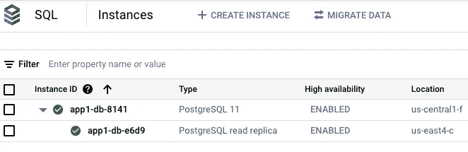
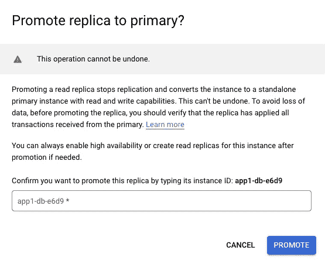
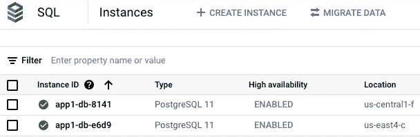
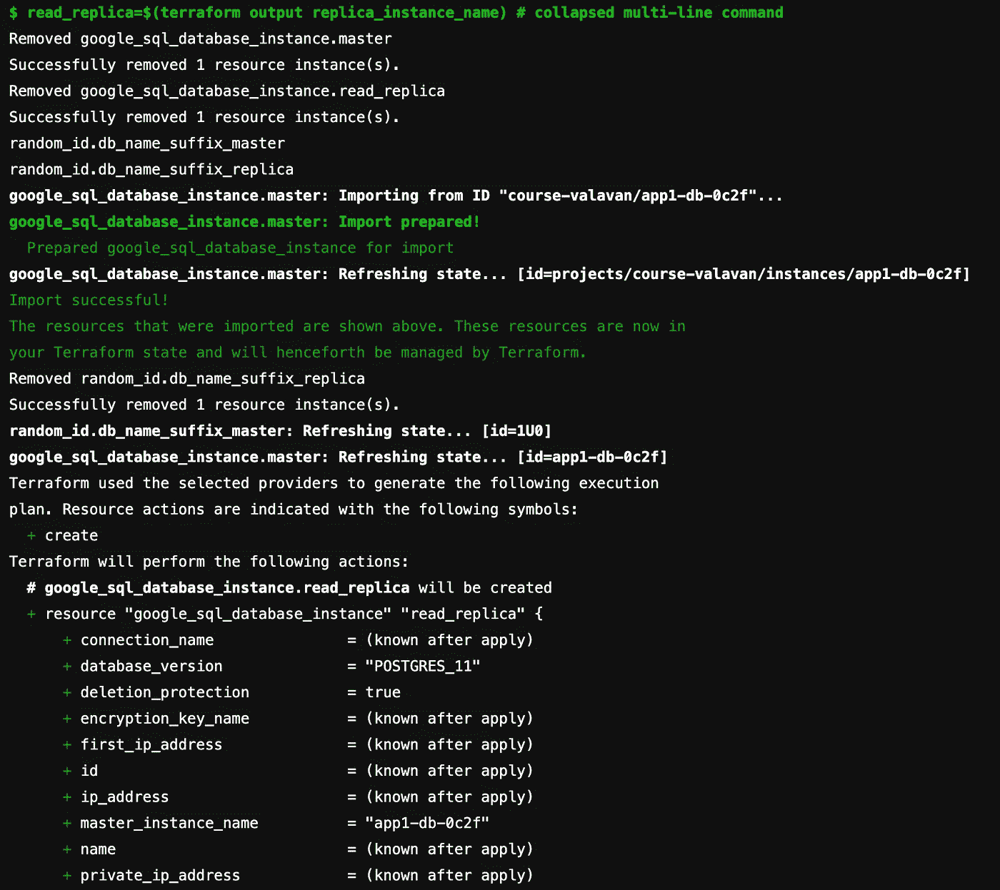
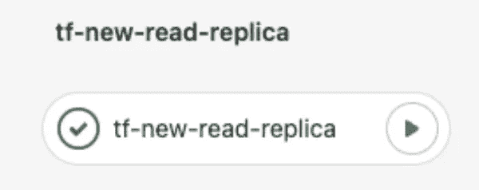
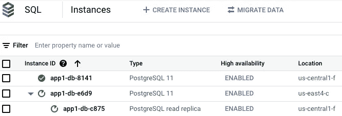
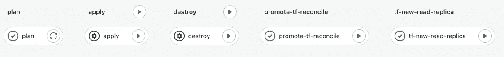
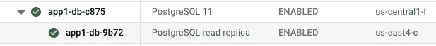

# 在 Terrafrom 中管理云 SQL 故障转移

> 原文：<https://medium.com/google-cloud/managing-cloud-sql-failover-in-terrafrom-ee34f582be97?source=collection_archive---------1----------------------->

在本文中，我们将了解如何使用 Terraform 以重复和自动化的方式管理云 SQL 副本到主服务器的升级。

**TOC**

*   GCP 云 SQL 中的高可用性/灾难恢复选项
*   将读取副本提升为主副本时要考虑的事项
*   主&副本的基础地形设置
*   触发故障转移并观察 TF 状态文件问题
*   解决方案设计要求
*   完成地形状态管理的配置更改
*   通过 CI/CD 管道触发故障转移
*   使用 CI/CD 管道触发回切到原始状态

Google Cloud 为云 SQL 数据库提供了两个基本的故障转移选项

# GCP 云 SQL 的高可用性/灾难恢复选项

**高可用性** —在这种方法中，主云 SQL 实例在一个区域(例如:区域 a)中调配，辅助实例在另一个区域(例如:区域 b)中调配，但共享相同的 IP 地址和连接字符串。从地形的角度来看，没有变化。

**读取副本** —在这种方法中，您在主分区之外的不同分区中拥有一个读取副本，或者在完全不同的区域中拥有一个读取副本。

*   读取复制副本是主实例的精确拷贝
*   仅用于读取和执行查询，不用于写入
*   减少主节点上的负载。你可以点击这里的链接了解更多关于读取副本和跨区域读取副本的信息[https://cloud . Google . com/SQL/docs/MySQL/replication # read-replicas](https://cloud.google.com/sql/docs/mysql/replication#read-replicas)

# **将读取副本提升为主副本时要考虑的事项:**

如果出现区域性中断或数据库损坏，您可能会在故障排除过程中确定主数据库无法及时恢复，并且您需要提升读取副本以接管主实例。这里有几个考虑因素:

*   当读取复制副本提升为主副本时，它将成为独立的数据库
*   应用程序现在需要使用新提升的主服务器(以前的读取副本)的连接字符串或 IP 地址
*   读取副本不会回退到主副本。主数据库只能用于历史目的，一旦安全，最终应该被删除。

# **云 SQL 主服务器和读取副本的平台:**

确保在您的 GCP 项目中启用了以下 API

```
gcloud services enable servicenetworking.googleapis.com sqladmin.googleapis.com
```

让我们看看下面的 terraform 配置，创建一个主数据库和一个读取副本数据库。

您需要提供以下值

*   创建一个 GCS 存储桶来存储 Terraform 状态文件
*   在下面的地形配置中提供 GCS 存储桶名称
*   在`terraform.tfvars`文件中提供云 SQL 区域 1、区域 2 和 VPC 网络名称的值

执行上述 terraform 后，我们将创建一个主 SQL 实例和一个读取副本实例，如下图所示



让我们使用`gcloud` 或直接在云控制台上触发副本到主服务器的手动升级

```
gcloud sql instances promote-replica <replica-id>
```



现在，您可以看到副本已成为独立数据库，主数据库不再复制到读取副本实例



通常，当我们手动将副本提升为主副本时，terraform 中不会捕捉到更改。在执行`terraform plan`时，terraform 将尝试用旧的主数据库和副本数据库替换数据库

```
resource "google_sql_database_instance" "master"
resource "google_sql_database_instance" "read_replica"
```

因为它认为 GCP 偏离了它的国家文件。

```
# google_sql_database_instance.master has been changed
# google_sql_database_instance.read_replica has been changed**# google_sql_database_instance.master must be replaced
# google_sql_database_instance.read_replica must be replaced****Plan: 2 to add, 0 to change, 2 to destroy**
```

# **方案设计要求:**

*   如何管理升级的读取副本的地形状态，该状态不应触发升级的读取副本的替换
*   如何从提升的主实例创建新的读取副本，以便我们可以保持部署在更改之前的状态
*   如何通过避免手动错误引入自动化、可重复性和可靠性
*   停机结束后如何回切到主区域并恢复

**步骤 1 —更改地形配置:**

为了避免这种情况，我们添加了块`lifecycle {ignore_changes}`来指示 terraform，而不是跟踪数据库名称的更改，因此在手工升级后，terraform 不会强制替换主云 SQL 实例。重要的是保持所有其他参数相同(如*区域，disk_size)。下面的*是修改后的`main.tf`文件

**步骤 2——使用 terraform 状态命令对 terraform 状态文件进行更改**

这里，我们将使用`terraform state`命令将 read_replica 状态移动到主 terraform 资源中

```
# Remove the master instance from state file 
terraform state rm google_sql_database_instance.master # Remove the replica instance from state file 
terraform state rm google_sql_database_instance.read_replica  

# Now import the state of read_replica into master terraform config
terraform import google_sql_database_instance.master <project_id>/<read-replica>

# Finally create a new random suffix id for the new read-replica, 
# otherwise it will try to create it with the same name 
terraform state rm random_id.db_name_suffix_replica## We are checking if the master and replica were originally created ## in different region, hence trigger a rebuild of replica in the  ## primary regionif [ "master_region" != "replica_region" ]; then
   terraform plan -var region1=$replica_region -var region2=$master_region -out "planfile1"else
   terraform plan -out "planfile1"
fi
```

**步骤 3——将这些变更作为流水线步骤执行**

我们不应该尝试手动这样做，主要原因是在进行复制粘贴和交换名称和 id 时，状态文件的更改可能是灾难性的。让我们看看如何在 Gitlab 管道中触发这一点。在这里，我们添加了两个将被手动触发的新更改


在`**promote-tf-reconcile**`流水线阶段，我们正在检索`replica instance "name”`，执行状态文件更改，最后运行该阶段的最后一步，我们还将执行一个

`terraform plan`

计划输出应该只显示**一个新的读取副本**将被创建，主副本指向手动提升的实例



`**promote-tf-reconcile** stage`的管道执行示例

```
Terraform will perform the following actions:# google_sql_database_instance.read_replica will be created+ resource "google_sql_database_instance" "read_replica" {
+ connection_name               = (known after apply)
+ database_version              = "POSTGRES_11"
+ ip_address                    = (known after apply)
+ master_instance_name          = "app1-db-e6d9"
+ name                          = (known after apply)
+ service_account_email_address = (known after apply)
+ replica_configuration {
+ failover_target = false
      + settings {
          + activation_policy     = "ALWAYS"
          + availability_type     = "REGIONAL"....
# random_id.db_name_suffix_replica will be created
+ resource "random_id" "db_name_suffix_replica" {**Plan: 2 to add, 0 to change, 0 to destroy.**
Changes to Outputs:
  + replica_instance_name = (known after apply)
  + replica_region        = "us-central1"
```

**步骤 3 —** 一旦我们验证了计划输出，我们就可以触发管道的下一个阶段，该阶段正在应用变更



```
terraform apply
```

您应该能够在控制台中看到，新的复制副本创建已经开始。



我们能够使用这种方法将状态更改安全地导入 Terraform，并将云 SQL 实例恢复到相同的配置。

以下是本例中使用的完整 Gitlab 管道阶段和配置



# **将数据库回切到主区域(原始状态)**

一旦中断结束，您希望将数据库转移回主区域，您将再次执行相同的步骤。

*   提升在主区域中创建的读取副本(手动—使用控制台或 gcloud)。一些客户可能更喜欢使用 gcloud 在管道中完成这一步。
*   要在辅助区域创建新的读取副本，可以再次执行管道的最后两个阶段:



回切到主服务器后的最终部署

现在，主数据库回到了**美国中部 1** ，副本数据库回到了**美国东部 4**

我们的**起始状态参考图:**


原始期