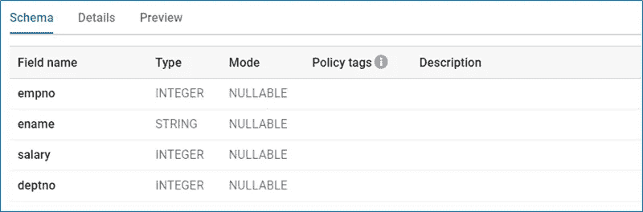

# 在 Google BigQuery 中隐藏列

> 原文：<https://medium.com/google-cloud/managing-fine-grained-data-access-control-in-bigquery-293660f0db91?source=collection_archive---------1----------------------->

## 管理敏感数据的细粒度数据访问控制

BigQuery 使用策略标记提供对列的细粒度访问。当用户试图在查询时访问受限列时，BigQuery 会检查列策略标记及其策略，以查看用户是否有权访问数据。以下步骤概述了在 BigQuery 中管理数据访问控制的实现策略:
■ **步骤 1:** 为管理员和应用程序用户定义数据目录角色
■ **步骤 2:** 定义数据目录分类和策略标签
■ **步骤 3:** 对 BigQuery 列应用列级安全性
■ **步骤 4:** 使用列级安全性验证数据访问

## 身份和访问管理(IAM)角色

应用列级安全性需要多个 IAM 角色。BigQuery 列级安全性需要以下数据目录角色:


数据目录角色

## 创建业务分类

数据目录分类法用于创建策略标记的分层组，以控制 BigQuery 中的列访问。创建数据目录分类和策略标记需要以下步骤:
**1 .**打开数据目录
**2。**导航到“策略标记”并单击“创建和管理策略标记”
**3。**点击
创建 **4。**输入分类名称(例如:业务分类)和描述
**5。**选择项目名称和位置
和 **6。**输入策略标签名称和描述
**7。**单击“添加子策略标签”添加子策略标签(如果需要)


策略标签


启用访问控制

## 没有列级安全性的数据访问

没有列级安全性的数据访问允许不受任何限制地访问所有列。



大查询模式(无访问控制)

```
$ bq query --use_legacy_sql=false '**select * from bq_poc.employee**'+-------+--------+--------+--------+
| empno | ename  | salary | deptno |
+-------+--------+--------+--------+
|  7782 | CLARK  |   2450 |     10 |
|  7654 | MARTIN |   1250 |     30 |
|  7566 | JONES  |   2975 |     20 |
+-------+--------+--------+--------+
```

## 对 BigQuery 列应用列级安全性

在 BigQuery 中，列级安全性是通过策略标记在列上实现的。因此，只有授权用户才能访问受限列，其他用户可以访问其余列。使用以下步骤将策略标签添加到列中:
**1 .**打开 BigQuery
**2。**点击表(例:员工)
**3。**在【模式】选项卡下，点击【编辑模式】
**4。**选择一列(例如:工资)并点击【添加政策标签】
**5。**在“添加策略标签”屏幕中，选择策略标签(例如:受限)


列上的策略标记


大查询模式(带访问控制)

## 具有列级安全性的数据访问

在此示例中，SELECT *命令失败，因为在列(salary)上添加了列级安全性，并且用户没有访问受限列的“数据目录细粒度读者”角色。

```
$ bq query --use_legacy_sql=false '**select * from bq_poc.employee**'BigQuery error in query operation: Error processing job 'data-lab:bqjob_r22cdf84d6fe1d46f_00000173c98b3a33_1': **Access Denied**: BigQuery BigQuery: User does not have permission to access policy tag "Business Taxonomy : Restricted" on column bq_poc.employee.**salary**.
```

修改查询以排除用户不能访问但可以访问其余列的列(salary)。现在，查询已成功执行。

```
$ bq query --use_legacy_sql=false \
     'select * **EXCEPT (salary)** from bq_poc.employee'+-------+--------+--------+
| empno | ename  | deptno |
+-------+--------+--------+
|  7782 | CLARK  |     10 |
|  7654 | MARTIN |     30 |
|  7566 | JONES  |     20 |
+-------+--------+--------+
```

## 结论

数据访问控制是组织保护敏感数据不可或缺的一部分，限制未经授权的用户访问列数据有助于建立信任和安全合规性。