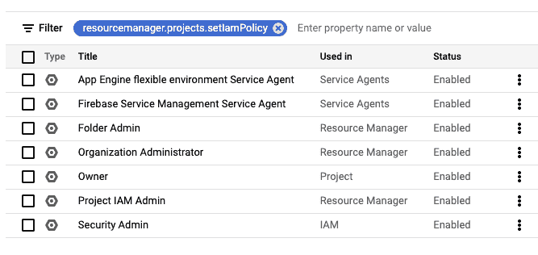
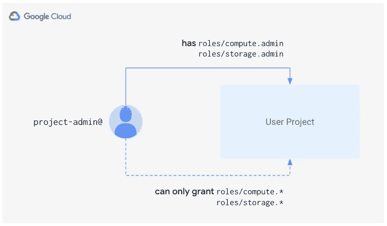

# 通过委派角色授权管理 GCP 服务的使用

> 原文：<https://medium.com/google-cloud/managing-gcp-service-usage-through-delegated-role-grants-a843610f2226?source=collection_archive---------0----------------------->


企业客户通常需要对允许其用户在 GCP 使用哪些服务进行精细控制。例如，考虑一家公司可能希望如何允许他们的用户只使用谷歌计算引擎(GCE)、谷歌云存储(GCS)，而不使用其他东西。

GCP 通过[云 API 和服务](https://cloud.google.com/resource-manager/docs/organization-policy/org-policy-constraints)组织策略(`constraints/serviceuser.services`)提供对服务使用的一些控制。然而，该组织策略仅支持有限的一组服务，并且它仅充当拒绝列表，而不可能指定允许服务的列表。出于限制服务使用的目的，该组织策略有所欠缺。

为了解决这一问题，组织采取了对授予其用户的权限进行严格控制的手段来限制对特定服务的访问。在我们上面的场景中，组织管理员将只授予其用户计算管理员和存储管理员角色。这有效地防止了用户使用未经组织管理员授权的服务。

这种方法的问题是，虽然细粒度的权限有效地允许项目管理员最大限度地使用 GCE 和 GCS，但权限管理确实非常严格和繁琐。这阻碍了生产力，因为项目管理员不能轻易地将权限授予其他任何人。如果需要加入新的主体(用户、服务帐户、组)，中央云管理员团队必须明确地将角色授予新的主体。

项目管理员不能授予其他任何人权限的原因是因为他们缺少自己项目的关键权限`resourcemanager.projects.setIamPolicy`。没有此权限，项目管理员不能在项目级别创建(或更改)任何 IAM 绑定(即授权)。

请注意，通过计算管理员和存储管理员角色，项目管理员可以授予对特定计算资源(例如虚拟机)或存储桶的权限，但如果管理员希望允许其他人创建新桶，该怎么办呢？

**输入委托角色授权**。[委派角色授予](https://cloud.google.com/iam/docs/setting-limits-on-granting-roles)是 GCP 的一项新功能，它允许组织管理员控制用户可以授予或撤销哪些角色，即使用户对某个资源拥有`setIamPolicy`权限。换句话说，通过委派角色授予，组织管理员可以授予用户**授予/撤销特定角色的权限。**正如我们将看到的，委派角色授权是使用 IAM 条件配置的。 [IAM conditions](https://cloud.google.com/iam/docs/conditions-overview) 本身就是一个完整的主题，但其总体思想是，它允许您指定给定的 IAM 绑定何时有效(即，仅当满足条件时才授予权限)。

此时，我们知道我们将为项目管理员创建一个带有条件的绑定。但是我们要给他们什么角色呢？如果我们在 GCP 控制台的角色页面中搜索`resourcemanager.projects.setIamPolicy`权限，我们会看到一些有趣的选项:



我们可以放弃这些角色中的大部分，但是，IAM 管理的项目看起来很有前途。如果我们列出它的权限，我们会看到它只包括

*   `resourcemanager.projects.get`
*   `resourcemanager.projects.getIamPolicy`
*   `resourcemanager.projects.setIamPolicy`

这是一个仅授予读写项目的 IAM 绑定的权限的角色，即设置其权限。

现在我们有了所有的工具来允许我们的用户只使用 GCE 和 GCS，同时仍然给他们在他们自己的项目中授予额外权限的灵活性。项目管理员将在其项目中扮演以下角色:

*   计算管理
*   存储管理员
*   项目 IAM 管理员，条件是仅授予/撤销计算管理员和存储管理员权限。

# 实施细节

要实现我们之前提到的权限，您必须创建一个具有以下形式的条件的绑定:

```
api.getAttribute('iam.googleapis.com/modifiedGrantsByRole', []).hasOnly(roles)
```

其中`roles`是您希望允许用户授予其他主体的角色列表。在我们的例子中，表达式应该是:

```
api.getAttribute('iam.googleapis.com/modifiedGrantsByRole', []).hasOnly(['roles/compute.admin', 'roles/storage.admin'])
```

请记住，`hasOnly()`的参数不能超过 10 个元素。如果希望委派更多的角色，可以用 OR 运算符(||)连接多个表达式。但是，每个条件最多只能有 12 个逻辑操作符，所以如果需要 130 个以上的角色，就需要创建多个绑定。

# 允许附加角色

到目前为止，我们已经允许项目管理员委派计算管理员和存储管理员，但如果项目管理员还想委派其他权力较小的角色，如存储对象查看器，该怎么办？尽管存储对象查看器的权限集是存储管理员的严格子集，但我们使用的 IAM 条件不支持授予存储对象查看器权限。我们需要**明确列出项目管理员将被允许授予/撤销的任何和所有角色。**我们希望以这样的方式结束:



虽然不方便，但我们可以轻松地在我们的条件中包含任何其他计算和存储角色。要提取与 GCE 和 GCS 相关的任何角色，我们可以使用以下命令:

```
$ gcloud iam roles list --filter=”name:roles/storage. stage=GA” — format=”get(name)” >> roles.txt
$ gcloud iam roles list --filter=”name:roles/compute. stage=GA” — format=”get(name)” >> roles.txt
```

运行这个 roles.txt 后，将包含如下内容:

```
roles/storage.admin
roles/storage.hmacKeyAdmin
roles/storage.legacyBucketOwner
roles/storage.legacyBucketReader
roles/storage.legacyBucketWriter
roles/storage.legacyObjectOwner
roles/storage.legacyObjectReader
roles/storage.objectAdmin
roles/storage.objectCreator
roles/storage.objectViewer
roles/compute.admin
roles/compute.imageUser
roles/compute.instanceAdmin
roles/compute.instanceAdmin.v1
roles/compute.networkAdmin
roles/compute.networkUser
roles/compute.networkViewer
roles/compute.orgFirewallPolicyAdmin
roles/compute.orgFirewallPolicyUser
roles/compute.orgSecurityPolicyAdmin
roles/compute.orgSecurityPolicyUser
roles/compute.orgSecurityResourceAdmin
roles/compute.osAdminLogin
roles/compute.osLogin
roles/compute.osLoginExternalUser
roles/compute.packetMirroringAdmin
roles/compute.packetMirroringUser
roles/compute.publicIpAdmin
roles/compute.securityAdmin
roles/compute.serviceAgent
roles/compute.storageAdmin
roles/compute.viewer
roles/compute.xpnAdmin
```

我们删除了所有遗留角色和`compute.xpnAdmin`,因为它不能应用于项目级别。我们现在有 28 个角色，所以我们必须将我们的条件分成多个表达式:

构建和维护这个表达式当然很麻烦。我们将看到如何使用 Terraform 实现自动化，但首先需要注意一些重要事项。

# 考虑

需要记住的一个重要方面是，IAM 绑定是附加应用的。这意味着，如果您有一个有条件的角色绑定和无条件的角色绑定(直接或通过资源层次结构继承)用于同一个角色并提到同一个用户，那么有条件的角色绑定实际上是无用的。在使用委派角色授权时，您必须牢记这一点，并确保以下几点，以确保您的用户保持在您设置的限制范围内:

1.  您必须**确保授予项目管理员的无条件角色绑定不允许他们使用** `resourcemanager.projects.setIamPolicy` **权限**。如果您做不到这一点，项目管理员可以授予他们自己(和任何其他委托人)任何他们想要的角色。
2.  您必须**确保没有一个被委派的角色包含** `resourcemanager.projects.setIamPolicy` **权限**。如果做不到这一点，项目管理员可以授予自己包含该权限的角色，然后授予自己任何想要的角色。换句话说，您必须确保上一个屏幕截图中显示的角色都没有列在 IAM 条件的`hasOnly()`调用中(如果您有任何自定义角色，您也必须考虑这些角色)。
3.  **项目管理员不应该有权限修改他们可以授予**的任何(自定义)角色。如果不能确保这一点，项目管理员就可以将`resourcemanager.projects.setIamPolicy`添加到他们控制的角色中，然后授予自己该角色，这实际上是将他们的权限提升到了完全的`projectIamAdmin`。

# 使用 Terraform 处理委派角色授权

正如我们之前看到的，构建 IAM 条件来实现委托角色绑定可能会很棘手。为了简化这个过程，我们构建了一个 [Terraform 示例](https://github.com/terraform-google-modules/cloud-foundation-fabric/tree/master/cloud-operations/iam-delegated-role-grants)，它实现了我们在本文中讨论的场景。只需克隆回购协议并适当设置`project_id`和`project_administrators`变量:

```
$ git clone [https://github.com/GoogleCloudPlatform/cloud-foundation-fabric.git](https://github.com/GoogleCloudPlatform/cloud-foundation-fabric.git)
$ cd cloud-foundation-fabric/blueprints/cloud-operations/iam-delegated-role-grants/
$ terraform init
$ terraform apply -var project_id=my-project-id 'project_administrators=["user:project-admin@example.com"]'
```

运行后，`project-admin@example.com`将被允许授予上面`my-project-id`中列出的 GCE 和 GCS 角色。如果用户尝试授予任何其他角色(例如角色/所有者)，GCP 将不会允许。去试试吧！

这就是你开始所需要的，但是你也可以通过`direct_role_grants`和`delegated_role_grants`变量定制角色集。查看[自述文件](https://github.com/GoogleCloudPlatform/cloud-foundation-fabric/blob/master/blueprints/cloud-operations/iam-delegated-role-grants/README.md)了解更多详情。

# 审核委派的权限

在考虑因素部分，我们提到我们必须确保项目管理员没有直接或间接的`resourcemanager.projects.setIamPolicy`权限。为了帮助确保这一点，存储库还包括一个 Python 脚本来帮助验证这一点。你只需要把你想要检查的角色放在一个文件中，脚本会告诉你是否有角色包含了`resourcemanager.projects.setIamPolicy`(还有一些其他的)。

```
$ pip3 install -r requirements.txt
$ gcloud application default login
$ python3 audit.py roles.txtroles/storage.admin ok
roles/storage.hmacKeyAdmin ok
roles/storage.objectAdmin ok
roles/storage.objectCreator ok
roles/storage.objectViewer ok
roles/compute.admin ok
roles/compute.imageUser ok
roles/compute.instanceAdmin ok
roles/compute.instanceAdmin.v1 ok
roles/compute.networkAdmin ok
roles/compute.networkUser ok
roles/compute.networkViewer ok
roles/compute.orgFirewallPolicyAdmin ok
roles/compute.orgFirewallPolicyUser ok
roles/compute.orgSecurityPolicyAdmin ok
roles/compute.orgSecurityPolicyUser ok
roles/compute.orgSecurityResourceAdmin ok
roles/compute.osAdminLogin ok
roles/compute.osLogin ok
roles/compute.osLoginExternalUser ok
roles/compute.packetMirroringAdmin ok
roles/compute.packetMirroringUser ok
roles/compute.publicIpAdmin ok
roles/compute.securityAdmin ok
roles/compute.serviceAgent ok
roles/compute.storageAdmin ok
roles/compute.viewer ok
roles/compute.xpnAdmin ok
WARNING: roles/owner contains {'resourcemanager.projects.setIamPolicy'}
```

我们有意在文件中包含了所有者角色，以向您展示需要注意的事项。如果您在输出中得到任何警告，检查有问题的角色并再次运行脚本，直到您的所有角色都显示为“ok”。

**注意**:该脚本使用[应用程序默认凭证](https://cloud.google.com/sdk/gcloud/reference/auth/application-default)，因此在运行它之前，您需要使用`gcloud auth application-default login`来验证您的 Google 用户。

# 结束语

我们已经展示了如何使用委派角色授权来限制 GCP 服务的使用。这是一个强大的功能，您可以将它整合到您的整体安全设计中，以简化权限管理。对于一些组织来说，这可以取代涉及中央云管理团队的静态权限管理，而其他组织可以混合使用这两种方法(即，集中管理生产权限，而其他环境依赖于委派角色授权来实现更大的灵活性)。

在以后的文章中，我们将讨论如何将这种技术扩展到更多的服务，以及如何允许项目管理员指定新的项目管理员。敬请期待！