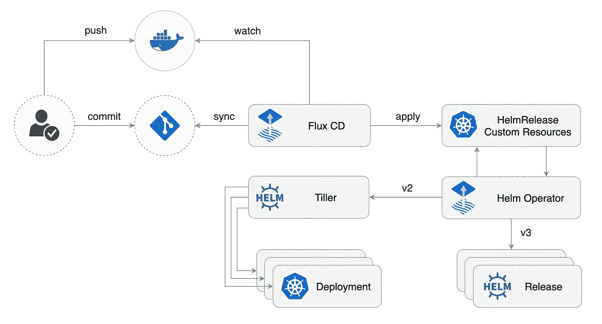
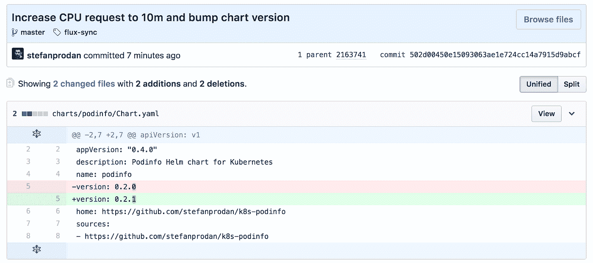
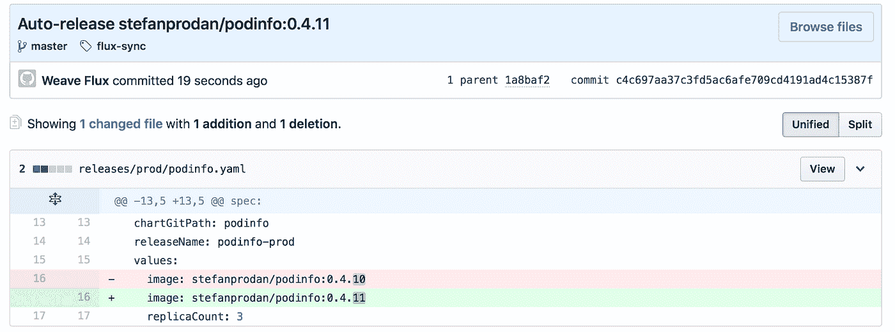
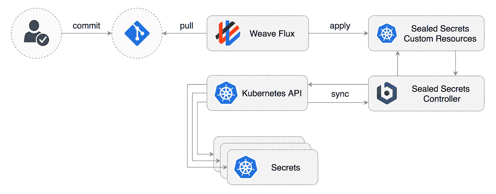

# 以 GitOps 的方式管理 GKE 的 Helm 版本

> 原文：<https://medium.com/google-cloud/managing-helm-releases-the-gitops-way-207a6ac6ff0e?source=collection_archive---------1----------------------->

GitOps 是一种持续交付的方式，它通过使用 Git 作为声明性基础设施和工作负载的真实来源来工作。对于 Kubernetes 来说，这意味着使用`git push`而不是`kubectl create/apply`或`helm install/upgrade`。

在传统的 CICD 管道中，CD 是由持续集成工具驱动的实现扩展，用于将构建工件提升到生产中。在 GitOps 管道模型中，对生产的任何更改都必须在应用到集群之前在源代码控制中提交(最好通过 pull 请求)。这样，回滚和审计日志由 Git 提供。如果整个生产状态都在版本控制之下，并在单个 Git 存储库中描述，那么当灾难发生时，整个基础设施可以从该存储库中快速恢复。

为了更好地理解这种 CD 方法的好处以及 GitOps 和基础设施即代码工具之间的区别，请访问 Weaveworks 网站并阅读[什么是 GitOps？](https://www.weave.works/blog/what-is-gitops-really)。

为了将 GitOps pipeline 模型应用到 Kubernetes，您需要三样东西:

1.  一个 Git 存储库，其中包含 YAML 格式的工作负载定义、Helm 图表和任何其他 Kubernetes 自定义资源，这些资源定义了您的集群所需的状态(我将此称为 *config* 存储库)
2.  一个容器注册表，CI 系统在其中推送不可变的图像(没有*最新的*标签，使用*语义版本*或 git *提交 sha* )
3.  在集群中运行并执行双向同步的操作员:

*   监视注册表中新的映像版本，并根据部署策略使用新的映像标记更新工作负载定义，并将更改提交到配置存储库
*   观察配置存储库中的更改，并将它们应用到集群中

我将使用谷歌云 Kubernetes 托管服务运行工作负载，GitHub 托管配置报告，Docker Hub 作为容器注册表，Weave Flux OSS 作为 GitOps Kubernetes 运营商。



# 先决条件

您需要一个 Kubernetes 集群 1.11 或更新版本，一个 GitHub 帐户，本地安装 git 和 kubectl。

用自制软件为 macOS 安装 Helm v3 和 fluxctl:

```
brew install helm fluxctl
```

在 Windows 上，您可以使用 Chocolatey:

```
choco install kubernetes-helm fluxctl
```

在 Linux 上，你可以从 GitHub 下载 [helm](https://github.com/helm/helm/releases) 和 [fluxctl](https://github.com/fluxcd/flux/releases) 二进制文件。

# 安装 Flux CD

用 [Flux](https://github.com/fluxcd/flux) 自动化 Helm 发布的第一步是用你的图表源代码创建一个 Git 库。

在 GitHub 上，派生这个库并在本地克隆它(用您的 GitHub 用户名替换`fluxcd`):

```
git clone [https://github.com/fluxcd/helm-operator-get-started](https://github.com/fluxcd/helm-operator-get-started)
cd helm-operator-get-started
```

*如果您使用 fork，在继续之前，请使用您的 Docker Hub 存储库和 GitHub 用户名(位于主分支的\ releases(dev/stg/prod)\ podinfo . YAML 中)更新发布定义。

将 FluxCD 存储库添加到 Helm repos:

```
helm repo add fluxcd [https://charts.fluxcd.io](https://charts.fluxcd.io)
```

创建`fluxcd`名称空间:

```
kubectl create ns fluxcd
```

通过指定您的 fork URL 来安装 Flux(用您的 GitHub 用户名替换`fluxcd`):

```
helm upgrade -i flux fluxcd/flux --wait \
--namespace fluxcd \
--set git.url=git@github.com:fluxcd/helm-operator-get-started
```

安装`HelmRelease` Kubernetes 自定义资源定义:

```
kubectl apply -f [https://raw.githubusercontent.com/fluxcd/helm-operator/master/deploy/flux-helm-release-crd.yaml](https://raw.githubusercontent.com/fluxcd/helm-operator/master/deploy/flux-helm-release-crd.yaml)
```

用*舵 v3* 支架安装通量舵操作器；

```
helm upgrade -i helm-operator fluxcd/helm-operator --wait \
--namespace fluxcd \
--set git.ssh.secretName=flux-git-deploy \
--set helm.versions=v3
```

Flux Helm operator 为 Flux 提供了一个扩展，可以自动发布舵图。一个图表发布通过一个名为 HelmRelease 的 Kubernetes 定制资源来描述。Flux 守护进程将这些资源从 git 同步到集群，Flux Helm 操作员确保 Helm 图表按照资源中指定的方式发布。

请注意，通量舵操作员与 Kubernetes 1.11 或更新版本一起工作。

在启动时，Flux 生成一个 SSH 密钥并记录公钥。使用以下命令查找公钥:

```
fluxctl identity --k8s-fwd-ns fluxcd
```

为了将集群状态与 Git 同步，您需要复制公钥，并在 GitHub 存储库上创建一个具有写访问权限的部署密钥。

打开 GitHub，导航到您的分支，转到*设置>部署密钥*点击*添加部署密钥*，勾选*允许写访问*，粘贴 Flux 公钥并点击*添加密钥*。

# GitOps 管道示例

配置回购具有以下结构:

```
├── charts
│   └── podinfo
│       ├── Chart.yaml
│       ├── README.md
│       ├── templates
│       └── values.yaml
├── hack
│   ├── Dockerfile.ci
│   └── ci-mock.sh
├── namespaces
│   ├── dev.yaml
│   └── stg.yaml
└── releases
    ├── dev
    │   └── podinfo.yaml
    └── stg
        └── podinfo.yaml
```

我将使用 [podinfo](https://github.com/stefanprodan/k8s-podinfo) 来展示一个完整的 CI/CD 管道，包括促进环境之间的发布。

我假设以下 Git 分支模型:

*   开发分支(功能就绪状态)
*   stg 分支(发布候选状态)
*   主分支机构(生产就绪状态)

当 PR 在 dev 或 stg 分支中被合并时，将产生一个不可变的容器映像，如在`repo/app:branch-commitsha`中。

在`hack`目录中，您可以找到一个模拟 dev 和 stg 的 CI 流程的脚本。`ci-mock.sh`脚本执行以下操作:

*   从 GitHub 获取 podinfo 源代码
*   生成随机字符串并修改代码
*   生成随机 Git 提交短 SHA
*   构建 Docker 映像，格式为:`yourname/podinfo:branch-sha`
*   将图像推送到 Docker Hub

让我们创建一个对应于`dev`分支的图像(用您的 Docker Hub 用户名替换`stefanprodan`):

```
$ **cd** **hack && ./ci-mock.sh -r stefanprodan/podinfo -b dev**

Sending build context to Docker daemon  4.096kB
Step 1/15 : FROM golang:1.10 as builder
....
Step 9/15 : FROM alpine:3.7
....
Step 12/15 : COPY --from=builder /go/src/github.com/stefanprodan/k8s-podinfo/podinfo .
....
Step 15/15 : CMD ["./podinfo"]
....
Successfully built 71bee4549fb2
Successfully tagged stefanprodan/podinfo:dev-kb9lm91e
The push refers to repository [docker.io/stefanprodan/podinfo]
36ced78d2ca2: Pushed
```

在*图表*目录中有一个 podinfo 舵图。使用这个图表，我想用我刚刚发布到 Docker Hub 的图片在`dev`命名空间中创建一个发布。我将创建一个`HelmRelease`定义，而不是编辑图表源中的`values.yaml`:

```
apiVersion: helm.fluxcd.io/v1
kind: HelmRelease
metadata:
  name: podinfo-dev
  namespace: dev
  annotations:
    fluxcd.io/automated: "true"
    filter.fluxcd.io/chart-image: glob:dev-*
spec:
  releaseName: podinfo-dev
  chart:
    git: git@github.com:fluxcd/helm-operator-get-started
    path: charts/podinfo
    ref: master
  values:
    image: stefanprodan/podinfo:dev-kb9lm91e
    replicaCount: 1
```

通量舵释放场:

*   `metadata.name`是强制性的，需要遵循 Kubernetes 命名惯例
*   `metadata.namespace`是可选的，决定了在哪里创建发布
*   `spec.releaseName`是可选的，如果没有提供，发布名称将是$namespace-$name
*   `spec.chart.path`是包含图表的目录，相对于存储库根目录给出
*   `spec.values`是图表本身的默认参数值的用户定制

HelmRelease `spec.values`中指定的选项将覆盖图表源中`values.yaml`中的选项。

通过`fluxcd.io/automated`注释，我指示 Flux 自动完成这个发布。当一个带有前缀`dev`的新标签被推送到 Docker Hub 时，Flux 将更新 yaml 文件中的 image 字段，并将更改提交和推送到 Git，最后将更改应用到集群上。


当`podinfo-dev` HelmRelease 对象在集群内部发生变化时，Kubernetes API 将通知 Flux Helm 操作员，操作员将执行 HelmRelease 升级。

```
$ **helm -n dev history podinfo-dev**

REVISION	STATUS    	CHART        	     
1       	SUPERSEDED	podinfo-0.2.0	Install complete
2       	DEPLOYED  	podinfo-0.2.0	Upgrade complete
```

Flux Helm 操作符对 HelmRelease 集合中的更改做出反应，但也会检测图表源文件中的更改。如果我对 podinfo 图表做了更改，操作员会选择并运行升级。



```
$ **helm -n dev history podinfo-dev**

REVISION        STATUS    	CHART        	DESCRIPTION     
1	        SUPERSEDED	podinfo-0.2.0	Install complete
2	        SUPERSEDED	podinfo-0.2.0	Upgrade complete
3	        DEPLOYED  	podinfo-0.2.1	Upgrade complete
```

现在让我们假设我想将来自`dev`分支的代码提升到一个更稳定的环境中，让其他人来测试它。我将通过将来自`dev`的 podinfo 代码合并到`stg`分支中来创建一个发布候选。CI 会介入并发布新的形象:

```
$ **cd hack && ./ci-mock.sh -r stefanprodan/podinfo -b stg** 
Successfully tagged stefanprodan/podinfo:stg-9ij63o4c
The push refers to repository [docker.io/stefanprodan/podinfo]
8f21c3669055: Pushed
```

假设试运行环境有某种自动化负载测试，我想有一个不同于 dev 的配置:

```
apiVersion: helm.fluxcd.io/v1
kind: HelmRelease
metadata:
  name: podinfo-rc
  namespace: stg
  annotations:
    fluxcd.io/automated: "true"
    filter.fluxcd.io/chart-image: glob:stg-*
spec:
  releaseName: podinfo-rc
  chart:
    git: git@github.com:fluxcd/helm-operator-get-started
    path: charts/podinfo
    ref: master
  values:
    image: stefanprodan/podinfo:stg-9ij63o4c
    replicaCount: 2
    hpa:
      enabled: true
      maxReplicas: 10
      cpu: 50
      memory: 128Mi
```

借助 Flux Helm 版本，可以轻松管理每个环境的不同配置。在图表源中添加新选项时，请确保默认情况下它是关闭的，这样它就不会影响所有环境。

如果我想创建一个新环境，比方说进行修补程序测试，我会执行以下操作:

*   在`namespaces/hotfix.yaml`中创建新的名称空间定义
*   创建一个目录`releases/hotfix`
*   创建一个名为`podinfo-hotfix`的 FluxHelmRelease
*   将自动过滤器设置为`glob:hotfix-*`
*   让 CI 工具将映像从我的热修复分支发布到`stefanprodan/podinfo:hotfix-sha`

# 使用 sem 版本的生产促销

对于生产，我将使用[语义版本化](https://semver.org/)，而不是用 Git commit 来标记图像。

让我们假设我想将代码从`stg`分支提升到`master`并发布产品。通过 pull 请求将`stg`合并到`master`之后，我会通过用版本`0.4.10`标记`master`来剪切一个发布。

当我推送 git 标记时，CI 将以`repo/app:git_tag`格式发布一个新图像:

```
$ **cd hack && ./ci-mock.sh -r stefanprodan/podinfo -v 0.4.10**

Successfully built f176482168f8
Successfully tagged stefanprodan/podinfo:0.4.10
```

如果我想基于版本标签自动化生产部署，我会使用`semver`过滤器而不是`glob`:

```
apiVersion: helm.fluxcd.io/v1
kind: HelmRelease
metadata:
  name: podinfo-prod
  namespace: prod
  annotations:
    fluxcd.io/automated: "true"
    filter.fluxcd.io/chart-image: semver:~0.4
spec:
  releaseName: podinfo-prod
  chart:
    git: git@github.com:fluxcd/helm-operator-get-started
    path: charts/podinfo
    ref: master
  values:
    image: stefanprodan/podinfo:0.4.10
    replicaCount: 3
```

现在如果我发布一个新的补丁，比如说`0.4.11`，Flux 会自动部署它。

```
$ **cd hack && ./ci-mock.sh -r stefanprodan/podinfo -v 0.4.11**

Successfully tagged stefanprodan/podinfo:0.4.11
```



# 管理 Kubernetes 的秘密

为了在公共 Git 回购中安全地存储秘密，你可以使用 Bitnami [密封秘密控制器](https://github.com/bitnami-labs/sealed-secrets)并将你的 Kubernetes 秘密加密到密封秘密中。SealedSecret 只能由群集中运行的控制器解密。

在[头盔中心](https://hub.helm.sh/charts/stable/sealed-secrets)可以得到密封秘密头盔图，所以我可以用头盔库代替 git repo。这是机密控制器的发布:

```
apiVersion: helm.fluxcd.io/v1
kind: HelmRelease
metadata:
  name: sealed-secrets
  namespace: adm
spec:
  releaseName: sealed-secrets
  chart:
    repository: https://kubernetes-charts.storage.googleapis.com/
    name: sealed-secrets
    version: 1.6.1
```

请注意，这个版本不是自动化的，因为这是一个关键的组件，我更喜欢手动更新它。

安装 kubeseal CLI:

```
brew install kubeseal
```

在启动时，密封秘密控制器生成 RSA 密钥并记录公钥。使用 kubeseal，您可以将您的公钥保存为`pub-cert.pem`，公钥可以安全地存储在 Git 中，并且可以用于加密机密，而无需直接访问 Kubernetes 集群:

```
kubeseal --fetch-cert \
--controller-namespace=adm \
--controller-name=sealed-secrets \
> pub-cert.pem
```

您可以使用 kubectl 在本地生成一个 Kubernetes 秘密，并使用 kubeseal 对其进行加密:

```
kubectl -n dev create secret generic basic-auth \
--from-literal=user=admin \
--from-literal=password=admin \
--dry-run \
-o json > basic-auth.json

kubeseal --format=yaml --cert=pub-cert.pem < basic-auth.json > basic-auth.yaml
```

这将生成一个类型为`SealedSecret`的定制资源，其中包含加密的凭证:

```
apiVersion: bitnami.com/v1alpha1
kind: SealedSecret
metadata:
  name: basic-auth
  namespace: adm
spec:
  encryptedData:
    password: AgAR5nzhX2TkJ.......
    user: AgAQDO58WniIV3gTk.......
```

删除`basic-auth.json`文件，将`pub-cert.pem`和`basic-auth.yaml`推送到 Git

```
rm basic-auth.json
mv basic-auth.yaml /releases/dev/

git commit -a -m "Add basic auth credentials to dev namespace" && git push
```

Flux 将在您的集群上应用密封秘密，然后密封秘密控制器将它解密为 Kubernetes 秘密。



为了准备灾难恢复，您应该使用以下内容备份 sealed-secrets 控制器私钥:

```
kubectl get secret -n adm sealed-secrets-key -o yaml --export > sealed-secrets-key.yaml
```

要在灾难后从备份中恢复，请替换新创建的密码并重新启动控制器:

```
kubectl replace secret -n adm sealed-secrets-key -f sealed-secrets-key.yaml
kubectl delete pod -n adm -l app=sealed-secrets
```

# 通量舵集成常见问题

**我已经从 Git 中删除了一个** `**HelmRelease**` **文件。为什么 Helm release 仍然在我的集群上运行？**

默认情况下，Flux 不删除资源，您可以使用以下命令启用 Flux GC:

```
--set syncGarbageCollection.enabled=true
```

**我在每个环境中都有一个专用的 Kubernetes 集群，我希望对所有环境使用相同的 Git repo。我该怎么做呢？**

对于每个集群，在配置报告中创建一个 Git 分支。安装 Flux 时，使用`--set git.branch=cluster-name`设置 Git 分支。

**如何监控 CD 管道和 Flux 管理的工作负载？**

[Weave Cloud](https://www.weave.works/product/cloud/) 是 Weaveworks 的 SaaS 产品，它通过以下方式扩展通量:

*   用于所有流量操作、审计跟踪和部署警报的用户界面
*   集群的实时图，用于调试和分析其状态
*   对集群的全面观察和洞察(托管 Prometheus，拥有 13 个月的指标历史)
*   通过 GitHub webhooks 路由进行即时流量操作

*最初发表于*[*www . weave . works*](https://www.weave.works/blog/managing-helm-releases-the-gitops-way)*。*