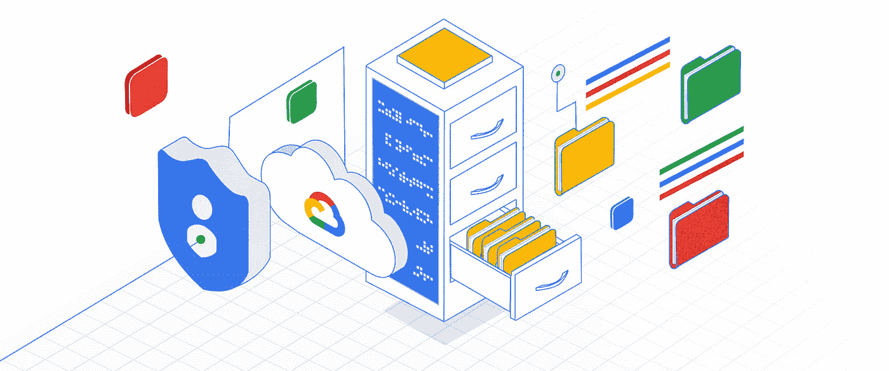
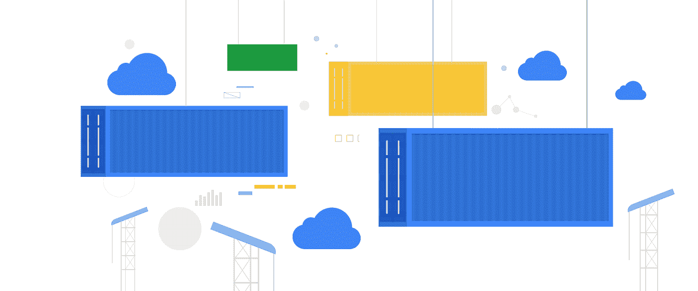

# 在你的应用中管理支付:查看结账

> 原文：<https://medium.com/google-cloud/managing-payments-in-your-app-check-out-the-checkout-f776f6e40a38?source=collection_archive---------2----------------------->

让我们来看看结账流程的下一步吧！

*该退房了！* [*来源*](https://unsplash.com/photos/a9632QgPKQM)

你是这个系列的新手吗？查看 [*第一篇博客*](https://bit.ly/33qptv1) *的介绍和目录！*

知道我的钩针图案肯定会大受欢迎，我渴望开始下一步建设我的商店！到目前为止，我有一个将库存数据添加到 Cloud Firestore 的函数和一个在 Stripe 中创建项目的函数。

# 条带检验

正如在[上一篇博客](https://bit.ly/33qocUL)中所讨论的，Checkout 创建了一个安全的 Stripe 托管的支付页面，可以让你快速收款。结帐需要服务器端和客户端组件。在服务器端，创建一个签出会话。这将返回一个会话 ID，您将它传递回客户机以完成结帐。

# 签出会话

结账环节代表了顾客购买意图的细节。当您的客户想要付款时，您可以创建一个会话。在将您的客户重定向到结账会话后，Stripe 会显示一个付款表单，您的客户可以在其中完成购买。

> *条带检出需要服务器和客户端组件*

一旦您的客户完成购买，他们将被重定向回您的网站。这意味着我们需要一个服务器解决方案来创建会话。

# 安全服务器

条带检出客户端-服务器握手对于保护数据的有效性是必要的。例如，如果定价信息直接从客户端传递过来，那么用户就有可能修改价格。请放心，我不会低价出售我的袜子图案！我煞费苦心地创造了这些模式，如果我不珍惜我的时间，别人也不会珍惜！只要可能和合适，确保客户不能修改数据，尤其是与获得报酬相关的数据。

> *使用服务器确保客户端无法修改关键数据*

有很多 Google 云解决方案可以满足服务器环境的需求。我用的是云跑。

# 云运行

根据一个比我更有写作天赋的营销人员写的东西，Cloud Run 允许你通过部署任何监听请求或事件的容器来编写代码。您可以用自己喜欢的语言、自己喜欢的依赖项和工具构建应用程序，并在几秒钟内完成部署。此外，它通过根据流量几乎瞬间从零开始自动扩展和缩减，将所有基础架构管理抽象化。Cloud Run 只对您使用的确切资源收费。

现在你可能会奇怪，考虑到这个项目的第一次迭代使用了云函数，为什么我对此使用了云运行而不是云函数。在这里，云函数也是一个很好的工具。就个人而言，我想探索一下 Cloud Run 提供的灵活性。如果 Node.js 不是您的难题，您可以用您选择的语言编写相同的功能，并以相同的方式将其部署到 Cloud Run。如果您决定将您的应用程序带到其他地方，只需构建您的容器并将其部署到您选择的服务中。

*用云跑快乐跑！* [*来源*](https://unsplash.com/photos/bqA55pIysk0)

# 准备好了吗？

现在，您已经对条带检出和云运行有了大致的了解，您已经准备好构建项目的这一部分了！以下是接下来要采取的一些步骤:

*   查看下一篇[博文](https://bit.ly/2YziCfh)！
*   查看[条带文档](https://bit.ly/3fpxpih)
*   了解关于[云运行的所有信息](https://bit.ly/2EQvRBq)
*   查看[第一篇博客](https://bit.ly/33qptv1)中所有帖子的链接