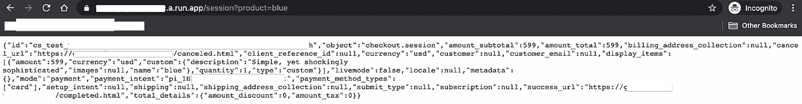

# 在你的应用程序中管理支付:查看结账——代码

> 原文：<https://medium.com/google-cloud/managing-payments-in-your-app-check-out-the-checkout-the-code-b869132170fb?source=collection_archive---------1----------------------->

*了解如何在云运行中创建条带检出意图，并将会话 ID 传递给客户端。*


*退房时间到了！* [*来源*](https://unsplash.com/photos/K_P6uDekLKI)

*你是这个系列的新手吗？查看* [*第一篇博客*](https://bit.ly/33qptv1) *的介绍和目录！*

# 赶上进度

随着我们的美国袜子市场库存的增加和运行，是时候通过创建支付意图来实现 Stripe Checkout 的服务器端组件了。


如果你对这些代码背后的基本原理感兴趣，那么看看这个博客！

假设您已经了解了我为什么要包含这段代码，我将把重点放在执行上。简而言之，Stripe Checkout API 使您能够以安全且符合当前法规的方式实现采购功能。这个过程包括在服务器环境中创建一个购买意向，并将该意向传递给客户机以完成购买。

这篇文章详细介绍了实现 Checkout 的服务器端组件的方法。

# 建立

记住这一点，让我们来探索一下结帐功能。导航至 **part-2-stripe-checkout** 文件夹，查看其中的内容。

*   checkout.js
*   package.json
*   Dockerfile 文件
*   README.md

因此，这告诉你这也是一个 Node.js 应用程序，感谢`package. json`。但是，这里还有一个附加文件:`Dockerfile`。将应用打包到容器中并部署到云运行时，这是必需的。

# 代码


[*来源*](https://unsplash.com/photos/q2GNdFmhxx4)

在部署到 Cloud Run 之前，让我们看一下`checkout.js`中的代码。

首先，有一些导入和初始化器。

```
const stripe = require('stripe')(process.env.STRIPE_SECRET_KEY);
const admin = require('firebase-admin');
const express = require('express');
const app = express();
admin.initializeApp();
const db = admin.firestore()
const DOMAIN = process.env.DOMAIN;
```

注意这里有几个环境变量。您可以在本地声明值，就像我们在将库存项目添加到 Cloud Firestore 和 Stripe 以进行本地测试时所做的那样，但是一旦代码被部署到 Cloud Run，您也将在该环境中为它们赋值。有几种方法可以做到这一点，我将在后面的文章中解释。

然后，是端点定义。该函数使用`session`扩展，引用当前正在创建的条带检出会话。

```
app.get('/session', async (req, res) => {
```

接下来是一些处理 CORS 和实现对请求的查询选项的响应的代码。我不打算深入研究这段代码，因为它主要是关于一般的 HTTP 请求。

```
res.set('Access-Control-Allow-Origin', '*');if (req.method === 'OPTIONS') {// Send response to OPTIONS requestsres.set('Access-Control-Allow-Methods', 'GET');res.set('Access-Control-Allow-Headers', 'Content-Type');res.set('Access-Control-Max-Age', '3600');res.status(204).send('');
```

获取作为查询参数传递的产品名称，然后用它来引用 Firestore 中的产品文档。

```
let product = req.query.product;
let productRef = db.collection('socks').doc(product);
productRef
  .get()
  .then(async doc => {
    // Get inventory data from Firestore
    const data = doc.data();
```

检索到文档后，从文档数据中获取产品信息。

# 为什么不将所有数据作为查询参数传递？

正如标题所示，您可能想知道为什么代码需要从 Firestore 获取产品数据，而这些数据本可以作为查询参数从客户端传递过来。如果数据是直接从客户端传递过来的，那么用户就有可能自己定价。

# 创建条带签出会话

使用 Cloud Firestore 提供的信息，创建结账会话。您会注意到成功 URL 和取消 URL 是使用`DOMAIN`环境变量提供的。这个变量将是您的 web 应用程序的 URL。因为我们还没有制作那个应用程序，所以我们将使用一个替身。

```
// Create a CheckoutSession on Stripe with the order information
const session = await stripe.checkout.sessions.create({
  payment_method_types: ['card'],
  line_items: [
    {
      name: data.name,
      description: data.description,
      amount: data.price,
      currency: 'usd',
      quantity: 1,
      images: [data.image]
    }
  ],
  success_url: DOMAIN + '/completed.html',
  cancel_url: DOMAIN + '/canceled.html',
  metadata: { file: data.file }
});
```

创建后，在响应对象中传递该会话。

```
// Send the session to the client
res.send(session);
```

# 部署到云运行

现在我们已经研究了代码，让我们开始部署吧！下面的命令在幕后做了很多工作。首先，它使用 Cloud Build 构建容器映像，然后将映像存储在容器注册表中，最后部署到 Cloud Run。将`SERVICE`更改为您希望为服务指定的名称，将`PROJECT-ID`更改为您的云项目 ID，将`REGION`更改为您希望部署的地区(例如`us-central1`)。

```
gcloud run deploy SERVICE --image gcr.io/PROJECT-ID/checkout-session --platform managed --allow-unauthenticated --region REGION
```

运行此命令后，终端将显示访问您的应用程序的 URL。如果您现在点击这个链接，您会得到一个错误，因为环境变量还没有值。让我们把它修好！

# 在云运行中配置环境变量


不，不是那种环境！ [*来源*](https://unsplash.com/photos/ihMzQV3lleo)

关于环境变量的云运行文档展示了几种实例化值的方法:通过控制台，通过 gcloud，或者通过。yaml 文件。所有这些方法都有各自的用处。如果你偏爱其中一个，请随意使用。正如我以前说过的，如果有选择的话，我通常倾向于 CLI。然而，在这种情况下，我更喜欢. yaml。当我有一大堆变量要设置时，这感觉更容易。我可以看到它们并检查错误，然后迅速做出更改。虽然我们这里只有两个环境变量，但是您的项目可能会更加复杂，包含更多的组件和变量。在项目成长之前熟悉这个系统是很好的。

```
gcloud run services describe SERVICE --format export > service.yaml
```

现在，您可以将环境变量添加到文档中。请确保使用您的条带密钥，该密钥可通过条带控制台访问。一旦您的店面 web 应用程序部署完毕，您将使用您实际的 web URL 替换`[https://www.google.com](https://www.google.com/)` 。

```
apiVersion: serving.knative.dev/v1
  kind: Service
  metadata:
    name: SERVICE-abc
  spec:
    template:
      spec:
        containers:
          - env:
            - name: STRIPE_SECRET_KEY
            value: sk_test_abcd1234
            - name: DOMAIN
              value: https://www.google.com
```

还有一点需要注意:元数据下面的`name`是指具体的配置版本。如果你上传这个。同样，您会得到一个错误，因为该名称已经被占用。**删除此** `**name**` **字段以便上传文件。这将分配一个新的随机生成的版本名。**

保存该文件，您就可以上传新的配置了。

注意，这个配置文件将替换所有当前的配置，所以如果您在控制台中设置了变量，并在。yaml 或完全删除它们，这将在配置部署后反映在控制台中。

记住这一点，准备好之后，运行以下命令:

```
gcloud run services replace service.yaml
```

# 运行云运行


[*来源*](https://unsplash.com/photos/XnzWWNBqWhM)

有了新的配置，您现在可以运行应用程序了。您的请求将采用以下格式:

```
[https://[your-run-app/session?product=[product]](/[your-run-app/session?product=[product])
```

例如，为蓝色袜子模式创建结帐会话的请求可能如下所示:

```
[https://checkout-a1bcdef98.a.run.app/session?product=blue](https://checkout-a1bcdef98.a.run.app/session?product=blue)
```



# 后续步骤

现在，您拥有了一个创建条带检出会话的无服务器后端！接下来，我们将创建店面，这样我们的顾客就可以最终购买我们令人惊叹的袜子图案了！

以下是接下来要采取的一些步骤:

*   在他们的 [YouTube 频道](https://bit.ly/3fm3dEJ)上的[文档](https://bit.ly/3fpxpih)中找到关于 Checkout 和 Stripe 的更多组件
*   在[文档](https://bit.ly/2XnV7We)和[谷歌云开发者 YouTube 频道](https://bit.ly/30qyzGe)上了解更多关于云运行的信息
*   查看下一篇博文
*   查看[第一篇博客](https://bit.ly/33qptv1)中所有帖子的链接