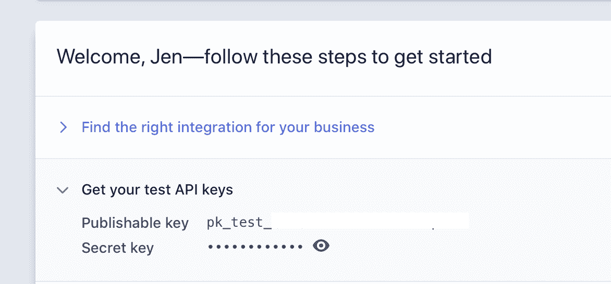
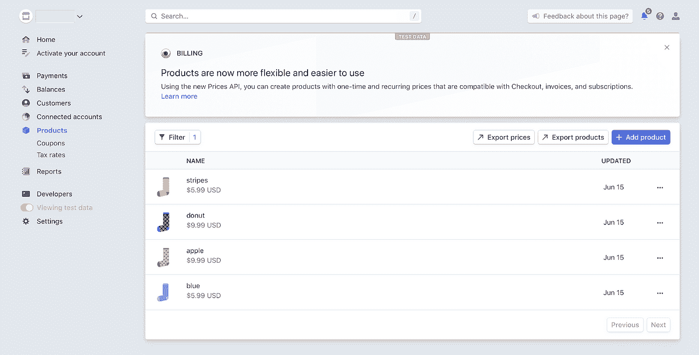

# 在应用中管理支付:整合 Stripe——代码

> 原文：<https://medium.com/google-cloud/managing-payments-in-your-app-incorporating-stripe-the-code-cd37f4167c61?source=collection_archive---------3----------------------->

*参见如何实现库存物品分条*


谁知道支付处理会如此有趣？？ [*来源*](https://unsplash.com/photos/jpHw8ndwJ_Q)

*你是这个系列的新手吗？查看* [*第一篇博客*](https://bit.ly/33qptv1) *的介绍和目录！*

# 赶上进度

如果你对这些代码背后的基本原理感兴趣，那么看看[的博客](https://bit.ly/30wAER3)！

简而言之，Checkout 创建了一个安全的 Stripe 托管支付页面，让您可以快速收款。要使用 Checkout API，首先需要创建代表您的产品和产品价格的产品和价格对象。我将向您展示如何使用 Stripe API 做到这一点。

# 建立

记住这一点，让我们来探索一下结帐功能。导航至 **part-1-set-up-stripe** 文件夹并查看内容。

*   索引. js
*   package.json
*   产品 _img 文件夹
*   README.md

你需要一个 Stripe 账户和项目。[登录](https://dashboard.stripe.com/login)您的帐户或[创建一个新帐户](https://dashboard.stripe.com/register)。

前往[条纹仪表板](https://dashboard.stripe.com/test/dashboard)并找到你的秘密钥匙。



将您的密钥添加为环境变量，就像我们之前对您的 Google 凭据所做的那样。

```
export STRIPE_SECRET_KEY="sk_yoursecretkey"
```

# 代码

让我们来看看这段代码是如何工作的。

首先，初始化 Stripe 和 Admin SDK。这就是需要条带密钥地方。

```
const stripe = require('stripe')(process.env.STRIPE_SECRET_KEY);
const admin = require('firebase-admin');
admin.initializeApp({
  credential: admin.credential.applicationDefault(),
});
const db = admin.firestore();
let collectionSnapshot;
```

我们所有的产品信息目前都存储在 Firestore 中，所以获取`socks`集合中的项目。

```
collectionSnapshot = await db.collection('socks').get();
```

循环访问集合中的文档快照。

```
collectionSnapshot.forEach(async (item) => {
  const thisItem = item.data();
  console.log(thisItem.name); // just for fun, log the items
```

对于每个项目，通过将名称、描述和图像数组传递给`create`函数来创建一个条带产品。我本可以将`thisitem.images`作为`images`的值传递，因为它是一个数组，但是我选择了这种格式来强调，虽然我们对每个项目只有一个图像，但是这个值始终是一个数组。

```
const stripeProduct = await stripe.products.create(
  {
    name: thisItem.name,
    description: thisItem.description,
    images: [thisItem.images[0]]
  });
```

最终的条带产品具有唯一的 id。

```
const product = stripeProduct.id;
```

使用此 ID 和项目的价格来创建条纹价格。

```
// create a price object for the item
await stripe.prices.create({
  product: product,
  unit_amount: thisItem.price,
  currency: 'sd',
});
```

最后，为了保持 Firestore 和 Stripe 同步，将产品 ID 添加到 Firestore 中的项目文档中。

```
// add resulting product ID to the item
await db.collection('socks').doc(thisItem.name).set({product: product}, {merge: true});
```

# 运行它

使用命令`node index.js`运行代码。

然后转到条带仪表板，验证项目是否已上传。



*您的仪表盘看起来会像这样*

# 后续步骤

你做到了！钩针图案信息现在可以在云商店和条纹商店中保存。随着产品和价格项目现在在 Stripe 中同步，我们可以执行结帐操作来初始化购买。

*   查看下一篇博文
*   查看[第一篇博客](https://bit.ly/33qptv1)中所有帖子的链接