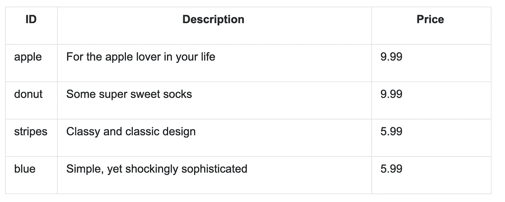
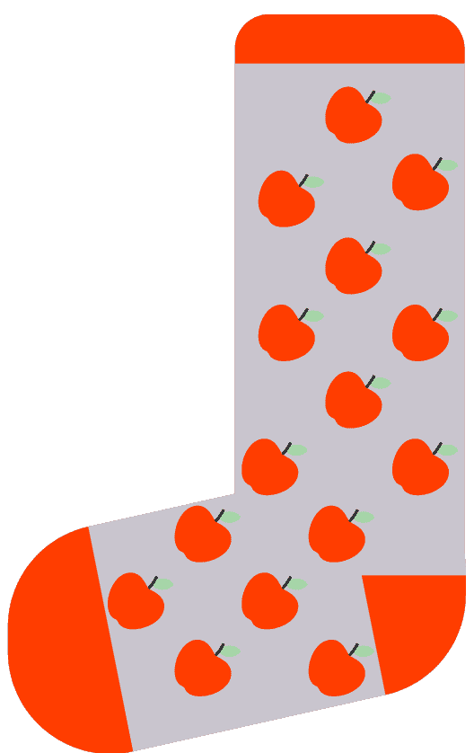
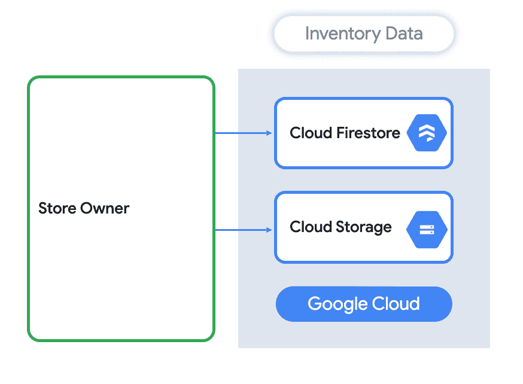

# 在你的应用中管理支付:设置库存

> 原文：<https://medium.com/google-cloud/managing-payments-in-your-app-setting-up-inventory-8b4d0f86f82d?source=collection_archive---------3----------------------->

*在我的* [*上一篇*](/@ThatJenPerson/stripe001-intro-what-happens-after-you-click-pay-bd7ab4e09221) *中，我让你思考一个 app 点击“支付”后会发生什么。现在是时候编制一份要销售的产品清单了！*

[*图像来源*](https://unsplash.com/photos/-BvBZKXwQo8)

*你是这个系列的新手吗？查看* [*第一篇博客*](https://bit.ly/33qptv1) *的介绍和目录！*

# 商店

几年前，当我住在美国一个冬天漫长的地方时，我就开始编织了。在那些黑暗的冬日里，当外出冒险不是一个选择时，它给了我一些事情做。这也给了我一个制作自制节日礼物的好技巧！每个人都假装喜欢手工围巾或手套。但是我最喜欢的钩针项目是一双舒适的袜子！所以记住这一点，欢迎来到美国袜子市场:一个完全由成品组成的商店，在这里你可以从多种钩针图案中进行选择。年复一年，手工制作的凹凸不平的练习袜也会让你所爱的人失望。

# 创造产品

我们商场目前有四种不同袜子款式的库存:

随着我的商店越来越成功(我相信会的)，我会想添加更多的模式。我也可能想根据需求提高或降低图案的价格。这就是为什么我把我的模式信息存储在 Cloud Firestore 中。然后，我可以获取这些信息，并在我的网络应用程序中显示出来，使用 Firestore 的实时功能，总是显示最新的模式和价格。

# 云 Firestore

Cloud Firestore 是一个灵活、可扩展的 NoSQL 云数据库，用于存储和同步客户端和服务器端开发的数据。它的数据模型支持灵活的分层数据结构。将您的数据存储在文档中，组织成集合。除了子集合之外，文档还可以包含复杂的嵌套对象。

*Cloud Firestore 为存储袜子图案数据提供了完美的解决方案*

钩针编织是一种有趣、相对便宜且令人放松的爱好。你应该试试！ [*来源*](https://unsplash.com/photos/uka6tfxFL0s)

# 存储图像

云 Firestore 非常适合创建和更新产品名称和信息。但是，它不适合像图像这样的大数据。在我的情况下，我需要一个地方来存储成品的图像，这样顾客就可以看到他们的袜子看起来有多好…或多或少。这真的取决于你的钩针实力。例如，有人告诉我，我的围巾“看起来是自制的”，我想这意味着我的袜子看起来也不会像照片上那么好。顺便说一下，这是一个真实的故事。

把它扔给我！

无论如何，让我们来讨论存储这些图像。云存储非常适合这种使用情形。我将图像添加到云存储中，获取物品的下载 URL，然后将它们上传到 Cloud Firestore 以将它们与物品相关联。

> *通过为云存储中的对象生成下载 URL 并将其存储在云 Firestore 中，将该对象与云 Firestore 中的数据相关联*

> *在 Firestore 和 Storage 中存储有关图案的信息，以便所有顾客都能获得详细信息*

# 准备好了吗？

有了概述的结构和基本原理，您就可以构建项目的这一部分了！以下是接下来要采取的一些步骤:

*   查看[条带文档](https://bit.ly/3fpxpih)
*   深入了解[云 Firestore](https://bit.ly/2XrtL17)
*   查看[下一篇博文](https://bit.ly/3i7HceJ)
*   查看[第一篇博客](https://bit.ly/33qptv1)中所有帖子的链接