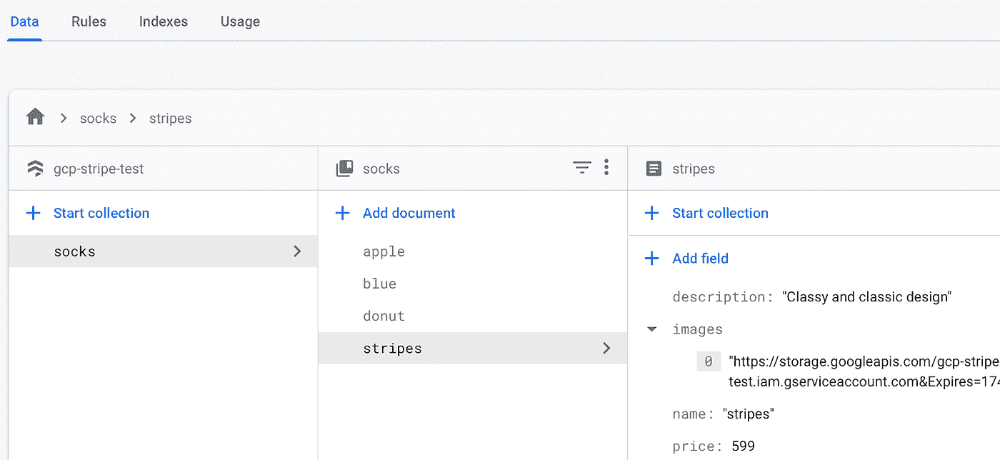

# 在你的应用中管理支付:设置库存-代码

> 原文：<https://medium.com/google-cloud/managing-payments-in-your-app-setting-up-inventory-the-code-9f570e173e97?source=collection_archive---------5----------------------->

*查看如何实现物品上传到云火石*


建立你的商店，然后坐以待毙，让利润滚滚而来。 [*来源*](https://unsplash.com/photos/1zTetyivDYE)

*你是这个系列的新手吗？查看* [*第一篇博客*](https://bit.ly/33qptv1) *的介绍和目录！*

# 赶上进度

如果你对这段代码背后的基本原理感兴趣，你可以在[上一篇文章](https://bit.ly/30rNK1K)中找到所有相关信息！

假设您已经阅读了它，我基本上将深入研究它的实现。简而言之，我们不希望项目被硬编码到我们的 HTML 中。相反，项目将存储在云 Firestore 中，并在访问网站时下载。但是这些商品都有图片——人们当然想看看他们要买什么！—所以我们也需要一个地方来存放它们。我们使用云存储来上传商品图片，然后为每个图片生成一个唯一的下载 URL，这样就可以公开查看了。


> *谷歌云存储提供了存储袜子图案图像的完美场所*

# 获得项目

项目的每一步都可以在 [GitHub](https://github.com/jenperson/gcp-serverless-store.git) 上找到。下载或复制 repo 以跟进。今天，我将完成第 0 步:建立库存。导航至**零件-0-设置-库存/上传-功能**文件夹，查看内容。

*   一个文件
*   一个`package.json`文件
*   一个`product_img`文件夹

`index.js`文件包含上传库存项目的代码。`package.json`文件包含了我们需要的 Node.js 包。`product_img`文件夹包含袜子的美丽图片。


*曾经那么美！*

# 设置项目

在运行代码之前，有几个设置步骤。

首先，启动一个新的或现有的 [Firebase 项目](https://console.firebase.google.com/)，并初始化 [Cloud Firestore](https://firebase.google.com/docs/firestore) 。

然后，安装所需的 npm 软件包。

```
npm install
```

我们用来上传物品的功能使用 [Firebase Admin SDK](https://firebase.google.com/docs/admin/setup) 来访问 Cloud Firestore。为了进行身份验证，您需要下载一个[服务账户密钥](https://console.firebase.google.com/u/0/project/_/settings/serviceaccounts/adminsdk)。请记住，这允许访问您的所有 Firebase 产品，因此请确保它的安全，不要将其存储在公共存储库中。

将环境变量`GOOGLE_APPLICATION_CREDENTIALS`设置为包含您的服务帐户密钥的 JSON 文件的文件路径。该变量仅适用于您当前的 shell 会话，因此如果您打开一个新的会话，您将需要再次设置该变量，但是这不太可能起作用，因为您只需运行该函数一次。

```
export GOOGLE_APPLICATION_CREDENTIALS="/home/user/Downloads/service-account-file.json"
```

您还需要您的云存储空间的名称。如果您愿意，您可以对此进行硬编码，但是由于我们将在项目的未来部分需要它，我发现创建一个环境变量更方便。

```
export STORAGE_BUCKET="your-project-name.appspot.com"
```

现在该函数已经准备好运行了！但是在我们运行它之前，让我们看看它是做什么的。知道你将进入什么总是好的！

首先，我们使用刚才在终端中设置的默认凭证导入并初始化 Firebase Admin SDK。然后，我们创建一个 Firestore 实例和一个云存储空间实例。

```
const admin = require('firebase-admin');
admin.initializeApp({
  credential: admin.credential.applicationDefault(),
  storageBucket: process.env.STORAGE_BUCKET
});
const db = admin.firestore();
const bucket = admin.storage().bucket();
```

然后，有一组袜子图案。

```
let items = [
  {
    name: 'apple',
    description: 'For the apple lover in your life',
    price: 999
  },
  {
    name: 'donut',
    description: 'Some super sweet socks',
    price: 999
  },
  {
    name: 'stripes',
    description: 'Classy and classic design',
    price: 599
  },
  {
    name: 'blue',
    description: 'Simple, yet shockingly sophisticated',
    price: 599
  }
]
```

接下来是`setData()`函数，它获取商店商品的数组并将数据上传到 Cloud Firestore。

```
async function setData() {
  for (item of items) {
    console.log(item); // it’s fun to see something on the screen when you run a function
    let thisItem = item;
    const filename = `${item.name}.png`;
    try {
      // upload the image to Cloud Storage
      await bucket.upload(`product_img/${filename}`, {
        // Support for HTTP requests made with 'Accept-Encoding: gzip'
        gzip: true,
        metadata: {
          cacheControl: ‘public, max-age=31536000’,
        },
      });
      const config = {
        action: 'read',
        expires: '03–17–2025'
      };
      // get a signed URL so the image can be viewed publicly
      const url = await bucket.file(filename).getSignedUrl(config);
      // add URL to the data about the item
      thisItem.images = url
      // upload object data to Cloud Firestore
      await db.collection(‘socks’).doc(item.name).set(thisItem);
    } catch (error) {
      console.error(error);
    }
  }
}
```

我们还记录项目名称和对象，以便您在运行该函数时有所了解。好了，事不宜迟，让我们开始吧！

```
node index.js
```

为了确保成功上传清单，请检查 [Firebase 控制台](https://console.firebase.google.com/u/0/project/_/database/firestore/)。



哒哒！如果不算我花在编码上的时间，这几乎比从控制台添加项目要少。但是，嘿，它绝对*不容易出错。*

# 后续步骤


*真不敢相信这个形象有多完美。* [*来源*](https://unsplash.com/photos/uzDLtlPY8kQ)

这对于定期更新来说显然是不实际或不方便的。我们真正需要的是一个前端，使添加项目更容易。我们称之为“伏笔”。但是现在，这是我们启动和运行项目所需要的！

接下来:

*   在[指南](https://firebase.google.com/docs/firestore)中查看云 Firestore 的所有功能
*   查看[下一篇博文](https://bit.ly/30wAER3)
*   查看[第一篇博客](https://bit.ly/33qptv1)中所有帖子的链接