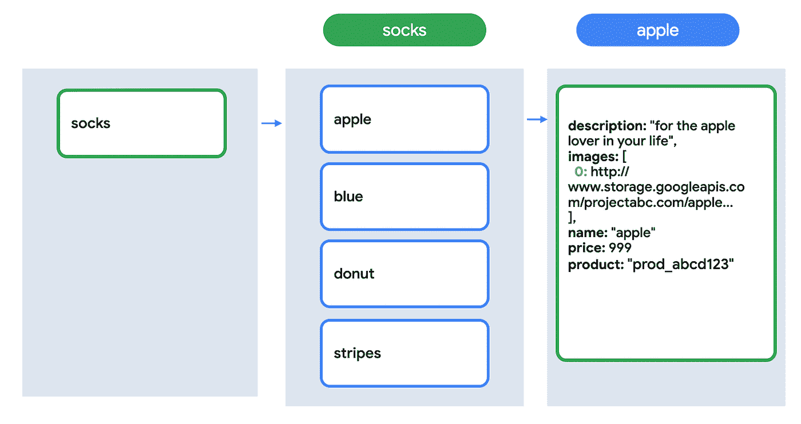

# 在你的应用中管理支付:设置网站

> 原文：<https://medium.com/google-cloud/managing-payments-in-your-app-setting-up-the-website-fe8df68e8883?source=collection_archive---------3----------------------->

*我们有一个* [*库存准备就绪*](https://bit.ly/3ibYBTq) *。我们来做个网站吧！*

到目前为止，我们一直在构建我们商店的后端组件。在我看来，那些设置和实现步骤是最重要的！但是更令人兴奋的是有一个前端接口。由于我们已经建立了强大的基础，网站实际上没有太多事情要做。我们关注的两个主要步骤是**获取最新产品**和**完成条带检验过程**。

# 获取最新产品

美国袜子市场网站从 Cloud Firestore 获取产品信息。这确保了随着库存的变化和新产品的发布，客户将看到最新的信息。

> *使用云 Firestore 下载产品的最新信息*

此图显示了云 Firestore 中的当前数据结构:

有一个名为`socks`的集合有四个文档。每个文档的关键字是相关产品的名称。

这些文档有几个字段:

*   描述
*   一组图像
*   名字
*   价格
*   产品 SKU(带条纹)

我从为这些博客寻找股票图片中得到乐趣。这个是我搜索“收藏”时出现的。这让我想起了 NoSQL 的数据库。有点夸张，但我喜欢！ [*来源*](https://images.unsplash.com/photo-1515281239448-2abe329fe5e5?ixlib=rb-1.2.1&ixid=eyJhcHBfaWQiOjEyMDd9&auto=format&fit=crop&w=1969&q=80)

由于 Cloud Firestore 是一个 NoSQL 数据库，我们不必坚持这种结构。随着商店的发展，业务需求可能会发生变化。我们可以轻松地向文档添加新字段，向 socks 集合添加新文档，以及添加新集合。也许有一天，我们会扩展到围巾和帽子的图案！今后，我们可以为每个类别增加新的系列。

通过向客户提供商品信息，他们可以进行选择和检验。

*这是一张被标记为“数据库”的图片。还不错！不过你应该看看出现的一些。如此随意。* [*来源*](https://images.unsplash.com/photo-1544383835-bda2bc66a55d?ixlib=rb-1.2.1&ixid=eyJhcHBfaWQiOjEyMDd9&auto=format&fit=crop&w=1621&q=80)

# 开始结帐

Stripe 的结帐 API 包括重定向到支付门户的功能。这意味着我们不必编码这个组件，我绝对喜欢！通过预构建的用户界面节省时间是明智的，但是使用这种用户界面的真正好处是它让我们不必担心管理客户支付信息的安全性。把安全交给一家每天整天专注于支付的公司，我感觉很好！

> *Stripe check out 预建用户界面在实现支付处理时会考虑一些安全问题*

为了启动 Stripe 结帐流程，我们首先调用我们的云运行端点来创建一个支付意向会话。我们在呼叫响应中获得关于会话的数据。一旦我们把数据传给 Stripe，支付处理就在他们手里了。完成后，客户将被重定向到我们选择的页面。

# 后续步骤

概述了店面的功能后，您就可以开始构建项目的这一部分了！以下是接下来要采取的一些步骤:

*   查看[条纹文档](https://stripe.com/docs)
*   深入了解[云火场](https://firebase.google.com/docs/firestore)
*   查看下一篇博文