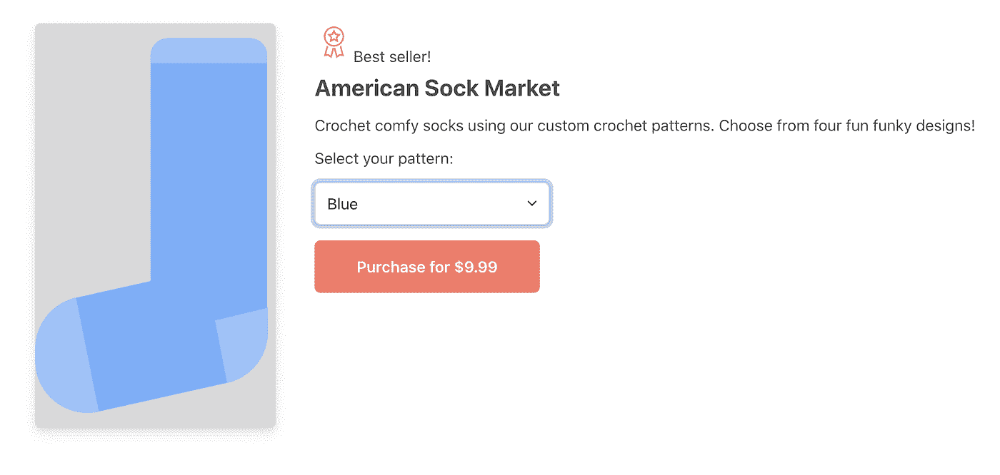
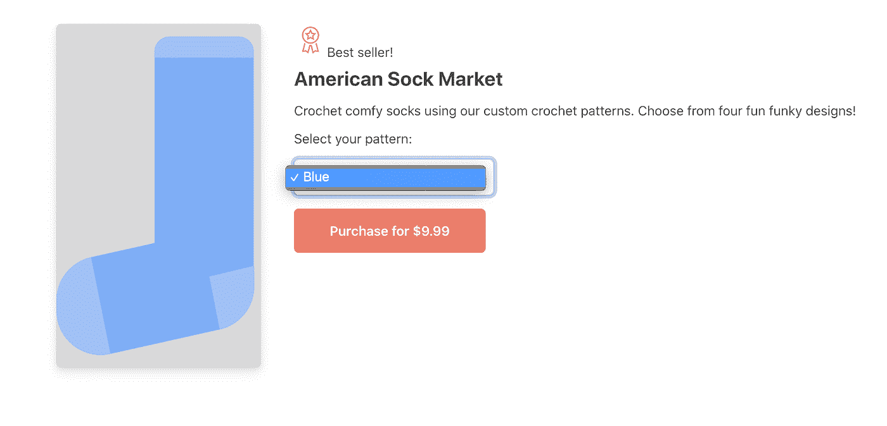
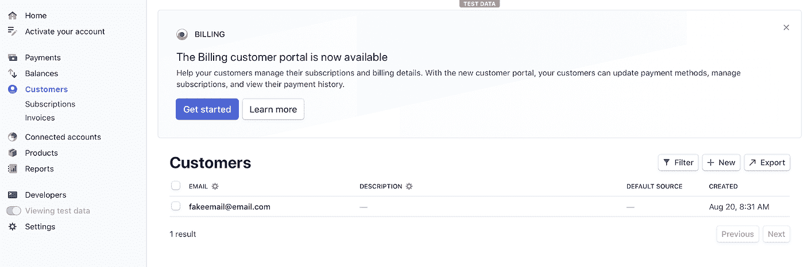
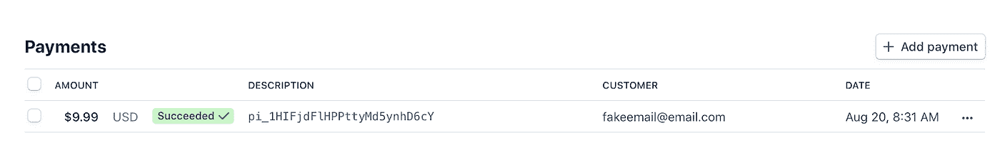

# 在你的应用中管理支付:设置网站-代码

> 原文：<https://medium.com/google-cloud/managing-payments-in-your-app-setting-up-the-website-the-code-f4640c92b1e1?source=collection_archive---------1----------------------->

让我们赶快做好这个网站吧！


如果你还在和我一起踏上编码之旅，那么我知道你对支付充满热情！ [*来源*](https://images.unsplash.com/photo-1455849318743-b2233052fcff?ixlib=rb-1.2.1&ixid=eyJhcHBfaWQiOjEyMDd9&auto=format&fit=crop&w=1650&q=80)

*你是这个系列的新手吗？查看* [*第一篇博客*](https://bit.ly/33qptv1) *的介绍和目录！*

到目前为止，我们为美国袜子市场写的代码是后端的。在本帖中，我们终于解决了前端问题！


在我的[上一篇博文](https://bit.ly/2CTBYEm)中，我描述了店面的组成部分。在这篇文章中，我将介绍这个实现。转到`part-3-set-up-shop-website`文件夹，这样我们就可以检查代码了！

在该文件夹中，您会找到另一个文件夹和一些文件:

*   公共/
*   firebase.json
*   firestore .规则
*   package.json
*   README.md

这里有几个你可能不熟悉的文件:`firebase.json`和`firestore.rules`。我稍后会解释这些。现在，让我们假装它们不重要，即使它们实际上非常重要。

打开`public/`文件夹，我们找到了将要探索的主要代码:

*   img/
*   404.html
*   canceled.html
*   completed.html
*   global.css
*   normalize.css
*   index.html
*   索引. js

我建议打开所有的文件，看一看，只是为了了解这个应用程序是如何工作的。在 Chrome 窗口中打开`index.html`。最后，一个真正的网站来看看！



但是当然，这个网站还没有建立和运行。这只是 HTML。所以如果你点击下拉菜单，你只会看到这个孤独的占位符袜子。



这只袜子一定很悲伤，因为它是孤独的。也许这就是为什么它这么蓝。

检查 HTML 也没有表现出太多的兴奋。该页面特意保持简单，以便您可以轻松了解如何定制它来满足您的需求。让我们把注意力集中在我们发现一些脚本标签的主体底部。

```
<script src="https://www.gstatic.com/firebasejs/7.15.0/firebase-app.js"></script>
<script src="https://www.gstatic.com/firebasejs/7.15.0/firebase-firestore.js"></script>
<script src="/__/firebase/init.js"></script>
```

这些脚本用于将 Firestore 整合到应用程序中。我在这篇博客中展示的版本号是我发表这篇文章时的最新版本，但是从那以后它们可能已经改变了。请务必查看 Firestore 文档以找到最新版本号。

第一个脚本是核心 Firebase SDK。所有使用 Firebase 的项目都需要它。第二个脚本添加了我们将要使用的 Firebase 产品:Firestore。第三个初始化 Firebase，供这个特定的应用程序使用。它总是跟踪任何其他与 Firebase 相关的脚本。

# 为什么选择 Firebase？

因此，云 Firestore 是云产品*，而*是 Firebase 产品。你可以在 [Google Cloud](https://bit.ly/2YdrK99) 和 [Firebase 文档](https://bit.ly/34aA9hE)中找到实现步骤，这些方向是相同的。要访问 Firestore 客户端，您可以使用 Firebase SDKs。

此外，该网站是托管在 Firebase 托管。与其他托管选项相比，这种方法的优势在于 Firebase 应用程序的配置是由托管环境自动提供的，这意味着您不必提供配置细节。这使得在多个 Firebase 项目中使用相同的 web 应用程序代码变得很容易。

这就是`index.html`中所有令人兴奋的事情。同样，你可以随意阅读它。只要记住这是有意为之的基本原则。没有框架和优化。与支付相关的代码可以在`index.js`中找到，所以让我们花点时间浏览一下。

# 代码

好吧，让我们看看`index.js`。

首先，像往常一样，我们有一些初始化器。

```
const stripe = Stripe('pk_test_ABCde');
const db = firebase.firestore();
const sockRef = db.collection('socks');
let selectedProduct;
let productList = '';
```

请注意，您将在这里提供您的 Stripe 公钥。因为这个密钥是公开的(顾名思义),所以您不必担心客户端可以访问它。当您部署应用程序时，请确保包含您的公钥，您可以在 [Stripe 仪表板](https://bit.ly/2Yfkbio)中找到该公钥。

# 买最新的袜子

接下来，在我们的代码中，我们从 Cloud Firestore 获取袜子图案的最新信息。

```
sockRef.get().then(querySnapshot => {
  querySnapshot.forEach(doc => {
    const data = doc.data();
    let name = data.name;
    // capitalize first letter for display purposes
    let displayName = name.charAt(0).toUpperCase() + name.slice(1);
    if (!selectedProduct) {
      selectedProduct = name;
    }
    const amount = data.price;
    const image = data.images[0];
    productList = productList+`<option data-amount="${amount}" data-id="${name}" data-img="${image}">${displayName}</option>`
    });
    document.getElementById('select').innerHTML = productList;
  });
```

以下是该代码中采取的基本步骤:

*   获取`socks`集合中的文档
*   遍历文档
*   从每个文档中获取数据
*   用它来填充一个 HTML 标签

请记住，我填充 HTML 的方式并不理想。在您自己的应用程序中，您可能正在使用某种 JavaScript 框架，它会以更优雅的方式更新您的 HTML。

# 结账时间

一旦顾客选择了商品，就该结账了。在这里，我们通过调用我们的云运行端点来启动条带检出会话。

```
fetch(
 'https://[your_cloud_run_url]/session?product='+selectedProduct
)
.then(function(response) {
  return response.json();
})
.then(function(session) {
  document.getElementById(“spinner”).classList.add(“hidden”);
  document.getElementById(“label”).classList.remove(“hidden”);
  stripe
  .redirectToCheckout({
    sessionId: session.id
  })
//...
});
```

在对云运行的调用中，我们将选择的产品作为查询参数传递。响应数据包括条带检出会话 ID，我们需要它来完成检出。使用 Stripe client SDK，我们重定向到 Stripe Checkout 页面。从那里开始，支付由 Stripe 处理，所以你不需要额外的编码！这就是开一个简单店面的全部内容。

# 很好…但是你似乎掩饰了文件夹里的一些东西

你不认为我会忘记，是吗？在部署之前，我确实想谈谈项目文件夹中的几个文件:

*   firebase.json
*   firestore .规则

这些小文件在我们的项目中起着重要的作用。让我们逐一检查一下。

# firebase.json

打开`firebase.json`文件。在里面，您会发现以下代码:

```
{
  "firestore": {
    "rules": "firestore.rules"
  },
  "hosting": {
    "public": "public",
    "ignore": [
      "firebase.json",
      "**/.*",
      "**/node_modules/**"
    ]
  }
}
```

该文件包含通过 Firebase CLI 部署 Firebase 项目的配置。如果我运行命令`firebase deploy`，那么默认情况下，我将在这个文件的配置大纲中部署 Firestore 和主机。

对于托管，配置告诉 Firebase 哪个文件夹是公共文件夹，哪些文件和文件夹要忽略。

对于 Firestore，配置告诉我哪些文件将包含在部署中。在这种情况下，我们使用 CLI 来配置 Firestore 的安全规则。这似乎是进入那个`firestore.rules`文件的一个很好的继续！

# firestore .规则

在我解释这个项目的安全规则之前，我想强调的是，安全性不是可有可无的，在设计数据库模式时应该考虑安全性。安全规则是一个内容丰富的话题，我恳求你阅读[文档](https://bit.ly/3iWuMGW)，测试示例，并确保你对 Firestore 安全规则的工作原理有深刻的理解。我不是想教训你，但同时，我承认我在教训你。我不在乎你是否认为我是一个唠叨的人，如果这意味着你真的会认真对待安全问题！

唷！好了，说完了，让我们回到美国袜子市场的规则上来。我们可以检查`firestore.rules`文件中的 Firestore 安全规则:

```
rules_version = '2';
service cloud.firestore {
  match /databases/{database}/documents {
    match /socks/{sock=**} {
      allow read: if true;
    }
  }
}
```

如果你不熟悉安全规则的格式，那么一定要花些时间阅读这些文档。这些规则允许公众访问`socks`集合及其下的所有子集合。因为默认的安全条件是 false，除非另外指定，否则任何客户端都不能读取或写入数据库的任何部分。因此，客户不能写入“socks”集合，也不能读写数据库的任何其他部分。

这是一套非常基本的规则，绝对不推荐用于生产应用程序。即使在测试中，通过将身份验证作为与数据库的任何部分进行交互的一项要求来保证数据库的安全也是一个好主意。我将`socks`集合设置为能够被公开读取，而实际上我更喜欢至少使用匿名认证。因此，正如你可能会怀疑的那样，我们将在未来的帖子中添加身份验证！如果听起来我又开始说教了，那就这样吧。你看过[规则文件](https://bit.ly/3iWuMGW)了吗？

# 部署到 Firebase 主机

这是你一直在等待的时刻:是时候让这个应用程序发挥作用了！早在[这个系列的第一篇博文](https://bit.ly/33qptv1)中，我就概述了构建这个项目的需求。其中之一就是安装 Firebase CLI。如果您还没有安装它，那么您可以按照 [CLI 参考文档](https://bit.ly/3kWfiV8)中的步骤安装并运行它。

将默认项目设定为您正在使用的项目。

```
firebase use PROJECT_ID
```

现在我们运行的任何命令都将自动使用这个项目，除非您添加一个`--project`标志并包含另一个项目。

通过运行以下命令，将网站部署到主机，将安全规则部署到 Firebase:

```
firebase deploy
```

一旦部署，跟随链接到你的托管网页给它一个尝试！

# 它还活着！

嗯，可能我们店面与其说是*活*不如说是*活*。继续点击，感受一下这款应用。当你准备好尝试结帐功能时，你可以使用 Stripe 的虚拟信用卡号码 4242 4242 4242 4242。

您可以通过[条纹仪表盘](https://bit.ly/2Yfkbio)验证支付是否成功。



*您可以在客户列表下看到您使用的电子邮件*



*点击电子邮件，您将看到该客户的付款历史记录*

# 差不多完成了

我们现在拥有的是一个可以进行支付的独立应用程序，所以你可以说它已经完成了。但是还有很多其他事情需要考虑，比如验证支付是否成功，创建帐户以便客户可以保存他们的购买历史，退款管理等等。你可以打赌这个系列赛还远没有结束！请继续关注我，享受支付处理的乐趣！

同时，继续玩你的项目。可以分叉回购，进行修改。如果你认为你正在做一件好事，那就提出一个拉取请求吧！

此外，请确保:

*   学习[云 Firestore 安全规则](https://bit.ly/3iWuMGW)(是的，我又提起了！)
*   查看[条带文档](https://stripe.com/docs)
*   挖到[云火店](https://firebase.google.com/docs/firestore)