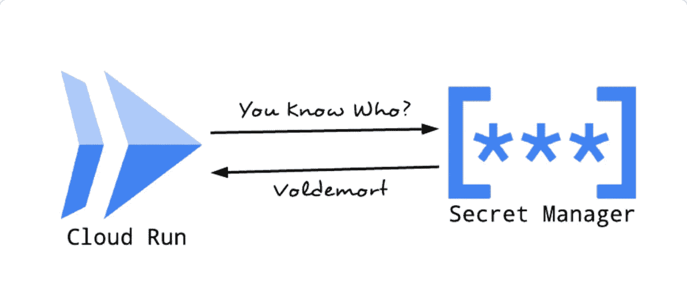
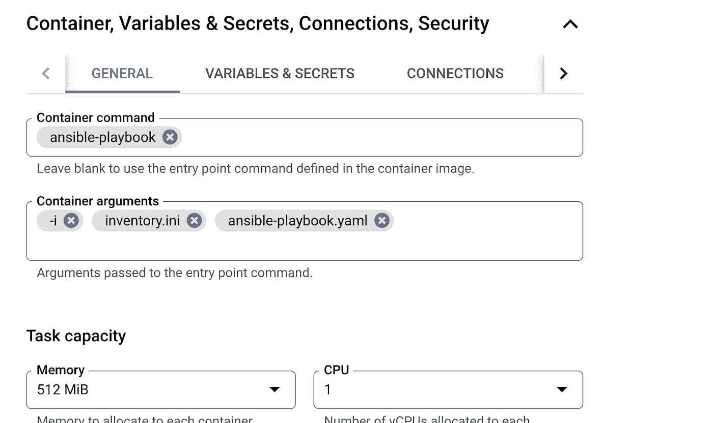

# 在云运行中管理装载的 SSH 密钥的权限

> 原文：<https://medium.com/google-cloud/managing-permissions-on-mounted-ssh-keys-in-cloud-run-707f7fbf6a21?source=collection_archive---------2----------------------->



# 概述:

CloudRun 是谷歌的托管计算平台，让你可以直接在谷歌的可扩展基础设施上运行和扩展容器。这份特殊的文档可能会对那些试图使用 SSH 密钥(通过[Google Secrets Manager(GSM)](https://cloud.google.com/secret-manager/docs)上传)将运行在 CloudRun 上的应用程序连接到其他服务的人有用。例如，连接到虚拟机的脚本、连接到数据库的应用程序等。我试图在一个 GCE 上执行一个用例来执行 ansible 脚本，并且遇到了更改已挂载 SSH 密钥的权限的特殊问题。本文档包含将 ansible 连接到 GCE 所执行的详细步骤，并为与 ansible 一起使用的已安装 ssh 密钥所出现的主要阻塞提供解决方法。

默认情况下，Ansible 希望在执行脚本之前有一个从主节点到远程节点的 SSH 连接。ssh 连接可以通过多种方式执行，比如手动将私钥添加到主节点，使用 ssh-agent，或者将私钥保存在机器上，并使用*ansi ble _ ssh _ private _ key _ file*标记从脚本中引用它。在 GCP，遵循最佳安全实践，总是建议使用 Secrets Manager 将密钥存储和挂载到在 Cloud Run 中运行的容器。

# 步骤:

本节包含为解决和克服此问题而执行的所有步骤的详细信息。这个用例可以在高层次上划分为以下步骤，

*   用脚本创建图像。
*   从 CloudRun 和 VM 创建网络连接。
*   管理 CloudRun 中的密钥。
*   管理挂载的密钥以匹配 ansible 的权限。

# 使用脚本创建映像:

从 docker-hub 使用了安装了 ansible 的 ubuntu 映像。对于这个 POC，使用了一个简单的 ansible 脚本来创建一个示例文本文件。以下是用于此用例的所有文件的片段，

库存. ini 文件:

```
{ 
[targets]
{internal-ip of VM}     ansible_connection=ssh        ansible_user={user-name}   ansible_ssh_common_args='-o StrictHostKeyChecking=no' ansible_ssh_private_key_file={secret-key-path}
}
```

ansible-playbook.yaml:(在目标虚拟机中创建一个空的文本文件)

```
- name: To change the permissions of key file in container
  hosts: localhost
  tasks:
    - name: execute the local script to change permissions
      script: /home/before_script.sh
      register: log

    - debug: var=log  

- name: This is a hello-world example
  hosts: {internal-ip of VM}
  tasks:
    - name: Create a file called '/tmp/testfile.txt' with the content 'hello world'.
      copy:
        content: hello world
        dest: /tmp/testfile.txt
```

before_script.sh

```
mkdir -p /root/secrets
chown -R {username}:{username} /root/secrets
chmod 755 -R /root/secrets
cp /mount/{secret-key mounted} /root/secrets/cr-ansible-key
cat /root/secrets/cr-ansible-key
chmod 600 /root/secrets/*
```

docker 映像一旦创建，就会被推送到 google 容器注册表中，CloudRun 可以使用该映像来执行作业。要将容器映像推送到 gcr 中，创建并下载 service-account.json 文件，该文件具有连接到 gcr 的权限，并设置 docker 使用此服务帐户来推/拉映像。根据 GCR 标准标记新图像，并将图像推送到 gcr 存储库。([从 gcr 推/拉图像](https://cloud.google.com/container-registry/docs/pushing-and-pulling))。以下命令用于连接 gcr 和推/拉映像。

```
** to save changes made to the running container ** 
Docker commit $containername (this will create a new image)

** connect to gcr using docker **
docker login -u _json_key --password-stdin https://gcr.io < account.json

** push/pull images into gcr ** 
docker tag ${imagename according to gcr std}
docker push ${imagename}
```

# 创建连接和云运行作业执行:

要将 CloudRun 与 VM 连接起来，需要在与 VM 相同的 VPC 和区域上创建一个[无服务器 VPC 访问连接器](https://cloud.google.com/vpc/docs/configure-serverless-vpc-access)。CloudRun 作业使用这个连接器来建立从作业到 VM 的网络连接。

通过运行 ssh-keygen 命令创建私钥和公钥。将私钥保存为 [Google Secrets Manager](https://cloud.google.com/secret-manager/docs) 下的密钥，并将公钥添加到 SSH 元数据部分下的 VM 中。该元数据自动将公钥添加到虚拟机内部的 authorized_keys 文件下，用于 ssh 连接。在云运行服务下，打开云运行作业并创建新作业。(注意:Ansible containers 只能作为作业部署，因为云运行服务要求应用程序监听某个端口——主要用于 web 应用程序。)

选择容器映像、区域(必须与 VPC 连接器相同)，在 General 选项卡下，传递参数以在内部运行 ansible-playbook(下面提供了屏幕截图)，引用在 Variables & Secrets 选项卡下作为秘密添加的 ssh-key，并将创建的连接器添加到 Connections 选项卡下的 connect to the VM。



CloudRun 作业中入口点的参数

# 管理装载的密钥以匹配 ansible 的权限:

在执行作业时，它抛出以下错误，

```
“fatal: [#.#.#.#]: UNREACHABLE! => {"changed": false, "msg": "Failed to connect to the host via ssh: Warning: Permanently added '#.#.#.#' (ED25519) to the list of known hosts.\r\n@@@@@@@@@@@@@@@@@@@@@@@@@@@@@@@@@@@@@@@@@@@@@@@@@@@@@@@@@@@\r\n@ WARNING: UNPROTECTED PRIVATE KEY FILE! @\r\n@@@@@@@@@@@@@@@@@@@@@@@@@@@@@@@@@@@@@@@@@@@@@@@@@@@@@@@@@@@\r\nPermissions 0444 for '/mount/cr-ansible-key' are too open.\r\nIt is required that your private key files are NOT accessible by others.\r\nThis private key will be ignored.\r\nLoad key \"/mount/cr-ansible-key\": bad permissions\r\n{username}@#.#.#.#: Permission denied (publickey).", "unreachable": true}
”
```

当我们尝试从脚本中引用挂载的密钥时，它不能按预期从 ansible 工作，因为 Cloud Run 将密钥挂载为具有 0444 权限的只读文件，ansible 预计密钥具有 0600，并抛出一个错误，指出私钥具有太多的打开权限。

为了克服这个错误，为用户创建了一个具有必要权限的文件夹— 0600，并将挂载的 ssh-key 复制到这个文件夹中。复制到该文件夹中的键现在在 ansible-script 中被引用，ansible-script 执行时没有出现上述错误。这由在 ansible-playbook.yaml 中的主要 ansible 任务之前运行的 before_script.sh 来执行。

这个用例是为通过 secret manager 安装密钥而编写的。然而，可以通过将密钥作为环境变量(可能导致安全问题)直接传递到脚本中或者通过点击 Google Security Manager api 直接访问密钥来传递密钥。