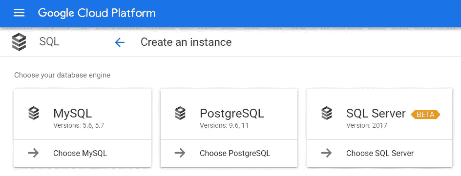
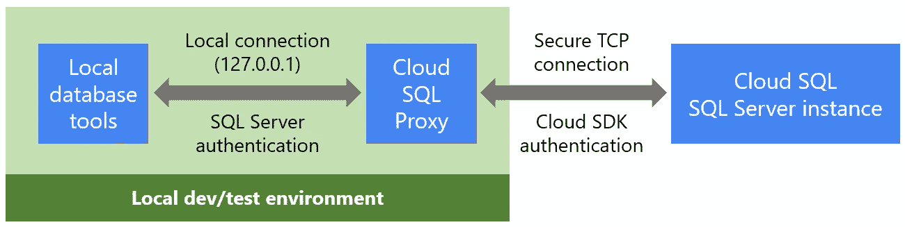
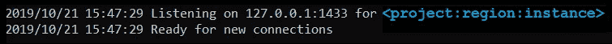
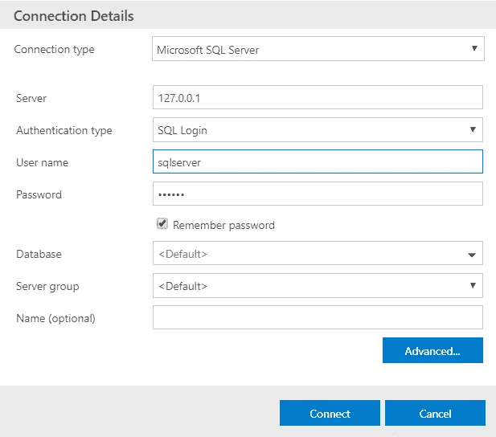
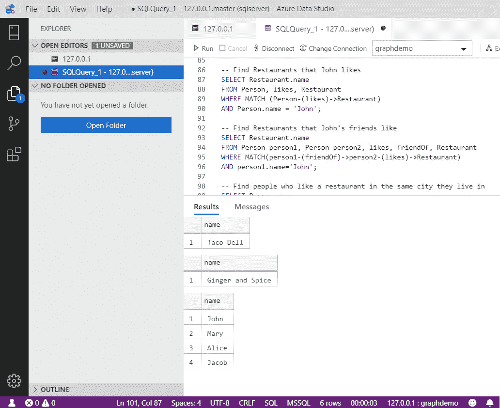
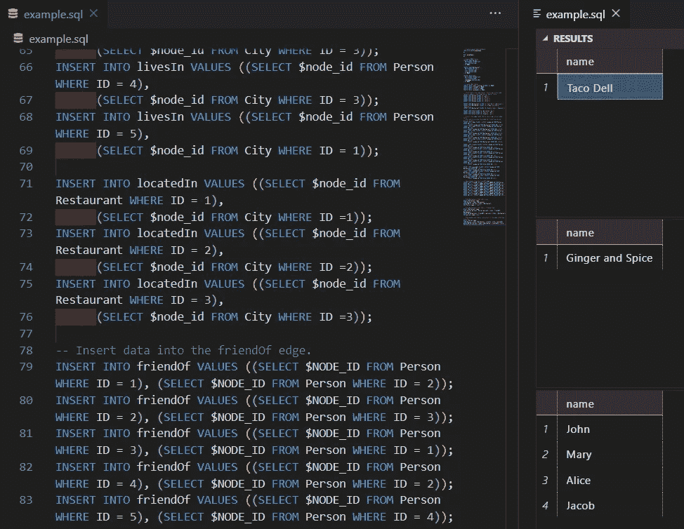
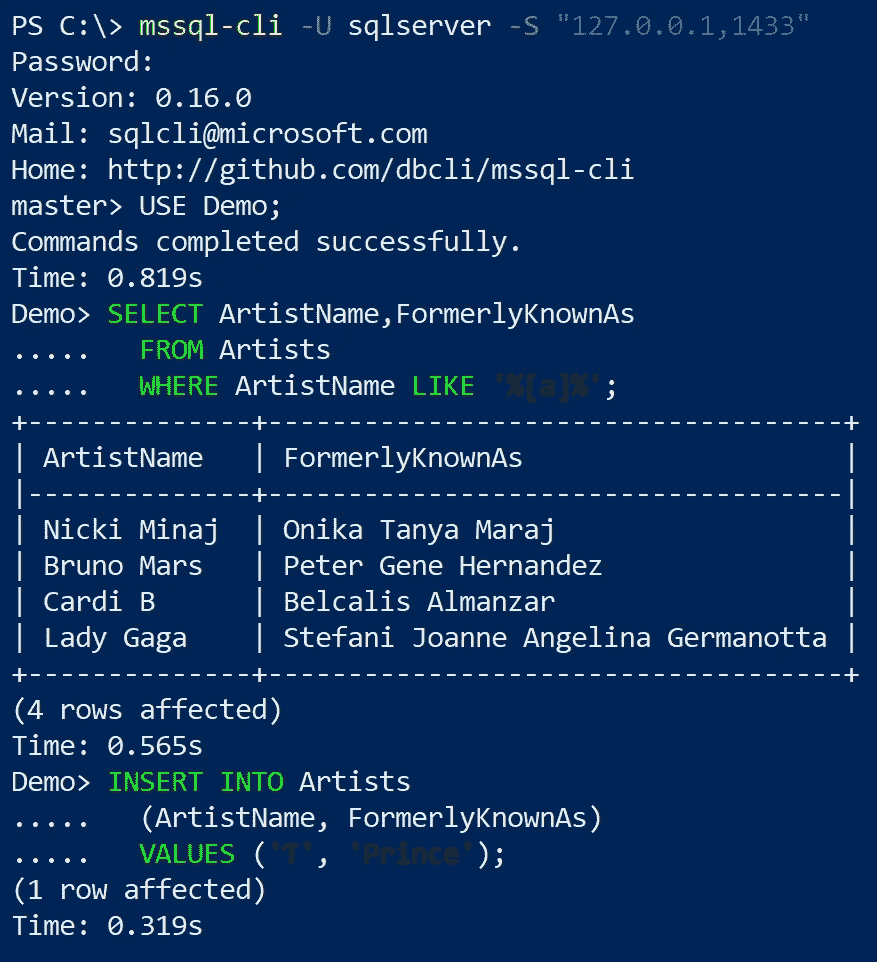

# 在云 SQL 中管理 SQL Server 实例

> 原文：<https://medium.com/google-cloud/managing-sql-server-instances-in-cloud-sql-ecee1e48aa4e?source=collection_archive---------2----------------------->


SQL Server 现已在云 SQL 上推出[公测版](https://cloud.google.com/blog/products/databases/leave-no-database-behind-with-cloud-sql-for-sql-server)，让您可以轻松地将 SQL Server 工作负载迁移到 Google Cloud。云 SQL 是一种完全托管的数据库服务，可处理自动备份、安全补丁、高可用性和更新，为内部托管提供了一种成本更低、复杂性更低的替代方案。



**云 SQL 为 MySQL、PostgreSQL 和 SQL Server 提供数据库引擎**

有许多数据库工具[可以与云 SQL 中的 SQL Server 实例一起使用。例如,](https://en.wikipedia.org/wiki/Comparison_of_database_tools)[云 SQL for SQL Server 的快速入门](https://cloud.google.com/sql/docs/sqlserver/quickstart)带您了解如何创建一个实例并从[SQL Server Management Studio](https://docs.microsoft.com/en-us/sql/ssms/download-sql-server-management-studio-ssms?view=sql-server-ver15)(SSMS)连接到它，这是一个用于管理 SQL Server 数据库的 Windows 应用程序。

在这篇文章中，我们将看看如何在云 SQL 中将四个流行的数据库工具连接到您的 SQL Server 实例。无论您喜欢使用哪种工具来运行 T-SQL 查询和执行常见的数据库管理任务，您都可以将它们与云 SQL 一起使用。

# 云 SQL 代理

[云 SQL 代理](https://cloud.google.com/sql/docs/mysql/sql-proxy)是连接到云 SQL 实例的推荐方式，因为它提供了改进的安全性和认证管理。代理的 TLS 加密连接比内置 SSL 更安全，它使用 IAM 身份验证和[选项来提供凭证](https://cloud.google.com/sql/docs/mysql/sql-proxy#invocation)以支持各种开发和部署场景。该代理适用于客户端应用程序，例如本地安装的数据库管理工具，而使用代理进行本地测试的[快速入门](https://cloud.google.com/sql/docs/sqlserver/quickstart-proxy-test)概述了如何安装和配置它以用于 SQL Server 实例。

代理运行在本地机器上，通过安全的加密连接管理进出云 SQL 的流量。数据库工具等应用程序可以在`127.0.0.1`本地连接到代理。



**使用云 SQL 代理将数据库工具连接到 SQL Server 实例**

云 SQL 代理需要凭证来认证到云 SQL 的连接，在[云 SQL 代理文档](https://cloud.google.com/sql/docs/mysql/sql-proxy#invocation)中有几个选项。使用本地数据库工具时，最简单的认证方式是使用来自经过认证的云 SDK 客户端的[凭证，因此我们将使用这种方法。安装](https://cloud.google.com/sql/docs/mysql/sql-proxy#gcloud) [Cloud SDK](https://cloud.google.com/sdk/) 并运行`gcloud auth login`命令，您将准备好与代理连接，而无需授权 IP 地址或配置 SSL 连接。

当您启动代理时，使用`-instances`参数为您的云 SQL 实例指定实例连接名称。要找到您的实例的连接名称，请单击[云 SQL 实例列表](https://console.cloud.google.com/sql/instances)中的实例，然后查看 Overview 选项卡下的内容。当您在代理命令行上使用该连接名称时，您需要添加端口 1433(SQL Server 连接的默认端口)，因此代理命令行如下所示:

```
cloud_sql_proxy.exe -instances=<connection-name>=tcp:**1433**
```

您还可以使用代理连接到多个云 SQL 实例。在这种情况下，您需要为每个实例分配不同的 TCP 端口。例如，下面是连接到两个云 SQL 实例的语法，第一个在端口 1433 上，第二个在端口 1434 上:

```
cloud_sql_proxy.exe -instances=<connection-name1>=tcp:**1433**,<connection-name2>=tcp:**1434**
```

大多数面向 SQL Server 的数据库工具默认使用端口 1433，因此您需要显式指定端口 1434 来将本地客户端连接到该示例中的第二个实例。

当您从命令行调用代理时，您可能会发现让它在单独的终端会话中运行很有用，这样您就可以在当前会话中继续工作。在 Linux 或 Mac OS 上，您可以简单地在 Bash 命令的末尾添加一个`&`,在一个单独的子 shell 中启动代理。在 Windows PowerShell 中，使用以下语法在单独的进程中启动代理:

```
Start-Process -filepath “cloud_sql_proxy.exe” -ArgumentList “-instances=<connection-name>=tcp:1433”
```

在代理运行之后，您看到“准备好新连接”消息，您已经准备好使用本地数据库工具连接到云 SQL，或者从本地运行的您自己的代码连接。



**云 SQL 代理，监听 127.0.0.1:1433 的新连接**

# Azure 数据工作室

[SQL Server quickstart](https://cloud.google.com/sql/docs/sqlserver/quickstart) 讲述了如何连接 SSMS，这是在 Windows 上工作的 SQL Server 数据库管理员的普遍选择。 [Azure Data Studio (ADS)](https://docs.microsoft.com/en-us/sql/azure-data-studio/download?view=sql-server-ver15) 是微软的另一个管理 SQL Server 数据库的工具，它适用于 Windows、macOS 和 Linux。如果你不确定使用哪个工具，微软有一个 SSMS 和 ADS 的功能对比，可能会有帮助。注意，SSMS 是基于 Visual Studio 的，而 ADS 是基于轻量级的 VS 代码编辑器的，所以 ADS 比 SSMS 加载得更快，对于习惯于使用 VS 代码的开发人员来说会更熟悉。

要试用它，从[下载页面](https://docs.microsoft.com/en-us/sql/azure-data-studio/download?view=sql-server-ver15)安装 Azure Data Studio。确保云 SQL 代理正在运行(如前所述)，然后在 ADS 中连接到`127.0.0.1`作为服务器，并使用 SQL 登录作为身份验证类型。



**从 Azure Data Studio 连接到云 SQL 代理**

连接后，您可以编写和运行 T-SQL 查询，并使用 ADS 的所有其他功能。例如，如果您想了解 T-SQL 的 MATCH 子句如何与图形数据库一起工作，您可以从[文档页面](https://docs.microsoft.com/en-us/sql/relational-databases/graphs/sql-graph-sample?view=sql-server-ver15)复制 T-SQL 脚本，并将其粘贴到 ADS 中并运行它。以下是输出结果:



**在 Azure Data Studio 中运行的图形数据库模式匹配示例与云 SQL 中的 SQL Server 实例进行比较**

# VS 代码的 mssql 扩展

如果您正在使用 VS 代码， [mssql 扩展](https://marketplace.visualstudio.com/items?itemName=ms-mssql.mssql)提供了代码完成、大型代码片段库和其他工具，使得编写和运行 T-SQL 脚本变得容易。

要使用 mssql 从 VS 代码进行连接，请按照下列步骤操作:

1.  安装 [mssql](https://marketplace.visualstudio.com/items?itemName=ms-mssql.mssql) 扩展
2.  创建一个脚本作为一个`.sql`文件。这个脚本中有什么并不重要，但是为了连接到数据库，脚本文件需要有焦点。
3.  安装扩展后首次创建脚本文件时，将会打开一个终端窗口来初始化 SQL tools 服务。让这运行到完成。
4.  转到命令面板(Ctrl-Shift-P)并键入`sqlcon`，然后选择`MS SQL: Connect`，系统会提示您创建一个连接。使用`127.0.0.1`作为服务器名，选择 SQL Login 作为身份验证类型，并输入您的用户名和密码。
5.  为连接命名后，它将连接到您的数据库。

一旦连接上，您就可以在编辑脚本时使用 Ctrl-Shift-E 来运行脚本。脚本输出将显示在脚本右侧的面板中。



**运行在云 SQL 实例上的脚本示例，来自 VS 代码，带有 mssql 扩展**

有关使用 mssql 扩展的详细信息，请参阅[使用 Visual Studio 代码创建和运行 Transact-SQL 脚本](https://docs.microsoft.com/en-us/sql/linux/sql-server-linux-develop-use-vscode?view=sql-server-ver15)。

# mssql-cli 实用程序

用于 SQL Server 的 mssql-cli 命令行查询工具是一个跨平台的 cli，用于针对 SQL Server 实例运行 T-SQL 命令和脚本。有关如何在 Linux、Windows 或 Mac OS 上安装的信息，请参见[安装指南](https://github.com/dbcli/mssql-cli/blob/master/doc/installation_guide.md)。

安装 mssql-cli 后，使用以下语法连接到本地云 sql 代理:

```
mssql-cli -U <username> -S “127.0.0.1,1433”
```

请注意，mssql-cli 使用逗号来分隔主机地址和端口，而其他一些工具使用冒号。



**mssql-cli 提供语法高亮、T-SQL 智能感知和多行编辑模式**

# 入门指南

云 SQL 很容易上手，SQL Server 的测试版现已公开，任何人都可以试用。您可以在 [Cloud SQL for SQL Server 文档](https://cloud.google.com/sql/docs/sqlserver/)中找到快速入门、操作指南、API 文档和其他资源。如果你是谷歌云平台(GCP)的新手，[注册](https://cloud.google.com/free-trial/)并获得 300 美元的信用，你可以使用云 SQL 和其他 GCP 服务。

您可以使用云 SQL 代理来连接您喜欢的数据库管理工具，如上所述，因此您可以使用您已经知道的工具来管理云 SQL 实例。有关于使用云 SQL 的问题吗？请在下面的评论中告诉我们，或者查看[支持页面](https://cloud.google.com/sql/docs/sqlserver/getting-support)了解其他支持选项。如果您将参加在西雅图举行的 SQL Server PASS 峰会，请务必在 Cloud SQL 展台停下来与团队见面，并观看 Cloud SQL 的实际应用！