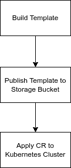

# 使用 Kubernetes 配置连接器管理数据流作业

> 原文：<https://medium.com/google-cloud/managing-streaming-dataflow-job-using-kubernetes-config-connector-cb6422b770ac?source=collection_archive---------1----------------------->

Kubernetes 配置连接器(KCC)是一个开源插件，允许我们通过 Kubernetes 管理 GCP 资源，从而将其作为基础设施代码保存。每当通过集群应用更改时，配置连接器定制资源(CR)将创建和管理 Kubernetes 资源。Kubernetes 配置连接器，支持各种 Google 云资源，如 Dataflow、PubSub、Bigquery 等。

假设我们想要创建一个从 PubSub 到 Bigquery 的数据流作业，这将要求我们创建一组资源，如 PubSub 主题、Bigquery 表、存储桶，作为作业的临时路径，以及一个数据流作业。

这里有一个来自 Google Cloud 的关于如何使用 KCC 创建流作业的可用示例。

*   定义发布订阅主题

```
apiVersion: pubsub.cnrm.cloud.google.com/v1beta1
kind: PubSubTopic
metadata:
  name: dataflowjob-dep-streaming
```

*   定义 Bigquery 数据集和表

```
apiVersion: bigquery.cnrm.cloud.google.com/v1beta1
kind: BigQueryDataset
metadata:
  name: dataflowjobdepstreaming
---
apiVersion: bigquery.cnrm.cloud.google.com/v1beta1
kind: BigQueryTable
metadata:
  name: dataflowjobdepstreaming
spec:
  datasetRef:
    name: dataflowjobdepstreaming
```

*   创建一个存储桶

因为在这个例子中，我们希望在删除资源时确保存储桶被销毁，所以我们将`force-destroy`的注释设置为 true。

```
apiVersion: storage.cnrm.cloud.google.com/v1beta1
kind: StorageBucket
metadata:
  annotations:
    cnrm.cloud.google.com/force-destroy: "true"
  name: ${PROJECT_ID?}-dataflowjob-dep-streaming
```

*   创建数据流工作规范

以下示例将使用来自 Google 的可用公共模板创建一个数据流作业。我们使用我们已经在工作规范中定义的所有资源。由于这是一个示例，我们将`on-delete`注释设置为 cancel。然而，对于生产用途，我们希望确保首先处理所有数据，还有另一个值叫做`drain`。所有规格都可以在这个 YAML [规格](https://github.com/GoogleCloudPlatform/k8s-config-connector/blob/9f5538f382b0304b1a57a6c485b3d50b31d93eab/scripts/generate-google3-docs/resource-reference/generated/resource-docs/dataflow/dataflowflextemplatejob.md)中看到。一般来说，如果我们已经创建了一个模板，我们可以将它放入存储桶，并创建一个 YAML 规范，将该模板指向我们的模板。

```
 apiVersion: dataflow.cnrm.cloud.google.com/v1beta1
kind: DataflowJob
metadata:
  annotations:
    cnrm.cloud.google.com/on-delete: "cancel"
  labels:
    label-one: "value-one"
  name: dataflowjob-sample-streaming
spec:
  tempGcsLocation: gs://${PROJECT_ID?}-dataflowjob-dep-streaming/tmp
  templateGcsPath: gs://dataflow-templates/2020-02-03-01_RC00/PubSub_to_BigQuery
  parameters:
    inputTopic: projects/${PROJECT_ID?}/topics/dataflowjob-dep-streaming
    outputTableSpec: ${PROJECT_ID?}:dataflowjobdepstreaming.dataflowjobdepstreaming
  zone: us-central1-a
  machineType: "n1-standard-1"
  maxWorkers: 3
```

假设我们想要创建一个新的流作业，那么我们可以定义以下步骤来创建所述作业。



用于创建新流式作业的 CI/CD 定义。