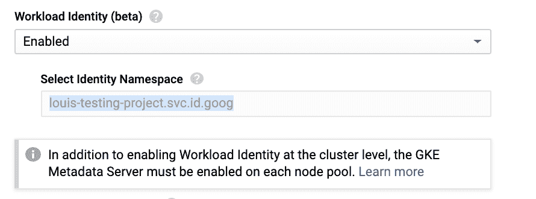

# 使用工作负荷标识将 Kubernetes 服务帐户映射到 GCP IAMs

> 原文：<https://medium.com/google-cloud/mapping-kubernetes-service-accounts-to-gcp-iams-using-workload-identity-b53496d543e0?source=collection_archive---------0----------------------->

## GKE 的 GCP 凭证管理变得简单多了

我们喜欢谷歌 Kubernetes 引擎(GKE)，但直到最近，我们还没有一个很好的故事，如何让我们的服务在 Kubernetes 上运行所需的谷歌云平台(GCP)的许可。

我们探索了一系列围绕 GCP 服务帐户凭证管理的工具——一路上利用了 Terraform、Vault、Kubernetes Secrets 和 KMS 加密凭证——但没有一个工具能给我们提供我们一直在寻找的干净、可扩展、短命的令牌解决方案。

我们真正想要的(也是我们多次要求的)是一种让 Kubernetes 服务账户充当 GCP 服务账户的方式 Google 现在终于通过 [**工作负载身份实现了这一点。**](https://cloud.google.com/kubernetes-engine/docs/how-to/workload-identity)

让我们看一个例子来说明这是如何工作的。

## 设置

*   我们有一个运行在服务帐户下的 GKE 集群:
    **gke-cluster-sa @ Louis-testing-project . iam . gserviceaccount . com**
*   我们有一个桶**GS://workload-identity-test**
*   我们有一个不同的服务帐户可以读取 bucket:
    **bucket-lister-sa @ Louis-testing-project . iam . gserviceaccount . com**

**目标:**在我们的 GKE 集群上运行的特定 pod 可以在我们的 bucket 中列出对象，而无需接触 GCP 服务帐户密钥或安装任何秘密。

## 以前事情是如何运作的

让我们尝试在不启用工作负载标识的情况下列出存储桶内容。

```
kubectl run -i -tty test1 -image gcr.io/cloud-builders/gsutil ls gs://workload-identity-test> AccessDeniedException: 403 gke-cluster-sa@louis-testing-project.iam.gserviceaccount.com does not have storage.objects.list access to workload-identity-test.
```

这里发生了什么？在 pod 中运行的 gsutil CLI 访问了节点的元数据端点，该端点返回了运行 node - **gke-cluster-sa** 的服务帐户的令牌。这个服务帐户没有权限读取存储桶，所以我们得到 403。

## 设置工作量标识

我们需要做的第一件事是在 GKE 集群上启用工作负载身份。



在集群编辑 UI 中静态定义的身份命名空间将 Kubernetes 服务帐户名称映射到用于身份和访问管理(IAM)绑定的虚拟 GCP 服务帐户句柄(下面将详细介绍)。

## 启用元数据服务器

元数据服务器在每个 GKE 节点上运行，并改变元数据端点的行为。这也保护了元数据端点，消除了对[元数据隐藏](https://cloud.google.com/kubernetes-engine/docs/how-to/protecting-cluster-metadata)的需要。让我们在默认节点池上启用元数据服务器。

```
gcloud beta container node-pools update default-pool \
 — cluster=workload-identity-test \
 — workload-metadata-from-node=GKE_METADATA_SERVER \
 — zone=us-central1-b
```

随着元数据服务器在我们的节点上运行，让我们看看现在尝试列出我们的 bucket 内容会发生什么。

```
kubectl run -i — tty test2 — image gcr.io/cloud-builders/gsutil ls gs://workload-identity-test> ServiceException: 401 Invalid Credentials
```

我们有进展了。随着元数据端点的加强，我们无法再检索运行节点的服务帐户的令牌，因此我们现在得到 401 错误，而不是 403。

## 创建并绑定 Kubernetes 服务帐户

让我们创建一个特别注释的 Kubernetes 服务帐户— *witest*

```
apiVersion: v1
kind: ServiceAccount
metadata:
  annotations:
    iam.gke.io/gcp-service-account: bucket-lister-sa@louis-testing-project.iam.gserviceaccount.com
  name: witest
  namespace: default
```

这里，我们在*默认*名称空间中定义了一个服务帐户 *witest* ，并且我们提供了一个注释，定义了我们想要映射到的 GCP 服务帐户。

接下来，我们需要将派生的虚拟 GCP 服务帐户句柄绑定到我们想要充当的真实 GCP 服务帐户。

```
gcloud iam service-accounts add-iam-policy-binding \
  --role roles/iam.workloadIdentityUser \
  --member "serviceAccount:louis-testing-     project.svc.id.goog[default/witest]" \
  bucket-lister-sa@louis-testing-project.iam.gserviceaccount.com
```

**service account:Louis-testing-project . SVC . id . goog【default/witest】**源自启用工作负载标识时定义的标识名称空间，以及我们绑定的 Kubernetes 服务帐户的名称空间和名称。

## 确认它有效

在配置好一切之后，让我们试着列出我们的 bucket 的内容。

```
kubectl run --serviceaccount=witest -i --tty test3 --image gcr.io/cloud-builders/gsutil ls gs://workload-identity-test> gs://workload-identity-test/success/
```

太棒了，这个工作很漂亮。我们能够列出桶的内容，但看不到任何长期令牌。这是一个巨大的特性，使我们的凭证管理和安全故事变得更好——感谢谷歌！