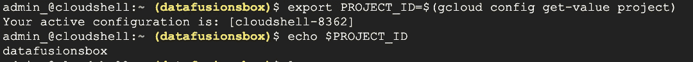

# Robyn 在 Vertex AI 上的营销组合建模

> 原文：<https://medium.com/google-cloud/marketing-mix-modelling-with-robyn-on-vertex-ai-9dab591cbf49?source=collection_archive---------0----------------------->

数字营销格局正在经历一场结构性转变。Cookieless 将扰乱我们如何衡量和理解数字广告投资的有效性。这就是为什么越来越多的营销人员和分析师转向统计建模，这不需要用户级的跟踪。一个流行的例子是**营销组合建模(** MMM)。

MMM 是一种技术，允许营销人员衡量其营销和广告活动的影响，并确定**各种渠道如何为其目标**(如销售收入)做出贡献。

Robyn(【https://facebookexperimental.github.io/Robyn/】)是可以帮助 MMM 分析的开源库之一。Robyn 是一个 R 库，本文的目标之一是展示**如何在 Vertex AI 上使用 Robyn 运行 MMM 分析:Google 的机器学习平台可作为 Google Cloud 上的一项服务。**

Robyn 的安装过程被很好地记录了下来，但是考虑到这个库还处于实验阶段，你会很容易地找到一些帖子和评论，这些帖子和评论都是人们在这里遇到问题时的抱怨。为了帮助您完成这一步，**我们还将展示如何构建 Dockerfile 定义，该定义考虑了运行基于 Robyn 的 R 脚本所需的所有依赖关系**。我们将使用 docker 文件实例化 **Vertex AI Workbench** 用于笔记本的交互实验，然后在 Vertex AI 无服务器 ML 基础设施上调度自动化 MMM 作业。

# 你为什么应该关心营销组合建模？

MMM 是一种成熟的方法，在数字时代之前，媒体公司已经对其进行了几十年的验证测试。对广告支出影响的简单思考可以是一个简单的线性模型，例如，销售额=权重 1 *渠道 1 +权重 2 *渠道 2 +基数。

但现实比这更复杂。有一个渠道饱和(收益递减)效应，这是一个渠道特有的。渠道在推动客户行动的快慢方面有所不同(也称为 adstock)。最后，你想要的结果是你的营销预算在渠道间的优化分配。

所有这些方面都是 MMM 技术的核心部分。在本文中，我们将向您展示 Robyn 如何处理这些机制，以及您如何在没有或只有极少统计建模背景知识的情况下，在 GCP 上运行和自动化该过程。

# 为什么要在 Vertex AI 上运行 MMM 分析？

当谈到机器学习时，谷歌被视为黄金标准，拥有世界一流的研究团队，如谷歌大脑、谷歌研究和深度思维，通过谷歌搜索、谷歌翻译和 TensorFlow、Kubeflow、Kaggle、Colabs、TPUs、Kubeflow、BERT、T5、ImageNet、Parti、LaMDA、PaLM 等多种贡献，仅举几例。

鉴于上述所有情况——谷歌的机器学习平台 Vertex AI，作为谷歌云上的一项服务，似乎至少值得一试。

有一点让 Vertex AI 不同于其他类似的平台:它是完全无服务器的——你可以通过 GPU 和 TPU 等各种加速器访问谷歌的 ML 基础设施，无需管理服务器、虚拟机、Kubernetes 集群，也无需安装和升级任何软件。

来源:[https://cloud . Google . com/blog/topics/developers-从业者/new-ml-learning-path-vertex-ai](https://cloud.google.com/blog/topics/developers-practitioners/new-ml-learning-path-vertex-ai)

第二个值得一提的是，Vertex AI 是一个端到端的 MLOps 平台。这是什么意思？这意味着它是一个单一的地方，您可以在这里管理功能，标记训练样本，使用您最喜欢的 ML 框架和语言(Python，R)运行训练，执行自动化超参数调整，实现和执行 MLOps 管道，在模型注册表中注册您的模型，运行无服务器批量预测作业，将您的模型部署为 REST 端点，并支持模型监控和预测的可解释性。

最后一点是，Vertex AI 将允许你建立完全定制的模型，但也将让你访问许多由谷歌设计的最先进的架构，并作为 AutoML 培训提供。在我们的下一篇文章中，我们将展示如何使用 Vertex AI AutoML 功能构建 MMM 管道，**,但在本文中，我们将展示 Vertex AI 也可以与任何第三方库一起工作。**

# 建立实验环境

Vertex AI Workbench 允许您使用 Jupyter 笔记本运行交互式分析。它有几个预构建的 Docker 映像，打包了用于不同 Jupyter 环境的必要库，如针对 NVIDIA GPUs 优化的 Python 3、TensorFlow(包括 TensorFlow Enterprise)、PyTorch、R 等。

尽管 Robyn 没有预构建的映像，但是没有什么可以阻止我们通过扩展 R 的现有映像并添加 Robyn 及其依赖项来构建自定义映像。这正是我们的计划:

*   首先，我们必须从为本文准备的 Dockerfile 定义构建一个定制的容器映像。
*   接下来，我们将前往顶点人工智能和顶点人工智能笔记本的新实例。我们将从自定义容器映像实例化该实例，这样我们就可以在交互式环境中运行 MMM 实验。
*   现在，我们有了运行一些 MMM 实验和学习 Robyn 基础知识所需的一切。我们实验的最终目标应该是一个可以自动执行的工作脚本，以计算新的预算分配建议。
*   一旦我们对我们的脚本感到满意——我们将能够使用相同的容器映像定期运行我们的 MMM 脚本，作为利用 Vertex AI 无服务器 ML 基础设施的 Vertex AI 自定义训练作业。

# 步骤 1:从 Dockerfile 构建一个容器映像

下面是一个 order 文件，它是我们多次反复试验的结果，我们保证拥有安装 Robyn 库所需的所有依赖项。

在 Google Cloud 上构建容器映像的最佳方式是使用 Cloud Build。然而，开始使用 Vertex AI 并不需要所有 DevOps 实践都到位；因此，我们将使用云壳，这是所有谷歌云控制台用户都可以使用的。

您可以通过执行以下命令从我们的 git 存储库中获取 docker file(Cloud Shell 已经安装了一个 Git 客户端):

> git 克隆[https://gist . github . com/a 63416348809d 36 b 46 c 185 FD 728d 8 F6 e . git](https://gist.github.com/a63416348809d36b46c185fd728d8f6e.git)

设置代表您的 GCP 项目 ID 的 PROJECT_ID 变量:

> export PROJECT_ID=$(gcloud 配置获取值项目)

列出可用文件夹。应该只有一个子文件夹。当你进入它时，你应该看到一个名为 Dockerfile 的文件。现在您需要运行 docker build 命令。我们将我们的 docker 容器映像命名为 *rrobyn，*，标签是*最新的(构建将花费 30 分钟，但您只需要做一次)*:

> docker**build**-t " gcr . io/$ { PROJECT _ ID }/rro byn:latest "。

构建过程完成后，将新创建的映像推送到 GCP 容器注册表:

> 码头工人**推**gcr.io/${PROJECT_ID}/rrobyn:latest

# 步骤 2:从自定义 docker 图像启动顶点 AI 笔记本

进入谷歌云控制台，使用搜索栏查找 Vertex AI 服务。点击左侧**工作台**，然后点击 **[+新笔记本】**按钮。您将看到一个预定义笔记本电脑环境类型的列表。在本文中，我们将从自定义映像设置笔记本环境；因此，选择**【自定义…】**选项。

您将被要求输入笔记本名称、地区和区域。Google Cloud 将使用这些详细信息在请求的地理位置创建相应的计算资源。您还可以在这里指定我们希望使用自定义图像:

因此，让我们指定我们的容器图像:

单击 Create，您应该会在列表中看到一个新的 Vertex AI 笔记本实例(您可能需要等待几分钟来准备好您的实例):

点击**【打开 JupyterLab】**按钮，将打开一个新的 JupyterLab 标签页。**选择 R 内核:**

导入 Robyn 库并打印其版本，以验证所有工作符合预期。

# 第三步:用罗宾做实验

Robyn 库让您从 MMM 的统计建模中概念化许多细节。

让我们仔细看看和 Robyn 一起做 MMM 时需要的关键步骤。我们希望它能帮助你更好地掌握如何使用这个库的一些基础知识。

典型流程如下图所示:

关键步骤是:

1.  数据导入
2.  超参数调谐
3.  罗宾造型
4.  建模输出解释
5.  预算分配

我们将按照官方文档中的[演示脚本](https://github.com/facebookexperimental/Robyn/blob/main/demo/demo.R)来完成这些步骤。

## 数据导入

Robyn 库附带了一个演示数据集。当然，在你的实验中，你会使用你的数据，但是如果你正在寻找一些其他来源的模拟数据，那么你可以看看谷歌的[聚合营销系统模拟器(AMSS)](https://github.com/google/amss) 。

要导入内置 Robyn 演示数据集，请运行以下说明:

下图显示了该数据集中的几个样本记录:

让我们仔细看看这个数据集，并从我们的输入数据中了解 Robyn 所需的格式。

**第 1 列—日期:**日期格式必须为年-月-日。取决于数据粒度(周、月等)。)值表示周期的第一天。

**第 2 列—收入:**在这里，我们可以选择您想要优化投资的任何内容，例如销售收入或转换次数

**第 3–8 列—要关联的渠道和非渠道数据:**这些数据或者是已花费的(即电视 _S)、印象(即 facebook_I)、点击(即 search_click_P)、上下文(即竞争对手 _ 销售 _B、事件)或者是有机的(即时事通讯)。把你认为可能影响你收入的媒体组合的所有方面，有机的和上下文。

然后将您的输入数据映射到 **robyn_inputs** 字段:

## 为变量转换选择超参数

Robyn 将对媒体支出数据的两个特征进行建模:

1.  Adstock(遗留效应)
2.  收益递减(饱和效应)

广告背后的想法是反映广告不会立即带来效果，通常需要一段时间，这就是所谓的**延续效应**。事实上，在观看电视广告和去零售店购买产品之间有一段时间。Robyn 给了我们两种方法可供选择:几何方法和更灵活的 Weibull 方法。如果你想了解更多这些方法，请查看[文档](https://facebookexperimental.github.io/Robyn/docs/features#variable-transformations)。在我们的例子中，我们将使用几何变换。

**收益递减，另一方面，****说明了一个事实，即我们在特定渠道上投资多少钱和投资将产生多少额外销售收入之间不存在简单的线性依赖关系。在一定程度上，这一渠道将会饱和，额外的资金在这里不会有太大的变化。在这里使用一些数字:假设将投资预算从 10 万美元增加到 15 万美元，会给我们带来 5 万美元的额外销售额，但从 15 万美元增加到 20 万美元只会带来 3 万美元的额外销售额。这些数字只是一个例子，但你明白了。这是一种媒体通道饱和的效果，Robyn 使用 SCurve 变换来模拟这种效果。**

**Adstock 和递减转换模型需要配置参数(theta 代表 adstock，alpha 和 gamma 代表递减收益)。您无法猜测哪个参数值最适合您的历史数据。幸运的是，这是通过超参数调整自动完成的。Robyn 使用 Nevergrad 优化库来寻找最佳匹配。在这个阶段你能做的是提供边界，定义 [Nevergrad](https://facebookresearch.github.io/nevergrad/) 应该寻找的搜索空间。[有关如何解释参数的更多信息，请参见官方文档。](https://facebookexperimental.github.io/Robyn/docs/features/)**

**显示完整的参数列表:**

**下面是一个示例，说明如何定义与我们演示数据集中每个单独字段相对应的参数边界:**

## **运行模型**

**在此阶段，我们已经具备了运行 Robyn MMM 建模所需的所有条件:**

**这一步会生成数千个模型。有些人会比其他人更好。通过帕累托前沿(红线)上的 NRMSE(归一化均方根误差:模型误差的度量)和分解 RSSD(距离平方和的分解平方根:给定模型有多不现实的度量)的维度来检查哪一个更好。帕累托前沿是多目标优化中相当流行的一个概念。它允许设计者将注意力限制在一组**有效的**选择上，并在这组选择中进行权衡，而不是考虑每个参数的全部范围。**

****

**Robyn 将从 **Pareto 前沿**中选择几个不同的模型，并为每个模型生成一份专门的报告。**

**下一步是手动检查这几个选定的模型。**为什么手动而不是自动化？**手动审核是必不可少的，因为你想根据你的商业知识/直觉来验证结果。毕竟这些只是模型。**

****

**Robyn 将尽可能提供帮助，并制作一份内容丰富的报告，用商业术语描述所选模型(“模型一页”):**

****

## **理解和解释结果**

**因此，你面前有一份 Robyn 制作的报告，你想知道这些漂亮的图表如何帮助你决定如何投资，以优化销售收入或转化率。让我们看看更好地理解这些图表会有什么帮助。让我们假设我们的投资预算应该用于优化销售收入。下面是由生成的图表解释的概念列表:**

*   ****归因:**有多少销售额归因于特定的渠道**
*   ****实际与预测:**模型在预测实际销售额方面有多好**
*   ****支出份额与影响份额(渠道的总投资回报率):**您在渠道上花费了多少预算，有多少支出归因于您的销售。在这里，您可以了解渠道的投资回报率，以及您是否在无效渠道上超支。**
*   ****反应曲线(收益递减):**了解哪些渠道有产生更多销售的空间**
*   ****拟合与残差:**了解我们是否遗漏了模型中的任何关键变化**
*   ****Adstock:** 了解给定渠道的投资对该渠道销售额的影响时间。这还将显示哪些通道往往转换得更快(数字通道通常转换得更快也就不足为奇了)。**

**您应该研究这些度量标准，并使用您的领域知识来拒绝一些被提议的不现实的模型。特别要注意收益递减，因为这里的错误会对预算分配产生很大影响。在这个回顾步骤的最后，你应该对你想继续使用哪个模型有信心。**

## **预算分配器**

**最后一步是用选定的模型回答下面的问题“我的广告费应该花在哪里”？这就是罗宾的预算分配器派上用场的地方。**

**Robyn 采用您的最佳模型，在付费广告渠道中生成最佳预算分配。为了生成建议，它使用基于梯度的非线性求解器。**

**创建预算分配建议的示例代码:**

**我们在这里使用了" **max_historical_response** "场景，它为与上一个周期相同的预算规模创建了一个优化的媒体组合:**

**Robyn 使我们能够在为我们计算分配建议时设置一些约束条件，这些约束条件应该由求解器(优化器)使用。在我们的例子中，我们使用了以下约束:**

*   ****channel_constr_low = 0.7** ，它指示优化器我们不希望每个通道的花费少于历史花费的 70%。**
*   ****channel_constr_up = c(1.2，1.5，1.5，1.5，1.5)** —指示优化器每个通道的最大支出增长。该顺序与表示我们的通道的输入参数的顺序一致。因此，在本例中，与该频道的历史支出相比,“tv_S”的最大预算被限制为 120%,而其他付费媒体的最高预算为 150%。**

**预算分配器生成可视化报告(如下)和表格 CSV 文件，其中包含新的优化媒体渠道支出组合。**

****

**生成的图形表示以下内容:**

1.  ****初始预算分配与优化预算分配** —显示优化支出占*总*媒体预算的百分比。**
2.  ****初始与优化平均响应** —预测每个渠道将推动多少销售(转化)。**
3.  ****响应曲线** —优化支出(三角点)如何定位在每个渠道的饱和度曲线上。**

# **步骤 4:自动化 MMM 分析**

**Vertex AI 笔记本非常适合实验，但一旦我们的入围模型脚本和使用该模型为下一阶段的预算分配生成建议的脚本准备就绪，我们希望定期运行它。然而，我们不想手动启动 Vertex AI Notebook 实例，然后在每次需要新建议时打开我们的脚本并执行其所有代码单元。**

**相反，我们希望安排该脚本的执行，并要求 Google Cloud 为我们运行它，例如，每周一下午 5 点，这样当我们在周二早上开始喝第一杯咖啡时，我们就可以在电子邮件中收到新的报告。**

**我们需要两个组件:**

*   **调度器，它将触发我们的脚本在一个重复的时间表上执行**
*   **我们可以在其上执行脚本的计算机**

**调度将由 GCP 调度程序处理:一个完全管理的企业级 cron 作业调度程序，它作为一个单一的玻璃面板，允许您从一个地方管理您所有的自动化任务。**

****

**Vertex AI 将处理计算，但这次我们不会使用 Vertex AI 笔记本。相反，我们将利用它的无服务器培训功能。无服务器意味着我们不关心底层基础设施——我们将**委托**执行:这里有我们的脚本；嘿顶点人工智能-执行它。**

**为了与 Vertex AI 通信，我们将使用它的 python SDK。因此，我们需要几行代码来与 Vertex AI 通信，并指示它我们要执行什么:**

**第 9–12 行将启动与 Vertex AI 的新会话(建立通信上下文)。**

**第 16 行是我们设置一个本地变量的地方，这个变量表示我们之前为 Robyn 构建的自定义 docker 图像的 URL。**

**第 18–22 行是我们指示 Vertex AI 我们想要在它的基础设施上执行什么的地方(这里，我们的脚本被命名为 mmmAnalysis。r)。**

**Vertex AI 将需要知道我们认为这项工作可能需要多少计算能力。我们需要为这些工作者提供一些工作者和一种类型的 VM 实例。(分别是第 25 行和第 26 行)。**

**第 28 行是我们发送作业并期望 Vertex AI 开始执行它的地方。**

****

**这段代码也需要一些计算。然而，在这种情况下，我们可以使用 Cloud Functions，这是一个用于这种单一用途功能的无服务器执行环境。**

# **总结:**

**在这篇文章中，我们展示了如何使用谷歌的机器学习平台 Vertex AI 来实验 Robyn 库进行营销组合建模。首先，我们共享了一个定制的 Docker 文件，其中包含了成功使用 Robyn 所需的所有依赖项。然后我们用 Vertex AI Workbench 编译的 Docker 图像建立了一个交互环境来运行一些实验，并了解媒体渠道和其他变量如何影响我们的销售收入。我们还能够通过 Vertex AI 定制训练作业自动化大部分过程，在 Vertex AI 无服务器 ML 基础设施上运行我们的脚本。自动化的结果是媒体预算分配器，它可以定期运行以生成下一周期的预算分配建议。**

**你的下一步是激活产生的见解和建议。自动化在这方面也有帮助，但是您可能还希望在最后一步中进行更多的控制，并且将人放在循环中。在这种情况下，您可能希望使用产生的见解和建议，并将它们放在 Google 的 Data Studio 或 Looker 的交互式仪表盘上，然后非技术决策者可以在您公司的媒体战略决策会议上使用它们。**

> *****本文由*** [***卢卡兹***](https://www.linkedin.com/in/lukasz-olejniczak-1a75a613/) ***和*** [***斯坦尼斯劳***](https://www.linkedin.com/in/stanis%C5%82aw-magierski-1258507/) ***合著。所表达的观点是作者的观点，不一定反映谷歌的观点。*****

**如果你喜欢这篇文章，请为它鼓掌。更多 google 云端数据科学、数据工程、AI/ML 关注我[***LinkedIn***](https://www.linkedin.com/in/lukasz-olejniczak-1a75a613/)***。*****