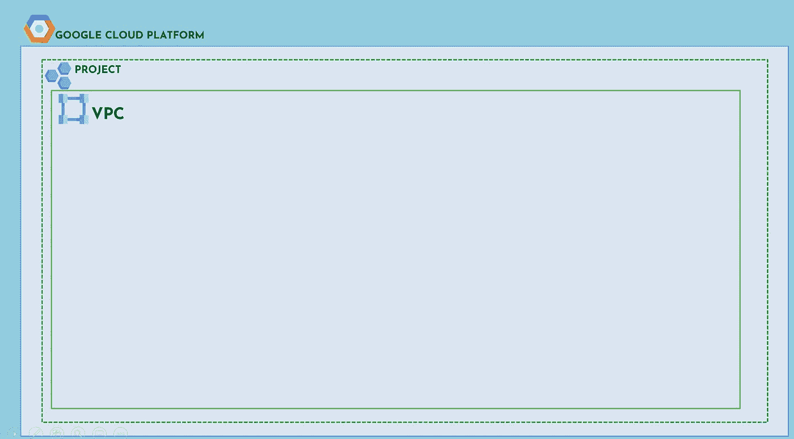
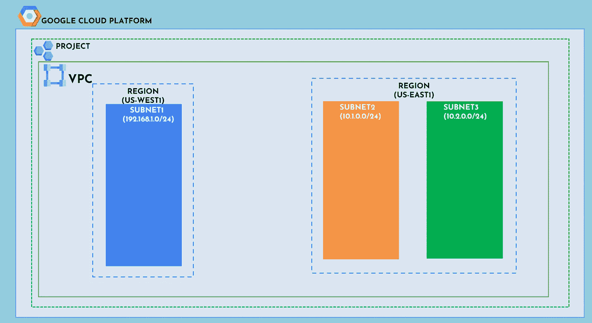
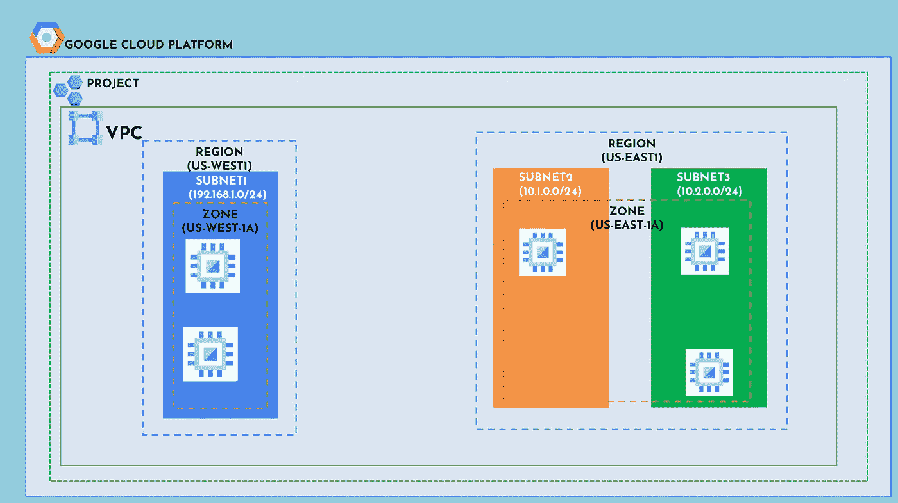
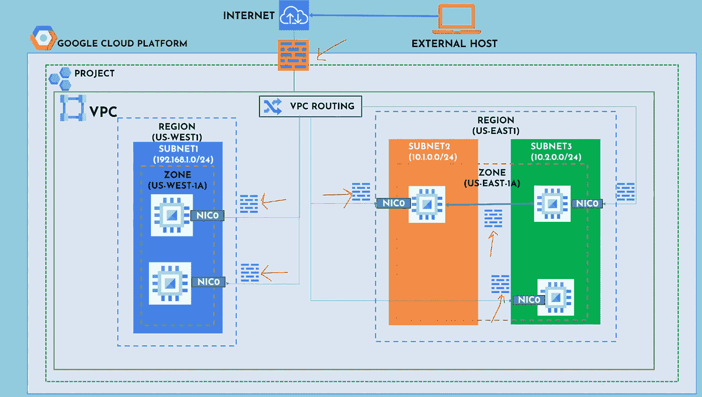
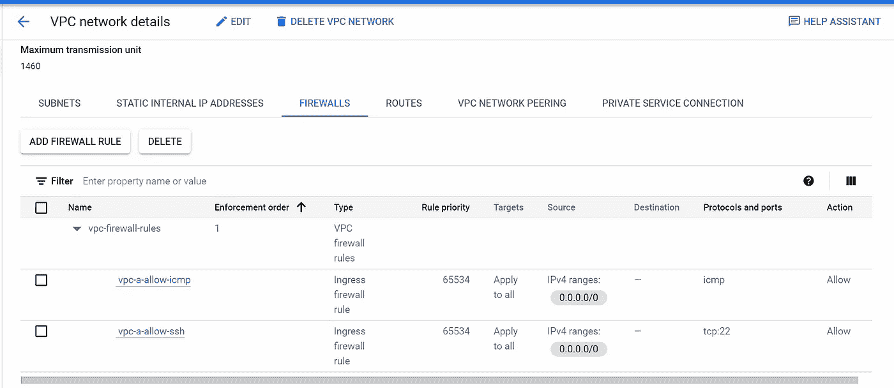

# 掌握 GCP 网络和 VPC:云工程师终极指南

> 原文：<https://medium.com/google-cloud/master-gcp-networking-and-vpc-the-ultimate-guide-for-cloud-engineers-db16338c9db0?source=collection_archive---------0----------------------->

在这个博客里，加入我吧🚀我将带您了解在谷歌云平台(GCP)上设置虚拟私有云(VPC)的基础知识。我将向您展示如何配置子网、防火墙规则和其他基本组件。想知道怎么做吗？🤷‍♀️

**什么是虚拟私有云:** VPC 网络是 GCP 上的逻辑隔离网络。你可以像看待物理网络一样看待 VPC 网络，只不过它是在谷歌云中虚拟化的。

什么是 VPC(虚拟私有云)

# **什么是子网？**

子网是区域性资源，有与之相关联的 IP 地址范围。子网不应有重叠的 IP 地址范围。请确保仔细选择子网范围。如果你想了解更多关于如何计算子网范围内的 IP 以及什么是子网掩码的信息，请随意查看我发布的[视频](https://youtu.be/G1azmL5-eQI)。如果子网中的 IP 地址后来耗尽，我们可以通过编辑来扩展子网范围。

GCP 有哪些子网

# 子网的重要性

在调配计算引擎实例时，您可以选择必须在其中进行调配的区域。选择区域意味着选择其区域，您为资源选择的区域决定了它可以使用的子网。因此，在本例中，当您在区域 us-west-1A 中调配两个 GCE 实例时，它会确定其区域在 US_WEST1 中，并将在属于 US-WEST1 的子网中进行调配。

同样，当您在美国东部-1A 地区置备实例时，它们将在美国东部-1 地区置备，并将成为子网 2 和子网 3 的一部分。一个区域是一个地理位置上的数据中心的集合，而一个地区是多个相距数英里的区域的集合。您将工作负载部署在多个区域中，以获得高可用性和容错能力。

在 VPC 中调配虚拟机实例

# 什么是防火墙规则，为什么它们很重要？

创建网络后，您可以[创建防火墙规则](https://cloud.google.com/vpc/docs/using-firewalls)来允许或拒绝网络中资源之间的流量，比如 VM 实例之间的通信。您还可以使用防火墙规则来控制进出互联网的 VPC 网络流量。

**下面的防火墙规则示例允许来自所有来源的 ICMP 和 SSH 流量进入。**

*   类型表明它是入口(入站)规则还是出口(出站)规则。
*   规则优先级定义应该首先评估哪个规则，数字越小，优先级越高。例如，优先级为 1000 的防火墙规则将在优先级为 65535 的规则之前被评估。
*   目标定义规则是应用于单个实例、多个实例还是网络中的所有实例。这里可以使用网络标签来选择多个实例。
*   Source 表示允许/拒绝流量的入站源 CIDR 范围。
*   在出口规则的情况下，目的地被填充，并表示目的地 CIDR 范围。
*   协议和端口定义允许/拒绝流量的端口，例如 SSH 的端口 22、HTTP 的端口 80 等等。
*   操作是允许或拒绝。

防火墙规则示例

🙏感谢您到目前为止跟随教程。如果你觉得这个博客有帮助，请不要忘记给它一两个掌声。如果你想了解我未来的内容，一定要关注我，并考虑订阅我的 YouTube 频道。祝您好运👍在您的 GCP 学习和认证之旅中，如果您有任何问题或需要额外的支持，请不要犹豫。

🎯不要错过观看 VPC 概念实施的机会！观看我们的 YouTube 视频，了解如何使用所有必要的网络组件设置 VPC，并更好地了解它们是如何协同工作的

**参考文献📚:**

【https://mxtoolbox.com/subnetcalculator.aspx[https://cloud.google.com/vpc](https://cloud.google.com/vpc)[https://cloud.google.com/vpc/docs/overview](https://cloud.google.com/vpc/docs/overview)[https://cloud.google.com/vpc/docs/subnets](https://cloud.google.com/vpc/docs/subnets)[https://cloud.google.com/vpc/docs/firewalls](https://cloud.google.com/vpc/docs/firewalls)[https://cloud.google.com/vpc/docs/add-remove-network-tags](https://cloud.google.com/vpc/docs/add-remove-network-tags)