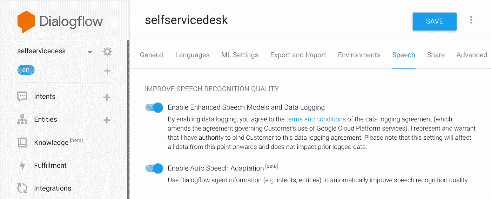
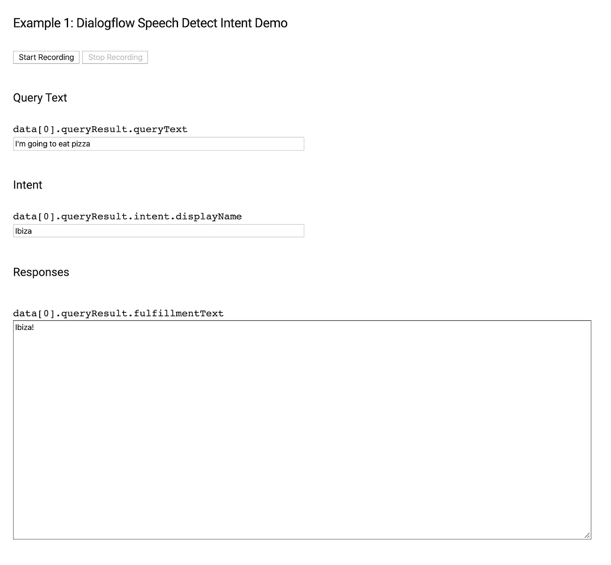
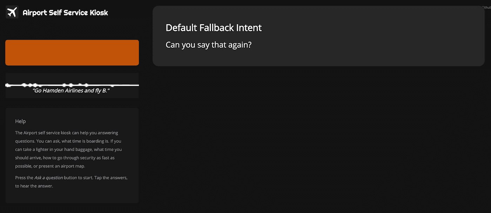
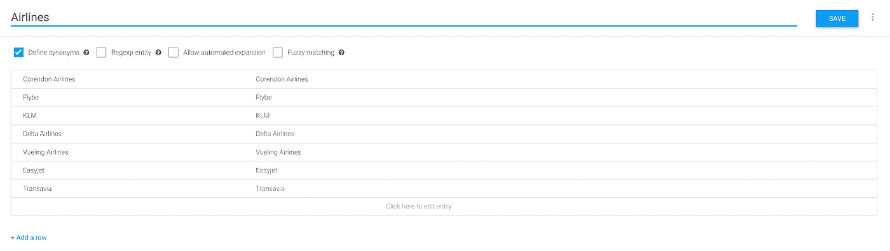
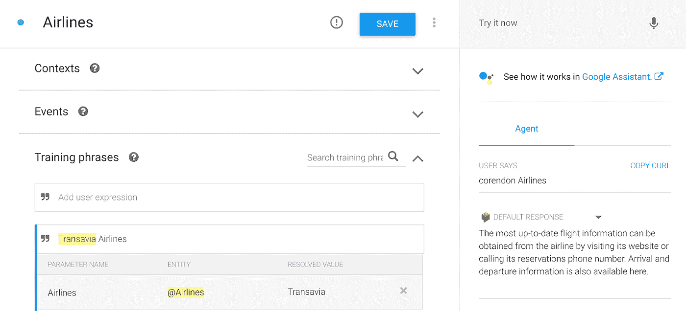
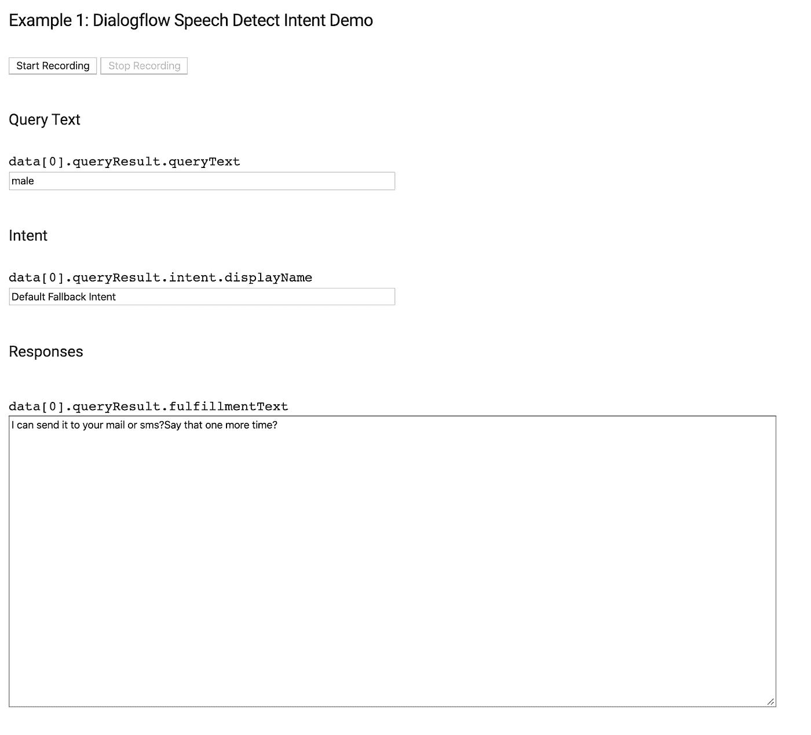
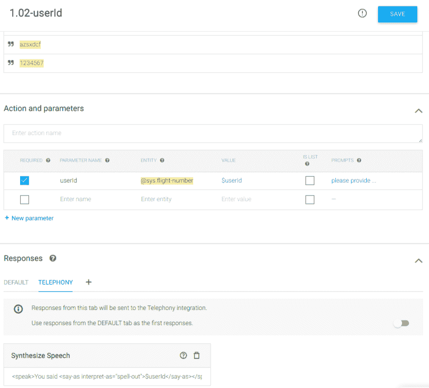
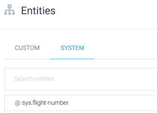
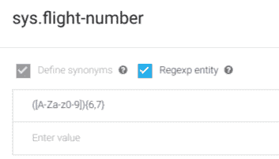

# 掌握语音代理在 Dialogflow 中的自动语音自适应

> 原文：<https://medium.com/google-cloud/mastering-auto-speech-adaptation-in-dialogflow-for-voice-agents-25d5b65a1cf9?source=collection_archive---------1----------------------->

*自动语音适配通过有效地将上下文添加到您的对话中，提高了 Dialogflow 语音代理的语音识别准确性。*

在荷兰，我们有一个名为“Mama Appelsap*”的广播节目。它取笑歌词中的听错和曲解短语。这种现象的另一个词是 T2 蒙德格林。Mondegreens 通常是由一个人在听一首诗或一首歌时创作的；听者无法清楚地听到歌词，就用听起来相似并有某种意义的词来代替。你可以在 Youtube 上找到各种各样的 mondegreens，比如[克里登斯清水复兴合唱团的歌曲《坏月亮升起》](https://www.youtube.com/watch?v=w6iRNVwslM4)。你可能听说过。除了听到“有一个坏月亮正在升起”，你还可以听到:“右边有一个浴室”。(事实上，听过一次之后，就很难再听下去了。)

当我们谈论语音机器学习模型时，语音到文本模型已经由大数据集训练。基于之前听到的音频示例，它会尝试匹配文本短语。也就是说，听不到语音不仅对人类来说很难，对机器来说也很难。然而，我们可以通过提供提示来偏向机器学习模型。在 Dialogflow 中，构建语音代理的时候，其实就是这么简单；您只需启用**自动语音适配开关**，该开关可在**设置>语音**选项卡中找到。意图和(标记的)实体将用作提示。

在写这篇文章的时候，这个特性还是测试版。如果您在设置面板中找不到语音标签，您需要首先启用测试版功能。这可以在**设置>常规**选项卡中找到:

一旦您启用了自动语音适配，您就可以构建您的 Dialogflow 语音代理来利用它。

您可以通过使用麦克风在模拟器中测试它，或者如果您是开发人员，我建议您使用我的 Dialogflow 语音识别示例，因为它将为您提供更多的调试信息。

为了获得最佳结果，您还需要启用增强模型:

[https://cloud.google.com/dialogflow/docs/data-logging](https://cloud.google.com/dialogflow/docs/data-logging)

**注意:自动语音适配不适用于 Google (Google Assistant)上的操作，因为使用 AoG 框架，语音识别是在将数据发送到 Dialogflow 之前由 Google 上的操作执行的。**

# 设置语音意图检测示例，使用浏览器的麦克风并从服务器运行 Dialogflow 脚本。

我创建了一些代码片段，您可以在浏览器中使用它们来使用笔记本电脑的麦克风。你可以说出一个用户的话语，它会匹配的意图。当您打开调试控制台时，您可以浏览结果并看到**查询文本、**捕获的口语文本对话流并转换为文本。

[按照自述文件步骤](https://github.com/dialogflow/selfservicekiosk-audio-streaming)，下载服务帐户密钥，设置 Dialogflow 并从示例文件夹运行“npm install”。完成后，您可以运行以下命令来运行脚本:

`npm --EXAMPLE=1 --PORT=8080 --PROJECT_ID=[your-gcp-id] run start`

当你浏览到 [http://localhost:8080](http://localhost:8080) 时，你会看到一个类似下面的屏幕，你可以通过在 Dialogflow 中创建示例来进行试验，这些示例与本博客中的示例相似。

# 语音适应示例

以下示例显示了如何通过对您的代理进行某些更改来改进语音识别:

# 自定义实体提示

如果您为公司提供的产品或服务名称定义实体，并且最终用户在发言中提到这些术语，它们更有可能被识别。

我创造了一个航空语音人工智能；[http://selfservicedesk.appspot.com/](http://selfservicedesk.appspot.com/)

如果没有启用语音适配，当我提到诸如**科伦登航空**或 **Flybe** 之类的航空公司时，它不会解释正确的名称:

但是，当启用语音适应时，我可以创建一个指向不同航空公司的自定义实体:

然后我可以创建使用 **@Airlines** 实体的意图。

接下来，当我在模拟器中测试(通过使用麦克风)“考兰登航空公司”时，它会明白我指的是哪家航空公司。

# 系统实体提示

前面的例子使用了定制实体。但我会和@sys.number 等**系统实体**做类似的工作，想想用户说“二”时的用户言语表达，可能会被识别为“对”、“太”、“2”或者“二”。或“四对五”、“四二五”、“四四二五”等。系统实体将被用作提示。

# 意图暗示

如果用类似“我们要去伊比沙岛”的短语来定义训练短语，类似的发音用户话语被可靠地识别为“我们要去伊比沙岛”而不是“我们要去吃披萨”。

# 在代码中重写语音提示

您还可以在代码中调整语音适应。当您通过 SDK 实现集成时，这很方便。在**输入配置**中提供显式 [**语音上下文**](https://cloud.google.com/dialogflow/docs/reference/rpc/google.cloud.dialogflow.v2beta1#google.cloud.dialogflow.v2beta1.SpeechContext) 将覆盖在 Dialogflow 控制台中由输入音频(语音到文本)配置的自动语音适配生成的隐式语音上下文提示。 **speechContexts** 接受一个对象，该对象包含一个由**短语[]** 组成的数组，其中包含语音识别器应该以较高的可能性识别的单词和短语。参见[云语音文档](https://cloud.google.com/speech-to-text/quotas)了解使用限制。

**speechContexts** 对象也可以接受一个可选的 **boost** (float)属性。与其他上下文相比，此上下文的提升:

*   如果提升是积极的，Dialogflow 将增加在这个上下文中的短语比相似发音的短语被识别的概率。
*   如果未指定提升或非正值，Dialogflow 将不会应用任何提升。

Dialogflow 建议您使用(0，20)范围内的提升，并找到一个适合您的二分搜索法用例的值。

注意: **phraseHints[]** 将被弃用。

在这里你可以找到一个例子。考虑以下聊天流程:

“我飞往罗马的 PNR 是多少？”

我可以通过邮件或短信发给你。

*【邮件】*

为了确保代理理解“邮件”而不是“男性”或“指甲”，我在代码中提供了 **speechContexts** :

语音上下文代码段

# 语音适应和支持正则表达式

目前语音识别还没有对内置的 [regex 实体](https://cloud.google.com/dialogflow/docs/entities-regexp)的内置支持。实体正则表达式规则对自动语音适应没有影响。用户表达式中可能需要字母数字序列，例如说出一个帐户 id。有了自动语音适应，你就可以解决这个限制。

此示例显示了如何识别用户话语中的帐户 id。帐户 id 是由字母和数字字符组成的 8 个字符串。例如:AA12BB34

使用以下条目创建以下两个实体:

**人物**

*   答，答
*   B，B
*   …
*   Z，Z

**数字**

*   0, 0
*   1, 1
*   …
*   9, 9

**账号 Id**

*   @ character @ character @ digit @ digit @ character @ character @ digit @ digit

使用 **@AccountId** 作为训练短语中的参数。

**注意:@AccountId 实体条目要求连续实体之间有空格，以便成为有效的实体定义。因此，用户话语“AB12CD34”不匹配，但是用户话语“A B 1 2 C D 3 4”匹配。这通常不是问题，因为用户说出的话语是用字母数字字符的空白填充来处理的。这意味着，一旦后端接收到 AccountId 参数，您就必须删除空白。像往常一样，应该在 webhook 中进行适当的验证。**

如果航班号(PNR)是 6 个字母数字的组合。我们可以有目的地利用系统实体 **@sys.flight-number** :

您可以从**实体>系统**页签自定义 **@sys.flightnumber** 。

这里我们将添加一个正则表达式来捕获正确的字符数:

在我们的例子中是 6 或 7 个字符，可以是大写或小写字符或数字:

**([A-Zaz0–9]){ 6，7}**

# 结论

自动语音适应通过有效地将上下文添加到您的对话中，提高了您的 Dialogflow 语音代理的语音识别准确性。在这篇文章中，我展示了一些语音机器人的例子。这个功能可以让代理的准确率提高 40%以上！

你可以想象，当你在 IVR 系统/联络中心使用语音代理时，这将是一个游戏改变者。到目前为止，IVR 还是相当基础的，用户体验是这样的，人们只是喊着像“和‘代表’说话”这样的触发短语来尽快逃离流程。Dialogflow & CCAI 希望帮助人们建立体验，帮助他们获得高质量的服务，而不需要他们重复自己。

有了 SpeechContexts，开发人员和对话式 UX 设计人员可以提供上下文并提升它来偏向模型。因此，微调对话中包含错误短语的可能性。最后，Google 将每个 API 请求的短语提示数量从 500 个增加到了 5000 个。

如果你想知道这个电台节目的名字是什么意思，它是迈克尔·杰克逊的歌曲《即将开始》的绿色世界。其中有一句话“妈妈色妈妈萨，妈妈酷萨”。不是荷兰语“Mama Appelsap ”,它在荷兰语中的意思是:苹果汁妈妈。