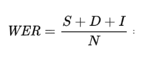
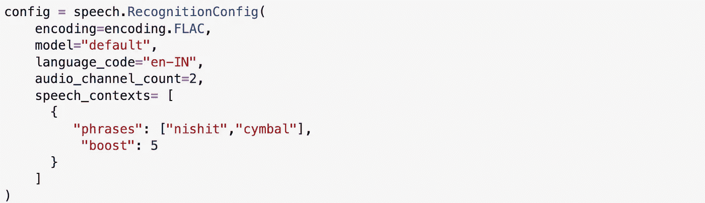

# 测量和提高语音到文本的准确性|谷歌云平台

> 原文：<https://medium.com/google-cloud/measuring-and-improving-speech-to-text-accuracy-google-cloud-platform-eba62c50b8ac?source=collection_archive---------1----------------------->

什么是语音转文本？

语音到文本(STT)或自动语音识别(ASR)是一种通过计算语言学将人类语音自动转换为文本的技术。

这是人工智能几十年来努力的关键领域之一，通过深度学习技术的突破性进展，尽可能接近人类的语音识别能力。

这些进步使得语音到文本在我们日常个人使用的电话、家庭应用到行业应用中得到采用，如呼叫分析和代理辅助、媒体字幕、临床文档、内容搜索等。

# **我们使用 STT 解决了什么问题？**

**问题陈述:**客户是一家资产管理公司，作为他们入职旅程和保单注册流程的一部分，他们录制了一段客户同意保单条款和条件的视频证词。如果将来出现利益冲突，这将被用作合法的可接受证据。作为对视频档案进行的合规性审计的一部分，发现了相当多的不合规之处，一些视频没有任何声音，一些视频不完整或缺少事实，一些视频有太多的背景噪音，难以理解客户在说什么。

**解决方案:**集团 IT 团队启动了一项计划，引入语音到文本的转录服务来转录客户的视频证明，并且只有在转录在捕捉关键事实方面是准确的情况下才批准和存储它。集团 IT 团队启动了该计划，但无法获得所需的准确性，于是联系了我们。

在这篇博客中，我们将看到我们如何使用 GCP 的语音到文本服务帮助客户测量和提高他们的语音到文本需求的准确性。

# ASR 和谷歌语音转文本！

在我们开始提高精度之前，有必要

1.  高度了解 ASR 系统的工作原理。
2.  我们如何衡量结果来改善它？

# **ASR —系统架构**

这是一个极其简化的图表，可以让您对系统有一个高度的了解。

谷歌语音转文本

该系统以 10-25 毫秒语音帧的形式接收用户的音频输入，以处理和开发所谓的**声学模型。**声学模型**查看音频波形或声谱图，并将这些波形转换成**音素**。**

一个**音素**是组成一个单词的特定语言中不同的声音单位。下面的例子显示了组成英语单词“five”和“four”的 3 个不同的音素。这些单词到音素的映射是由专家开发的，可以被认为是组成单词但使用语音的字母表的等价物。

这些音素单词预测然后被输入所谓的**语言模型**。

**语言模型**提供了一种解释特定语言的单词应该如何排序的方法，这些模型是通过对该特定语言的大量文本进行训练而开发的。语言模型查看音素的分组和系列，并尝试将输出转录为作为输出发送的一系列单词格。

所以，用一种非常简单的方式，这就是演讲如何被转录成文本。

# 测量:单词错误率(WER)

语音到文本的输出以**单词错误率(WER)** 来衡量，它是三种可能发生的转录错误的组合:

*   **插入错误** ( **I** ) —出现在假设抄本中但不出现在基本事实(人类抄写)中的单词
*   **替代错误** ( **S** ) —在假设和基本事实中都存在但没有正确转录的单词
*   **删除错误** ( **D** ) —假设中缺失但存在于基本事实中的词
*   **总字数(N)**——地面实况抄本总字数

**WER** 是通过将所有错误(S+D+1)相加，并除以地面实况抄本中的总字数(N)来计算的。因此，我们的目标是尽可能降低 wer。

# **测量和提高精度**

在此背景下，让我们尝试解决 AMC 客户的问题。我将使用以下事实来模拟记录的客户评价，并测试其准确性:

我想从 cymbal direct insurance 申请一份保证收入里程碑保单。我确认在 5 年内每年支付 50000 卢比的保险费。我住在孟买，地址是 400001 孟买堡 Alpine Regency Main Street 789 号，我的联系电话是 98211 65243，请将此视为我对处理申请的批准。”

# **迭代** — **1:检查当前配置和准确性**

以下是该小组正在尝试的 python sdk 代码:

**WER:** *绿色删除线文本是抄写中的错误，黄色高亮显示是基本事实文本。*

当前配置的 WER 极高，为 **37.88%** ，将整体 STT 精度降至 **60+%。**

# **迭代— 2:语言代码**

上述配置的一个关键问题是 **language_code=en-US。**谷歌语音转文本提供了 **125 多种语言**，其中包括这些语言在不同国家的**变体**。因此，对于英语来说，它提供了这些国家中英语的 40 多种变体。既然这是给印度客户的，那我们就把它改成印度版本吧。

印度-en-IN 的配置更新为英语

**WER:**WER 急剧下降至 10+%,仅通过这一更改就可获得接近 **90%+** 的准确度，因此这是需要审查的最重要的配置之一。

# **迭代 3:转录模型**

另一个需要回顾的关键领域是被转录的演讲的上下文。如下所示，不同领域的上下文不同，因此应该寻找转录类型的特定模型，以获得更好的准确性。

截至目前，Google 文本到语音转换支持以下模式。这些仅适用于特定的语言，并且在不断发展。

因为没有一个模型适用于我们的场景，所以我们将使用“默认”模型。

# **迭代— 4:语音自适应—短语提示和增强**

在我们的 Iteration-2 输出中，仍然会看到一些**专有名词** **或者生僻字**(人和公司名称)地址和电话号码相关的错误。

为了解决这个问题，GCP 提供了**语音适配**，这是一种向 ASR 提供提示的机制，以使其偏向所需的输出。有 3 种类型的适应特征——短语提示、增强和类别标记。

**短语提示**提供了在配置请求中定义单词或长短语的能力，这些单词或长短语可能会出现在语音中，因此系统会将其考虑在内并偏向特定的信息。

**Boost** 允许您为这些短语提示添加数字权重，以调整语音适应对转录结果的影响强度。

因此，让我们用一个 **Speech_Contexts** 参数来更新配置，传递专有名词并增加其权重。

**输出:**

专有名词 **Nishit 和 Cymbal** 现在都可以使用语音适应短语提示和增强功能正确转录，从而改善转录。

**Boost** 在处理发音完全相同的单词时也很有用。比如“公平合理”，或者“天气好坏”。

提示和提升这个短语有两种用法:

1.  **静态列表**:你可以建立一个你的领域或业务特有的关键词字典，并在每次请求时将它作为参数传递，以正确地转录它。Google STT 还提供了一种方法来存储数千个项目的集合并传递集合 ID，这样您就不必为每个请求发送所有项目。静态列表的例子可以是印度医学名称的列表，其可能不是可用于医学转录的标准单词。
2.  **动态参数:**不可能总是构建一个静态列表，例如，对于转录名字，你不可能将所有可能的名字的列表构建为一个集合。在这种情况下，您可以将这些参数作为参数从上游流程传递，并动态创建配置对象。

# **迭代— 5:语音适应—类别**

我们仍然会遇到与电话号码相关的错误，这就是语音适应的**类**功能会有所帮助的地方。

**类**代表自然语言中出现的常见概念，例如定义货币单位、地址和日历日期。

例如，如果一个音频记录包含“**我的房子在 123 Main Street** ”，那么预期的输出将是作为数字的(“123”)而不是序数(“123”)，即使它是这样说的。

在这里，类标记可以定义为[“我的房子是$ADDRESSNUM”]，其中$ address num 是偏向 STT 在地址内转录数字的类标记。与地址标记类似，还有各种其他用于日期、电话号码等的类别标记—参考[https://cloud.google.com/speech-to-text/docs/class-tokens](https://cloud.google.com/speech-to-text/docs/class-tokens)查看每种语言可用的类别标记列表。GCP STT 也总是你来定义自己的自定义类令牌。

在我们的例子中，电话号码有些不一致，所以我在下面添加了电话号码标记。

通过使用各种配置和优化技术，整体 WER 已降至 **3%** ，从而将精确度从 60+% 提高到 **97%。还有其他一些小误差，也可以通过调整组合来微调。然而，我在证明中有我需要的所有关键事实，转录准确，因此我对 97%的准确性感到满意。**

除了这些优化，还有一些最佳实践采样率和无损编解码器，将有助于为 https://cloud.google.com/speech-to-text/docs/best-practices 的[STT 服务提供最佳输入](https://cloud.google.com/speech-to-text/docs/best-practices)

**概要:**

演讲是困难的，并且在引擎盖下极其复杂。ASR 的期望不应该是获得 100%的准确性，而是利用其潜力来加速您的转录并推动业务成果。

谷歌云平台的语音转文本建立在谷歌几十年的研究和对 ASR 领域的贡献之上，是业内领先的语音识别和转录服务之一。通过其语音适应性，它还提供了调整和偏置引擎的机制，以提高转录的准确性。更多详情，请访问:

【https://cloud.google.com/speech-to-text 