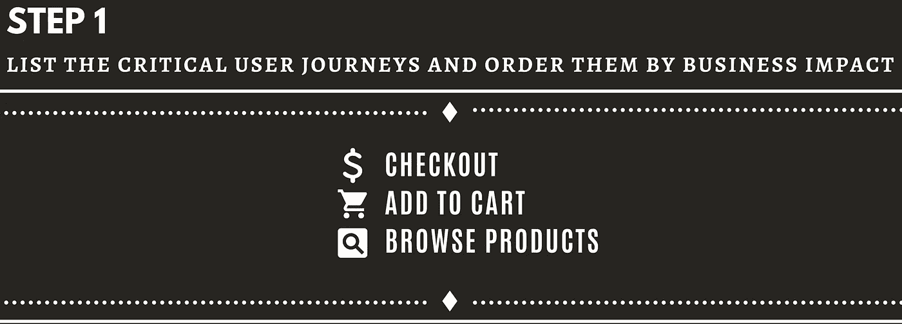

# 测量 GCP 的可靠性:使用云操作沙盒的 SLO 逐步创建指南

> 原文：<https://medium.com/google-cloud/measuring-reliability-in-gcp-step-by-step-slo-creation-guide-using-cloud-operation-sandbox-99043bd0e70f?source=collection_archive---------1----------------------->

> 在这个分步指南中，我将使用我们的学习环境云操作沙箱演示如何在云操作中配置 SLO。

在简短的术语介绍之后，我将介绍云操作沙盒。然后，我们将为基于 web 的电子商务应用程序 Hipster Shop 创建 SLO。最后，我们将了解如何配置我们在 GCP 的云操作套件中定义的 SLO。

> 如果你不熟悉 SRE 的概念和术语，请在进入下一部分之前回顾一下 [SRE 基本面(SLIs vs SLA vs SLOs)](https://cloud.google.com/blog/products/devops-sre/sre-fundamentals-sli-vs-slo-vs-sla)。

在 SRE，我们采用以客户为中心的方法来推动各方面的活动；从确定指标，到容量规划和变更管理。只要你的用户满意，你可以优先考虑速度，但当你被认为不可靠时，你应该优先考虑可靠性。为了改善我们的用户体验，你必须首先定义 SLIs 和 SLO。

SLI，SLO，SLA 概述

**SLI，SLO，SLA 回顾**

SLIs 和 SLO 的范围是一个**用户之旅。**你的*用户*正在使用你的*服务*来实现一组*目标*，其中最重要的被称为*关键用户旅程(CUJ)* 。

# 逐步创建 SLI/O

对于本指南，我们将使用 [***云操作沙箱***](https://cloud-ops-sandbox.dev/docs/) ，这是一个点击即可部署的开源学习环境。云操作沙盒帮助从业者了解如何使用[谷歌云的操作套件](https://cloud.google.com/products/operations)，并提供在类似于生产环境的合成流量的隔离云环境中应用 SRE 实践的能力。

> ***云操作沙盒*** 是一个快速简单的“游戏环境”,用于评估尽可能接近真实生产环境的云操作。从这里开始: [cloud-ops-sandbox.dev](http://cloud-ops-sandbox.dev)

云运营沙盒包括一个名为 ***潮人店*** 的云原生微服务演示应用。

Hipster Shop 是一个基于 web 的电子商务应用程序，有一个前端和一系列后端服务。该应用程序由 11 个用各种语言编写的微服务组成，它们通过 gRPC 相互通信。潮人商店展示了 Kubernetes/GKE、Istio、云监控和日志记录以及 gRPC 等技术的使用。

Hipster Shop 的用户可以浏览商品，将它们添加到购物车中，然后购买它们。要开发 SLIs，理解应用程序是如何构建的很重要。

首先，让我们回顾一下潮人店的流程:

1.  用户通过前端访问应用程序。
2.  然后购买由 CheckoutService 处理。
3.  CheckoutService 依赖 CurrencyService 来处理转换。
4.  其他服务(如 RecommendationService、ProductCatalogService 和 Adservice)用于向前端提供呈现页面所需的内容。

> 更多信息请参考公开回购:[github.com/GoogleCloudPlatform/cloud-ops-sandbox](https://github.com/GoogleCloudPlatform/cloud-ops-sandbox)

# SLO 创作过程

要保证用户快乐，你得先定义它。我们的用户正在使用我们的**服务**来实现一系列**目标**，其中最重要的是**关键用户旅程(CUJs)** 。

定义 CUJs 后，您需要确定最接近描述用户体验的指标，这些指标就是我们的 **SLIs** 。然后，您将使用这些 sli 来定义我们的 **SLO** 目标。

## 1.SLO 进程-确定我们的 CUJ

用户在“潮人商店”购物时可以采取的一些关键行动包括:

1.  浏览产品，
2.  结帐，
3.  并添加到购物车。

接下来，你应该问问自己，哪些对业务最重要？并以此作为 CUJs 的优先级标准。

结帐并不是唯一的关键用户旅程，但它与企业收入直接相关，因此我们将它放在首位。

如果你发现对 CUJs 进行优先排序很有挑战性，试着把你自己放在用户的位置上。在我们的例子中，作为一个用户，你有多少次在没有购买商品的情况下在线浏览商品或将商品添加到购物车？

对于本例的其余部分，“Checkout”将是 SLO 的基础，但是您可以将相同的技术应用于其他关键的用户旅程。

CUJ 收银台使用我们架构的以下组件

## **2。SLO 进程-SLI 创造**

在您确定了 CUJ 和您将关注的交互之后，您将需要 ***选择哪些指标*** 将最准确地代表用户体验。

假设我们的应用程序 Hipster Shop 为最终用户的电子商务流量提供服务，用户在结账时在前端执行不同操作的体验应该保持一致。因此，我们应该为请求可用性(有多少请求成功)、延迟(请求需要多长时间)、质量和其他指标定义 SLIs。

在决定使用什么样的 SLI 打字时，我建议查看一下《SLOs 手册的艺术》第 7 页中的 SLI 菜单。该手册为根据交互类型(请求/响应、数据处理或存储)起草 sli 提供了方便的指南。

下一步是定义 SLI 规范。 **SLI 规范**是对你认为对你的用户重要的服务结果的评估。您可能希望将它们表示为“好”事件的数量除以有效事件的总数。

最后，您将通过添加[度量方法](https://sre.google/workbook/implementing-slos/)将该规范细化为详细的 **SLI 实现**，例如，应用级度量、日志处理、前端基础架构度量、合成客户端/数据、客户端工具(要了解更多信息，请阅读:[SLOs 手册的艺术，第 16 页](https://static.googleusercontent.com/media/sre.google/en//static/pdf/art-of-slos-handbook-letter.pdf))。

在结帐 CUJ 的情况下，目标是结帐功能保持可接受的可用性。为了实现这一点，您需要测量有多少用户尝试签出，以及有多少请求成功，因此成功请求的数量是“好”的度量。

> 重要的是要详细说明具体要测量什么，以及你计划在哪里测量。

> **为什么排除 3XX 和 4XX 状态码？**由于 3xx 和 4xx 表示重定向和客户端错误，在这种特定情况下，您可以将这些视为“系统正常工作”。因此，您不希望将这些类型的请求视为违反我们可用性 SLO 的错误。
> 
> 请注意，这不应该是一种概括，您应该注意做出这个决定，并且建议在您的系统中检查这些错误，以检查它们是否代表系统故障。

## 3.SLO 进程——SLO

在定义 SLIs 之后，是时候设置 SLO(服务水平目标)了，它是指定时间窗口(例如，一个月或一个季度)内 SLI 的目标。

SLO 应包括一个用百分比表示的*目标*，即良好/总比率，例如 99.99%。在*特定测量窗口*中，该窗口应该是一个持续时间，允许我们在需要时做出战略决策并优先考虑可靠性(要了解更多信息，请阅读:[选择适当的时间窗口](https://sre.google/workbook/implementing-slos/))。

如果你想在跟踪这些 SLO 的基础上改变你的系统，设定一个可实现的目标是很重要的。如果你的目标过于雄心勃勃，SLO 将很快成为一个被忽视的麻烦。如果你的客户对你今天的服务很满意，你可能做得很好，你可能希望你的目标基于符合用户期望的历史数据。这些目标不是一成不变的，您应该重新访问这些目标，并对它们进行迭代，以符合业务需求。

在我们的例子中，根据历史数据趋势，您可以假设我们的 SLO 将有 99%的可用性。如果你没有历史数据，试着检查竞争对手和基准类型的旅程的问题，以检查用户的期望。例如，如果在交互服务和报告生成之间需要手动操作，您可能会考虑拆分旅程阶段(更多信息:请参考[SLOs 手册的艺术，第](https://static.googleusercontent.com/media/sre.google/en//static/pdf/art-of-slos-handbook-letter.pdf) 20 页中的买入货币 CUJ)。

## 第四步:

在您定义了您的 sli 和 SLO 之后，是时候将这些定义转化为有形的仪表板和警报了。在 GCP，我们在**实现** SLIs 和 SLOs 的工具是 [*云运营套件*](https://cloud.google.com/products/operations) 。

# 使用云计算运营套件实施

云操作套件提供**面向服务的** **监控**，这意味着您正在为一项“服务”配置 SLIs、SLO 和刻录率警报。

创建 SLO 的第一步是**接收与 SLIs 中的使用指标相关的数据**，对于 GKE 服务，它是现成的，但您也可以接收额外的数据。然后你需要定义我们的服务，定义我们的指示器:SLI**，我们的目标:SLO**，最后:燃烧率警报**。******

************

******使用云操作沙盒的优势之一是，它集成了大量来自 Hipster Shop 中的微服务的不同可观察性指标，即装即用。在[监控→服务→服务概述](https://cloud.google.com/stackdriver/docs/solutions/slo-monitoring/ui/svc-overview)下可以找到所有潮人店铺微服务:******

******对于我们的用例，您需要选择结帐服务。如你所见，这里有两个结账服务。原因是因为*的云操作沙箱*的服务正在使用 Istio。使用 Istio 的服务会被自动检测到，云操作套件会为我们创建云监控中的服务。然而，为了演示如何创建自己的服务，云操作沙盒还使用 Terraform 部署定制服务([查看 Terraform 配置](https://github.com/GoogleCloudPlatform/cloud-ops-sandbox/tree/master/terraform/monitoring))。因此，我们有两个服务，一个是自动检测的，因为使用了 Istio，另一个是在 Terraform 代码中定义的，它是显式创建的。******

************

******要浏览现有的 SLO，请选择自定义结帐服务(这是由云操作沙盒中的 Terraform 代码创建的):******

************************

******接下来，您将选择自动检测的结帐服务(这是自动检测的，因为使用了 Istio):******

************

1.  ******要配置您在上一节中介绍的可用性 SLI 和 SLO，您将选择→“创建 SLO”。******
2.  ******在第一个屏幕中，您将选择您的 **SLI 类型** : **可用性********

********

****3.然后，您将选择性能指标:可用性。您的 SLI 实现将是:service/server/**request count，**这是 service/request_count 的成功 HTTP GET 请求的百分比，由 Istio 测量。在此屏幕中，您还可以看到该指标的历史数据。****

********

****4.然后，您应该配置我们的 SLO。在这种情况下，过去 28 天内 99%的结帐请求都是成功的。28 天的滚动窗口通常更符合客户体验，是制定战略决策和提前计划的良好时间间隔(要了解更多信息，请阅读:[选择合适的时间窗口](https://sre.google/workbook/implementing-slos/)):****

********

****在保存之前，您可以查看 SLO，看看 JSON 配置应该是什么样子(这可以作为自动化的一部分):****

********

****5.之后，您可以在“结账服务”概览页面上看到新的 SLO。最后，您可以为它创建 [SLO 燃烧率警报](https://cloud.google.com/stackdriver/docs/solutions/slo-monitoring/alerting-on-budget-burn-rate):****

********

****在下一个屏幕中，您将设置警报的条件、通知谁、通知方式(电子邮件、webhook 等)以及要包括的任何附加说明:****

********

****创建警报后，您可以在服务屏幕中看到它以及由 SLO 触发的任何事件:****

********

****如果触发了警报，您将能够在警报屏幕中看到它:****

********

****完成后，您可以在服务屏幕下看到服务详细信息、警报时间表、SLO 和其他信息:****

********

****现在，您已经了解了如何起草结账可用性 SLO 并在云运营中实施它。我想鼓励您起草并实施额外的 SLO，如延迟 SLO，额外的 CUI，如添加到购物车，甚至利用这些知识来起草和配置您自己的服务的 sli 和 SLO。****

****SRE 之旅既包括实施 SRE 的实践，比如这里提到的 SLO，也包括培养一种[有利的文化](http://bit.ly/sre_4steps)。下面，您可以找到其他资源，包括按资源类型和级别分类的公开可用资源的集合。****

# ****其他资源:****

*   ******[**书籍**](http://landing.google.com/sre/books/) ( [SRE](https://landing.google.com/sre/sre-book/toc/index.html) ，[工作簿](https://landing.google.com/sre/workbook/toc/)，[建筑安全&可靠系统](https://static.googleusercontent.com/media/landing.google.com/en//sre/static/pdf/Building_Secure_and_Reliable_Systems.pdf))******
*   ****[**为 GCP 客户征集 SRE 公共资源**](http://bit.ly/Public_SRE_Resources)****
*   ******Coursera:**[**现场可靠性工程:测量和管理可靠性**](https://www.coursera.org/learn/site-reliability-engineering-slos)****
*   ******[SLO 监控](https://cloud.google.com/stackdriver/docs/solutions/slo-monitoring)在 GCP 的‘云行动’******