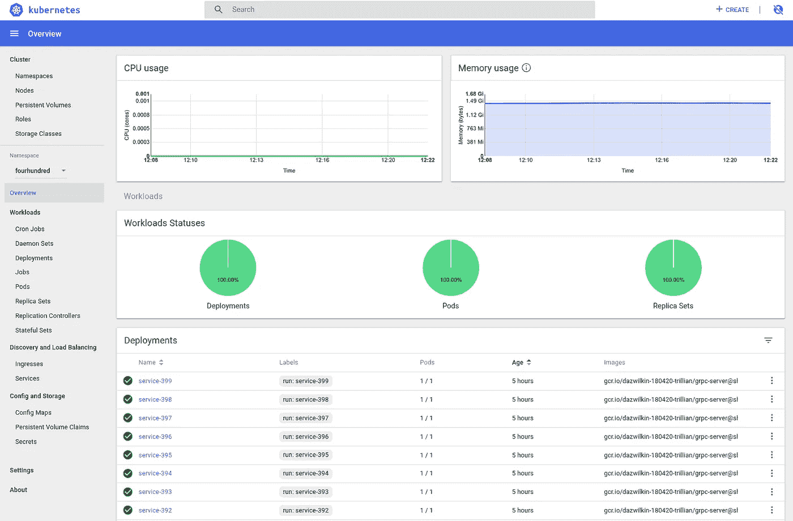
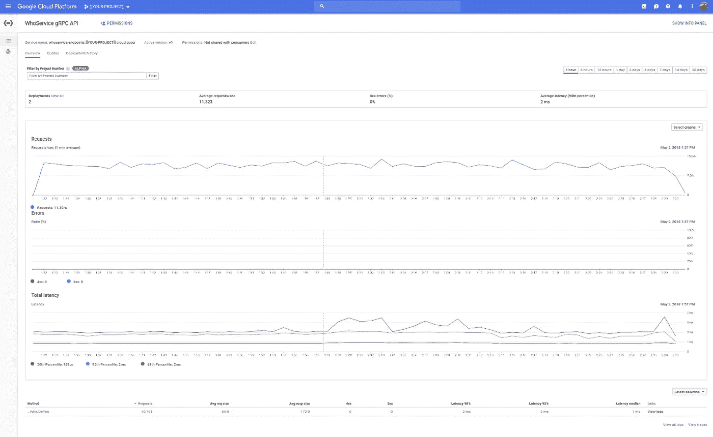
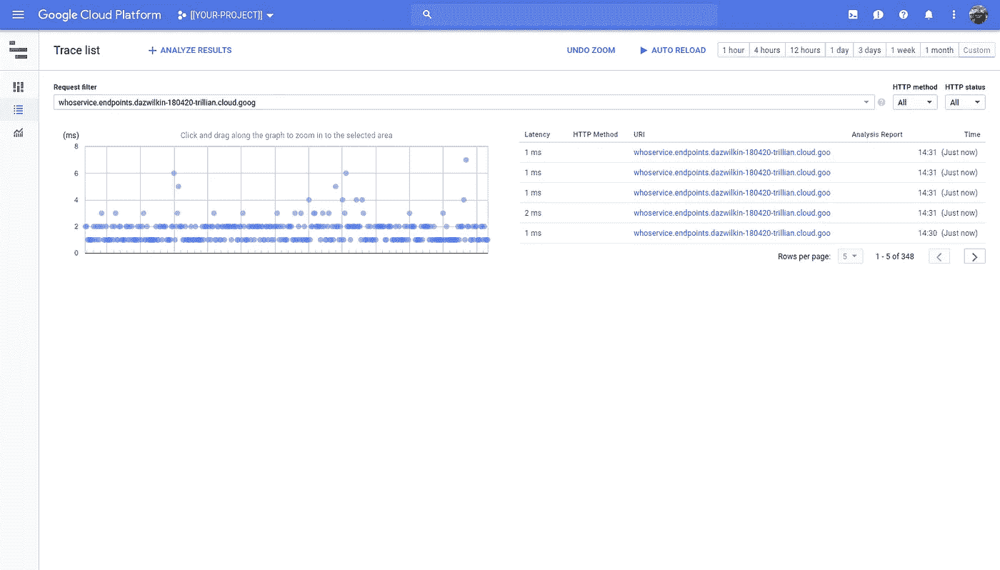

# Mega8s:一个复杂的 Kubernetes 星团

> 原文：<https://medium.com/google-cloud/mega8s-1c341043511e?source=collection_archive---------1----------------------->

帮助重现一个客户的问题需要创建一个 Kubernetes 集群，这个集群比我以前创建的大约 400 个带有网络负载平衡器的服务要大。这需要大量增加配额

## 定额

```
CPUs: 96
IPs: 96
PD: 9182 (GB)
Firewalls: 500
Forwarding Rules: 500
Target Pools: 500 
```

> 我确定的 CPU 和 IP 配额远远超过了实际需要。之前对此记录的尝试调配了比最终运行所需更多的 CPU。

我在我的首选`us-west1`中创建了一个可抢占的 1x4 区域集群。

## 状态

这是事后的事；我曾经部署了 400 项服务，这些服务提供了 400 个网络 LBs:

```
kubectl get deployments \
--namespace=$NAMESPACE \
--output=name \
| wc --lines
400kubectl get services \
--namespace=$NAMESPACE \
--output=name \
| wc --lines
400kubectl get pods \
--namespace=$NAMESPACE \
--output=name \
| wc --lines
400
```

每个服务都有`--type=LoadBalancer`，Kubernetes 需要一些时间对所有这些进行编程:

```
gcloud compute forwarding-rules list \
--format="value(name)" \
--project=$PROJECT \
| wc --lines
401gcloud compute instances list \
--format="value(name)" \
--project=$PROJECT \
| wc --lines
4
```

> **NB**“401”——吗？？？参见下面的解释

有 4 个(！)节点——每个节点运行 100 个 pod(一个 pod/服务),尽管每个 pod 都很小(2.5MB ),但这一点令人印象深刻



> **NB** 很难展示 400 个服务……我向你保证前面的服务也存在。

## 怎么会？

巴什-福和我的巴什并不出色；-)

请参见下文，了解如何为 gRPC 服务和云端点部署创建容器。

假设您有一个代表 gRPC 服务器的容器:

```
gcr.io/${PROJECT}/grpc-server:latest
```

让我们创建一些部署和服务。我建议你逐渐开始:

```
PROJECT=[[YOUR-PROJECT]]
NAMESPACE=[[YOUR-NAMESPACE]]            # fourhundredkubectl create namespace ${NAMESPACE}for NUM in $(seq -f "%03g" 0 9)
do
  echo "Service: service-${NUM}"
  kubectl run service-${NUM} \
  --image=gcr.io/${PROJECT}/grpc-server:latest \
  --port=10000 \
  --namespace=${NAMESPACE}
  kubectl expose deployment/service-${NUM} \
  --protocol=TCP \
  --port=10000 \
  --target-port=10000 \
  --type=LoadBalancer \
  --namespace=${NAMESPACE}
  kubectl label service/service-${NUM} grpc=true service=whoami \
  --namespace=${NAMESPACE}
done
```

> **NB**`Service`使用端口`10000`,`Deployment`的吊舱露出端口`10000`，吊舱中的集装箱监听`10000`。这相当于 Docker 的`--publish=10000:10000`。

您可以使用我之前展示的命令来检查进度:

```
kubectl get deployments \
--namespace=${NAMESPACE} \
--output=name \
| wc --lineskubectl get pods \
--namespace=${NAMESPACE} \
--output=name \
| wc --linesgcloud compute forwarding-rules list \
--format="value(name)" \
--project=$PROJECT \
| wc --lines
```

**NB** 第一个命令使用`kubectl`，第二个命令使用`gcloud`。创建网络 LBs(由`forwarding-rules`表示)需要一点时间。

当您对所拥有的东西有信心时，您可以在脚本中突破下限和上限，并再次运行它。

## 延期:整理

要删除部署和服务:

```
NAMESPACE=[[YOUR-NAMESPACE]]for NUM in $(seq -f "%03g" 0 9)
do
  echo "Service: service-${NUM}"
  kubectl delete deployment/service-${NUM} --namespace=${NAMESPACE}
  kubectl delete service/service-${NUM} --namespace=${NAMESPACE}
done
```

**NB** 确保您正确设置了下限(当前为`0`)和上限(当前为`9`)以删除您的所有服务。

您可以重新运行之前显示的命令，以确保将`Deployments`、`Services`、`Pods`和 LBs ( `forwarding-rules`)降到零。或者，您可以敲打名称空间，这应该会删除所有内容:

```
kubectl delete namespace/${NAMESPACE}
```

## 测试

我们现在有一些网络 LB(转发规则),通过每个服务的网络 LB 在端口`9000`上公开我们的 gRPC 服务(本身运行在端口`10000`上)。这个脚本列举了所有服务的端点(有些可能还没有 IP 地址，这些被忽略了)，然后它随机选择一个端点并调用它。这不是重要的负载测试，但却是负载测试:-)

```
NAMESPACE=[[YOUR-NAMESPACE]]unset LB
LB=()
for IP in $(kubectl get services \
--selector=grpc==true,service==whoami \
--namespace=${NAMESPACE} \
--output=json \
| jq --raw-output '.items[] | .status.loadBalancer.ingress[0].ip | select(.!=null)')
do
  LB+=(${IP})
donewhile :
do
  TEST_LB=${LB[$RANDOM % ${#LB[@]} ]}
  ./grpc-client --host=${TEST_LB} --port=10000
done
```

> **注意**如果您大幅修改了磅数(向上或向下)，您应该重新运行整个脚本。如果你有相同数量的 LBs，一些可能随后获得了一个 IP 地址。如果你只是想像以前一样使用相同的 LBs 再次运行，你可以只运行`while`循环。

## 可选:云端点

谷歌的说明在这里:

[https://cloud . Google . com/endpoints/docs/grpc/get-started-grpc-kubernetes-engine](https://cloud.google.com/endpoints/docs/grpc/get-started-grpc-kubernetes-engine)

如果您想使用云端点部署 gRPC 服务的另一个实例，您需要

*   启用云端点
*   生成原型描述符
*   部署服务配置
*   使用*端点边车部署 gRPC WhoService *
*   测试一下！

```
gcloud services enable endpoints.googleapis.com \
--project=$PROJECT
```

我们必须生成一个伴随`api_config.yaml`文件的原型描述符(`api_descriptor.pb`)来创建端点服务。以下是我建议您从包含`whoami`目录的工作目录开始执行的步骤，该目录本身包含`whoami.proto`和`api_config.yaml`文件:

```
virtualenv env
source venv/bin/activate
pip install grpcio-toolspython -m grpc_tools.protoc \
--include_imports \
--include_source_info \
--proto_path=./whoami \
--descriptor_set_out=./whoami/api_descriptor.pb \
whoami.proto
```

然后部署服务配置:

```
gcloud endpoints services deploy api_descriptor.pb api_config.yaml \
--project=$PROJECT
```

如果成功，将返回:

```
Service Configuration [2018-05-02r0] uploaded for service [whoservice.endpoints.[[YOUR-PROJECT]].cloud.goog]
```

现在，云端点知道了我们的 API 会带来什么，我们需要部署实现它的 gRPC WhoService:

> **注意**请将第 20 行的`[[YOUR-PROJECT]]`替换为您的 GCP 项目的价值。

然后:

```
kubectl apply --filename=deployment.yaml
```

您可以通过以下方式确认:

```
kubectl get deployment/grpc-server
kubectl get service/grpc-server
```

我们将重用之前在 bash 脚本中使用的机制来标识由该部署创建的网络 LB 的 IP 地址:

```
ENDPOINTS_IP=$(\
  kubectl get service grpc-server \
  --output=jsonpath="{.status.loadBalancer.ingress[0].ip}")
echo ${ENDPOINTS_IP}
```

因为配置网络 LB 需要一点时间，所以重复该命令，直到获得一个 IP。一切都很好:

```
while :
do
  ./grpc-client \
  --host=${ENDPOINTS_IP} \
  --port=9000
done
```

> **注意**通过端点，我们与边车通信，边车与我们的 gRPC 服务器通信。为了说明这一点，我们使用`9000`作为代理，而我们的服务仍然在`10000`上。

端点为我们提供了一个仪表板:



云端点



云迹

…还有痕迹！！Woot

## Stackdriver Kubernetes

如果[这个](https://cloudplatform.googleblog.com/2018/05/Announcing-Stackdriver-Kubernetes-Monitoring-Comprehensive-Kubernetes-observability-from-the-start.html)在 2 天前宣布的话，我就可以向你展示这个具有令人敬畏的新 Kubernetes 监控的集群:-(

## gRPC Whoami

哎呀，我从某人那里抄袭了这个，但是不记得在哪里了。亲爱的开发者，很抱歉没有提到你的名字

我寻求一个简单的 gRPC 服务来模拟客户的体验。我还使用云端点部署了该服务的一个实例。

> **注意**请用你的`github.com/your-name`目录路径替换`client.go`的第 8 行和`[[YOUR-GITHUB]]`的`server.go`。这是假设你用的是 GitHub，但如果你用的是 Go 也是可能的。如果您没有使用 GitHub，您必须简单地反映 gRPC 服务的目录结构。我提议`my-working-dir/client`、`my-working-dir/server`和`my-working-dir/whoami`。后者应该包含`whoami.proto`和`api_config.yaml`。
> 
> **注意**请用您将在其中部署端点服务的 Google 云平台项目的值替换`api_config.yaml`的第 4 行。

为了方便起见，我在上面包含了机器生成的`whoami.pb.go`文件。这省去了您从`whoami.proto`文件生成这个文件的麻烦，并使这篇博文稍微短了一些。如果您感兴趣，请点击此处了解更多关于此流程的信息:

[https://grpc.io/docs/tutorials/basic/go.html](https://grpc.io/docs/tutorials/basic/go.html)

您*应该*能够获取并运行这些文件:

```
go get ./...
go run server/server.gogo run client/client.go
```

> 在一个窗口中启动服务器后，你需要在另一个窗口中运行客户端。

如果成功了，我们可以建造并再试一次:

```
CGO_ENABLED=0 GOOS=linux go build -a -installsuffix cgo -o grpc-client client/client.goCGO_ENABLED=0 GOOS=linux go build -a -installsuffix cgo -o grpc-server server/server.go
```

**或**:2 的循环需要循环吗？

```
for FILE in client server
do
  CGO_ENABLED=0 \
  GOOS=linux \
  go build -a -installsuffix cgo -o grpc-${FILE} ${FILE}/${FILE}.go
done
```

如果可行，我们可以用集装箱装起来再试一次:

> 你不需要容器化客户端，只需要容器化服务器。
> 
> **NB** `Dockerfile.client`采用多阶段构建。都用`dumb-init`。如果不想使用`dumb-init`,分别拆卸 12+4 线。在客户端文件中，将第 15 行替换为`ENTRYPOINT ["/grpc-client"]`。在服务器文件中删除第 8 行并留下`CMD`。

```
docker build \
--tag=gcr.io/${PROJECT}/grpc-client \
--file=Dockerfile.client \
.docker build \
--tag=gcr.io/${PROJECT}/grpc-server \
--file=Dockerfile.server \
.docker push gcr.io/${PROJECT}/grpc-client
docker push gcr.io/${PROJECT}/grpc-server
```

## 试验

服务器:

```
docker run \
--interactive \
--tty \
--publish=10000:10000 \
gcr.io/dazwilkin-180420-trillian/grpc-server
```

如果您将客户装箱，那么:

```
docker run \
--interactive \
--tty \
--net=host \
gcr.io/dazwilkin-180420-trillian/grpc-client \
  --host=localhost \
  --port=10000
```

如果您没有将客户端容器化，则:

```
./grpc-client --host=localhost --port=10000
```

## 旁白:尼克的黑客

愚蠢的是，我忘记了我还创建了端点服务，并想知道为什么我有 401(而不是 400)网络 LBs-(

感谢 Nick——一个非常棒的 Kubernetes 工程师——他指出了这个有用的 LBs 过滤器，它表明，虽然我在名称空间`fourhundred`中有 400 个名为`service-XXX`的 LB(LB 描述保留了 Kubernetes 名称空间/服务名称== cool ),但我在`default`中还有一个由端点创建的 LB:

```
gcloud compute forwarding-rules list \
--project=${PROJECT} \
--format="table(description)"
DESCRIPTION
...
{"kubernetes.io/service-name":"fourhundred/service-009"}
{"kubernetes.io/service-name":"default/grpc-server"}
{"kubernetes.io/service-name":"fourhundred/service-010"}
{"kubernetes.io/service-name":"fourhundred/service-011"}
{"kubernetes.io/service-name":"fourhundred/service-012"}
{"kubernetes.io/service-name":"fourhundred/service-013"}
{"kubernetes.io/service-name":"fourhundred/service-014"}
{"kubernetes.io/service-name":"fourhundred/service-015"}
...
```

## 结论

我认为这次经历最能说明问题的是，拥有 400 项服务的 Kubernetes 与拥有 4 项服务的 Kubernetes 差别不大。还要注意我们是如何忽略了为该服务提供动力的节点以及体现这些节点的 GCE 虚拟机。

## 整理

“焦土”清理是删除 GCP 项目。这将删除项目中的所有内容。如果你专门为这项工作创建了项目，做得很好。继续进行，风险自负:

```
gcloud projects delete ${PROJECT} --quiet
```

或者，您可以删除 Kubernetes 集群和端点服务。同样，如果你将其中任何一个用于其他目的，请注意你会删除所有内容。继续进行，风险自负:

```
gcloud container clusters delete $CLUSTER \
--project=${PROJECT}gcloud endpoints services delete \
whoservice.endpoints.${PROJECT}.cloud.goog \
--project=${PROJECT}
```

仅此而已！