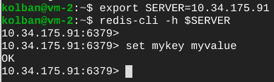

# 通过 VPC 对等访问内存存储 Redis

> 原文：<https://medium.com/google-cloud/memorystore-redis-access-through-vpc-peering-3bb75e1746d4?source=collection_archive---------2----------------------->


一位 GCP 用户想创建一个附属于 VPC 的 Memorystore Redis。这很容易。然后，用户希望在单独的项目中创建另一个 VPC，并让该 VPC 中的虚拟机访问原始的 Memorystore Redis。这能实现吗？如果能，如何实现？

这篇文章带领我们经历了一个旅程，在这里我们建立了这样一个环境并让它工作。这个故事带我们经历了到达那里的过程，并解释了其中的一些难题。

我们将从一个简单的基本对等网络图开始:


让我们称之为基线。这并不代表我们最终想要的结果，但是让我们看看我们是否能实现这个环境。

*   创建一个名为`project-i-1`的 GCP 项目。
*   删除名为`default`的 VPC 网络。
*   创建一个名为`vpc-1`的 VPC 网络。
*   在`vpc-1`中创建一个名为`subnet-1`的子网，IP 地址为区域`us-central1`中的`10.1.0.0/16`。
*   在附属于属于`vpc-1`的子网`subnet-1`的`project-i-1`中创建一个名为`vm-1`的虚拟机。在我的例子中，我们发现这被赋予了 IP `10.1.0.2`。
*   创建一个名为`project-i-2`的 GCP 项目。
*   删除名为`default`的 VPC 网络。
*   创建一个名为`vpc-2`的 VPC 网络。
*   在`vpc-2`中创建一个名为`subnet-2`的子网，IP 地址范围为区域`us-central1`中的`10.2.0.0/16`。
*   在`project-i-2`中创建一个名为`vm-2`的虚拟机，连接到属于`vpc-2`的名为`subnet-2`的子网。在我的例子中，我们发现这被赋予了 IP `10.2.0.2`。
*   在`project-i-1`中创建一个名为`vpc-1-to-vpc-2`的 VPC 对等定义，将`vpc-1`映射到`vpc-2`。


*   在`project-i-2`中创建一个名为`vpc-2-to-vpc-1`的 VPC 对等定义，将`vpc-2`映射到`vpc-1`。


*   检查两个项目中 VPC 喷丸的状态是否为“活动”。


*   在`vpc-1`中创建一个防火墙规则，允许来自`0.0.0.0/0`的 SSH 端口`22`进入。


*   在`vpc-2`中创建防火墙规则，允许来自`10.0.0.0/8`的所有端口/协议进入。这包括`subnet-1`。

此时，我们可以 SSH 到`vm-1`并对`vm-2` ( `10.2.0.2`)执行 ping，它将会成功。


这说明我们有一个从`vm-1`到`vm-2`的网络路径，它跨越了项目和 VPC。现在是时候扩展我们的故事并添加 Memorystore Redis 了。

*   为项目`project-i-2`中的 Redis 启用 Memorystore。
*   为 Redis 创建一个 Memorystore 实例。这在`10.34.175.91`创建了一个实例。这对你来说可能会有所不同。记下 IP 以备将来使用。


*   在`vpc-2`中创建一个防火墙规则，允许来自`0.0.0.0/0`的 SSH(端口`22`)进入。
*   宋承宪进入`vm-2`。
*   安装 Redis 命令行界面(CLI)。

```
sudo apt-get install redis-tools
```

*   运行 Redis cli

```
export SERVER=[REDIS-1 IP — 10.34.175.91]
redis-cli -h $SERVER
```

*   保存名称/值对。

```
set mykey myvalue
```



如我们所见，这工作得很好。

*   宋承宪进入`vm-1`。
*   安装 Redis 命令行界面(CLI)。

```
sudo apt-get install redis-tools
```

*   运行 Redis cli

```
export SERVER=[REDIS-1 IP — 10.34.175.91]
redis-cli -h $SERVER
```

**失败**。我们似乎没有从连接到`vpc-1`的虚拟机到`10.34.175.91`的路径。


看看这个故事能不能解释。回顾一下，我们看到`vm-2`可以连接到 Redis，但`vm-1`不能。先问为什么我们认为`vm-1` *可能*能够连接 Redis？我们有一种直觉，它可能会工作，因为`vpc-1`和`vpc-2`是对等的。这告诉我们的是，附属于`vpc-1`的事物有一个网络路径连接到`vpc-2`的事物。我们已经证明了，我们可以从`vm-1`ping`vm-2`。当我们创建 Redis 实例时，我们将`vpc-2`命名为允许向 Redis 发出请求的 VPC。如果我们查看 Redis 服务器描述的输出，我们会看到一个名为`authorizedNetwork`的条目，它命名为`vpc-2`。


这可能会让我们认为 Redis 连接到了`vpc-2`，并且`vpc-1`和`vpc-2`是对等的，因此连接到`vpc-1`的虚拟机应该能够到达 Redis。不幸的是，故事没那么简单。如果我们深入挖掘，我们会发现 Redis 实际上连接到它自己的私有的*未命名的* VPC，并且当我们创建 Redis 实例时，它实际上在 Redis 未命名的 VPC 和 Redis 所连接的 VPC(在本例中为`vpc-2`)之间创建了一个 VPC 对等。

一个更合适的图表应该是这样的:


这充分解释了为什么`vm-2`能够访问 Redis。名为`vpc-2`的 VPC 与 Redis 使用的未命名的 VPC 是对等的。由于`vm-2`附属于`vpc-2`，它与 Redis VPC 有对等连接，因此也与 Redis 本身有对等连接。

我们还有最后一个概念… VPC 对等是*不*可传递的。尽管`vpc-2`与 VPC Redis 对等，`vpc-1`与`vpc-2`对等，但这并不意味着*不是*与 VPC Redis 对等。此处记录了这种缺乏过渡性的情况[。在那里，我们将发现以下内容:](https://cloud.google.com/vpc/docs/vpc-peering#restrictions)

> 只有直接对等的网络才能通信。不支持可传递对等。换句话说，如果 VPC 网络 N1 与 N2 和 N3 对等，但是 N2 和 N3 没有直接连接，VPC 网络 N2 不能通过 VPC 网络对等与 VPC 网络 N3 通信。

这是我们无法从`vm-1`连接到 Redis 的一个看似合理的原因。这是否意味着我们根本*不能*从`vm-1`连接到 Redis？是和不是。我们不能直接连接，但我们可以通过一个简单的代理连接。我们的高层次故事将是在`vpc-2` VPC 创建一个低端计算引擎。因为这个计算引擎连接到了`vpc-2` VPC，所以它可以直接访问 Redis 服务器。在这个计算引擎上，我们将安装名为[胡桃夹子](https://github.com/twitter/twemproxy)的开源包。胡桃夹子是一个认识 Redis 的代理。它将接收传入的 Redis 请求，并有效地将这些请求转发给 Redis 服务器。由于代理计算引擎*只是*一个附属于`vpc-2`的计算引擎，它将对任何对等于`vpc-2`的其他 VPC 可用，在我们的故事中，这将包括`vpc-1`。


*   在附属于属于`vpc-2`的子网`subnet-2`的`project-i-2`中创建一个名为`redis-proxy`的虚拟机。在我的例子中，我们发现这被赋予了 IP `10.2.0.3`。
*   宋承宪进入`redis-proxy`。
*   安装[胡桃夹子](https://github.com/twitter/twemproxy)。

```
sudo apt-get update
sudo apt-get install nutcracker
```

*   创建名为`nutcracker.yaml`的胡桃夹子配置文件。

```
redis-1:
 listen: 0.0.0.0:6379
 redis: true
 servers:
 - [REDIS-1 IP]:6379:1
```

*   启动胡桃夹子应用程序。

```
sudo nutcracker --conf-file nutcracker.yaml
```

*   在`vm-1`上，运行指向`redis-proxy`的 Redis 命令。

```
export SERVER=10.2.0.3
redis-cli -h $SERVER
get mykey
```

这个测试成功了，把我们带到了故事的结尾。我们现在已经实现了与一个 Memorystore Redis 实例的交互，该实例被定义为一个 VPC，它与托管 Redis 客户端应用程序的另一个 VPC 对等。

我们可能会考虑其他可能性来实现我们的功能目标，其中的核心是使用共享 VPC 的想法，并在主机项目中创建我们的 Memorystore Redis，并通过服务项目使其可用。

作为本文的配套，这里有一个视频演示了这里描述的故事: