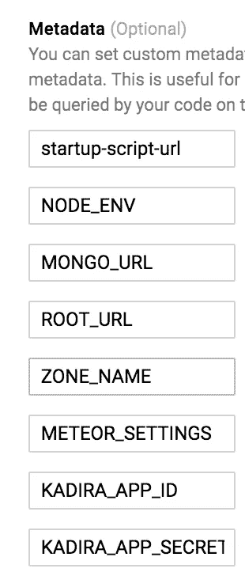

# 流星❤谷歌(DevOps 后)

> 原文：<https://medium.com/google-cloud/meteor-google-a-devops-post-b8a17f889f84?source=collection_archive---------1----------------------->

几个月来，我一直在 Google Compute Engine 上部署一个客户端项目，它已经取得了如此大的成功，我想与全世界分享它。

我们还不需要水平扩展(在此之前，我们已经垂直扩展得很好了)，但是我们确实为每个客户端运行单独的应用服务器。该应用程序是医疗保健，谷歌是一个很好的选择，因为我们的资源涵盖在 HIPAA BAA。然而，如果有人想横向扩展，这绝对是一个选择，要么使用谷歌应用引擎(我也推荐)。

现在，在我们开始之前，我还没有尝试过这一点，但从技术上来说，人们也可以将他们的 Meteor 应用程序部署到 Google App Engine，我已经在他们灵活的环境中的一个非 Meteor Node 应用程序上成功地使用了这个引擎。你的日志会被放到 Google 的 Stackdriver 日志接口上。我将在另一篇文章中提供更多信息。

使用 App Engine 而不是这种方法的优点是，与数字海洋 VPS 相比，您会有更好的管理体验，类似于 Modulus 或 Heroku。然而，如果你已经部署了 *mup* 并且出于某种原因需要改变，请继续阅读。

关于“为什么选择谷歌？”—谷歌的云平台真的是非常令人惊叹的体验。许多服务配合得非常好，界面、工具和文档都非常出色，它们让我能够完全控制我需要做的任何事情的每个方面，并且与可用的 REST 和 CLI 功能完全等同。如果你曾经不得不使用 AWS，你会得到真正的享受。

我们在这里要做的只是通过 shell 脚本运行一些终端命令。一点也不花哨。可以想象，使用我将要概述的这些技术，您也可以部署到 IBM BlueMix、Microsoft Azure 或 Amazon Web Services，这取决于您的需求和基础设施目标。

我没有太多使用 Docker 的经验，但是你也可以使用这个系统来改进这些技术。对于大多数人来说，额外的工具和领域知识真的不是必需的。

继续前进…

首先，让我们熟悉一下谷歌的术语。GCP，谷歌云平台。GAE 的 App Engine 是他们的 PaaS(平台即服务)。GCE，谷歌计算引擎，是他们的 IaaS(基础设施即服务)。他们也有 GCS，谷歌云存储，就像 AWS S3。他们的 CLI 客户端叫做 *gcloud* 。

哈尔莱特，现在我们开始吧！

整个过程的先决条件:一个 meteor 或 node 应用程序，安装在您系统上的 Meteor 或 Node，一个 Google 云平台帐户(简单，免费，您可以获得几个月和几百美元的信用来试用它！)，并安装了 gcloud 终端客户端。说明非常简单，您可以在这里找到它们:

[https://cloud.google.com/sdk/downloads](https://cloud.google.com/sdk/downloads)

此外，请随意修改我在这里所做的，以更好地满足您的需求。这只是让你开始，真的。

首先，您需要一个构建脚本，这是专门针对 Meteor 的部分。

这个脚本假设了一些事情。您正在一个开发目录中工作，该目录包括您的 Meteor 项目目录。因此，我们将应用程序目录放在运行 *meteor* 命令的目录之外。然后您将 *chmod +x ./meteor_build.sh* 您的 shell 文件，这样您就可以运行它，并用:*调用它。/meteor_build.sh* (两个命令中前面的句点都很重要，不要省略)

简单到目前为止，对不对？这只是运行 Meteor build 命令，将您的应用程序转换成一个包含整个应用程序的压缩 tarball。极其方便。它是专门为 64 位 Linux 构建的。

这将设置您的项目名称(您应该更改)，该名称应该始终在运行 gcloud 命令之前设置。此外，您需要事先运行此命令:

*gcloud 授权登录*

这将验证您进入您上次使用的系统默认浏览器窗口中使用的 Google 帐户。超级方便，比设置环境变量或跟踪用户和密码容易得多。如果你和其他开发人员一起工作，使用 GCP IAM(身份和访问管理)很容易将他们添加到你的项目中。

另外，我们正在复制两个我还没有列出的文件， *startup.sh* 和 *nginx.sh* 。上传你的包需要稍微长一点的时间，所以我把它放在最后。

如果你没有想到 HTTPS，评论一下 *pem* 和 *key* 行，但是说真的，现在是 2016 年，支持 HTTPS，FFS。如果你需要帮助，有很多资源可供你使用，只需使用谷歌的另一个已知的东西。确保将它们放在一个单独的目录中，我在这里称之为 *app-secure* 。

现在，我将编写一个相当大的 shell 脚本，它只能在您的应用服务器上运行。这是部署到 GCS bucket 的脚本，用于引导您的服务器运行您的 Meteor 应用程序。

我不会深入这个脚本的每一行，但它是有注释的，我会告诉你它应该在 Debian 8 (Jessie)上运行，它对我们来说工作得很好。修改它以适应您的需求和目标体系结构。它足够短，每一行都值得一读。

最后，你需要一个基本的 *nginx.conf* 。为此，在这里找到并修改在步骤 1 中找到的脚本。

 [## 如何用 Nginx | DigitalOcean 在 Ubuntu 14.04 上部署一个 Meteor.js 应用

### 用 Nginx 和 MongoDB 在 Ubuntu 14.04 上部署一个 Meteor.js 应用。本教程向您展示了如何构建和部署…

www.digitalocean.com](https://www.digitalocean.com/community/tutorials/how-to-deploy-a-meteor-js-application-on-ubuntu-14-04-with-nginx) 

一定要调用那个 *nginx.conf* 并把它放在应用程序的某个地方。

有了脚本，现在我们来看看 GCP 控制台。Google 为此提供了大量文档，所以我只提供步骤，您可以根据需要使用他们的文档来填充空白。

首先，在 GCE 中创建一个*实例模板*。在根据您的喜好填写表单时，请确保它设置为使用 Debian 8。

请确保使用以下环境变量填写元数据部分:

启动脚本 url 应该总是设置为*GS://your-bucket-name/scripts/meteor _ startup . sh*。如果您不使用 Kadira，请忽略它，并在此添加您需要的任何内容。这里的内容也应该存在于启动脚本的元数据部分，否则它不会在启动时填充到实例中。

一旦你得到了你的*实例模板*，现在创建一个*实例组*。一旦你完成了这两件事，*实例组*应该实例化 GCE *实例。*

最后，您可以使用 GCE 主屏幕上的 SSH 按钮和*tail-f/var/log/startup script . log*SSH 进入您的服务器，并查看您的服务器工作情况。如果这个过程中出现任何问题，你都会在那里看到。然后，您可以修复它并重置实例。如果您正在运行多个实例，您应该不会遇到中断。如果运行部署脚本并希望更新应用程序包，还需要重置实例。

所以，这就是让 GCE 运行您的 Meteor 应用程序所需要做的事情的范围，或者至少，这应该让您开始。尽情探索 GCP 提供的一切，一定要提供反馈、评论和心意！