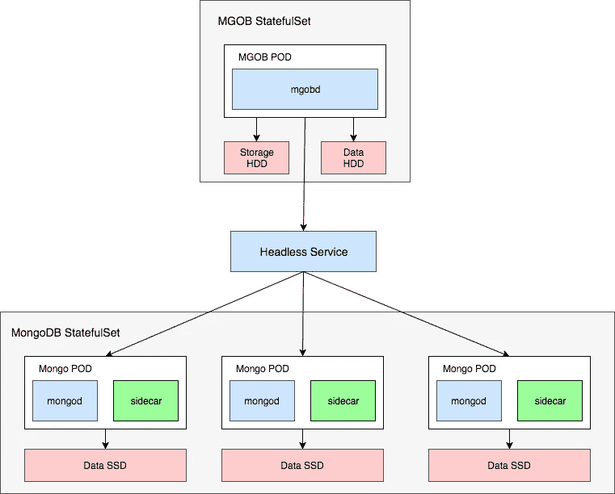

# MGOB——Kubernetes 的 MongoDB 备份代理

> 原文：<https://medium.com/google-cloud/mgob-a-mongodb-backup-agent-for-kubernetes-cfc9b30c6c92?source=collection_archive---------2----------------------->

MGOB 是一个开源的 MongoDB 备份自动化工具，使用 golang 构建在 mongodump 之上。

我开始从事这项工作的主要原因是，我希望有一个配备了 Prometheus 的备份代理，我可以作为 StatefulSet 运行，并以只能从 Kubernetes 内部访问的各种 MongoDB 服务器为目标。

特点:

*   计划备份
*   本地备份保留
*   上传到 S3 对象存储(Minio & AWS)
*   上传到 Google 云存储
*   上传到 SFTP
*   通过电子邮件和 Slack 发送通知
*   普罗米修斯仪器
*   用于本地备份和日志的 http 文件服务器

以下是使用 StatefulSets 和 PersistentVolumeClaims 在 Google Kubernetes 引擎上设置 MGOB 以自动化 MongoDB 备份的分步指南。



先决条件:

*   GKE 集群最低版本 1.8
*   kubctl 管理配置

在我们开始之前，将 mgob 存储库和`cd`克隆到`k8s`目录:

```
$ git clone [https://github.com/stefanprodan/mgob.git](https://github.com/stefanprodan/mgob.git)
$ cd mgob/k8s
```

## 用 k8s-mongo-sidecar 创建一个 MongoDB 副本集

让我们创建一个 MongoDB 集群，看看备份代理是如何工作的。

创建`db`名称空间:

```
$ kubectl apply -f ./namespace.yaml 
namespace "db" created
```

创建`ssd`和`hdd`存储类:

```
$ kubectl apply -f ./storage.yaml 
storageclass "ssd" created
storageclass "hdd" created
```

创建`startup-script` *守护进程设置*以在所有主机上禁用 hugepage:

```
$ kubectl apply -f ./mongo-ds.yaml 
daemonset "startup-script" created
```

创建一个 3 节点*副本集*，每个副本配置一个 1Gi SSD 磁盘:

```
$ kubectl apply -f ./mongo-rs.yaml 
service "mongo" created
statefulset "mongo" created
clusterrole "default" configured
serviceaccount "default" configured
clusterrolebinding "system:serviceaccount:db:default" configured
```

上面的命令为 Mongo *副本集*创建了一个*无头服务*和一个*有状态集*，并为 Mongo sidecar 创建了一个*服务帐户*。每个 pod 包含一个 Mongo 实例和一个 sidecar。边车将初始化*副本集*，并在 pod 启动后立即添加 rs 成员。您可以安全地放大或缩小*有状态集*的副本，边车将添加或删除 rs 成员。

您可以通过查看边车日志来监控 rs 初始化:

```
$ kubectl -n db logs mongo-0 mongo-sidecar
Using mongo port: 27017
Starting up mongo-k8s-sidecar
The cluster domain 'cluster.local' was successfully verified.
Pod has been elected for replica set initialization
initReplSet 10.52.2.127:27017
```

用`kubectl`检查新创建的集群:

```
$ kubectl -n db get pods --selector=role=mongo
NAME         READY     STATUS    RESTARTS   AGE
po/mongo-0   2/2       Running   0          8m
po/mongo-1   2/2       Running   0          7m
po/mongo-2   2/2       Running   0          6m
```

连接到在`mongo-0` pod 中运行的容器，创建一个`test`数据库并插入一些数据:

```
$ kubectl -n db exec -it mongo-0 -c mongod mongo
rs0:PRIMARY> use test
rs0:PRIMARY> db.inventory.insert({item: "one", val: "two" })
WriteResult({ "nInserted" : 1 })
```

每个 MongoDB 副本都有自己的 DNS 地址，如`<pod-name>.<service-name>.<namespace>`所示。如果您需要从另一个名称空间访问*副本集*，请使用以下连接 url:

```
mongodb://mongo-0.mongo.db,mongo-1.mongo.db,mongo-2.mongo.db:27017/dbname_?
```

通过在默认命名空间中创建临时 pod 来测试连接性:

```
$ kubectl run -it --rm --restart=Never mongo-cli --image=mongo --command -- /bin/bash
root@mongo-cli:/# mongo "mongodb://mongo-0.mongo.db,mongo-1.mongo.db,mongo-2.mongo.db:27017/test"
rs0:PRIMARY> db.getCollectionNames()
[ "inventory" ]
```

mongo-k8s 边车[只处理复制集供应。如果你想在 GKE 上运行一个分片集群，看看](https://github.com/cvallance/mongo-k8s-sidecar)[PK done/gke-MongoDB-shards-demo](https://github.com/pkdone/gke-mongodb-shards-demo)。

## 配置和部署 MGOB

首先让我们创建两个数据库`test1`和`test2`:

```
$ kubectl -n db exec -it mongo-0 -c mongod mongo
rs0:PRIMARY> use test1
rs0:PRIMARY> db.inventory.insert({item: "one", val: "two" })
WriteResult({ "nInserted" : 1 })
rs0:PRIMARY> use test2
rs0:PRIMARY> db.inventory.insert({item: "one", val: "two" })
WriteResult({ "nInserted" : 1 })
```

创建一个配置图，为`test1`安排每分钟备份，为`test2`安排每两分钟备份:

```
kind: ConfigMap
apiVersion: v1
metadata:
  labels:
    role: backup
  name: mgob-config
  namespace: db
data:
  test1.yml: |
    target:
      host: "mongo-0.mongo.db,mongo-1.mongo.db,mongo-2.mongo.db"
      port: 27017
      database: "test1"
    scheduler:
      cron: "* * * * *"
      retention: 5
      timeout: 60
  test2.yml: |
    target:
      host: "mongo-0.mongo.db,mongo-1.mongo.db,mongo-2.mongo.db"
      port: 27017
      database: "test2"
    scheduler:
      cron: "*/2 * * * *"
      retention: 10
      timeout: 60
```

如果您有一个分片集群，请确保在`host`字段中使用 mongos 地址。MGOB 也可以针对受密码保护的数据库，您可以在`database`之后添加用户名和密码字段。

应用配置:

```
kubectl apply -f ./mgob-cfg.yaml
```

使用两个磁盘部署 mgob *无头服务*和*有状态集*，3Gi 用于长期备份存储，1Gi 用于运行备份的临时存储:

```
kubectl apply -f ./mgob-dep.yaml
```

要监视备份，您可以流式传输 mgob 日志:

```
$ kubectl -n db logs -f mgob-0 
msg="Backup started" plan=test1 
msg="Backup finished in 261.76829ms archive test1-1514491560.gz size 307 B" plan=test1 
msg="Next run at 2017-12-28 20:07:00 +0000 UTC" plan=test1 
msg="Backup started" plan=test2
msg="Backup finished in 266.635088ms archive test2-1514491560.gz size 313 B" plan=test2 
msg="Next run at 2017-12-28 20:08:00 +0000 UTC" plan=test2
```

或者您可以`curl`mgob API:

```
kubectl -n db exec -it mgob-0 -- curl mgob-0.mgob.db:8090/status
```

让我们为`test2`数据库运行一个按需备份:

```
kubectl -n db exec -it mgob-0 -- curl -XPOST mgob-0.mgob.db:8090/backup/test2
{"plan":"test2","file":"test2-1514492080.gz","duration":"61.109042ms","size":"313 B","timestamp":"2017-12-28T20:14:40.604057546Z"}
```

您可以从 mgob 容器中还原备份。Exec 进入 mgob 并确定您想要恢复的备份，备份在`/storage/<plan-name>`中。

```
$ kubectl -n db exec -it mgob-0 /bin/bash
ls -lh /storage/test1
-rw-r--r--    307 Dec 28 20:23 test1-1514492580.gz
-rw-r--r--    162 Dec 28 20:23 test1-1514492580.log
-rw-r--r--    307 Dec 28 20:24 test1-1514492640.gz
-rw-r--r--    162 Dec 28 20:24 test1-1514492640.log
```

使用`mongorestore`连接到您的 MongoDB 服务器并恢复备份:

```
$ kubectl -n db exec -it mgob-0 /bin/bash
mongorestore --gzip --archive=/storage/test1/test1-1514492640.gz --host mongo-0.mongo.db:27017 --drop
```

## 监控和警报

对于每个备份计划，您可以通过电子邮件或 Slack 配置警报:

```
# Email notifications (optional)
smtp:
  server: smtp.company.com
  port: 465
  username: user
  password: secret
  from: mgob@company.com
  to:
    - devops@company.com
    - alerts@company.com
# Slack notifications (optional)
slack:
  url: [https://hooks.slack.com/services/xxxx/xxx/xx](https://hooks.slack.com/services/xxxx/xxx/xx)
  channel: devops-alerts
  username: mgob
  # 'true' to notify only on failures 
  warnOnly: false
```

Mgob 在`/metrics`端点上公开普罗米修斯指标。

成功/失败的备份计数器:

```
mgob_scheduler_backup_total{plan="test1",status="200"} 8
mgob_scheduler_backup_total{plan="test2",status="500"} 2
```

备份持续时间:

```
mgob_scheduler_backup_latency{plan="test1",status="200",quantile="0.5"} 2.149668417
mgob_scheduler_backup_latency{plan="test1",status="200",quantile="0.9"} 2.39848413
mgob_scheduler_backup_latency{plan="test1",status="200",quantile="0.99"} 2.39848413
```

## 备份到 GCP 存储桶

对于长期备份存储，您可以使用 GCP 存储桶，因为这比将所有备份保存在磁盘上更便宜。

首先，您需要从`API & Services`页面创建一个 GCP 服务帐户密钥。下载 JSON 文件，重命名为`service-account.json`。

将 JSON 文件作为秘密存储在`db`名称空间中:

```
kubectl -n db create secret generic gcp-key --from-file=service-account.json=service-account.json
```

从 GCP web UI 中，导航到*存储*并创建一个名为`mgob`的区域存储桶。如果存储桶名称被占用，您需要在`mgob-gstore-cfg.yaml`文件中更改它:

```
kind: ConfigMap
apiVersion: v1
metadata:
  labels:
    role: mongo-backup
  name: mgob-gstore-config
  namespace: db
data:
  test.yml: |
    target:
      host: "mongo-0.mongo.db,mongo-1.mongo.db,mongo-2.mongo.db"
      port: 27017
      database: "test"
    scheduler:
      cron: "*/1 * * * *"
      retention: 1
      timeout: 60
    gcloud:
      bucket: "mgob"
      keyFilePath: /etc/mgob/service-account.json
```

应用配置:

```
kubectl apply -f ./mgob-gstore-cfg.yaml
```

将带有`gcp-key`机密映射的 mgob 部署到卷:

```
kubectl apply -f ./mgob-gstore-dep.yaml
```

一分钟后，备份将上传到 GCP 存储桶:

```
$ kubectl -n db logs -f mgob-0 
msg="Google Cloud SDK 181.0.0 bq 2.0.27 core 2017.11.28 gsutil 4.28"
msg="Backup started" plan=test
msg="GCloud upload finished Copying file:///storage/test/test-1514544660.gz"
```

## 结论

如果您使用 MGOB 在 Kubernetes 上运行 MongoDB，您可以轻松地安排保留备份，将它们上传到 GCP 存储并设置警报。如果您对改进 MGOB 有任何建议，请在 [GitHub](https://github.com/stefanprodan/mgob) 上提交问题或 PR。非常欢迎投稿！