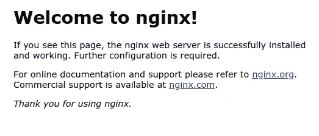

# 谷歌云平台上的 MicroK8s

> 原文：<https://medium.com/google-cloud/microk8s-on-google-cloud-platform-d8b7a71a3ef?source=collection_archive---------1----------------------->

[https://microk8s.io/](https://microk8s.io/)

这多酷啊！？

## 设置

```
PROJECT=[[YOUR-PROJECT]]
INSTANCE=[[YOUR-INSTANCE]] # Perhaps 'microk8s'
ZONE=[[YOUR-ZONE]]gcloud compute instances create ${INSTANCE} \
--machine-type=custom-2-8192 \
--preemptible \
--tags=microk8s \
--image-family=**ubuntu-minimal-1904** \
--image-project=ubuntu-os-cloud \
--zone=${ZONE} \
--project=${PROJECT} \
--metadata=startup-script='
!# /bin/bash
**sudo snap install microk8s --classic --channel=1.15/stable
'**
```

> 使用你喜欢的任何一个 Ubuntu 版本。我真的很想要 Ubuntu Core，但我认为`-minimial-`可能和。Ubuntu 预装了 snap。

如果您想节省用`sudo`作为`microk8s.kubectl`命令前缀的时间，您可以使用以下命令将您的用户添加到实例的`microk8s`组:

```
gcloud compute ssh ${INSTANCE} \
--zone=${ZONE} \
--project=${PROJECT} \
--command="**sudo usermod -a -G microk8s $(whoami)**"
```

然后:

```
gcloud compute ssh ${INSTANCE} \
--zone=${ZONE} \
--project=${PROJECT}
```

## 库伯内特斯

```
**microk8s.**kubectl cluster-info
Kubernetes master is running at [https://127.0.0.1:16443](https://127.0.0.1:16443)
Heapster is running at ...
Grafana is running at ...
InfluxDB is running at ...**microk8s.**kubectl get nodes
NAME       STATUS   ROLES    AGE   VERSION
microk8s   Ready    <none>    5m   v1.15.0
```

然后:

```
microk8s.kubectl run nginx --image=docker.io/nginx --port=80microk8s.kubectl get pods
NAME                     READY   STATUS    RESTARTS   AGE
nginx-5d756c54b9-hm97d   1/1     Running   0          48smicrok8s.kubectl scale deployment/nginx --replicas=3microk8s.kubectl get pods
NAME                     READY   STATUS    RESTARTS   AGE
nginx-5d756c54b9-gh5m6   1/1     Running   0          7s
nginx-5d756c54b9-hm97d   1/1     Running   0          71s
nginx-5d756c54b9-j869t   1/1     Running   0          7smicrok8s.kubectl expose deployment/nginx --type=NodePortmicrok8s.kubectl describe service/nginx
Name:                     nginx
Namespace:                default
Labels:                   run=nginx
Annotations:              <none>
Selector:                 run=nginx
Type:                     NodePort
IP:                       10.152.183.77
Port:                     <unset>  80/TCP
TargetPort:               80/TCP
NodePort:                 <unset>  **32592**/TCP
Endpoints:                10.1.1.10:80,10.1.1.11:80,10.1.1.12:80
Session Affinity:         None
External Traffic Policy:  Cluster
Events:                   <none>
```

当然，还有:

```
# Programmatically grab the NodePort value (#32592 above) **PORT**=$(\
  microk8s.kubectl get service/nginx \
  --output=jsonpath="{.spec.ports[0].nodePort}")curl [http://localhost:](http://localhost:$(microk8s.kubectl)${PORT}
```

退货:

```
<!DOCTYPE html>
<html>
<head>
<title>Welcome to nginx!</title>
<style>
    body {
        width: 35em;
        margin: 0 auto;
        font-family: Tahoma, Verdana, Arial, sans-serif;
    }
</style>
</head>
<body>
<h1>Welcome to nginx!</h1>
<p>If you see this page, the nginx web server is successfully installed and
working. Further configuration is required.</p><p>For online documentation and support please refer to
<a href="[http://nginx.org/](http://nginx.org/)">nginx.org</a>.<br/>
Commercial support is available at
<a href="[http://nginx.com/](http://nginx.com/)">nginx.com</a>.</p><p><em>Thank you for using nginx.</em></p>
</body>
</html>
```

或者，如果你喜欢:

```
gcloud compute ssh ${INSTANCE} \
--ssh-flag="-L **${PORT}**:localhost:**${PORT}**" \
--zone=${ZONE} \
--project=${PROJECT}
```

> 因为你必须从你的本地工作站运行`gcloud`命令，你不会有`${PORT}`设置。因此，您必须用值(在我的例子中是`32592`)替换`${PORT}`，或者在本地设置变量的值。
> 
> **注意**不要求远程${PORT}值映射到您工作站上的相同端口；您还可以使用`80:localhost:${PORT}`来访问`:80`上的 Nginx 服务。

然后，您可以从本地工作站访问该服务:

```
google-chrome http://localhost:${PORT}
```



## 结论

作为一名谷歌人，我被 Kubernetes 引擎宠坏了，但有时你只是想要最简单的集群，或者你想在本地开发|部署。MicroK8s 很优秀。

## 后续行动

安全地本地访问远程集群。

API 服务器在`:16443`上可用。如果我们可以创建一个本地 kubernetes 配置文件*并且*我们可以转发到`:16443`，那么我们就可以远程访问集群:

```
gcloud compute ssh ${INSTANCE} \
--zone=${ZONE} \
--project=${PROJECT} \
**--ssh-flag="-L 16443:localhost:16443"** 
```

然后，从另一个终端(当上面的 ssh 端口转发正在运行时)，我们可以复制`microk8s`配置文件(

```
gcloud compute scp \
${INSTANCE}:/var/snap/microk8s/current/credentials/client.config \
${PWD} \
--zone=${ZONE} \
--project=${PROJECT}
```

然后，或者使用`KUBECONFIG`:

```
KUBECONFIG=${PWD}/client.config
kubectl get pods
```

或者，显式引用每个命令上的配置:

```
kubectl --kubeconfig=${PWD}/client.config get pods
```

为了完整起见，如果您的本地工作站也使用 Snap，Google 的 Cloud SDK ( `gcloud`和`kubectl`都可以作为 Snap 使用。