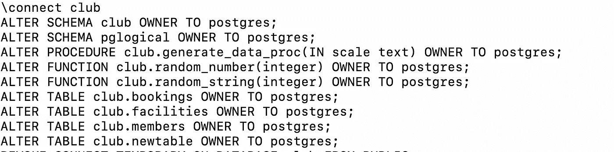

# PostgreSQL 中的迁移后任务:迁移授权和重新分配所有者

> 原文：<https://medium.com/google-cloud/migrate-grants-and-reassign-owner-in-alloydb-for-postgresql-post-dms-610393731024?source=collection_archive---------1----------------------->

> 它是迁移用户、角色和授权系列的一部分，是从 PostgreSQL 到 Google Cloud PostgreSQL 数据库的同构迁移的一部分。[查看第 1 部分，将用户凭证迁移到 CloudSQL 或 AlloyDB。](/google-cloud/migrate-users-with-credentials-from-cloudsql-to-another-instance-or-alloydb-for-postgresql-e377a222d3f8)

***谷歌云数据迁移服务(DMS)*** 以最少的停机时间简化整体迁移，将谷歌云数据库组合主要迁移到 PostgreSQL 托管服务。对于作为源的 PostgreSQL，它在内部利用 pglogical 扩展，并自动执行迁移模式、代码、初始回填数据和实例中所有数据库的连续更改的整个过程。

查看 DMS 产品团队发布的视频。

数据库迁移服务入门

## DMS 在迁移到 Google Cloud 中 PostgreSQL 时执行的高级任务。

以 AlloyDB 为参考目标，以下是 DMS 执行的高级任务。

> **1。创建数据库并迁移只有模式的**组件，将 **alloydbexternalsync 作为所有者。**
> 2。**创建带有节点和订户的 pglogical 扩展**。
> 3。**在实例中并行启动每个数据库**的回填。
> 4。**表格回填完成后，开始进行数据采集**。
> 5。**监控复制延迟**，一旦为 0，主服务器关闭，启动升级。6。如果有，使用 pglogical 同步序列，并删除 pglogical 节点和订阅。7。**将 AlloyDB 实例**提升为主实例。

DMS 迁移后作业已完成；我们对整个模式和数据组件都很满意，但是在用户和角色方面的额外任务还没有完成。如下所列

> **从具有相同或新凭证的源中迁移用户\角色**
> **迁移** **权限，包括根据源将**
> **更改**数据库对象所有者从 **alloydbexternalsync** 迁移到用户\角色。

我已经在博客上发表了如何 [***将具有凭证的用户从 CloudSQL 迁移到 AlloyDB 或另一个 CloudSQL 实例。***](/google-cloud/migrate-users-with-credentials-from-cloudsql-to-another-instance-or-alloydb-for-postgresql-e377a222d3f8)*还可以利用它将用户从 PostgreSQL 兼容实例迁移到 CloudSQL 或 AlloyDB。*

*在这篇博客中，我们将找到可行的方法和解决方案，作为迁移权限的自动化脚本，并执行必要的 Alter 命令来根据源代码更改所有者。*

## ***迁移** **权限包括授予和撤源。***

*如果迁移到 AlloyDB，我们将使用 PostgreSQL 客户端实用程序 [*pg_dumpall*](https://www.postgresql.org/docs/current/app-pg-dumpall.html) 从源 PostgreSQL(包括 CloudSQL)导出必要的授权和撤销。*

**

*pg_dumpall*

*我们将使用下面列出的键 *pg_dumpall* 选项来迁移用户\角色相关的授权和撤销命令。*

> ***— exclude-database** :根据托管服务排除内部数据库，如从 AWS 迁移的 rdsadmin 或从 cloudsql 迁移到 alloydb 的 cloudsqladmin。
> **—无角色密码**:避免仅在管理实例的情况下导出密码的异常。
> **—仅架构**:仅转储架构相关组件。*

*pg_dumpall 没有任何关于仅迁移授权的特定选项，因此我们将使用 sed 和 grep 等操作系统级命令来获得所需的输出。*

*使用 *pg_dumpall* 从 CloudSQL 作为源导出授权的示例命令。*

```
****pg_dumpall*** *-h <<instance-endpoints>> -U postgres* ***--exclude-database="alloydbadmin|cloudsqladmin|rdsadmin" --schema-only --no-role-passwords*** *| sed '/cloudsqladmin/d;/cloudsqlagent/d;/cloudsqliamserviceaccount/d;/cloudsqliamuser/d;/cloudsqlimportexport/d;/cloudsqlreplica/d;/cloudsqlsuperuser/d;s/NOSUPERUSER//g'* ***| grep -e '^|(GRANT\|REVOKE\|\\connect\)'****
```

**

*pg_dumpall 出口授权*

*我们可以使用类似的命令并进行必要的修改，以生成在 DMS 迁移作业完成后在迁移的数据库上执行的 sql 脚本。*

## ***根据来源将**数据库对象所有者从 **alloydbexternalsync(适用于 AlloyDB as target)** 更改为 user\role。*

*一旦 DMS 迁移工作完成，您将发现所有迁移的模式对象，如表、函数、索引，包括所有者为 *alloydbexternalsync* 的模式。*

*下面是在所有者为 *alloydbexternalsync* 的已迁移数据库中查找所有对象的脚本构建。如果我们已经迁移到 CloudSQL for PostgreSQL，可以使用相同的脚本来检查 *cloudsqlexternalsync* 拥有的所有对象。*

*它将连接到迁移实例中所有数据库，并显示由 DMS 创建的迁移用户拥有的数据库对象( *alloydbexternalsync* )*

## *dbobj_ownerlist.sh*

```
*#!/bin/bash#Argument input hostname , user and password of target PostgreSQL instance on GCP.
#sh dbobj_ownerlist.sh <<host-endpoint-Ip>> <<user>> <<password>>databaseList=$(cat << EOD
SELECT datname FROM pg_database WHERE datname not in ('cloudsqladmin','template0','template1','alloydbadmin' , 'rdsadmin') ORDER BY datname
EOD
)echo ${databaseList} | PGPASSWORD=$3 psql -h $1 \
-d postgres \
-U $2 \
--no-align \
-t \
--field-separator '-' \
-q \
| while IFS='-' read databasename ; dosqlCommand=$(cat <<EOD
SELECT '${databasename}' as DatabaseName,
nsp.nspname as SchemaName
,cls.relname as ObjectName
,rol.rolname as ObjectOwner
,CASE cls.relkind
WHEN 'r' THEN 'TABLE'
WHEN 'm' THEN 'MATERIALIZED_VIEW'
WHEN 'i' THEN 'INDEX'
WHEN 'S' THEN 'SEQUENCE'
WHEN 'v' THEN 'VIEW'
WHEN 'c' THEN 'TYPE'
WHEN 'm' THEN 'MVIEW'
WHEN 'p' THEN 'PARTITION TABLE'
WHEN 'I' THEN 'PARTITION INDEX'
WHEN 'f' THEN 'FOREIGN TABLE'
ELSE cls.relkind::text
END as ObjectType
FROM pg_class cls
JOIN pg_roles rol
ON rol.oid = cls.relowner
JOIN pg_namespace nsp
ON nsp.oid = cls.relnamespace
WHERE nsp.nspname NOT IN ('information_schema', 'pg_catalog')
AND nsp.nspname NOT LIKE 'pg_toast%'
AND rol.rolname IN ('alloydbexternalsync','cloudsqlexternalsync')
UNION
SELECT '${databasename}' , nsp.nspname , nsp.nspname , rol.rolname , 'SCHEMA'
FROM  pg_namespace nsp INNER JOIN pg_roles rol
ON nsp.nspowner = rol.oid
WHERE rol.rolname IN ('alloydbexternalsync','cloudsqlexternalsync')
UNION
SELECT  '${databasename}' ,  N.nspname  ,  quote_ident(p.proname) ,  rol.rolname , CASE p.prokind
WHEN 'f' THEN 'FUNCTION'
WHEN 'p' THEN 'PROCUDURE'
WHEN 'a' THEN 'AGGREGATE FUNCTION'
WHEN 'w' THEN 'WINDOW FUNCTION'
ELSE p.prokind::text
END as ObjectType
FROM   pg_catalog.pg_proc p
JOIN   pg_catalog.pg_namespace n ON n.oid = p.pronamespace
JOIN pg_roles rol
ON   rol.oid = p.proowner
WHERE  n.nspname not like 'pg_catalog%'
AND rol.rolname IN ('alloydbexternalsync','cloudsqlexternalsync')
order by 1,4 ,2
EOD
)echo  ${sqlCommand} | PGPASSWORD=$3 psql -h $1 -U $2 -d ${databasename}done*
```

> *sh db obj _ owner list . sh<<host-endpoint-ip>><<user>><<password>></password></user></host-endpoint-ip>*

**

*dbobj_ownerlist.sh*

*在接下来的步骤中，我们将根据源数据库生成必要的 ALTER 命令来更改所有者。在对对象所有者的变更应用必要的变更时，我们将使用与迁移授权相同的方法，即 *pg_dumpall。**

```
****pg_dumpall*** *-h <<instance-endpoints>>  --exclude-database="alloydbadmin|cloudsqladmin|rdsadmin" --schema-only --no-role-passwords  | sed '/cloudsqladmin/d;/cloudsqlagent/d;/cloudsqliamserviceaccount/d;/cloudsqliamuser/d;/cloudsqlimportexport/d;/cloudsqlreplica/d;/cloudsqlsuperuser/d;s/NOSUPERUSER//g' |* ***grep -e*** *'^\(GRANT\|REVOKE\|\\connect\****|ALTER.*OWNER.*\****)'**
```

*它将根据所有者和授权生成 Alter。检查如下生成的示例输出。*

**

****pg_dumpall —更改所有者****

*因此，现在我们可以将上面生成的 *pg_dumpall* 输出应用到迁移的目标实例，DMS 迁移后的作业就完成了。*

*通过 *pg_dumpall* ，我们可以组合所有关于整体用户\角色迁移的命令，包括创建、权限和根据源数据库重新分配所有者。*

```
****pg_dumpall*** *-h <<instance-endpoints>> -U postgres  --exclude-database="alloydbadmin|cloudsqladmin|rdsadmin" --schema-only --no-role-passwords  | sed '/cloudsqladmin/d;/cloudsqlagent/d;/cloudsqliamserviceaccount/d;/cloudsqliamuser/d;/cloudsqlimportexport/d;/cloudsqlreplica/d;/cloudsqlsuperuser/d;s/NOSUPERUSER//g' | grep -e '^\****(GRANT\|REVOKE\|\\connect\|ALTER.*OWNER.*\|CREATE ROLE\|ALTER ROLE\)'****
```

## *附加注释*

*默认情况下，每当在 CloudSQL 或 AlloyDB 之类的托管实例中创建数据库时，公共模式由 cloudsqlsuperuser 或 alloydbsuperuser 拥有。如果我们从一个托管实例迁移到 AlloyDB，我们需要明确地将公共模式的所有者分配给相应的用户。*

## *结论*

*DMS 迁移工作完成后，我们需要处理下面列出的用户\角色相关任务。*

> ***使用相同或新的凭证
> **从源中迁移用户\角色**迁移** **权限，包括根据源将**
> **更改**数据库对象所有者从 **alloydbexternalsync** 迁移到用户\角色。*

**pg_dumpall* 和脚本共享可用于启用迁移授权，并在 DMS 迁移作业完成后更改源中数据库对象的所有者。*

> *一旦迁移了用户或角色，围绕凭证和允许模式实施策略是非常关键的。CloudSQL 包含管理数据库用户凭证的密码策略，[查看博客了解更多信息。](/google-cloud/password-policies-with-cloudsql-for-postgresql-adf7f7e18cca)*