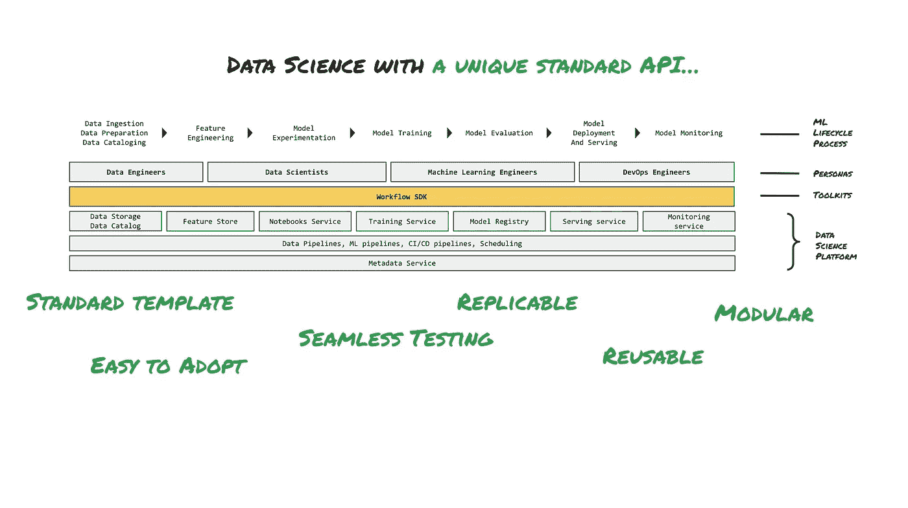

# 在 Vertex AI 上迁移 Kedro 管道

> 原文：<https://medium.com/google-cloud/migrate-kedro-pipeline-on-vertex-ai-fa3f2c6f7aad?source=collection_archive---------1----------------------->

## 实验方法


图。1 —使用 Vertex AI 的 Kedro 项目开发工作流

# 好吧，你说，我听！

关于 Google Cloud 上的[数据科学，你有什么想看的想法？请填写](https://cloud.google.com/data-science)[这张表格](https://forms.gle/H89eNLTVtCdpP1ro6)让我知道。这将对我以后的博客帖子有所帮助=)

# 放弃

你对凯卓了解多少？如果你没有，我给[留了一个简短的介绍视频](https://www.youtube.com/watch?v=KEdmJ2ADy_M)和一篇[中型文章](/quantumblack/introducing-kedro-the-open-source-library-for-production-ready-machine-learning-code-d1c6d26ce2cf)。我还假设你知道顶点 AI。但是你有[这篇文章](https://cloud.google.com/blog/products/ai-machine-learning/vertex-ai-overview)开发者支持者分享了更多关于它的内容。最后，本文基于最近引入顶点 AI 管道支持的 [kedro-kubeflow](https://kedro-kubeflow.readthedocs.io/en/0.4.4/index.html) 插件。**还在实验阶段**。但我觉得探索一下可能会很有趣。

# 前提

最近，我有机会与几个数据科学团队交谈。我们还讨论了他们在制作现成代码时面临的主要挑战。结果是交付时间通常会变长，因为

1.  **由不同背景的数据工程师和数据科学家组成的团队**面临的管理挑战。此外，在大多数情况下，他们都缺乏软件工程技能。而且，如果我们加上工作场所的混乱环境，严格的截止日期和令人分心的事情，就会导致薄弱的流程、低效的协作和糟糕的代码质量。
2.  **实验**。在通往“最佳”ML 方法的过程中，您使用不同的数据、建模方法和参数配置进行了几次实验。作为管理挑战的结果，团队不能产生适当的文档，并且不能保证代码的可再现性和可重用性。
3.  **属地**。与传统软件不同，ML 代码具有数据和系统依赖等依赖性。它们侵蚀了封装和模块化设计为了维护代码而帮助创建的边界。同时，让测试和监控变得非常具有挑战性。
4.  **缺乏标准化。**最后，一旦您找到了最佳模型，团队需要重新设计代码以满足 IT 规范，并构建一个可复制的管道来自动重新训练和部署模型。


图 2 —没有工作流框架的数据科学难点

出于这些原因，大多数团队决定致力于他们所谓的**【模板】**或**【工作流框架】**或**【界面】**。他们中的一些人从零开始建造了一个，另一些人采用了 CookieCutter，或者像这次一样，采用了 Kedro。最后，目标是在他们的数据科学平台 SDK 之上引入一个标准化层，以便在软件工程最佳实践方面创建可复制的 ML 项目。



图 3 —工作流框架带来的数据科学优势

在这一点上，你可能想知道:

> Vertex AI 如何融入这个故事？Kedro 和 Vertex AI 有什么联系？

让我们看看。

# 我们的场景

假设你是一家小型农业咨询公司创新部门的一员。一个更大的农民联盟希望将三种不同小麦品种的分类过程自动化:卡马、罗莎和加拿大小麦。为了验证 ML 方法，与一个重要的农业物理研究所合作，使用软 X 射线技术检测了内核内部结构的高质量可视化。提供数据是为了验证概念。

目标是为这三种类型的小麦建立一个固体分类器。为了加快 ML 实验阶段的速度并提供一个现成的代码，您的团队采用了 Kedro 作为项目框架。由于成员的数量和要处理的数据量，您一直在寻找一种可让您轻松扩展的托管服务。事实上，谈到 Kedro，当您必须在生产中交付模型时，它使用 Docker 或 Airflow 提供了一个强大的管道和打包框架，这意味着您的 Kedro 管道至少可以无缝部署在 Kubernetes (Kubeflow Operator)或 Airflow cluster (DAG)上。但是你仍然需要找出他们完成工作所需的资源。事情是这样的:

> 如果您可以找到一种托管的方式来部署 Kedro 管道，那会怎么样呢？

你当时想到的唯一答案是:**顶点 AI 管道*。**根据[公开文档](https://kedro.readthedocs.io/en/stable/10_deployment/06_kubeflow.html)，Kedro 管道可以转换为 Kubeflow 管道，这意味着它们可以部署在 Vertex AI 服务上。至少在理论上，这足以让团队在这个概念验证中一试身手。

# 我们的数据集

该数据集来自卢布林大学和克拉科夫工业大学的马佐格扎塔·查里亚塔诺维奇、耶日·尼翁扎斯、彼得·库尔奇基、彼得·科瓦尔斯基、西曼·祖卡斯克和萨沃米尔·扎克提供的 [UCI 种子数据集](https://archive.ics.uci.edu/ml/datasets/seeds)。利用软 X 射线技术和 GRAINS 软件包，从 210 个小麦样品中构造了以下 7 个实值几何参数:面积 A、周长 P、紧密度 C、粒长、粒宽、非对称系数和粒槽长度。

# 从 Kedro 到 Vertex AI，通过插件和简单的安排

让我们假设您已经按照 Kedro 文档中的描述构建了自己的管道。如果你做了正确的事情，你应该有以下的文件夹结构。

```
.
├── README.md
├── conf
│   ├── README.md
│   ├── base
│   └── local
├── data
│   ├── 01_raw
│   ├── 02_intermediate
│   ├── 03_primary
│   ├── 04_feature
│   ├── 05_model_input
│   ├── 06_models
│   ├── 07_model_output
│   └── 08_reporting
├── docs
│   ├── build
│   └── source
├── info.log
├── logs
│   ├── info.log
│   └── journals
├── notebooks
│   ├── 1_kedro_vertex_wheat_beam_clf_xgb.ipynb
│   └── notebook_template.ipynb
├── pyproject.toml
├── setup.cfg
└── src
    ├── requirements.in
    ├── requirements.txt
    ├── setup.py
    ├── tests
    ├── wk_classification
```

其中*1 _ 柯德罗 _ 顶点 _ 小麦 _ 梁 _ clf _ XB . ipynb*是我用来围绕 ML 方法做一些实验的笔记本。在本例中，我最终使用了 XGBoost 模型。

下面你可以看到我的管道可视化


图 Kedro Viz 上的 Kedro 管道执行图

从这里开始，我几乎无法按照以下顺序来表达我所讲述的将 Kedro 管道部署到 Vertex AI 的步骤: **Package。采纳。转换。安排一下。跑。**

## 打包。

为了将 Kedro 项目作为 Vertex AI 管道交付，我安装了*文档中描述的 *kedro-docker* 插件，并且构建了 docker 映像。*

这个插件有很好的命令行功能。你只需要跑

```
kedro docker init
```

并生成 *Dockerfile。还有 dockerignore。为您的项目提供 dive-ci* 文件。为了让它发挥作用，我刚刚更改了 Dockerfile 中的 BASE_IMAGE，并扩展了*。doctrignore*包括数据文件夹。在*文件*下方:

```
**ARG BASE_IMAGE=google/cloud-sdk:latest**
FROM $BASE_IMAGE# install project requirements
COPY src/requirements.txt /tmp/requirements.txt
RUN pip install -r /tmp/requirements.txt && rm -f /tmp/requirements.txt# add kedro user
ARG KEDRO_UID=999
ARG KEDRO_GID=0
RUN groupadd -f -g ${KEDRO_GID} kedro_group && \
useradd -d /home/kedro -s /bin/bash -g ${KEDRO_GID} -u ${KEDRO_UID} kedro# copy the whole project except what is in .dockerignore
WORKDIR /home/kedro
COPY . .RUN chown -R kedro:${KEDRO_GID} /home/kedro
USER kedro
RUN chmod -R a+w /home/kedroEXPOSE 8888CMD [“kedro”, “run”]
```

还有*。doctrignore*

```
##########################
# Kedro PROJECT

# ignore Dockerfile and .dockerignore
Dockerfile
.dockerignore

# ignore potentially sensitive credentials files
conf/**/*credentials*

# ignore all local configuration
conf/local
!conf/local/.gitkeep

# ignore everything in the following folders
# data
logs
notebooks
references
results

# except the following
!logs/.gitkeep
!notebooks/.gitkeep
!references/.gitkeep
!results/.gitkeep
**!data/01_raw**
```

现在，我们应该拥有了将 Kedro 项目容器化并使用 Kubeflow Pipelines 进行部署所需的全部资源。基于[原始文档](https://kedro.readthedocs.io/en/stable/10_deployment/06_kubeflow.html)，您需要运行提供的脚本，该脚本将 Kedro 节点和依赖关系转换为相应的工作流规范。我遇到的一些限制与脚本使用的处于折旧模式的 KFP v1 和 ContainerOp 有关。我还做了一些测试，生成的规范不符合 Vertex AI 管道服务所需的格式。

因此，我开始深入探讨“对话”挑战，我发现即使我们按原样转换管道，它也无法在自行管理的 Kubernetes 集群或 Vertex AI 管道服务上工作。原因何在？因为:

1.  在 Kubeflow 上运行 Kedro pipeline 时，节点不共享内存。那么 *MemoryDataSets* 就不起作用了，每个工件都需要存储为一个文件。
2.  由于无服务器服务，必须传递一组不同的参数，以便在 Vertex AI 管道上成功部署管道。

对我们来说幸运的是， [*kedro-kubeflow*](https://kedro-kubeflow.readthedocs.io/en/0.4.4/index.html) 插件最近引入了一个扩展，允许在与 Vertex AI 服务兼容的 KFP 标准中转换 kedro 管道。尽管它仍处于试验阶段，但我发现它能够通过做一些安排来应对其中的一些挑战。

## 适应。

一旦我[安装了插件](https://kedro-kubeflow.readthedocs.io/en/0.4.4/source/02_installation/01_installation.html#plugin-installation)，为了设置顶点 AI 管道作为运行基础设施，我创建了一个新的 gcp 配置文件夹。然后，由于无服务器服务，为了成功地部署管道，必须传递一组不同的参数。在插件文档中，你会找到它们的完整描述。我还修改了目录，以处理“不共享内存”节点的限制。为简单起见，您可以在下面找到目录

```
seeds:
 type: pandas.CSVDataSet
 filepath: /gcs/${KEDRO_CONFIG_BUCKET}/data/seeds.csv
 layer: raw
preprocessed_seeds:
 type: pandas.CSVDataSet
 filepath: /gcs/${KEDRO_CONFIG_BUCKET}/data/preprocessed_seeds.csv
 layer: processing
X_train:
 type: pandas.CSVDataSet
 filepath: /gcs/${KEDRO_CONFIG_BUCKET}/data/X_train.csv
 layer: processing
X_test:
 type: pandas.CSVDataSet
 filepath: /gcs/${KEDRO_CONFIG_BUCKET}/data/X_test.csv
 layer: processing
y_train:
 type: pandas.CSVDataSet
 filepath: /gcs/${KEDRO_CONFIG_BUCKET}/data/y_train.csv
 layer: processing
y_test:
 type: pandas.CSVDataSet
 filepath: /gcs/${KEDRO_CONFIG_BUCKET}/data/y_test.csv
 layer: processing
xgboost_classifier:
 type: pickle.PickleDataSet
 filepath: /gcs/${KEDRO_CONFIG_BUCKET}/models/xgboost
 backend: joblib
 versioned: true
 layer: model
```

和配置

```
host: vertex-ai-pipelines
project_id: ${KEDRO_CONFIG_PROJECT_ID}
region: ${KEDRO_CONFIG_REGION}
run_config:
 root: ${KEDRO_CONFIG_BUCKET}/pipelines
 image: gcr.io/${KEDRO_CONFIG_PROJECT_ID}/classify_wheat_kernel
 experiment_name: classify-wheat-kernel
 run_name: classify-wheat-kernel
```

其中${…}将利用 [TemplatedConfigLoader](https://kedro.readthedocs.io/en/stable/kedro.config.TemplatedConfigLoader.html#kedro-config-templatedconfigloader) 类，该类允许基于配置的模板值。

到目前为止，一切都准备好了。是时候转换管道了

## 转换。安排。快跑。

老实说，转换本身简单明了。用 *dockerfile* 和*。我构建图像，正确标记，并把它推送到项目的容器注册表中。*

```
kedro docker build --docker-args="--no-cache" --base-image="google/cloud-sdk:latest"
docker tag classify-wheat-kernel gcr.io/$PROJECT_ID/classify_wheat_kernel
docker push gcr.io/$PROJECT_ID/classify_wheat_kernel
```

然后我运行命令

```
kedro kubeflow -e gcp compile -o ../pipeline/kedro-vertex-classify-wheat-kernel-pipeline.json
```

就是这样。这是因为该命令将生成一个 PipelineSpec，它应该与 Vertex AI 服务兼容。但是，根据我的经验，我必须稍微调整一下输出才能让它工作。在我所做的更改列表下面

1.  更换*系统。数据集"*到*"系统。Model"* 为了存储具有正确元数据类型的模型工件
2.  从 kedro 运行命令行中删除每个节点的*–-params*参数
3.  更正 cp 路径，将管道工件移动到正确的元数据路径下。例如，我将 */home/kedro//gcs/* 改为 */home/kedro/gcs/*

**更新:**请查看“附加备注”部分以获得进一步的说明。

好了，当我完成了这些，我只是使用一个自定义脚本和 [Vertex AI SDK](https://cloud.google.com/vertex-ai/docs/pipelines/run-pipeline#vertex-ai-sdk-for-python) 将管道提交给 Vertex AI。下面你可以看到顶点 AI 上转换后的流水线的执行图。


图 5 —顶点 AI 管道上的 Kedro 管道执行图

我可以高兴地说:转换完成！

# 下一步是什么

在本文中，我使用一个简单的管道示例来展示如何将 Kedro 管道转换为 Vertex AI 管道。我利用了 Kedro 生态系统中一些最棒的插件，比如[](https://github.com/quantumblacklabs/kedro-docker)*和 [*kedro-kubeflow* 。](https://github.com/getindata/kedro-kubeflow)*

*正如我在开始时提到的，整个方法是实验性的，因为 Kedro Kubeflow 插件支持 Vertex AI 管道。例如，除了一些调整之外，我无法弄清楚如何跟踪 InputParameters 和 OutputParameters，如上图所示。但是提交几个命令来将整个项目转换成一个几乎可以投入生产的可扩展管道的想法对我来说仍然很有价值。这就是为什么我期待与插件的生产版本一起工作。*

*同时，我希望你会对这篇文章感兴趣。如果有，就鼓掌或者留言评论。欢迎通过 LinkedIn[或 Twitter](https://www.linkedin.com/in/ivan-nardini/)与我联系，进行进一步讨论或在 Google Cloud 上就数据科学进行交流！*

**感谢 Tuba Islam、Janos Bana、Manuel Hurtado、Mariusz Strzelecki 和 Marek Wiewiorka 提供的宝贵反馈。**

# *参考*

*   *[https://kedro.readthedocs.io/en/stable/index.html](https://kedro.readthedocs.io/en/stable/index.html)*
*   *[https://kedro . readthe docs . io/en/stable/03 _ tutorial/01 _ space flights _ tutorial . html](https://kedro.readthedocs.io/en/stable/03_tutorial/01_spaceflights_tutorial.html)*
*   *[https://kedro . readthe docs . io/en/stable/10 _ deployment/06 _ kube flow . html](https://kedro.readthedocs.io/en/stable/10_deployment/06_kubeflow.html)*
*   *[https://github.com/quantumblacklabs/kedro-docker](https://github.com/quantumblacklabs/kedro-docker)*
*   *[https://kedro-kubeflow.readthedocs.io/en/0.4.4/index.html](https://kedro-kubeflow.readthedocs.io/en/0.4.4/index.html)*
*   *[https://cloud . Google . com/python/docs/reference/ai platform/latest](https://cloud.google.com/python/docs/reference/aiplatform/latest)*
*   *[https://Google-cloud-pipeline-components . readthedocs . io/en/Google-cloud-pipeline-components-0 . 2 . 0/](https://google-cloud-pipeline-components.readthedocs.io/en/google-cloud-pipeline-components-0.2.0/)*

# *附加备注*

*同时，我有机会与 [Mariusz Strzelecki](https://medium.com/u/48a677777117?source=post_page-----fa3f2c6f7aad--------------------------------) 和 [Marek Wiewiorka](https://medium.com/u/978aad755da?source=post_page-----fa3f2c6f7aad--------------------------------) 讨论，他们是 *kedro-kubeflow* 插件的维护者。他们对我遇到的案例提供了很好的反馈。按顺序:*

1.  *[最新版本(0.4.4)支持模型工件](https://github.com/getindata/kedro-kubeflow/blob/0.4.4/kedro_kubeflow/vertex_ai/io.py#L57)，只要工件的图层设置为“模型”。作为旁注，该插件最初是为 KFP v1 协议兼容性(AI 平台管道)而创建的。那个版本没有区分工件类型。现在它支持数据集和模型。*
2.  *需要进一步调查。[插件支持参数](https://github.com/getindata/kedro-kubeflow/blob/0.4.4/kedro_kubeflow/vertex_ai/generator.py#L144)。我要在 Github 上开一期。*
3.  *这与顶点 AI 文档建议/gcs/ as 前缀的事实有关，而插件代码以不同的方式处理它。*

**你们中的一些人可能会争辩为什么我不建议作曲家。下面是来自[“在谷歌云上实现机器学习的最佳实践”](https://cloud.google.com/architecture/ml-on-gcp-best-practices)文章的注释:*

**"虽然您可以考虑其他编排器，如* [*【云作曲】*](https://cloud.google.com/composer) *(参见* [*气流*](https://airflow.apache.org/docs/apache-airflow/stable/tutorial.html) *)，但管道是更好的选择，因为它包括对常见 ML 操作的内置支持，并跟踪特定于 ML 的元数据和沿袭。沿袭对于验证您的管道在生产中是否正常运行尤为重要。**