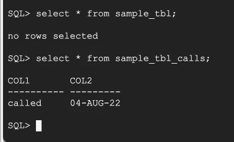
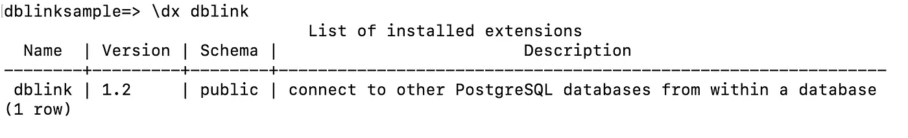
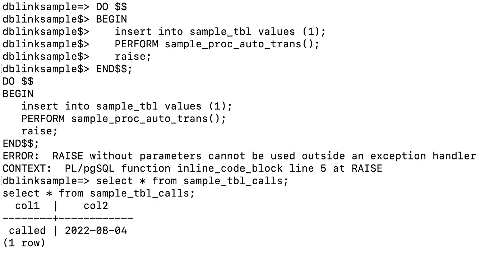
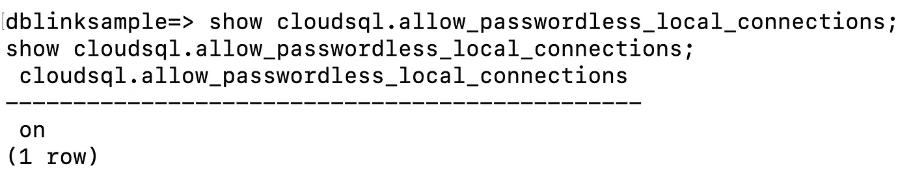
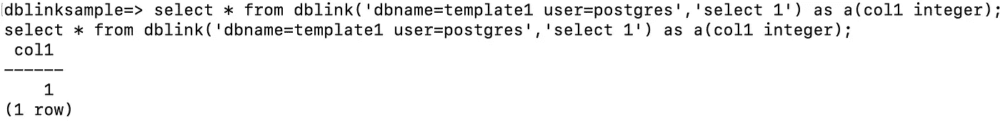
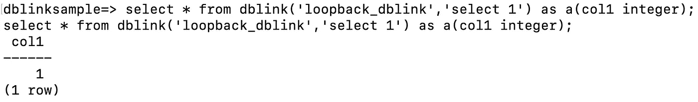

# 将 Oracle 自治事务迁移到 CloudSQL for PostgreSQL。

> 原文：<https://medium.com/google-cloud/migrate-oracle-autonomous-transaction-to-cloudsql-for-postgresql-adbc35152ba2?source=collection_archive---------1----------------------->

从 Oracle 迁移到 PostgreSQL compatible 最常见的迁移模式之一是自治事务。自治事务提供了实现子程序的功能，这些子程序可以独立于父事务进行事务提交或回滚。PostgreSQL 本身不提供类似的特性。

作为构建迁移模式以在 PostgreSQL compatible 中实现类似功能的一部分，我们遵循以下准则。

1.  重构在应用程序内的自治事务中实现的功能，或者向后工作以理解需求，并在可行的情况下作为云原生实现。
2.  如果重构或替代解决方案不可行，则利用 CloudSQL 支持的 PostgreSQL 扩展，如 dblink。

在本帖中，我们将使用 dblink 扩展实现类似的功能，并使用云 sql 数据库标志来避免将 dblink 本地连接的密码传递给同一个实例。

## Oracle 中的自主事务

让我们创建一个模拟代码来理解 Oracle 中的自治事务行为。

```
create table sample_tbl (col1 integer);create table sample_tbl_calls(col1 varchar2(10) , col2 date);CREATE OR REPLACE PROCEDURE sample_proc_auto_trans
AS
PRAGMA AUTONOMOUS_TRANSACTION;
BEGIN
INSERT INTO sample_tbl_calls VALUES(‘called’,sysdate);
commit;
END sample_proc_auto_trans;
/
```

PRAGMA 是 Oracle 中的编译器指令。AUTONOMOUS_TRANSACTION 强调程序块独立于父事务，并在自己定义的事务范围内运行。

我们将使用下面的 plsql 代码块模拟自治事务调用，并通过引发随机异常回滚父插入。

```
begin
insert into sample_tbl values (1);
sample_proc_auto_trans();
raise ZERO_DIVIDE;
commit;
exception when others then
**rollback;**
end;
```

我们回滚了实际的插入，但是自治过程内的插入被提交。



PostgreSQL 中的扩展增强了数据库提供的整体功能。C [点击这里](https://cloud.google.com/sql/docs/postgres/extensions#postgresql-extensions-supported-by-cloud-sql)查看 Cloud SQL 支持的扩展的完整列表。

PostgreSQL 中的 dblink 将显式打开一个新连接，并在其自己的事务范围内执行一个自治组件。就需要考虑总体影响的新连接而言，它有自己的开销。

让我们从在数据库中创建扩展开始。

```
dblinksample=> create extension dblink;
create extension dblink;
CREATE EXTENSION
```



一旦添加了 dblink 扩展，我们就可以通过传递必要的细节来调用远程调用。对于自治事务，远程调用是使用 dblink 实现的，但它连接到同一个数据库和实例。

典型的自治事务转换函数如下所示。

```
CREATE OR REPLACE FUNCTION sample_proc_auto_trans()
RETURNS void
AS
$BODY$
DECLARE
v_sql text;
BEGIN
PERFORM dblink_connect('conn','dbname=dbuser user=postgres password=********** port=5432');v_sql := 'INSERT INTO sample_tbl_calls VALUES (''called'',clock_timestamp())';PERFORM dblink_exec('conn', v_sql);
PERFORM dblink_disconnect(‘conn’);
END;
$BODY$
LANGUAGE plpgsql;
```

请注意:-我们已经显式传递了数据库用户的凭据，并且没有传递实例详细信息，因为它将连接到同一个实例。

让我们在 pl\pgsql 块下面运行，它将在异常时触发回滚。

```
DO $$
BEGIN
insert into sample_tbl values (1);
PERFORM sample_proc_auto_trans();
raise;
END$$;
```

它在异常时隐式回滚，但来自 sample_proc_auto_trans 的 dml 被提交。



这种实现的一个主要问题是硬编码的密码作为过程代码逻辑的一部分被传递。

CloudSQL 提供了一个数据库标志“*allow _ password _ local _ connections*”，可以在不需要传递密码的情况下实现本地连接。我们可以启用它，并更改以前的代码逻辑，使其不包括密码，如下所示。

```
PERFORM dblink_connect('conn','dbname=dblinksample user=postgres port=5432');
```

一旦设置了数据库标志，我们就可以对所有本地连接使用 dblink，而无需传递用户凭据。



我们可以在创建外部服务器和用户映射时扩展类似的行为。它可用于来自 dblink 的任何本地连接。

```
CREATE SERVER loopback_dblink FOREIGN DATA WRAPPER dblink_fdw OPTIONS (dbname 'dblinksample');
CREATE USER MAPPING FOR postgres SERVER loopback_dblink
OPTIONS (user 'dbuser');
```



带有云 sql 标志的整体 dblink 实现有助于我们实现与 Oracle 中自治事务类似的行为。由于不需要使用 CloudSQL 提供的标志的密码，我们可以避免从 dblink 作为部分或本地连接传递。
它还增加了额外的连接开销，因此在实现模块之前需要进行测试并相应地衡量影响。