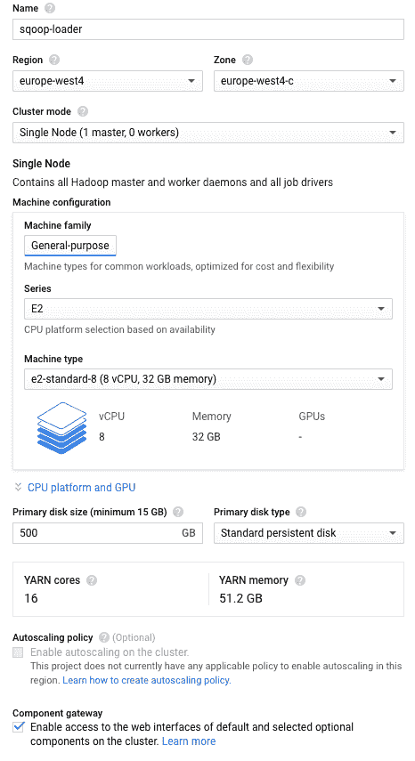

# 使用 Dataproc 和 Sqoop 将 Oracle 迁移到大查询

> 原文：<https://medium.com/google-cloud/migrate-oracle-data-to-bigquery-using-dataproc-and-sqoop-cd3863adde7b?source=collection_archive---------0----------------------->


> 想把 Oracle 数据库迁移到大查询？不知道如何将数据从 Oracle 迁移到 Big Query？想用 GCP 本地工具做这件事吗？
> 
> 继续读，你在正确的岗位上！

下面是使用 Dataproc 和 Sqoop 进行 Oracle 迁移的一些优势；

1.  几分钟后 Dataproc 就可以使用了
2.  有内置的 GCS 连接器，所以数据将保存在 GCS 中，以备大查询使用。只需使用“gs://”，而不是“hdfs://”
3.  Sqoop 支持许多关系数据库和大型机
4.  Sqoop 具有强大的可扩展性，例如配置分割和并行性。

Cloud Composer 或云数据融合也可用于 Oracle 到大型查询的迁移。我将在下一篇博文中讨论这些内容。

# 1.创建 Dataproc 集群

首先创建一个 dataproc 集群。您可以使用单节点 dataproc 集群。我们不需要很多节点，因为我们在这里不做大数据分析。

**性能提示；**大概网络带宽或者 Oracle 服务器(CPU/IO)会是瓶颈。dataproc 集群的 CPU 数量可能无关紧要，但是应该与期望的并行性成比例。为 dataproc、GCS 存储桶和 BQ 数据集仔细选择区域，它应该靠近您的 Oracle 数据库位置，以提供更好的网络延迟。

**哈提示；**如果这不是生产关键(即停机时间不是那么关键)，您就不需要 HA (3 个主节点)

**账单提示；** E2 实例比 N2 实例便宜。我们不需要附加 GPU 或其他 N2 功能，所以您可以使用 E2。

**上浆提示；**数据将被写入 GCS，HDFS 大小无关紧要。



```
gcloud dataproc clusters create sqoop-cluster — enable-component-gateway — region europe-west4 — subnet default — zone europe-west4-b — single-node — master-machine-type e2-standard-8 — master-boot-disk-size 500 — image-version 1.3-debian10 — project <project-id>
```

# 2.获取 Oracle JDBC 驱动程序

下载[甲骨文 JDBC 驱动](https://www.oracle.com/database/technologies/appdev/jdbc-downloads.html)。

出于本教程的目的，下载 [ojdbc8.jar](https://download.oracle.com/otn-pub/otn_software/jdbc/ojdbc8.jar) 或 ojdbc7.jar 版本

# 3.将 Oracle JDBC 驱动程序上传到 GCS

在 GCS 中创建一个存储桶，并将文件上传到 GCS；

从 cloudshell(或者您的终端，如果您在中安装了 gsutil

```
gsutil mb -l europe-west4 gs://my-sqoop-jar-bucket
wget [https://download.oracle.com/otn-pub/otn_software/jdbc/ojdbc8.jar](https://download.oracle.com/otn-pub/otn_software/jdbc/ojdbc8.jar)
gsutil cp ojdbc8.jar gs://my-sqoop-jar-bucket/
```

# 4.下载和上传 sqoop jars

在供应期间，可以使用[这个初始化操作](https://github.com/GoogleCloudDataproc/initialization-actions/tree/master/sqoop)安装 Sqoop。但是出于本教程的目的，我们将手动下载 sqoop jars 并上传到 GCS。

从[这里](http://www.apache.org/dyn/closer.lua/sqoop/)下载 sqoop jars。从任意镜像中选择 sqoop-1 . 4 . 7 . bin _ _ Hadoop-2 . 6 . 0 . tar . gz。例如；[http://Apache . cs . uu . nl/sqoop/1 . 4 . 7/sqoop-1 . 4 . 7 . bin _ _ Hadoop-2 . 6 . 0 . tar . gz](http://apache.cs.uu.nl/sqoop/1.4.7/sqoop-1.4.7.bin__hadoop-2.6.0.tar.gz)

```
BUCKET=gs://my-sqoop-jar-bucket
wget [https://apache.belnet.be/sqoop/1.4.7/sqoop-1.4.7.bin__hadoop-2.6.0.tar.gz](https://apache.belnet.be/sqoop/1.4.7/sqoop-1.4.7.bin__hadoop-2.6.0.tar.gz)
tar xvfz sqoop*
gsutil cp sqoop-1.4.7.bin__hadoop-2.6.0/sqoop-1.4.7.jar $BUCKET/
gsutil cp sqoop-1.4.7.bin__hadoop-2.6.0/lib/* $BUCKET/
```

# 5.从 Oracle 数据库中提取一个表并加载到 GCS 中

我们将使用带分隔符的文件类型(文本文件),因为在加载到大查询时，AVRO 格式的日期和数字列可能会有问题。

创建一个 GCS bucket 来存储提取文件，并提交您的 Sqoop 作业；

```
gsutil mb -l europe-west4 gs://my-oracle-extractJAR_BUCKET=gs://my-sqoop-jar-bucket
STAGING_BUCKET=gs://my-oracle-extract
libs=`gsutil ls $JAR_BUCKET | paste -sd, — `
JDBC_STR=jdbc:oracle:thin:<username>/<password>@<IP>:1521/<SERVICE>
TABLE=EMPLOYEES
SCHEMA=HRgcloud dataproc jobs submit hadoop — cluster=sqoop-cluster — region=europe-west4 — class=org.apache.sqoop.Sqoop — jars=$libs — import -Dmapreduce.job.user.classpath.first=true -Dorg.apache.sqoop.splitter.allow_text_splitter=true — connect=$JDBC_STR — target-dir=$STAGING_BUCKET/$TABLE — table=$SCHEMA.$TABLE — enclosed-by ‘\”’ — escaped-by \” — fields-terminated-by ‘|’ — null-string ‘’ — null-non-string ‘’ — as-textfile
```

Sqoop 有一个[错误](https://issues.apache.org/jira/browse/SQOOP-3480)，当“字符既用作封闭字符又用作转义字符”时会导致重复的双引号在大查询中，需要作为引号终止字段的转义字符。一种解决方法是在加载后更新 BQ，用单双引号替换双双引号。Sqoop 获取 Oracle 的“日期”类型作为“时间戳”类型。所以目标大查询表应该有“时间戳”列而不是“日期”列。初始加载后，可以很容易地转换到使用 CTAS 日期。

# 6.在大查询中创建数据集和表

如果您还没有创建数据集，请创建一个。

在大查询中创建表。您需要将数字类型转换为数值，并将其他 Oracle 类型转换为相应的 BQ 类型。

> 好消息；自动 Oracle 到 BQ 模式转换器将在下一篇博文中发布，敬请关注。

# 7.将数据从 GCS 加载到大查询

从 GCS 加载大查询表；

```
bq load -source_format=CSV — allow_quoted_newlines — field_delimiter=’|’ BQ_DATASET.$TABLE “$STAGING_BUCKET/$TABLE/part-*”
```

# 8.导出模式中的所有表

```
gcloud dataproc jobs submit hadoop — cluster=sqoop — region=europe-west4 — class=org.apache.sqoop.Sqoop — jars=$libs — import-all-tables -Dmapreduce.job.user.classpath.first=true -Dorg.apache.sqoop.splitter.allow_text_splitter=true — connect=$JDBC_STR — warehouse-dir=$STAGING_BUCKET/$SCHEMA — enclosed-by ‘\”’ — escaped-by \” — fields-terminated-by ‘|’ — null-string ‘’ — null-non-string ‘’ — as-textfile
```

# 9.将所有表格导入 BQ

首先，你需要在 BQ 中创建所有的表(好消息；会是下一篇博文)。然后，您可以使用下面的 shell 脚本来自动加载所有的表。

```
FILTER_DS=$1
FILTER_TABLE=$2
mkdir -p .schemas
files=`gsutil ls -r gs://my-oracle-extract/ | grep "\:$"  `for f in $files
do
  dataset=`echo $f | cut -d/ -f4`
  dataset="${dataset//c_lew/p_lew}"
  table=`echo $f | cut -d/ -f5`
  colon=`echo $f | cut -d/ -f6`
  if [[ ! -z $FILTER_DS ]] && [[ $FILTER_DS != $dataset ]] ; then
    echo "skipping " $dataset
    continue
  fi

  if [[ ! -z $FILTER_TABLE ]] && [[ $FILTER_TABLE != $table ]] ; then
    echo "skipping " $table
    continue
  fi
  if [[ ":" == "$colon" ]] ; then
    bq show --format=prettyjson  $dataset.$table | jq '.schema.fields' > .schemas/$dataset.$table.json 2>/dev/null
    OUT=$?
    if [ $OUT -eq 0 ];then
      f_with_wildcard="${f//\/\://*}"
      echo "Loading $dataset.$table"
      bq load  --field_delimiter='|' --source_format=CSV $dataset.$table $f_with_wildcard .schemas/$dataset.$table.json
    else
      echo "No table definition for $dataset.$table"
    fi
  fidone
```

希望这篇文章对你有用，感谢你的评论和反馈！