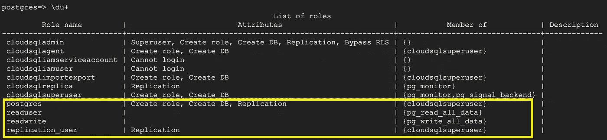
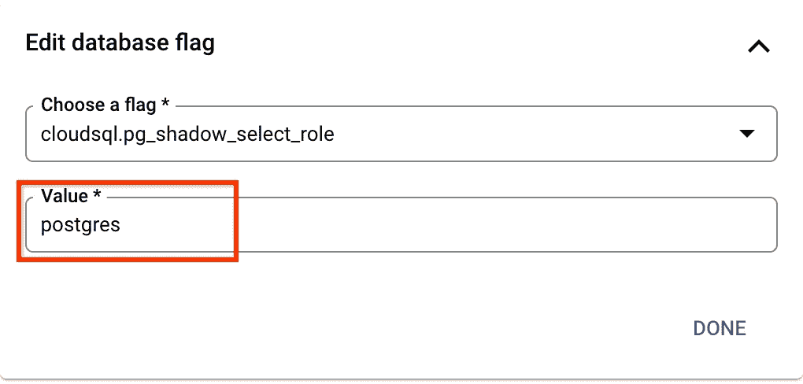

# 将具有凭证的用户迁移到 AlloyDB 或另一个 CloudSQL 实例。

> 原文：<https://medium.com/google-cloud/migrate-users-with-credentials-from-cloudsql-to-another-instance-or-alloydb-for-postgresql-e377a222d3f8?source=collection_archive---------1----------------------->

数据库用户和角色是数据库的组成部分，需要作为整个数据库对象的一部分进行迁移。我们可能会遇到这样的情况:将用户从具有相同密码和权限的 PostgreSQL 托管实例迁移到另一个实例。随着 AlloyDB 在 preview 中可用，我们可能会有一个用例将用户从 CloudSQL 迁移到 AlloyDB，并提供数据来验证概念。

PostgreSQL 提供 pg_dumpall 命令行来迁移包含用户和角色的多个数据库的完整实例。下面是从 PostgreSQL 导出用户或角色的示例命令。

```
pg_dumpall -h <<CLOUD_SQL_INSTANCE_IP>> -U postgres **-r** — if-exists -c
```

让我们假设一个源云 SQL 实例具有以下用户和角色。突出显示的是用户创建的，我们将使用 pg_dumpall 迁移它。



## 不使用密码导出用户和角色

现在让我们运行 pg_dumpall 命令并检查和输出。

```
deepakmahto@db-benchmark:~$ pg_dumpall -h <<CLOUD_SQL_INSTANCE_IP>> -U postgres -r --if-exists -c
Password: 
 — 
 — PostgreSQL database cluster dump
 —SET default_transaction_read_only = off;SET client_encoding = ‘UTF8’;
SET standard_conforming_strings = on;pg_dumpall: error: query failed: ***ERROR: permission denied for table pg_authid***
pg_dumpall: error: query was: **SELECT rolname FROM pg_authid WHERE rolname !~ ‘^pg_’ ORDER BY 1**
```

只有超级用户有权访问 pg_authid 表，它不能作为托管实例一部分从主用户(postgres)访问。一种方法是导出没有密码的用户和角色，并带有“—无角色密码”选项。

```
deepakmahto@db-benchmark:~$ pg_dumpall -h <<CLOUD_SQL_INSTANCE_IP>> -U postgres -r ***--no-role-passwords*** --if-exists -c
Password:..
CREATE ROLE cloudsqlsuperuser;
ALTER ROLE cloudsqlsuperuser WITH NOSUPERUSER INHERIT CREATEROLE CREATEDB LOGIN NOREPLICATION NOBYPASSRLS;
CREATE ROLE postgres;
ALTER ROLE postgres WITH NOSUPERUSER INHERIT CREATEROLE CREATEDB LOGIN REPLICATION NOBYPASSRLS;
CREATE ROLE readuser;
ALTER ROLE readuser WITH NOSUPERUSER INHERIT NOCREATEROLE NOCREATEDB LOGIN NOREPLICATION NOBYPASSRLS;
..
GRANT pg_read_all_data TO readuser GRANTED BY postgres;
..
```

它将导出所有用户和角色，包括由 CloudSQL 内部维护的托管用户，如 cloudsqlsuperuser、cloudsqladmin 等。

我们可以应用操作系统级命令，删除 CloudSQL 实例本地的用户和角色，并且只删除除托管用户之外的角色\用户。作为 ALTER ROLE 的一部分，我们添加了一个额外的命令来替换 NOSUPERUSER，以避免超级用户权限问题。

```
PGPASSWORD=******* pg_dumpall -h <<CLOUD_SQL_INSTANCE_IP>> -U postgres -r --no-role-passwords --if-exists -c ***| sed '/cloudsqladmin/d;/cloudsqlagent/d;/cloudsqliamserviceaccount/d;/cloudsqliamuser/d;/cloudsqlimportexport/d;/cloudsqlreplica/d;/cloudsqlsuperuser/d;s/NOSUPERUSER//g'***...
DROP ROLE IF EXISTS readuser;
DROP ROLE IF EXISTS readwrite;
DROP ROLE IF EXISTS replication_user;
...CREATE ROLE postgres;
ALTER ROLE postgres WITH  INHERIT CREATEROLE CREATEDB LOGIN REPLICATION NOBYPASSRLS;
CREATE ROLE readuser;
ALTER ROLE readuser WITH  INHERIT NOCREATEROLE NOCREATEDB LOGIN NOREPLICATION NOBYPASSRLS;
CREATE ROLE readwrite;
ALTER ROLE readwrite WITH  INHERIT NOCREATEROLE NOCREATEDB LOGIN NOREPLICATION NOBYPASSRLS;
CREATE ROLE replication_user;
ALTER ROLE replication_user WITH  INHERIT NOCREATEROLE NOCREATEDB LOGIN REPLICATION NOBYPASSRLS;
```

现在，虽然我们已经导出了用户和角色，但是密码呢，如何将其从一个托管实例导出到另一个托管实例呢？

## 使用 pg_shadow 导出密码

CloudSQL 提供了一个数据库标志“cloudsql.pg_shadow_select_role”，可以在 pg_shadow 视图中为指定用户选择角色。 [pg_shadow](https://www.postgresql.org/docs/current/view-pg-shadow.html) 视图提供从 pg_authid 查询有登录权限的用户的属性。

在第一步中，我们将在 postgres master user.pg_authid 的 cloudsql 实例上启用“cloudsql.pg_shadow_select_role”。更改数据库标志不需要重启实例。



让我们使用 psql 连接并验证访问。

```
postgres=> show cloudsql.pg_shadow_select_role ;
 cloudsql.pg_shadow_select_role 
 — — — — — — — — — — — — — — — — 
 ***postgres***
(1 row)postgres=> select usename from ***pg_shadow*** where usename not like 'cloudsql%';
     usename      
------------------
 readuser
 readwrite
 replication_user
 postgres
(4 rows)
```

我们可以通过创建 alter 语句导出密码，作为查询 pg_shadow 视图的一部分。pg_shadow 视图显示基于密码加密设置的密码。

```
postgres=> show password_encryption;
 password_encryption 
---------------------
 ***scram-sha-256***
(1 row)postgres=> select 'alter user '|| usename || ' with encrypted password '|| '''' || passwd || ''''||';' from pg_shadow where usename not like 'cloudsql%';
```

pg_dumpall 命令行可用于根据需要导出所有用户和角色，并在查询 pg_shadow 时发布启用数据库标志，我们可以应用 alter password 命令。

## 结论

现在我们了解了将用户及其权限从一个 CloudSQL 实例导出到另一个实例的总体方法。我们将结合整体命令并使用管道方法来移动用户和密码，而不使用暂存文件或存储。假设我们有到源和目标实例的必要连接。

## 步骤 1 :-导出没有密码的用户和角色

管道 pgdumpall 和 psql，用于导出没有密码的用户和角色。

```
PGPASSWORD=******* ***pg_dumpall*** -h <<**CLOUD_SQL_INSTANCE_SOURCE_IP**>> -U postgres -r — no-role-passwords | sed '/cloudsqladmin/d;/cloudsqlagent/d;/cloudsqliamserviceaccount/d;/cloudsqliamuser/d;/cloudsqlimportexport/d;/cloudsqlreplica/d;/cloudsqlsuperuser/d;s/NOSUPERUSER//g' **|** PGPASSWORD=********* ***psql*** -h <<**TARGET_CLOUDSQL_OR_ALLOYDB**>> -U postgres
```

## **步骤 2:-** 生成更改密码并应用于目标

使用 sql 从源生成 alter 命令的管道 psql 在 pg_shadow 视图上为 SELECT 启用必要的标志，并使用 psql 和目标实例的连接详细信息应用它。

```
deepakmahto@db-benchmark:~$ PGPASSWORD=******* **psql** -h <<**CLOUD_SQL_INSTANCE_SOURCE_IP**>> -U postgres -t **-c "select 'alter user '|| usename || ' with encrypted password '|| ''''|| passwd || ''''||';' from pg_shadow where usename not like 'cloudsql%'" |** PGPASSWORD=******* **psql** -h <<**TARGET_CLOUDSQL_OR_ALLOYDB**>> -U postgres
ALTER ROLE
ALTER ROLE
ALTER ROLE
ALTER ROLE
```