# 将 cPanel Web 托管服务器迁移到 Google Cloud

> 原文：<https://medium.com/google-cloud/migrating-a-cpanel-web-hosting-server-to-google-cloud-acdcf7c95768?source=collection_archive---------0----------------------->

*使用 Google 云存储、Google 计算引擎和云 DNS 从旧的 cPanel 托管服务器托管静态和动态网站。*

在这篇文章中，我将展示如何将 cPanel 服务器上的静态网站和动态应用程序迁移到谷歌云平台(GCP)。我的目标是降低我的个人托管成本，将网站迁移到一个安全、更新的环境中，并从我目前的 Linode cPanel VPS 迁移到 GCP。

# 盘货

因为从 cPanel 迁移通常是一项手动任务，所以我将关注域 public_html 目录，并手动迁移任何数据库。在这一步，我将决定哪些留下，哪些离开。在我的源 cPanel 服务器上，我将查找所有活动的域。

```
cat /etc/userdomains
<lines intentionally omitted>ls -al
<lines intentionally omitted> mysql> show databases;
<lines intentionally omitted>
```

现在是开始考虑关闭网站或者你可以存档和停止的好时机。就我而言，这些网站都没有产生任何收入，但它们是我拥有多年的网站，我还不准备摆脱它们。

# 确定迁移的目的地、服务和优先级

这个练习可以帮助您确定迁移的优先级和组织迁移。我正在评估这些网站的用途，确定我想保留的网站，以及它们最适合 GCP 的什么地方。我使用了如下所示的模板来帮助我完成并规划我的迁移:

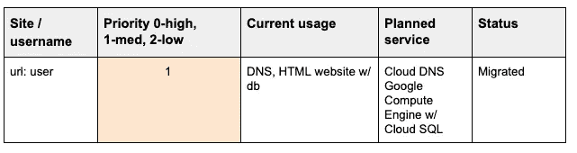

# 源服务器准备

## gcloud SDK 安装在源 cPanel 服务器上

我将使用 Google Cloud SDK 安全地传输文件，所以首先我需要在我的源 cPanel 服务器上安装 SDK。
[安装谷歌云 SDK](https://cloud.google.com/sdk/install) 。

我在安装过时的 cPanel 服务器和 gcloud SDK 时遇到了一些问题。由于 gcloud SDK 需要 Python 2.7 或 3+版本，而我只有 2.6 版本，所以我必须修复以下问题:

**过时的 python (2.6)** 修复:[安装 python27](https://tecadmin.net/install-python-2-7-on-centos-rhel/)

**无法 gcloud auth 登录 sqlite 的问题**

```
gcloud auth login
Go to the following link in your browser:<omitted>Enter verification code:<omitted>ERROR: gcloud crashed (OperationalError): unable to open database file
```

修复:[安装 sqlite 并重新编译 python2.7](https://stackoverflow.com/questions/48349205/how-to-install-sqlite3-for-python-2-7-if-not-installed-by-default)

```
yum install sqlite-devel
cd /usr/src/Python-2.7.18./configure — prefix=/usr/local/bin; make; make install
```

我的 python2.7 位于/usr/local/bin 中

**设置 env 变量，让 cloud SDK 知道 Python 2.7 的位置**

```
export CLOUDSDK_PYTHON=/usr/local/bin/python2.7
```

修复上述问题后，我能够成功地通过 gcloud auth 登录和 gcloud init 对 GCP 进行身份验证，并选择我要用于此次迁移的项目。

# 检查源服务器目录

因为我只从我的 Linode cPanel 服务器转移了 6 个站点，所以我可以很容易地检查每个主目录，看看我在处理什么。我将首先检查 public_html 目录有多大，如果有什么我可以清除的，以使传输更快。

```
du -sh
166M .
```

在这里，我正在寻找任何是 GBs+的，可能需要一段时间来转移。

# 现场验证

对于我们计划在谷歌云存储桶上托管的每个网站，我需要通过修改 DNS 区域来验证域所有权。如果在创建名为 bucket 的域之前没有验证您的域，您将收到以下错误:

```
gsutil mb gs://www.jordanaandmike.us
Creating gs://www.jordanaandmike.us/...AccessDeniedException: 403 The bucket you tried to create requires domain ownership verification. Please see [https://cloud.google.com/storage/docs/naming?hl=en#verification](https://cloud.google.com/storage/docs/naming?hl=en#verification) for more details.
```

遵循此处的文档[域名桶验证](https://cloud.google.com/storage/docs/domain-name-verification)。您可以提前或在迁移过程中完成这项工作。如果您以前从未这样做过，您需要访问您的域名的 DNS 托管位置来添加 TXT 记录，或者您需要将文件上传到根目录。

如果你打算在谷歌服务中使用域名，请确保你是[网站管理员中心](https://www.google.com/webmasters/verification/home?hl=en)的网站所有者。在您通过 HTML 文件上传或 TXT 文件 DNS 区域编辑验证您的域名后，您可以将该域名用于 Google 服务，如云存储。

如果您正在使用名称服务器(可能当前指向 cPanel 服务器)，您将需要将 DNS 服务器设置从自定义更改为注册服务器，以便您可以修改 DNS 区域或修改托管服务器上的区域。

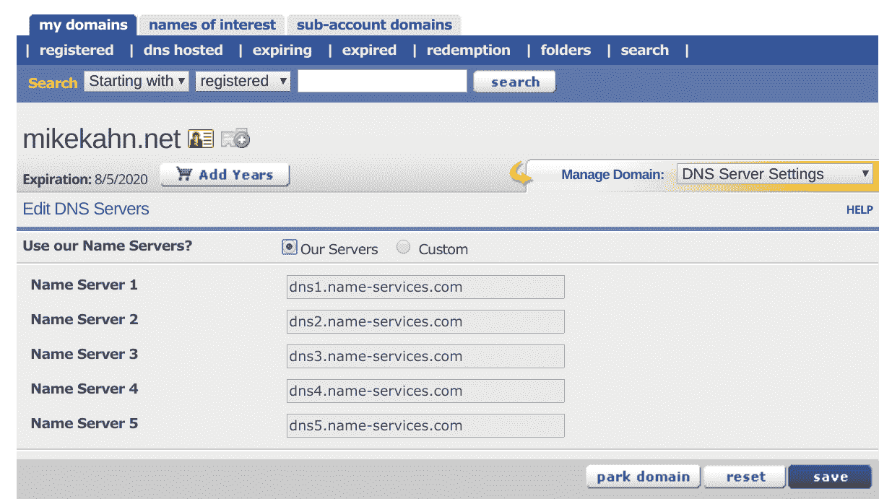

*将网站从自定义域名服务器改为注册域名服务器，该网站将托管在谷歌云存储桶上，这样我就可以修改 DNS 区域*

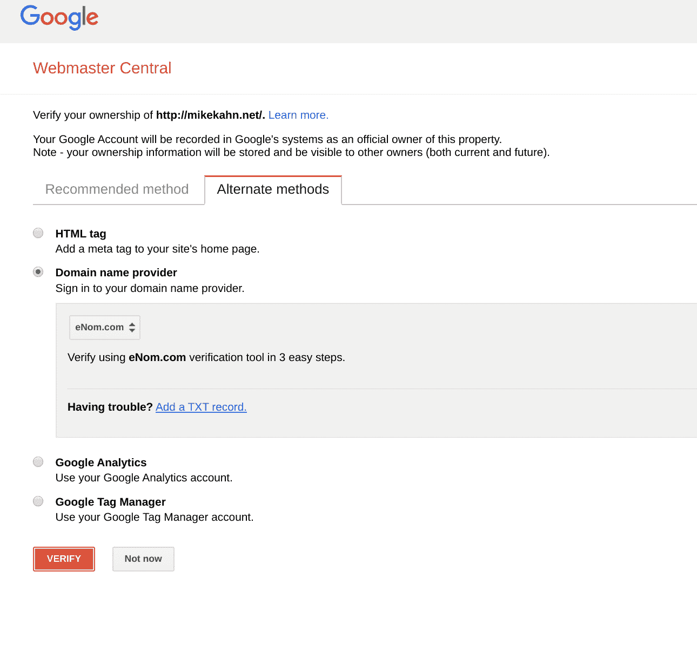

这里是您验证域名所有权的替代选项。推荐的方法是 HTML 文件上传。我将在我的域名提供商处选择 TXT 记录编辑，因为我已经更新了 DNS 区域以指向云存储。

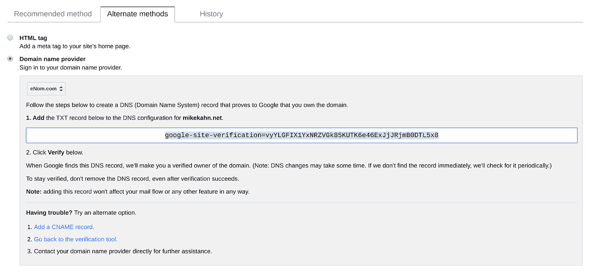

*用 TXT DNS 主机记录验证我的域名*

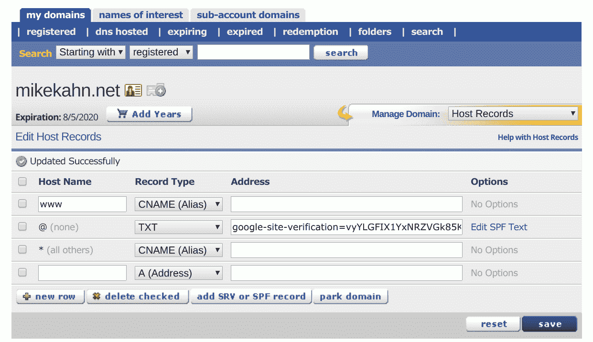

*在我的注册处设置用于谷歌域名验证的 TXT 记录*

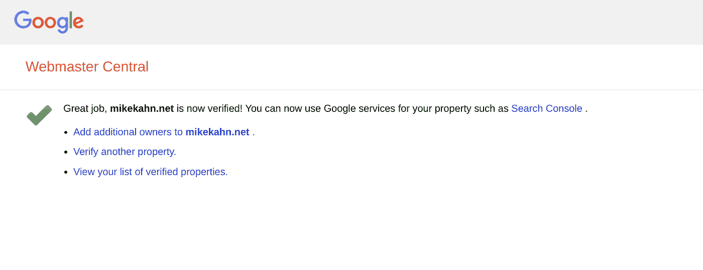

*确认 TXT 记录后，您将收到如下消息。现在你可以用谷歌服务来使用你的域名了。*

# 为您的迁移打开的选项卡/会话

1.  你的注册商(在我的情况下是 eNom)对你来说可能是 name price，Godaddy 等
2.  [谷歌站长中心](https://www.google.com/webmasters/verification/home?hl=en&authuser=1)
3.  [谷歌云控制台](https://console.cloud.google.com/)和云壳
4.  到源 cPanel 服务器的 SSH 会话

# 将静态网站迁移到谷歌云存储

## 环境差异和限制

谷歌云存储桶是静态基本 HTML 网站的一个很好的解决方案，因为它的低成本和轻松扩展。请注意，您正在将 web 服务器上的托管网站转移到 Google 云存储服务中。我注意到一些不同的事情:

**问题**:没有 HTTPS 支持

**解决方案**:云存储只支持通过 CNAME 的 HTTP。如果你想通过 HTTPS 为你提供内容，你需要使用负载均衡器或者使用 Firebase 主机而不是云存储。

**问题** : Web 服务器可以在没有索引页面的情况下提供目录内容，例如:[www.website.com/files/](http://www.website.com/files/)会从 Web 服务器返回一个页面，列出/files/中的所有文件。

例如，其中之一:

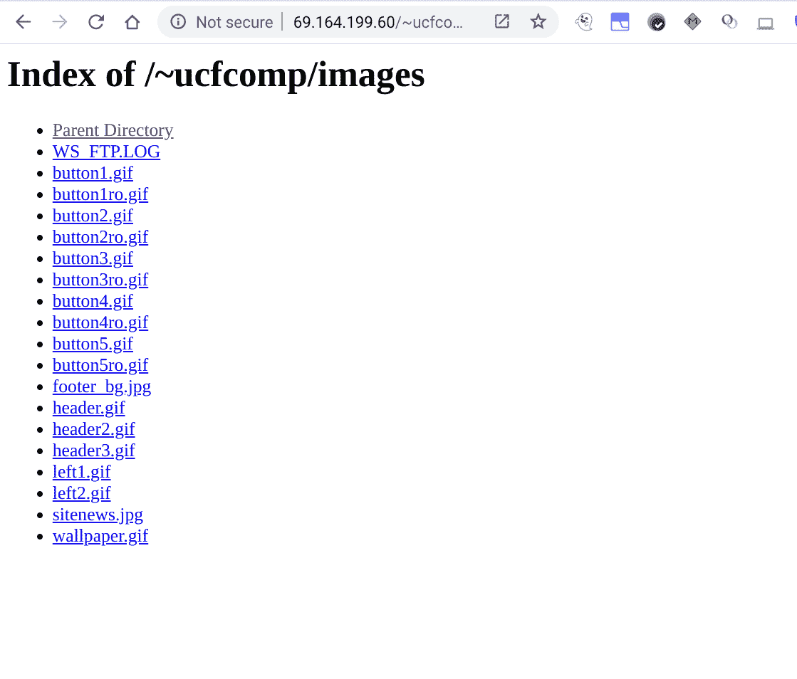

云存储不支持公共目录列表。

**解决方案**:我发现的所有目录列表脚本都是用 PHP 编写的，它们不能使用 GCS 托管。请改用云存储浏览器来浏览您的文件。

**解决方案二**:使用[云存储 Fuse](https://cloud.google.com/storage/docs/gcs-fuse) 挂载你的桶作为文件系统浏览你的文件。现在，您可以在本地查看/上传/下载 bucket 中的文件，而不是通过 web 服务器目录。

PHP 和动态网站将需要在谷歌云服务与网络服务器托管。

从一个优先级较低的非关键域开始迁移会让您熟悉迁移过程。由于我的 6 个域中有 5 个我计划登陆谷歌云存储，我将先测试移动一个静态站点。我将使用这个文档[托管一个静态网站](https://cloud.google.com/storage/docs/hosting-static-website)。

# 静态网站向云存储的转移过程

## 1: DNS 配置—将我的注册服务商托管的 DNS 区域指向云存储

根据站点的重要程度，您可能希望先设置云存储空间并移动文件。在企业/商业环境中，您可能会首先移动文件。我将遵循本演练的文档，因为我要移动的站点是低优先级的。

为您的域名在注册域名系统区域创建一个 CNAME，指向 c.storage.googleapis.com。

以我的一个域名为例:
主机名:[www . jordanaandmike . us](http://www.jordanaandmike.us)
记录类型:c.storage.googleapis.com
地址:CNAME。

以下是我的 DNS 区域在 CNAME 更新、URL 重定向(针对根域)和域所有权 TXT 记录添加验证后的样子。

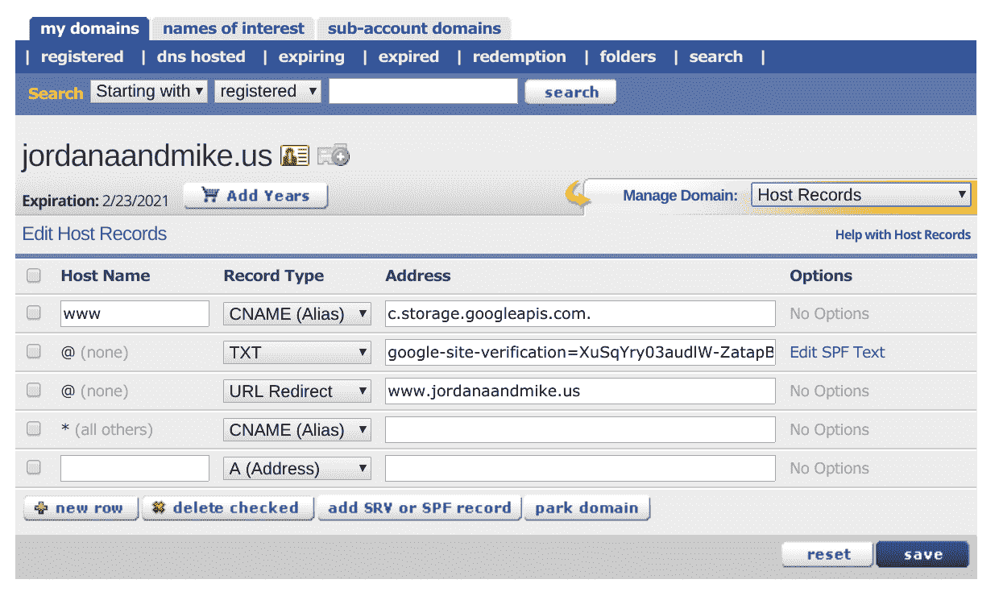

我的注册商的 DNS 配置指向云存储

注意:您的域名需要 www 主机 CNAME 和 URL 重定向才能通过[www.yourdomain.com](http://www.yourdomain.com)(CNAME)和 yourdomain.com(URL 重定向)进行解析。如果您希望根域解析(非 www，仅 domain.com ),请确保您设置了根域别名，有时也称为名称或别名。更多关于根域和 CNAME 的可爱文章来自[多米尼克·弗雷泽](https://medium.com/u/7ca0743c1c3b?source=post_page-----acdcf7c95768--------------------------------)T4。

## 2.为匹配 CNAME 主机名的站点创建一个存储桶。

假设您已经验证了您的域名，您可以创建一个域名存储桶。如果没有，请遵循此处的[域名所有权验证文档。](https://cloud.google.com/storage/docs/domain-name-verification?hl=en#verification)

```
gsutil mb gs://www.jordanaandmike.us
Creating gs://www.jordanaandmike.us/...
```

## 3.复制网站文件和目录

```
gsutil rsync -R . gs://[www.jordanaandmike.us](http://www.jordanaandmike.us)
```

## 4.使文件可公开访问

```
 gsutil iam ch allUsers:objectViewer gs://[www.jordanaandmike.us](http://www.jordanaandmike.us)
```

## 5.设置主页后缀和 404 页

这部分设置您的索引页面文件，以及当有人到达域名时提供什么。如果没有这个 gsutil web set 命令，访问域时将只返回一个 xml 文件。我们还将设置 404 页面，以备找不到页面时使用。

```
gsutil web set -m index.html -e 404.html gs://www.jordanaandmike.us
Setting website configuration on gs://www.jordanaandmike.us/...
```

## 6.请稍等片刻，等待 DNS 传播。这可能需要几分钟到几个小时。

## 7.使用您最喜欢的 dns 查找工具验证您的 DNS 更改是否已传播。G Suite 工具箱中有一个 dig 工具来验证您的更改。

[https://toolbox.googleapps.com/apps/dig/#CNAME/](https://toolbox.googleapps.com/apps/dig/#CNAME/)

如果在您这边没有看到变化，请检查另一个工作站/位置。不要惊慌，给它时间。

```
ping jordanaandmike.us
PING jordanaandmike.us (98.124.199.121) 56(84) bytes of data.64 bytes from 98.124.199.121 (98.124.199.121): icmp_seq=1 ttl=231 time=91.6 ms
```

## 8.检查您的域，验证它从云存储中加载正常

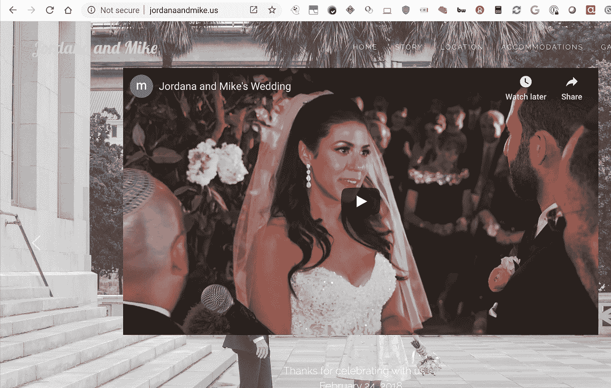

我美丽婚礼的网站托管在谷歌云存储上

通读[静态网站示例和提示](https://cloud.google.com/storage/docs/static-website#top_of_page)了解更多配置选项。

请注意，云存储会缓存文件，因此如果您在 html 页面上进行快速更改，可能需要一些时间来反映这些更改。

## 9.清理源服务器

一旦域解析为云存储，使用 cPanel script /script/removeacct 用户名删除源服务器上的帐户。

```
/scripts/removeacct jordanaandmike
Are you sure you want to remove the account “jordanaandmike”, and DNS zone files for the user? [y/N]? yRunning pre removal script (/usr/local/cpanel/scripts/prekillacct)……DoneCollecting Domain Name and IP……DoneLocking account and setting shell to nologin……DoneKilling all processes owned by user……DoneRemoving Sessions………DoneRemoving Suspended Info………Done
```

我将为谷歌云存储计划的其他域重复步骤 1-9。

# 将动态网站和应用迁移到计算引擎

所以我的目标是以尽可能低的成本将我的 cPanel 服务器迁移到 Google Cloud。对于我的 php 低流量网站，我将转移到计算引擎实例上的 web 服务器和 mysql 服务器。我可以在云 SQL 等其他服务上托管数据库，但我希望成本尽可能低。

## 制作转移的暂存桶

我会把 GCS 作为我转移的集结地。因此，我将从源-> GCS ->目的地进行传输。

```
gsutil mb gs://virtualgoldstar
Creating gs://virtualgoldstar/…
```

请注意，我在这里没有创建域名 bucket(就像我对静态站点所做的那样),因为我只是在两次转移之间将域名作为中间层转移到 GCS。我可以用 SFTP 或者其他方式转会，但是因为我已经用了 GCS，我想我会继续。此外，这还会给我一个网站的备份，我可以把它放在冷线存储层，并支付一年的费用。

## 将文件从源复制到暂存桶

```
gsutil rsync -R . gs://virtualgoldstar
Operation completed over 1.5k objects/103.8 MiB.
```

备份源数据库并复制到暂存桶

```
mysqldump virtual_funingimage > virtual_funingimage.sql
gsutil cp virtual_funingimage.sql gs://virtualgoldstar
Copying file://virtual_funingimage.sql [Content-Type=text/x-sql]…
/ [1 files][ 84.3 KiB/ 84.3 KiB]
Operation completed over 1 objects/84.3 KiB.
```

## 设置目标服务器

我将使用 [LAMP stack Google click 来部署图像](https://console.cloud.google.com/marketplace/details/click-to-deploy-images/lamp?q=lamp%20stack&id=5416d651-ffa7-4d30-ac18-06be7dba905e&project=mike-kahn-personal&authuser=1&cloudshell=true),因为它将预先配置好我需要的一切并准备就绪。这是谷歌从市场上点击部署图像，所以我可以信任它。

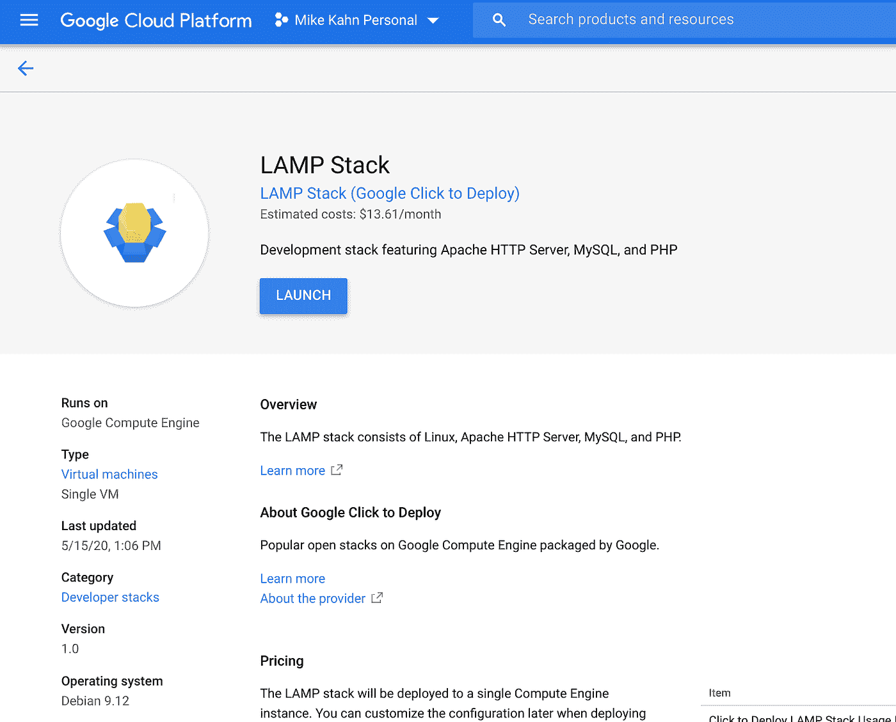

## 将文件从我的暂存桶复制到目标服务器

在这个 debian 映像中，httpd 根目录是/var/www/html/

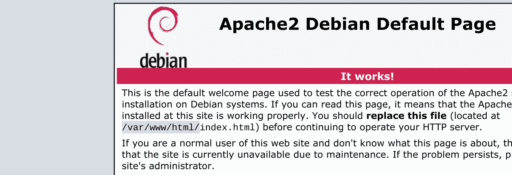

```
sudo gsutil cp -r gs://virtualgoldstar/* /var/www/html/
```

确保在您的 bucket 名称后面添加一个*来将文件复制到您的源目录。如果您不使用*号，它将创建一个带有 bucket 名称的目录，您必须手动移动所有文件和目录。

## 创建数据库、数据库用户、授予权限和导入数据库

LAMP Google click to deploy image 的 mysql root 密码可以在 Google Cloud 控制台的[部署管理器部署](https://console.cloud.google.com/dm/deployments)中找到。

```
sudo mysql -u root -p
mysql> CREATE DATABASE virtual_funingimage;
Query OK, 1 row affected (0.00 sec)
mysql> CREATE USER ‘virtual_root’@’localhost’ IDENTIFIED BY ‘password’;
mysql> GRANT ALL PRIVILEGES ON * . * TO ‘virtual_root’@’localhost’;
Query OK, 0 rows affected (0.00 sec) mysql -u root -p virtual_funingimage < virtual_funingimage.sql
Enter password:
$
```

## 与我的目标服务器 php 配置战斗了一天

所以我的源服务器是 php5.4，而我的目标服务器是 php7。我想移动的网站不能在 php7 上运行，需要做很多改动才能运行。我是一个不错的系统管理员，但不是一个不错的 php 开发人员。我现在正处于十字路口——我可以修改我的 php7 网站代码，或者降级我的 Debian click 上的默认 php 版本，以部署 LAMP server 并让 php5 启动和运行。因为我试图在尽可能短的时间和成本内完成这项工作，所以我将在我的目标服务器上运行 php5.6，即使它已经停产。我知道这样做的风险，也知道这样做是为了让我的网站尽快运行起来。

我关注了[这篇关于](https://cloudwafer.com/blog/installing-multiple-versions-of-php-on-debian/)[如何在 Debian](https://cloudwafer.com/blog/installing-multiple-versions-of-php-on-debian/) 上运行多个 php 版本的 [Cloudwafer](https://medium.com/u/5113fa353dc2?source=post_page-----acdcf7c95768--------------------------------) 文章。

```
php -v
PHP 5.6.40–29+0~20200514.35+debian9~1.gbpcc49a4 (cli)
Copyright © 1997–2016 The PHP Group
Zend Engine v2.6.0, Copyright © 1998–2016 Zend Technologies
```

在我的目标服务器上降级 php 后，我仍然无法加载 php 页面。

检查/var/log/apache2/error.log 和 GCP 日志中的 apache2 错误日志，每当试图加载 php 页面时，我总是看到分段错误:

```
[Tue Jun 09 13:01:22.821130 2020] [core:notice] [pid 25665] AH00052: child pid 25667 exit signal Segmentation fault (11)[Tue Jun 09 13:01:22.822031 2020] [core:notice] [pid 25665] AH00052: child pid 25668 exit signal Segmentation fault (11)
```

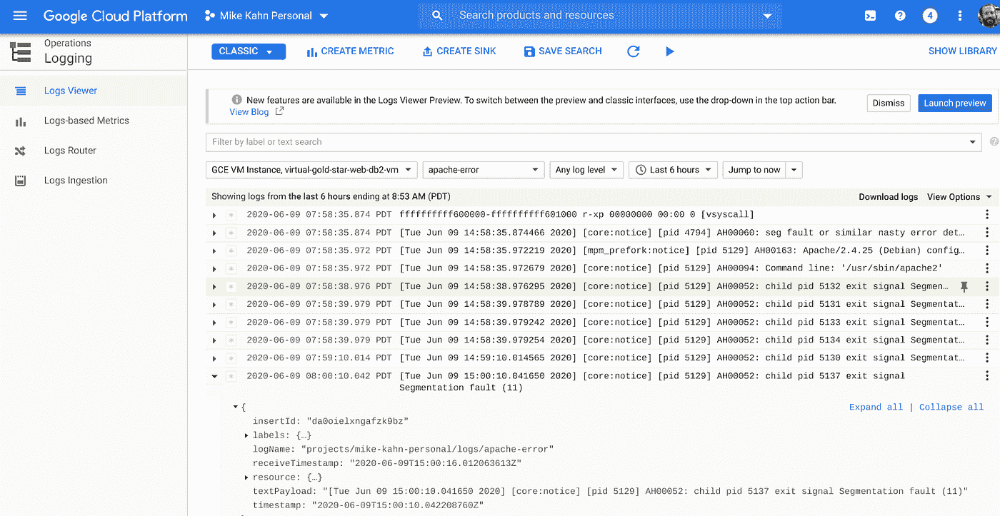

云控制台日志中的 Apache 错误日志

在搜索之后，php 中的分段错误通常与 php 模块有关。所以我决定最好比较一下我的源和目的地的 php 模块和 php.ini 设置。

```
php -m
[PHP Modules]
bcmath
calendar
Core
ctype
curl
date
dom
ereg
filter
ftp
...
```

我在 Google sheets 中快速比较了我的源和目的地的 php -m 输出:

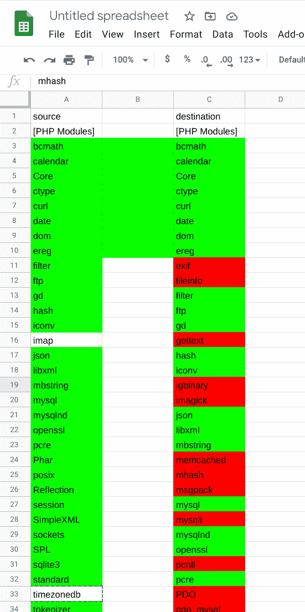

*比较我的源服务器和目的服务器中的 php 模块*

使用 phpdismod，我删除了不在我的源服务器上的所有模块:

```
sudo phpdismod exif fileinfo gettext igbinary imagick memcached mhash msgpack mysqli pcntl PDO pdo_mysql pdo_sqlite readline shmop sysvmsg sysvsem sysvshm wddx xdebug xsl Zend Opcache
```

在确保 php -m 在我的源和目标上匹配之后，我继续监控 error_log 并进行故障排除。我正准备用这篇文章回到 php7 并修改我的应用程序代码，然后在试图禁用 php5.6 时遇到了这个错误:

```
sudo a2dismod php5.6
Module php5.6 disabled.
Processing triggers for systemd (232–25+deb9u12) …
Processing triggers for php5.6-fpm (5.6.40–29+0~20200514.35+debian9~1.gbpcc49a4) …
NOTICE: Not enabling PHP 5.6 FPM by default.
NOTICE: To enable PHP 5.6 FPM in Apache2 do:
NOTICE: a2enmod proxy_fcgi setenvif
NOTICE: a2enconf php5.6-fpm
NOTICE: You are seeing this message because you have apache2 package installed.sudo a2enmod proxy_fcgi setenvif
Considering dependency proxy for proxy_fcgi:
Enabling module proxy.
Enabling module proxy_fcgi.
Module setenvif already enabled
To activate the new configuration, you need to run:
systemctl restart apache2sudo a2enconf php5.6-fpm
Enabling conf php5.6-fpm.To activate the new configuration, you need to run:
systemctl reload apache2sudo systemctl reload apache2
```

修改完我的模块后，我可能忘记了重新加载 apache2 配置。错误消息提醒我重新加载 apache2。在 systemctl 重新加载 apache2 之后，我的 php5.6 配置就可以用于我的 php 应用程序了。霍雷。呵！

## 拍摄工作实例的快照

这是对我的工作实例配置进行备份(快照)的好时机。这样，如果这个服务器有任何问题，我可以恢复这个最新的工作版本。

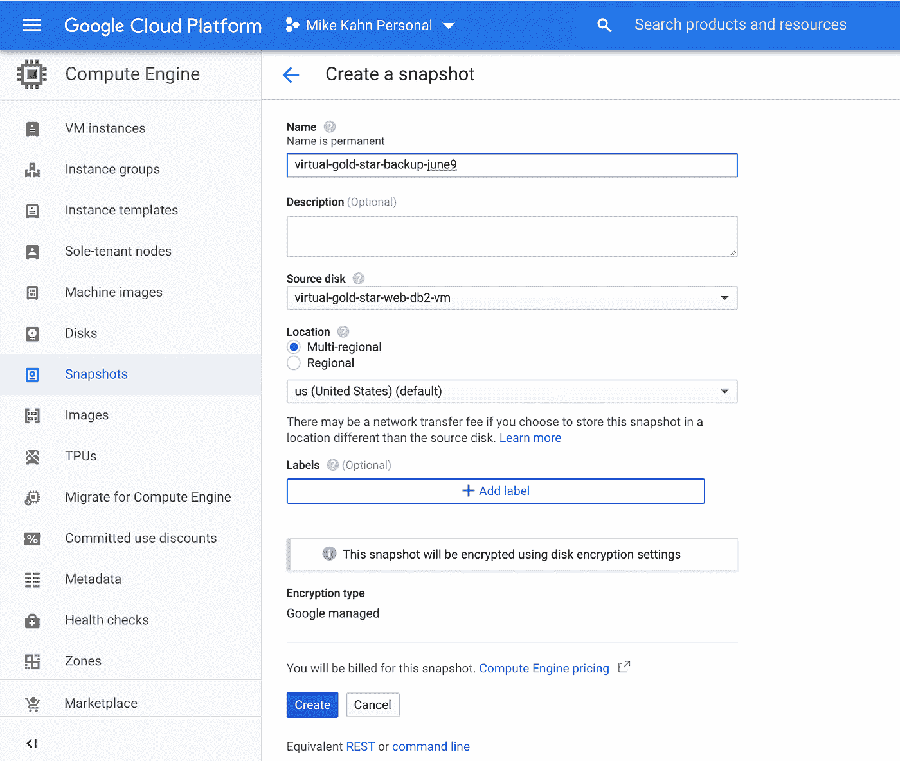

## 为实例创建警报策略

当我们创建备份时，让我们设置警报。因为这个站点托管在一台服务器上，没有冗余的 GLB 或托管实例组，所以如果它宕机，我想知道。

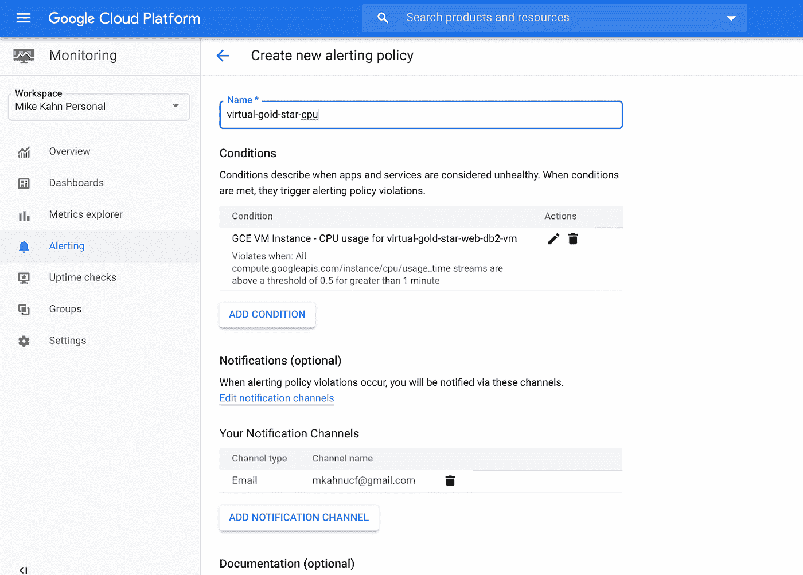

## DNS 配置—设置云 DNS

对于我现有的 DNS 区域，云 DNS 的每个区域成本约为 0.21 美元，因此我将我的域名指向云 DNS，并设置该区域通过 a 记录指向我的计算引擎实例。

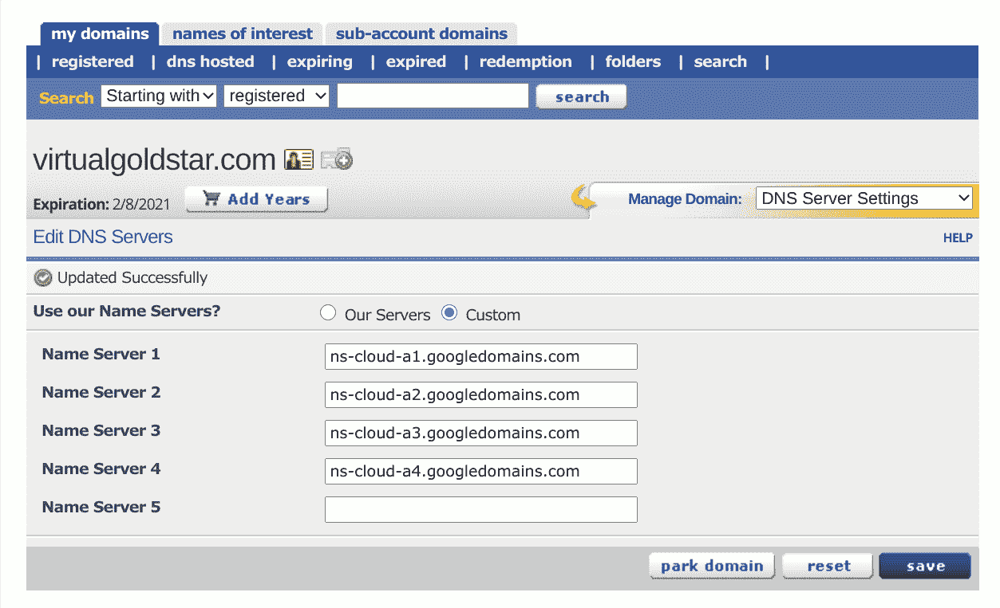

将我的注册器设置为指向云 DNS

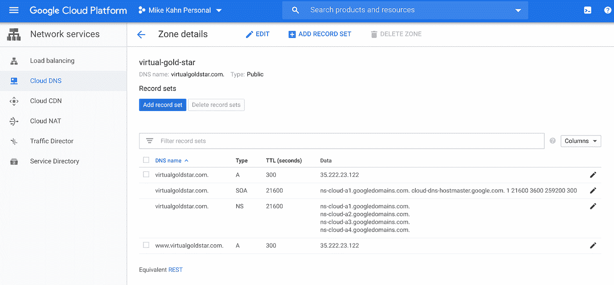

在云 DNS 上配置我的区域文件

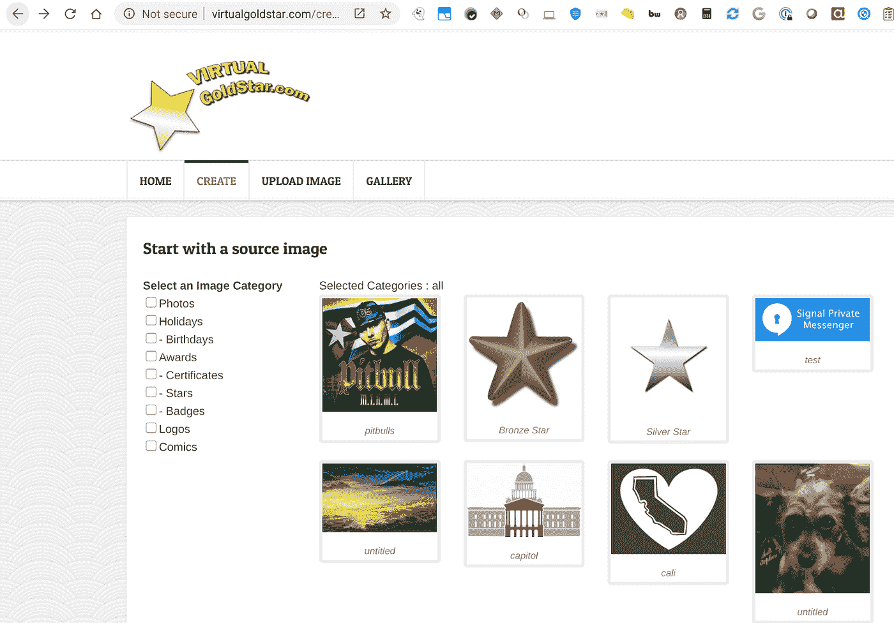

我五年前建立的 virtualgoldstar.com 迷因基因网站托管在谷歌计算引擎上，使用云域名系统

# 我错过的事情..

。htpasswd

我的 2015 php 站点有一个使用. passwd 文件进行身份验证的管理区。由于只迁移了 public_html 目录，我错过了这个。所以我需要重新创建我的管理区工作。

```
mkdir /home/virtual/.htpasswds/public_html/admin/sudo htpasswd -c /home/virtual/.htpasswds/public_html/admin/passwd mike
```

目录所有权

我的应用程序使用用户输入创建文件。在我的迁移过程中，我所有的应用程序文件都是由 root 创建的。为了让我的应用程序工作，我需要将两个目录更改为 www-data 所有

```
sudo chown www-data creating_image/
```

# 成本比较

我在利诺德的费用是:每月 38.50 美元

附加 IPv4 地址 MK _ Personal(144500)2020–05–01 04:00:00 2020–06–01 03:59 0.0015 美元 1.00 美元 0.00 美元 1.00 美元 Li node 6GB MK _ Personal(144500)2020–05–01 04:00:00 2020–06–01 03:59:

我决定不再更新我的 cPanel 执照，它是[5 个域名](https://cpanel.net/pricing/)每月 20 美元。

因此，要在 VPS 上运行这几个网站，我每月支付大约 58 美元。

我将在一个月后更新这篇文章，以比较在 GCP 运行一个月的成本。我估计大约是 40 美元/月或者少 20 美元/月。

感谢阅读！

**更新:2022 年 11 月 1 日**

在 GCP 运行 2 个迁移的 cPanel 站点(在 GCS 和 GCE 上运行 1 个静态站点)成本表如下:

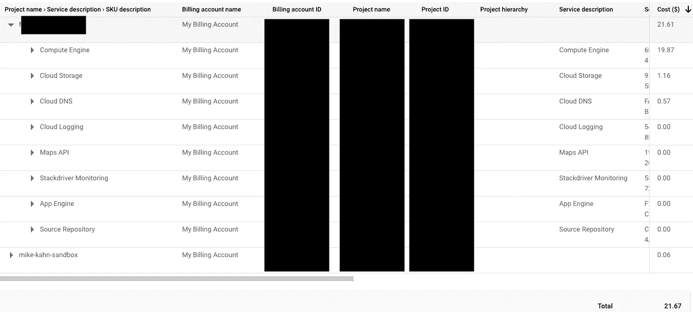

我个人 GCP 账户的费用表

在谷歌云上运行我的两个主要网站每月 21.67 美元。计算引擎支出的大部分是实例费(E2 实例核心-8.03 美元，E2 实例 ram-4.31 美元)和静态 IP 费用(7.38 美元/月)。PD 快照很便宜。我在云存储上运行的婚礼网站是< $1/month. I have a bunch of other backups in GCS in the cost table above.

I powered down one of the instances earlier this year that I had the DB running on Cloud SQL and another instance for web. When I was running those 2 instances + the site on GCS my expense was around $45/month.

Conclusion: GCP can be cost effective for individual users sites such as static websites with basic configuration requirements that do not require much maintenance or end user interaction. For end users looking to stop using cPanel, consider Google Cloud Storage for extremely low cost hosting for sites that do not require a DB or much web server configuration.

For operators and hosting providers considering moving to GCP it will be more challenging specifically for their clients that operate many sites. End users will lose access to a UI to manage site and domain configuration and more responsibility will be placed on the hosting provider for management. Consider looking into the [Google Cloud Partner Program](https://cloud.google.com/partners/become-a-partner)并在 Google Cloud Storage 上提供静态网站托管服务。