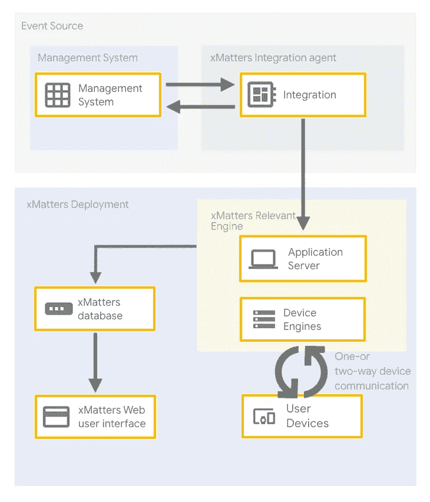

# 将 Monolith 迁移到 Google Kubernetes 引擎(GKE) —客户案例

> 原文：<https://medium.com/google-cloud/migrating-a-monolith-to-google-kubernetes-engine-gke-customer-story-c35c320325eb?source=collection_archive---------1----------------------->

## 在云中烹饪

# 介绍

*[***云上做饭***](/@pvergadia/get-cooking-in-cloud-an-introduction-5b3b90de534e)*是一个[博客](/@pvergadia/get-cooking-in-cloud-an-introduction-5b3b90de534e)和[视频](https://www.youtube.com/playlist?list=PLIivdWyY5sqIOyeovvRapCjXCZykZMLAe)系列，帮助企业和开发者在 Google Cloud 上构建商业解决方案。在这第三个迷你系列中，我们将讲述 ***将一个整体迁移到谷歌 Kubernetes 引擎(GKE)*** 。将整体迁移到微服务可能会令人生畏。一旦你决定接受它，你需要考虑什么？继续阅读…**

**在这些文章中，我们将带您了解将 monolith 迁移到微服务的整个过程、迁移流程、首先迁移什么、迁移的不同阶段以及如何处理数据迁移。这些文章的灵感来自于[这篇解决方案文章](https://cloud.google.com/solutions/migrating-a-monolithic-app-to-microservices-gke)。我们将以一个真实的客户故事来结束这一切，在一个真实的应用程序中完成这些步骤。**

**以下是这部迷你剧的所有文章，供你查阅。**

1.  **[将一块巨石迁移到 GKE:概述](/google-cloud/migrating-a-monolith-to-google-kubernetes-engine-an-overview-785f2cbe5c62)**
2.  **[将一块巨石迁移到 GKE:迁移过程](/google-cloud/migrating-a-monolith-to-google-kubernetes-engine-gke-migration-process-2de2f51986a2)**
3.  **将一块巨石迁移到 GKE:分阶段迁移**
4.  **将一块巨石迁移到 GKE:先迁移什么？**
5.  **[将一个整体迁移到 GKE:数据迁移](/google-cloud/migrating-a-monolith-to-google-kubernetes-engine-gke-data-migration-ef8ebccef6b0)**
6.  **将一个整体迁移到 GKE:客户故事(**本文**)**

**在本文中，我们将探索一个使用 [xMatters](http://xmatters.com) 的真实世界用例，以及他们如何从基于 Google Kubernetes 引擎的整体架构迁移到基于微服务的架构。所以，继续读下去吧！**

# **你会学到什么**

*   **执行从整体到微服务的端到端迁移的技巧**

# **先决条件**

*   **谷歌云的基本概念和结构，这样你就可以识别产品的名称。**
*   **查看云系列中 [Get Cooking 的介绍。](/@pvergadia/get-cooking-in-cloud-an-introduction-5b3b90de534e)**

# **看看这个视频**

**采访 xMatters 的 monolith 到微服务迁移之旅**

# **问题:**

**我有机会和来自 xMatters 的 [Travis DePuy](https://medium.com/u/4333bce42d4a?source=post_page-----c35c320325eb--------------------------------) 坐在一起。以下是我们关于他们迁移之旅的对话:**

****

**❓Priyanka::什么是 xMatters，这个工具是做什么的？**

**🅰️·特拉维斯:我们帮助保持数字服务的正常运行。当东西爆炸时，我们帮助最小化爆炸半径。我们通过跟踪当前的随叫随到资源并在正确的时间向正确的人提供关键信息来做到这一点。**

**这里我们看到 xMatters 流设计器画布的一部分，显示了 Stackdriver 警报工作流。第一步是入站 HTTP 触发器，它解析有效负载并开始工作。然后我们开始用一些 Stackdriver 可能没有的元数据来丰富警报。在这种情况下，我们从 GitHub 和 Jenkins 获得最后的提交和部署信息。最后，这里的最后一步是实际触发 xMatters 事件并通知人们。**

****

**来自 Stackdriver 的入站触发器及其在 xMatters Canvas 中的解析方式**

**现在我们看到 Dan 在他的移动设备上收到了 Stackdriver 通知。他查看来自 Stackdriver 的股票信息，但之后他可以查看来自 GitHub 和 Jenkins 的丰富数据。**

****

**他有几个不同的响应选项，稍后我会详细介绍，但他认为这已经足够严重，我们需要从当前的绿色部署恢复到蓝色部署。所以他选择了响应选项，并添加了可选的注释。**

**回到 xMatters 画布，我们看到当用户选择相关的响应选项时启动的各种流。每个组织都有重大事故，都有处理这些事故的流程。在这种情况下，我们看到 xMatters 将自动创建一个吉拉问题，然后是一个状态页事件，最后是一个 Slack 通道，这样团队就可以开始协作了。**

****

**xMatters 画布**

**我们还看到了 Dan 选择的回滚到蓝色，并且我们看到在使用 Kubernetes 命令触发重新部署之前创建了一个新的吉拉问题。jira 问题有助于跟踪谁在何时触发了部署，然后还可以作为未来调查的记录。**

**最后一个是我最喜欢的，使用一个剧本工具，比如 Ansible。我们可以启动现有的行动手册来尝试解决这个问题。**

**有无限的可能性，所有这些都可以根据组织的具体流程进行定制。**

**❓Priyanka: xMatters 在出现诸如流量高峰或错误率等情况时向正确的团队提供通知。**

**🅰️·特拉维斯:是的，任何时候你有一个应用程序需要接触到人，这就是我们可以提供价值的地方。但是通知只是更大工作流程中的一小部分。一旦你收到通知，你需要去寻找其他各种细节，然后根据严重程度或其他因素采取行动。而这一切都是手工劳动，被称为*。这是重要的工作，但是会占用你手头工作的时间。为了响应这一点和我们客户的需求，我们构建了一个工作流平台，在发送通知之前丰富警报，但同时也提供响应选项来自动完成这项工作。***

***❓priyanka::x matters 是否提供了创新的 DevOps 团队工具，以在当今高度分散的 IT 环境中维护运营可见性和控制？***

***🅰️·特拉维斯:没错，我们还从事各种行业的工作，包括:医疗保健、零售、制造和金融，以支持许多使用案例，如:开发运维、SRE、重大事故和事故响应。***

***❓Priyanka:How:你能定义一下整体架构和基于微服务的架构之间的区别吗***

******

***图尔杜肯——巨石***

***🅰️·崔维斯:嗯，想象一个像火鸭一样的庞然大物，你知道那种美味的怪物肉吗？这是一只塞在鸭子里的鸡，以及所有塞在火鸡里的东西。一个整体是手工制作的，并交付给运营团队，然后安装和部署。新版本是新的工件，需要新的程序和过程。但愿你不想改变什么。你必须把所有的东西都拆开，然后重新编译成一个大怪物。所有的片段都是高度交织在一起，高度相互依赖的。***

******

***纸杯蛋糕——微服务***

***反过来，你可以把微服务想象成几种不同口味的纸杯蛋糕。你有几个不同的食谱，如果你决定需要调整一个食谱，制作新的面糊并放入你的烤模中。然后你把它们推广给你的客户，他们都会得到你提供的最新最好的好处。每种配方都可以独立于其他配方进行调整。***

***❓Priyanka:哇！那是我听过的最美味的微服务解释！似乎 xMatters 最初是从 monolith 的角度接近云的，随着时间的推移，遇到了挑战，导致决定转向基于微服务的架构。其中有哪些挑战？***

***🅰️·特拉维斯:每个客户都在运行一个非常独特的实例，这导致监控和调试成为一场噩梦。此外，新客户的加入需要几天时间，随着我们发布新功能和淘汰旧操作系统，基础架构也随之改变，这成为一个非常定制的解决方案。我们还发现，我们的运营团队专注于构建基础设施平台，而不是与开发人员一起构建应用程序。***

***❓Priyanka::单一应用程序的主要挑战是——运营效率低下、监控和调试噩梦以及长时间的客户入职。我很好奇，基础设施和应用程序最初的整体状态是什么样的？***

***🅰️·特拉维斯:我们最初是一个内部应用程序，所以有一个大的整体是有意义的。***

******

***迁移前的 xMatters 整体架构***

***随着我们的客户开始接受云过渡，我们也开始接受，很自然地，我们将我们的 monolith 安装到我们物理维护的服务器中。***

***我们在世界各地的 6 个数据中心拥有空间，很快我们的服务迅速发展到 500 台运行 OpenStack 和自主开发的平台即服务的服务器。***

***这需要管理 5000 多台虚拟机！***

***❓Priyanka: 5000 台虚拟机太多了！这是你决定转向谷歌云的原因吗？***

***🅰️·崔维斯:是的，我们意识到这是不可持续的。我们真的只想构建一个企业应用程序，而不是照看硬件。***

***❓Priyanka::当你开始考虑基于微服务的架构时，你心中的最终目标是什么？***

***🅰️·特拉维斯:主要是规模。我们知道维护 5000 台虚拟机是不可扩展的，而且有如此多的冗余。每个实例都有自己的 web ui 版本、自己的通知服务、自己的调度服务。***

******

***应用网关将调用路由到不同的微服务***

***❓Priyanka::是的，当你刚接触微服务时，应用网关方法非常有用。这是如何部署在 Google Cloud 上的？***

***🅰️·特拉维斯:我们使用谷歌 DNS 进行 IP 地址查找，然后用户设备，比如浏览器和移动设备，最终到达全球负载均衡器。然后，它们通过我们的应用网关进行路由，这是一个自行开发的应用，由一些不同的服务组成，包括 consul 和 HA 代理以及我们自己的配置工具。这使得我们可以轻松地将设备路由到适当区域的适当数据，并提供服务发现。***

******

***如何设置微服务架构的高级视图***

***主要应用微服务运行在 Google Kubernetes 的容器中。这些容器都存储在 Google 容器注册表中。数据后端由 PostgreSQL 配合 Kafka 和 RabbitMQ 组成，运行在 Google Compute Engine 上。以及使用 Prometheus、Splunk 和 Stackdriver 进行监控。***

***❓Priyanka::那么，GKE 是微服务和数据后端 GCE 的明星。***

***❓Priyanka::那么，你是如何制定计划来打破这种垄断的，你是不是先挑选出一些服务来进行迁移？***

***🅰️·特拉维斯:嗯，我们从一些显而易见的方面开始，比如各种用户界面、API 和我们的集成构建器服务。在我们进行的过程中，我们发现了其他有意义的逻辑分离，例如警报抑制和随叫随到调度的事件处理。通知和数据处理的时机也成熟了。***

***❓Priyanka::是的，我在大多数应用程序的开发过程中遇到的最大挑战是数据依赖性。您是如何处理高度依赖共享数据的服务的？***

***🅰️·特拉维斯:依赖是不可避免的。微服务很少能完全独立运行。我们确保和其他人一起发布服务。***

***❓Priyanka::所以，基本上是在早期确定服务之间的依赖关系，然后计划微服务推出的节奏，这是基于这些依赖关系的。这绝对是一次相当大规模的迁移，一定花了很长时间？***

***🅰️·崔维斯:事实上，没那么糟。我们用了大约 12 个月完成了它。这很好，因为我们的数据中心合同即将续签，要么花钱续签，要么把所有东西都拿出来。***

***凭借 GCP 环境的灵活性，我们能够进行软部署，并保持我们现有的数据中心基础设施并行运行，我们这样做了大约 6 个月。***

***❓Priyanka::是的，这在任何移民中都是非常重要的一点。随着您慢慢地将一项项服务迁移到云中，您将在一个混合平台上运行一段时间。***

***🅰️·特拉维斯:我认为对我们来说，成功的最大贡献之一是，一旦基础设施到位，我们就制定了监控和可观察性。这对于通知我们变化的影响，尤其是了解我们变化的影响是至关重要的。***

***❓Priyanka: Stackdriver 成为你最好的朋友，这样的观察和监测。当你进行这些渐进的改变时，Google Kubernetes 引擎(GKE)在这个过程中扮演了什么角色？***

***🅰️·特拉维斯:我们使用 sidecar 模式，这有助于我们利用在 Splunk 以及其他可观察性应用程序上的投资。使用 sidecars 意味着我们可以自信地根据我们的需求变化交换其他应用程序。***

***❓Priyanka::在微服务中运行应用程序最大的挑战是什么？***

***🅰️·特拉维斯:两件事，学习服务所有权的诀窍和有效地部署这些服务。***

***❓Priyanka::这个变化对车队来说一定是新的。您如何确保开发和运营团队对这些变化感到满意？***

***🅰️·特拉维斯:杰斯·亨布尔讲述了当你把人们从他们行为的后果中抽象出来时，不良行为是如何发生的。因此，我们将团队与他们构建的服务联系起来。这让他们拥有自己构建的代码，并使它们与其服务级别目标保持一致。***

***❓Priyanka::是的，这种主人翁意识创造了奇迹，让团队对他们的 SLO 负责。***

***现在您已经完成了这个迁移过程，这个迁移是如何被证明是有帮助的呢？***

***🅰️·特拉维斯:更快乐的客户，意味着更快乐的团队和更少的熬夜，以及应用程序整体复杂性的降低。***

***根据经验，我们发现由于微服务架构以及 Google Cloud 提供的网络，性能提高了 43%。正如我提到的，我们有更快乐的团队，但是我们计算出事故减少了 60%!***

***❓Priyanka:快乐团队，快乐客户，事故减少 60%，绩效提高 43%！听起来我赢了！***

***你认为 xMatters 团队的下一步是什么？***

***🅰️·特拉维斯:我们会关注服务网格。现在，服务通过应用程序网关相互对话，因此让它们直接相互对话并成为真正的服务网格可能会为我们带来一些额外的改进。***

***❓Priyanka::是的，像 Istio 这样的服务网格似乎是连接、保护、控制和观察服务的合乎逻辑的下一步。***

***谢谢特拉维斯，这是非常有见地的！***

# ***结论***

***要点是——将一个整体迁移到 GKE 的微服务是一个复杂的过程，不会在一夜之间发生——事先规划(我的服务将如何通信——我将如何管理数据——首先迁移什么)有助于确保这一过程顺利进行。***

***如果您正在寻求将现有的单一平台迁移到云中，那么您已经从 xMatters 中获得了诀窍！敬请关注[云烹饪系列](/@pvergadia/get-cooking-in-cloud-an-introduction-5b3b90de534e)中的更多文章，并查看下面的参考资料了解更多细节。***

# ***后续步骤和参考:***

*   ***在[谷歌云平台媒体](https://medium.com/google-cloud)上关注这个博客系列。***
*   ***参考:[整体到 GKE 解决方案](https://cloud.google.com/solutions/migrating-a-monolithic-app-to-microservices-gke)的微服务。***
*   ***Codelab: [将一个整体迁移到 GKE 的微服务上](https://codelabs.developers.google.com/codelabs/cloud-monolith-to-microservices-gke/#0)***
*   ***关注[获取云端烹饪](https://www.youtube.com/watch?v=pxp7uYUjH_M)视频系列，订阅谷歌云平台 YouTube 频道***
*   ***想要更多的故事？查看我的[媒体](/@pvergadia/)，[在 twitter 上关注我](https://twitter.com/pvergadia)。***
*   ***请和我们一起欣赏这部迷你剧，并了解更多类似的谷歌云解决方案:)***