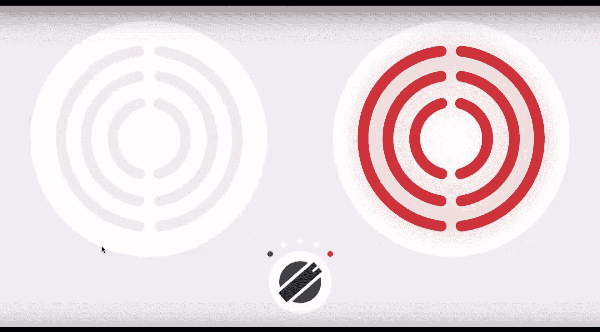

# 将 Monolith 迁移到 Google Kubernetes 引擎(GKE) —数据迁移

> 原文：<https://medium.com/google-cloud/migrating-a-monolith-to-google-kubernetes-engine-gke-data-migration-ef8ebccef6b0?source=collection_archive---------0----------------------->

## 在云中烹饪

作者:[普里扬卡·韦尔加迪亚](https://twitter.com/pvergadia)，[卡特·摩根](https://twitter.com/carterthecomic)

# 介绍

*[***获取云端烹饪***](/@pvergadia/get-cooking-in-cloud-an-introduction-5b3b90de534e)*是一个[博客](/@pvergadia/get-cooking-in-cloud-an-introduction-5b3b90de534e)和[视频](https://www.youtube.com/playlist?list=PLIivdWyY5sqIOyeovvRapCjXCZykZMLAe)系列，帮助企业和开发者在 Google Cloud 上构建商业解决方案。在这第三个迷你系列中，我们将讲述 ***将一个整体迁移到谷歌 Kubernetes 引擎(GKE)*** 。将整体迁移到微服务可能会令人生畏。一旦你决定接受它，你需要考虑什么？继续阅读…**

**在这些文章中，我们将带您了解将 monolith 迁移到微服务的整个过程、迁移流程、首先迁移什么、迁移的不同阶段以及如何处理数据迁移。我们这些文章的灵感来自于[这篇解决方案文章](https://cloud.google.com/solutions/migrating-a-monolithic-app-to-microservices-gke)。我们将以一个真实的客户故事来结束这一切，在一个真实的应用程序中完成这些步骤。**

**以下是这部迷你剧的所有文章，供你查阅。**

1.  **[将一块巨石迁移到 GKE:概述](/google-cloud/migrating-a-monolith-to-google-kubernetes-engine-an-overview-785f2cbe5c62)**
2.  **[将整块材料迁移到 GKE:迁移过程](/google-cloud/migrating-a-monolith-to-google-kubernetes-engine-gke-migration-process-2de2f51986a2)**
3.  **[将整块材料迁移到 GKE:分阶段迁移](/google-cloud/migrating-a-monolith-to-google-kubernetes-engine-gke-migrate-in-stages-7286ec26689c)**
4.  **将一块巨石迁移到 GKE:先迁移什么？**
5.  **将整体迁移到 GKE:数据迁移(本文)**
6.  **[将一个整体迁移到 GKE:客户故事](/google-cloud/migrating-a-monolith-to-google-kubernetes-engine-gke-customer-story-c35c320325eb)**

**在本文中，我们将讨论四种不同的数据迁移方法。所以，继续读下去吧！**

# **你会学到什么**

*   **迁移数据前要问什么问题**
*   **将数据从整体迁移到微服务应用的四种方法。**

# **先决条件**

**开始之前，了解以下内容会有所帮助:**

*   **谷歌云的基本概念和结构，这样你就可以识别产品的名称。**
*   **本[之前的视频在云系列](/@pvergadia/get-cooking-in-cloud-an-introduction-5b3b90de534e)中获取烹饪。**

# **看看这个视频**

# **开始前要问的问题**

****

**Eggs 很像数据迁移策略？嗯，也许不太多，但我知道的一件事是，eggs 和数据迁移都有多种方法来完成这项任务。来源:[https://pix abay . com/vectors/鸡蛋-早餐-蛋黄-蛋白-油炸-575756/](https://pixabay.com/vectors/egg-breakfast-yolk-protein-fry-575756/)**

**煮鸡蛋有很多种方法。**

**你可以煎、煮、炒等等。你使用哪种方法取决于多种因素:你想花多长时间？它和什么搭配？如此等等。**

**我的首选方法是 over hard，但这不是这里最重要的！**

**重要的是，当涉及到数据迁移时，就像鸡蛋一样，真的没有单一的最佳方法。您使用的策略将取决于几个重要问题的答案:**

*   **您需要迁移多少数据？**
*   **这些数据多久改变一次？**
*   **迁移数据时，您能承受由*切换窗口*所代表的停机时间吗——将流量从旧服务转移到新服务所需的时间？**
*   **您当前的数据一致性模型是什么？**

**这些问题的答案将引导您找到最适合您需求的数据迁移方法。**

# **4 种数据迁移方法**

**今天，我们将分享四种不同的数据迁移方法，根据数据迁移的规模和要求，每种方法解决不同的问题。**

**您使用的数据迁移方法基于:**

*   **您的应用程序可以承受的切换窗口大小，**
*   **您的团队能够处理的重构工作**
*   **以及每种方法提供的灵活性。**

**让我们来看看几种不同的策略。**

## **计划维护**

**如果您的工作负载能够承受切换窗口，则计划维护期是理想的选择。它是计划的，因为您可以计划切换窗口发生的时间。这是如何工作的:**

1.  **将数据从旧站点拷贝到新站点，以最小化切换窗口。(有关更多详细信息，请参考之前的文章“分阶段迁移”)。)**
2.  **将旧数据与新数据集进行比较，以确保没有任何复制错误。**
3.  **在迁移过程中，停止将更多数据写入系统。**
4.  **同步初始拷贝后发生的任何更改。**
5.  **部署使用新站点的工作负载和服务的新版本。**
6.  **启动工作负载和服务。**
7.  **当您不再需要旧站点作为备用选项时，请将其停用。**

**这种方法将大部分负担放在操作端，因为只需要对工作负载和系统进行最小的重构。**

## **连续复制**

**并非所有工作负载都承受得起长时间的切换窗口，因此连续复制方法通过在初始复制和验证步骤后提供连续复制机制，建立在定期维护方法的基础上。**

**其步骤如下:**

1.  **将数据从旧站点拷贝到新站点，以便最大限度地缩短切换窗口(就像在计划维护方法中一样)。**
2.  **然后，我们将旧数据与新数据集进行比较，以确保没有任何复制错误。**
3.  **建立从旧站点到新站点的连续复制机制。**
4.  **在迁移过程中，停止将更多数据写入系统。**
5.  **重构工作负载和服务以使用新站点。**
6.  **等待复制使新站点与旧站点完全同步。**
7.  **启动工作负载和服务。**
8.  **当您不再需要旧站点作为备用选项时，请将其停用。**

**这种方法比定期维护方法更复杂。但是，通过最大限度地减少您需要同步的数据量，它最大限度地缩短了所需切换窗口的时间。**

## **y 食谱**

**如果您的工作负载有严格的高可用性要求，而您又负担不起切换窗口，那么可以采用一种不同的方法，我们称之为 Y 方案。在这个方案中，工作负载是在迁移期间在旧站点和新站点中写入和读取数据。**

**这看起来是这样的:**

1.  **重构子系统，将数据写入旧站点和新站点，同时从旧站点读取数据。**
2.  **将在新站点开始写入数据之前写入的数据复制到新系统中。**
3.  **将旧数据与新数据集进行比较，以确保没有任何错误。**
4.  **将读取操作从旧站点切换到新站点。**
5.  **执行另一轮数据验证和一致性检查数据。**
6.  **禁止在旧网站中写入。**
7.  **当您不再需要旧站点作为备用选项时，请将其停用**

**与定期维护和连续复制方法不同，由于多次重构，Y，writing and reading recipe 将大部分工作从操作端转移到开发端，但它不需要切换窗口，这是一个优点！**

## **集中式 Y**

**现在，如果您想减少 Y 方法中所需的大量重构工作，您可以通过重构工作负载和服务来使用**数据访问微服务**来集中数据读写操作。**

**这种可扩展的微服务成为数据存储层的唯一入口点，并充当该层的代理。**

**它实际上与我们之前讨论的 Y 方法非常相似，唯一的区别是，我们没有重构整个服务，而是将重构工作集中在数据访问微服务上。**

1.  **重构数据访问微服务，以便在旧站点和新站点中写入数据。对旧站点执行读取。**
2.  **识别在新站点中启用写入之前写入的数据，并将其从旧站点复制到新站点。与上面的重构一起，这确保了数据存储是对齐的。**
3.  **执行数据验证和一致性检查，将旧站点中的数据与新站点中的数据进行比较。**
4.  **重构数据访问微服务以从新站点读取。**
5.  **执行另一轮数据验证和一致性检查，将旧站点中的数据与新站点中的数据进行比较。**
6.  **重构数据访问微服务，使其只在旧站点中写入。**
7.  **当您不再需要旧站点作为备用选项时，请将其停用。**

**在微服务架构中，这种方法是首选方法，并为您提供了最大的灵活性，因为您可以重构这个数据访问组件，而不会影响架构的其他组件，也不需要切换窗口。它给开发方带来了负担，但是比上面讨论的 Y 方法要轻得多。**

# **结论**

****

**四个快乐的厨师；四种快乐的数据迁移方法！来源:[https://pix abay . com/illustrations/chef-character-cook-gourmet-1417239/](https://pixabay.com/illustrations/chef-character-cook-gourmet-1417239/)**

**总之，我们研究了四种迁移数据的方法，并了解到选择正确的方法取决于对每种情况的利弊权衡。**

> **就像煮鸡蛋有很多种方法一样，您使用的数据迁移方法取决于您的应用程序的切换窗口、重构成本以及每种方法提供的灵活性。但是对于许多微服务架构来说，集中式 Y 方法将是首选方法，因为它最大化了灵活性和正常运行时间。**

**如果您希望将数据从整体架构迁移到微服务架构中，那么您已经体会到了其中的利弊。敬请关注[云烹饪系列](/@pvergadia/get-cooking-in-cloud-an-introduction-5b3b90de534e)中的更多文章，并查看以下参考资料了解更多细节。**

# **后续步骤和参考:**

*   **在[谷歌云的媒介](https://medium.com/google-cloud)上关注这个博客系列。**
*   **参考:[GKE 解决方案的整体到微服务](https://cloud.google.com/solutions/migrating-a-monolithic-app-to-microservices-gke)。**
*   **Codelab: [将一个整体迁移到 GKE 的微服务上](https://codelabs.developers.google.com/codelabs/cloud-monolith-to-microservices-gke/#0)**
*   **关注[云烹饪](https://www.youtube.com/watch?v=pxp7uYUjH_M)视频系列，订阅谷歌云的 YouTube 频道**
*   **想要更多的故事？查看我的[媒体](/@pvergadia/)，[在 twitter 上关注我](https://twitter.com/pvergadia)。**
*   **请和我们一起欣赏这部迷你剧，并了解更多类似的谷歌云解决方案:)**