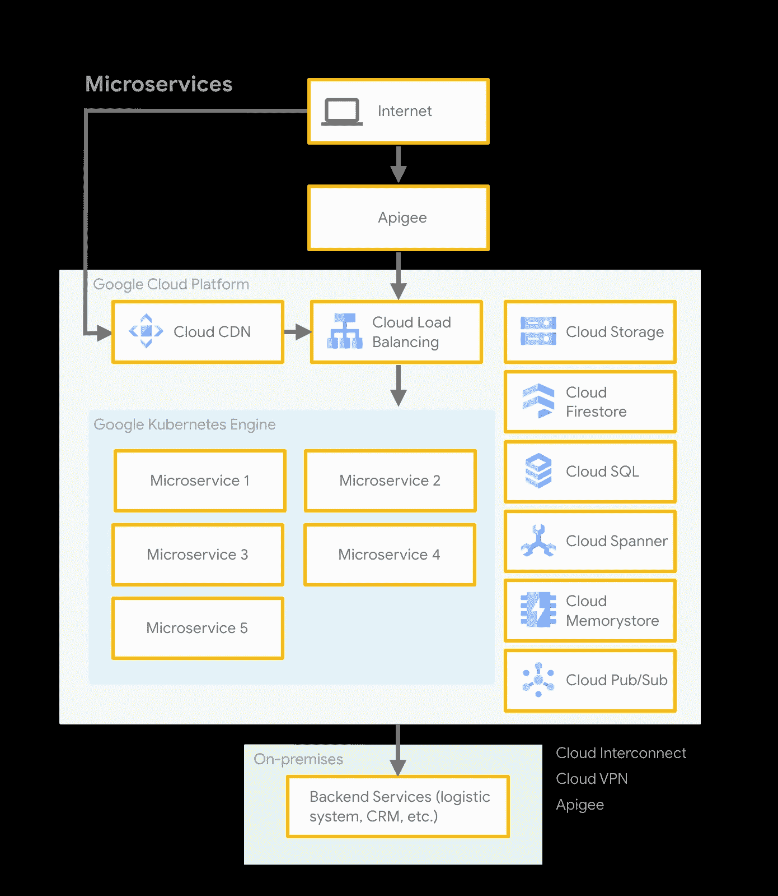

# 将 Monolith 迁移到 Google Kubernetes 引擎(GKE) —迁移流程

> 原文：<https://medium.com/google-cloud/migrating-a-monolith-to-google-kubernetes-engine-gke-migration-process-2de2f51986a2?source=collection_archive---------0----------------------->

## 在云中烹饪

作者:[普里扬卡·韦尔加迪亚](https://twitter.com/pvergadia)，[卡特·摩根](https://twitter.com/carterthecomic)

# 介绍

*[***获取云端烹饪***](/@pvergadia/get-cooking-in-cloud-an-introduction-5b3b90de534e)*是一个[博客](/@pvergadia/get-cooking-in-cloud-an-introduction-5b3b90de534e)和[视频](https://www.youtube.com/playlist?list=PLIivdWyY5sqIOyeovvRapCjXCZykZMLAe)系列，帮助企业和开发者在 Google Cloud 上构建商业解决方案。在这第三个迷你系列中，我们将讲述 ***将一个整体迁移到谷歌 Kubernetes 引擎(GKE)*** 。将整体迁移到微服务可能会令人生畏。一旦你决定接受它，你需要考虑什么？继续阅读…**

**在这些文章中，我们将带您了解将 monolith 迁移到微服务的整个过程、迁移流程、首先迁移什么、迁移的不同阶段以及如何处理数据迁移。我们这些文章的灵感来自于[这篇解决方案文章](https://cloud.google.com/solutions/migrating-a-monolithic-app-to-microservices-gke)。我们将以一个真实的客户故事来结束这一切，在一个真实的应用程序中完成这些步骤。**

**以下是这部迷你剧的所有文章，供你查阅。**

1.  **[将一块巨石迁移到 GKE:概述](/google-cloud/migrating-a-monolith-to-google-kubernetes-engine-an-overview-785f2cbe5c62)**
2.  **将一块巨石迁移到 GKE:迁移过程(本文)**
3.  **[将整块材料迁移到 GKE:分阶段迁移](/google-cloud/migrating-a-monolith-to-google-kubernetes-engine-gke-migrate-in-stages-7286ec26689c)**
4.  **将一块巨石迁移到 GKE:先迁移什么？**
5.  **[将一个整体迁移到 GKE:数据迁移](/google-cloud/migrating-a-monolith-to-google-kubernetes-engine-gke-data-migration-ef8ebccef6b0)**
6.  **[将一个整体迁移到 GKE:客户故事](/google-cloud/migrating-a-monolith-to-google-kubernetes-engine-gke-customer-story-c35c320325eb)**

**在本文中，我们将向您介绍迁移过程。所以，继续读下去吧！**

# **你会学到什么**

*   **为什么选择微服务？**
*   **从哪里开始迁移**
*   **迁移过程**

# **先决条件**

*   **谷歌云的基本概念和结构，这样你就可以识别产品的名称。**
*   **查看云系列中 [Get Cooking 的介绍。](/@pvergadia/get-cooking-in-cloud-an-introduction-5b3b90de534e)**

# **看看这个视频**

# **为什么选择微服务？**

**在上一篇文章中，我们列出了一个[列表，说明为什么将一个整体迁移到微服务](/@pvergadia/migrating-a-monolith-to-google-kubernetes-engine-an-overview-785f2cbe5c62)是有意义的。让我们回顾其中的一些:**

*   **基于微服务的架构是有益的，因为其松散耦合的组件可以独立测试和部署——理论上，组件越小越简单，维护和部署就越容易。**
*   **每一个独立的服务都可以用不同的语言和框架来实现，所以你可以为你正在做的特定工作使用正确的工具。**
*   **每个组件可以由不同的团队管理，从而减少团队之间的依赖性。服务之间的这种清晰的界限，允许团队更容易地为失败进行设计，并且更容易确定在服务停止时该做什么。**

**但是，这是否意味着微服务是完美的呢？不。原因是这样的——在 monolith 平台上，每个逻辑组件都可以与其他组件进行对话，几乎是默认的，因为它们都是同一个整体的一部分。但是对于微服务，尽管每个单独的组件都更简单、更易于管理，但这些服务如何协同工作以进行通信并作为一个系统运行，却更加复杂，并且由于增加的网络延迟，可能会更慢。**

**尽管如此，许多人——包括已经做了很多年的谷歌——认为微服务对大多数组织来说是一个巨大的胜利。但是，如果你没有正确地设计你的微服务，你可能最终会得到一个分布式的整体，这甚至比你最初拥有的整体还要糟糕。实际迁移可能需要几个月。**

> **如果你没有正确地设计你的微服务，你可能最终会得到一个分布式的整体，这甚至比你最初拥有的整体还要糟糕。**

# **从哪里开始？**

**因此，我们清楚地知道，将单一应用迁移到微服务并不容易。但是，为了帮助简化这一过程，让我们将路径从一个单一的内部应用程序映射到一个完全托管在 Google Cloud(由微服务构建)上的应用程序。定义开始和结束状态有助于为迁移铺平道路，并规划迁移过程。**

**注意:如果您已经将您的单片应用程序原样迁移到云中，那么我们在此讨论的相同步骤可以应用于创建微服务架构。**

## **起始状态**

****

**起始状态**

*   **对于大多数电子商务平台来说，起点是一个整体的内部应用程序。**
*   **您的平台可能有负载平衡器来处理来自 web 的请求。**
*   **这些请求被路由到您的应用服务器。**
*   **这些应用服务器通过利用诸如缓存、数据库、搜索等组件来处理请求。**
*   **此外，您的应用服务器可能会向其他后端系统发送请求。**

**这是一个通用的应用流程，它不能完全代表您当前的系统，但它应该作为一个理论上与您的系统相似的示例，以便您可以将其迁移到我们的目标架构。**

## **结束状态**

**现在，让我们谈谈最终状态和我们试图实现的目标。我们肯定希望实现与 monolith 相同的功能，除了现在不是运行 monolith，而是使用[Google Kubernetes Engine(GKE)](https://cloud.google.com/kubernetes-engine)-一个处理扩展、托管和部署容器的平台，将它分解为在可移植、可部署的代码单元(称为容器)中运行的单个微服务。**

****

**结束状态或期望状态**

**在这种架构中，每个微服务运行在自己的容器中，并通过安全的网络连接调用后端系统。我们仍将通过负载平衡器路由互联网流量，但现在流量被路由到单独的微服务，而不是 monolith 应用程序。**

**这使我们能够更新单个微服务的版本，同时对其他服务的影响最小。在我们的目标架构中，微服务可能会与许多其他谷歌云产品交互— [云存储](https://cloud.google.com/storage/?utm_source=google&utm_medium=cpc&utm_campaign=na-US-all-en-dr-bkws-all-all-trial-e-dr-1008076&utm_content=text-ad-none-any-DEV_c-CRE_79747411687-ADGP_Hybrid+%7C+AW+SEM+%7C+BKWS+%7C+US+%7C+en+%7C+EXA+~+Google+Cloud+Storage-KWID_43700007031545851-kwd-11642151515&utm_term=KW_google%20cloud%20storage-ST_google+cloud+storage&gclid=CjwKCAiAhJTyBRAvEiwAln2qB74W0pHY0AmLSoaHscUYZqiUGo3xu2YsSImVlQtKEIBlnBndYYyzRxoCnMEQAvD_BwE)、[云 SQL](https://cloud.google.com/sql/?utm_source=google&utm_medium=cpc&utm_campaign=na-US-all-en-dr-bkws-all-all-trial-e-dr-1008076&utm_content=text-ad-none-any-DEV_c-CRE_79747410847-ADGP_Hybrid+%7C+AW+SEM+%7C+BKWS+%7C+US+%7C+en+%7C+EXA+~+Google+Cloud+SQL-KWID_43700009739675350-kwd-18507329590&utm_term=KW_cloud%20sql-ST_cloud+sql&gclid=CjwKCAiAhJTyBRAvEiwAln2qBwQKhEO-mk-T4eGdjchLW_GExSQ_g7SodU5Q7exMqRt5Eyr0hKl9XBoCAcMQAvD_BwE) 和[云发布/订阅](https://cloud.google.com/pubsub)是电子商务应用程序的常用工具。**

# **迁移过程**

**既然我们已经定义了结束状态和开始状态，那么我们如何进行迁移呢？**

## **Google Cloud 上的服务和内部 monolith 之间的通信**

**在这种迁移过程中，您必须尽早做出的最重要的决定之一是，如何处理 GKE 上托管的新微服务与您的本地遗留系统之间的通信。由于我们是分阶段迁移，因此您的平台组件将有很长一段时间同时存在于 GKE 和本地。**

**有两种主要的解决方案，它们可以共存:**

****

**GKE 传统内部服务和新型微服务之间的差距**

*   ****基于 API 的连接:**在这种类型的连接中，您使用 API 管理解决方案，如 [Apigee](https://cloud.google.com/apigee) 作为两个环境之间的代理。这使您能够精确地控制暴露遗留系统的哪些部分以及如何暴露它们。它还允许您无缝地重构 API 的实现(从遗留服务转移到微服务),而不会影响 API 的消费者。**

****

**GKE 原有内部服务和新微服务之间的云 VPN**

*   ****私有网络连接:**在基于私有连接的解决方案中，您使用私有网络连接来连接您的 Google 云和内部环境。微服务通过此连接与您的遗留系统通信。可以用[云 VPN](https://cloud.google.com/vpn/docs/concepts/overview) 建立基于 IPSec 的 VPN 隧道。对于更大的带宽、高可用性和低延迟需求，[云互联](https://cloud.google.com/hybrid-connectivity)是更好的选择。**

**现在，让我们比较一下这两种沟通方式。**

*   **与私有连接相比，基于 API 的解决方案由应用程序团队实施，需要从一开始就与遗留应用程序进行更好的集成。因此，它更难设置，但从长远来看提供了更多的管理选项。**
*   **另一方面，基于云 VPN 或云互连的解决方案将由网络团队实施，最初需要与传统应用程序进行较少的集成。但是，从长远来看，它不会提供任何附加值。**

**既然我们对这些交流方式有了更多的了解，我们就可以将这两种方式结合起来，为我们的利益而使用它们。例如，我们可以仅将 Apigee 用于公共 API——在微服务和遗留系统之前，但不用于它们之间——并且我们可以将云 VPN 或云互连用于微服务和遗留系统之间的通信。此选项结合了两种方法的优点，但是管理起来更复杂。**

**迁移时你必须做出的另一个选择是——将哪些谷歌云技术用于数据库。例如，您是否希望使用云 Bigtable 来存储数据，或者您是否希望继续使用您当前的一些技术，因为它们仍然与您相关，或者因为移动它们的成本太高。您应该将这些选择视为迁移过程的一部分。当然，这个问题的答案将具体取决于您的场景。**

# **结论**

**要点是——将一个整体迁移到 GKE 的微服务是一个复杂的过程，不会在一夜之间发生——事先规划(我的服务将如何通信——我将如何管理数据——首先迁移什么)有助于确保这一过程顺利进行。**

> **将 monolith 迁移到微服务是一个复杂的过程，不会在一夜之间发生-事先规划(我的服务将如何通信，我将如何管理数据，首先迁移什么)，有助于确保这一过程顺利进行。**

**如果您希望将现有的单一平台迁移到云中，那么您已经对迁移过程有所了解。敬请关注[云烹饪系列](/@pvergadia/get-cooking-in-cloud-an-introduction-5b3b90de534e)中的更多文章，并查看下面的参考资料了解更多细节。**

# **后续步骤和参考:**

*   **在[谷歌云平台媒体](https://medium.com/google-cloud)上关注这个博客系列。**
*   **参考:[整体到 GKE 解决方案](https://cloud.google.com/solutions/migrating-a-monolithic-app-to-microservices-gke)的微服务。**
*   **Codelab: [将一个整体迁移到 GKE 的微服务上](https://codelabs.developers.google.com/codelabs/cloud-monolith-to-microservices-gke/#0)**
*   **关注[获取云端烹饪](https://www.youtube.com/watch?v=pxp7uYUjH_M)视频系列，订阅谷歌云平台 YouTube 频道**
*   **想要更多的故事？查看我的[媒体](/@pvergadia/)，[在 twitter 上关注我](https://twitter.com/pvergadia)。**
*   **请和我们一起欣赏这部迷你剧，并了解更多类似的谷歌云解决方案:)**