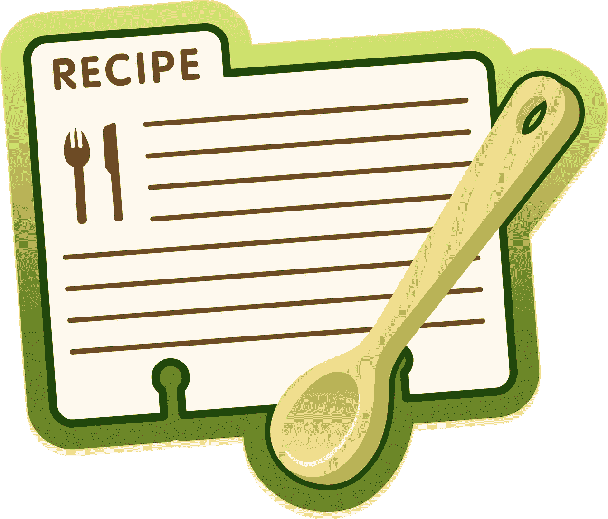

# 将 Monolith 迁移到 Google Kubernetes 引擎(GKE)——先迁移什么？

> 原文：<https://medium.com/google-cloud/migrating-a-monolith-to-google-kubernetes-engine-gke-what-to-migrate-first-8242b57e35c2?source=collection_archive---------2----------------------->

## 在云中烹饪

作者:[普里扬卡·韦尔加迪亚](https://twitter.com/pvergadia)，[卡特·摩根](https://twitter.com/carterthecomic)

# 介绍

*[***获取云端烹饪***](/@pvergadia/get-cooking-in-cloud-an-introduction-5b3b90de534e)*是一个[博客](/@pvergadia/get-cooking-in-cloud-an-introduction-5b3b90de534e)和[视频](https://www.youtube.com/playlist?list=PLIivdWyY5sqIOyeovvRapCjXCZykZMLAe)系列，帮助企业和开发者在 Google Cloud 上构建商业解决方案。在这第三个迷你系列中，我们将讲述 ***将一个整体迁移到谷歌 Kubernetes 引擎(GKE)*** 。将整体迁移到微服务可能会令人生畏。一旦你决定接受它，你需要考虑什么？继续阅读…**

**在这些文章中，我们将带您了解将 monolith 迁移到微服务的整个过程、迁移流程、首先迁移什么、迁移的不同阶段以及如何处理数据迁移。我们将以一个真实的客户故事来结束这一切，在一个真实的应用程序中完成这些步骤。**

**以下是这部迷你剧的所有文章，供你查阅。**

1.  **[将一块巨石迁移到 GKE:概述](/google-cloud/migrating-a-monolith-to-google-kubernetes-engine-an-overview-785f2cbe5c62)**
2.  **[将一块巨石迁移到 GKE:迁移过程](/google-cloud/migrating-a-monolith-to-google-kubernetes-engine-gke-migration-process-2de2f51986a2)**
3.  **[将整块材料迁移到 GKE:分阶段迁移](/google-cloud/migrating-a-monolith-to-google-kubernetes-engine-gke-migrate-in-stages-7286ec26689c)**
4.  **将一块巨石迁移到 GKE:先迁移什么？(本文)**
5.  **[将一个整体迁移到 GKE:数据迁移](/google-cloud/migrating-a-monolith-to-google-kubernetes-engine-gke-data-migration-ef8ebccef6b0)**
6.  **[将一个整体迁移到 GKE:客户案例](/google-cloud/migrating-a-monolith-to-google-kubernetes-engine-gke-customer-story-c35c320325eb)**

**在本文中，我们将带您了解如何决定首先迁移什么。所以，继续读下去吧！**

# **你会学到什么**

*   **如何选择要首先迁移的功能**
*   **如何将业务流程、团队、运营和设计纳入您的分析**
*   **如何将功能从您的传统环境迁移到新的基于云的微服务环境**

# **先决条件**

**开始之前，了解以下内容会有所帮助:**

*   **谷歌云的基本概念和结构，这样你就可以识别产品的名称。**
*   **本[之前的视频在云系列](/@pvergadia/get-cooking-in-cloud-an-introduction-5b3b90de534e)中获取烹饪。**

# **看看这个视频**

# **如何选择要首先迁移的要素？**

**很容易让人一头扎进去，尽快开始迁移特性。与其这样做，不如花点时间来评估系统的以下方面，从长远来看，这会给你带来最大的好处:**

****

**首先，可能很难知道要迁移什么。别害怕，我们有一个配方给你用。来源:[https://pix abay . com/vectors/question-worry-wonder-uncertain-310891/](https://pixabay.com/vectors/question-worry-wonder-unsure-310891/)**

**从一个**业务流程评估**开始。不要忘记，这将是一次学习经历，会有错误可以借鉴。因此，最初的工作不应该涉及业务关键系统，但它们仍然应该代表团队学习的重要用例。**

**从设计和开发的角度来看，你希望挑选那些依赖关系最少并且在必要时最容易重构的特性。必要时，还要考虑开发或重构的成本和复杂性。**

**从**运营**的角度来看，考虑能够承受切换窗口停机时间的特性。如果您需要最小化停机时间，迁移需要高可用性的功能可能意味着额外的工作。**

**最后，选择有明确流程的**团队**来领导最初的工作。因为您希望他们为迁移之旅带路，并了解他们将遇到新的挑战，他们必须找到解决方案。**

> **第一次迁移的理想特性需要很少的重构，是无状态的，没有外部数据需求，并且很少或没有依赖性。**

**考虑到所有这些因素，这种方法需要“分而治之”的方法，我们首先找到一个“具有挑战性但有意义”的特性进行迁移。该特性必须有足够的意义和挑战性，以便成为测试和改进我们关于迁移的假设的有用方法。**

**让我们看一个例子来说明这一点。**

# **迁移计划示例**

****

**一个配方就是一个攻击计划。现在我们来看一个创建迁移特性的例子。来源:[https://pix abay . com/vectors/recipe-label-icon-symbol-spoon-575434/](https://pixabay.com/vectors/recipe-label-icon-symbol-spoon-575434/)**

**想想我们在 ***的朋友——冰淇淋理论*** 和他们的迁徙(来自上一篇文章[)。](/google-cloud/migrating-a-monolith-to-google-kubernetes-engine-gke-migrate-in-stages-7286ec26689c)**

**因为他们正在考虑将他们的网站完全迁移到微服务，对他们来说，一个好的迁移顺序是首先迁移前端；然后想想无状态特性；接下来可能是具有独立数据集的功能，例如列出他们的实体商店的服务；最后是共享数据集的特性，比如平台本身的业务逻辑。**

**平台前端，随后是任何无状态功能，如货币兑换系统，首先是因为它们通常没有多少依赖项，并且通常需要有限的重构，因为在“初始迁移”方法中，后端 API 仍然由本地或另一个云上托管的传统数据中心或运行时提供。**

**在无状态特性之后，数据集不依赖于其他数据集的组件，例如列出实体商店的服务，是下一个要迁移的。这些更容易提取并转移到现代存储系统，如用于托管数据存储的**云存储**或**云 Firestore** ，用于关系数据的**云 SQL** ，或用于基于文档的 noSQL 数据的**云 Firestore** 。**

**最后，具有共享数据集的功能，如电子商务平台的业务逻辑，是最难迁移的，因为需要跨传统和新服务的一致性、分布、访问和延迟。**

**由于数据迁移并不简单，我们将在下一篇文章中专门讨论它，敬请关注。**

# **结论**

**当您计划您的迁移时，很容易从那些无关紧要的特性开始迁移。这可能是一个立竿见影的效果，但从长远来看，可能不会给你的项目带来最大的好处。您应该花时间评估每个特性并为它们的迁移创建一个计划，而不是直接投入到迁移中。**

> ***在开始迁移之前，花时间评估您的特性业务流程、团队、设计&开发和运营，将极大地帮助您的迁移过程。***

**如果您希望将一个整体应用迁移到微服务，那么您已经有了决定首先迁移哪些特性的方法。请继续关注[云烹饪系列](/@pvergadia/get-cooking-in-cloud-an-introduction-5b3b90de534e)中的更多文章，并查看以下参考资料了解更多详情。**

# **后续步骤和参考:**

*   **在谷歌云的媒介上关注这个博客系列。**
*   **参考:[GKE 解决方案的整体到微服务](https://cloud.google.com/solutions/migrating-a-monolithic-app-to-microservices-gke)。**
*   **Codelab: [将一个整体迁移到 GKE 的微服务上](https://codelabs.developers.google.com/codelabs/cloud-monolith-to-microservices-gke/#0)**
*   **关注[获取云端烹饪](https://www.youtube.com/watch?v=pxp7uYUjH_M)视频系列，订阅谷歌云的 YouTube 频道**
*   **想要更多的故事？查看我的[媒体](/@pvergadia/)，[在 twitter 上关注我](https://twitter.com/pvergadia)。**
*   **请和我们一起欣赏这部迷你剧，并了解更多类似的谷歌云解决方案:)**