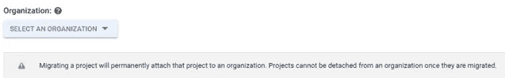

# 将项目从一个组织迁移到另一个组织— GCP

> 原文：<https://medium.com/google-cloud/migrating-a-project-from-one-organization-to-another-gcp-4b37a86dd9e6?source=collection_archive---------1----------------------->

我们的客户要求我们将他们所有的 GCP 项目迁移到另一个组织。最初我们没有在网上找到合适的文件。我与支持人员交谈，发现了谷歌控制台的局限性和需要遵循的流程。

在这篇博客中，我将尝试解释将项目从一个组织迁移到另一个组织时要遵循的限制/过程，这将是一个需要项目配置的手动支持过程。

**流程**:

**步骤 1** :分析我们想要转移的项目列表，并识别所有的依赖项(共享 VPC，自定义角色)以及为其应用的缓解计划。

**第二步**:将所有项目从当前组织的任意文件夹中取出，放到顶层。

**第三步**:联系谷歌技术支持，列出你想从当前组织转移到另一个组织的项目。谷歌支持将项目移出组织。所以他们没有上级组织。(无组织)

**第四步**:一旦谷歌确认活动完成。我们将把项目迁移到目标组织。

**注意:您不能迁移与共享 VPC 关联的项目。在这种情况下，您必须将服务项目与宿主项目分离，然后进行迁移。**

**a .项目中已定义的云 IAM 策略和服务帐户将随项目一起迁移。**

**b .在我们启动迁移之前对项目拥有权限的最终用户，在项目迁移到目标组织后将保持相同的权限。**

**c .在迁移阶段，最终用户可以继续访问项目，不会出现任何问题。(不需要停机)**

**步骤 5** :在“组织”下拉列表中，选择您要将项目迁移到的组织

在这个博客中，我们将迁移一个项目名:我的第一个项目，下面突出显示了这个项目。

单击要迁移的项目，然后转到 IAM & admin →设置→迁移。

选择项目名称，然后单击“迁移”

点击选择一个组织

要迁移项目，您需要在要将项目迁移到的组织中担任以下角色。如果没有这些角色，目标组织就不会作为迁移的选择出现在 Google 云平台控制台中。

**项目创建者角色(roles/resource manager . Project Creator)**

**项目推动者角色(roles/resource manager . Project Mover)**

现在，从下拉列表中选择目标组织，项目将被迁移

从下拉列表中选择目标组织。

将项目从一个组织迁移到另一个组织时，组织策略可能会有所不同，因此请确保在迁移之前定义了必要的组织策略。

已经为项目定义的云 IAM 策略将随项目一起导入。这意味着在项目迁移之前拥有项目权限的用户将在项目迁移到组织中后保留这些权限。